# Multiple Event Types — Shaping

## Source

> Shop owners need the ability to offer multiple services with varying durations, prices, and rules from a single booking page. Currently, the system's schema and logic limit each shop to a single event type. This gap prevents standard service businesses from accurately listing their offerings, making the platform non-viable for general adoption and placing it at a critical competitive disadvantage.
>
> — Problem diagnosis, 2026-03-22

---

## Problem

Every service business offers more than one service. A salon has cuts, colours, and treatments. A consultant offers 30-min calls and 90-min sessions. The platform currently binds a single `slotMinutes` value to the whole shop and a single deposit to the shop's policy. There is no model for "this service costs X and takes Y minutes." Without it, shop owners cannot list their real offering, and customers cannot select what they want.

## Outcome

Shop owners can create and manage multiple event types. Customers see a service-selection step in the booking flow before picking a date. Each service carries its own duration and deposit. Existing shops continue to work via a default event type created during migration.

---

## Requirements (R)

| ID | Requirement | Status |
|----|-------------|--------|
| **R0** | **Event type configuration** | **Core goal** |
| R0.1 | Each event type has its own duration | Must-have |
| R0.2 | Each event type has its own deposit (overrides shop-level default) | Must-have |
| 🟡 R0.3 | Each event type has a preset buffer time (0, 5, or 10 min) — inclusive of the slot duration, not additive; represents transition/cleanup time within the booked slot | Must-have |
| 🟡 R0.4 | Each event type has its own minimum advance notice requirement | Out |
| R1 | Customers select an event type before choosing a time slot | Core goal |
| R2 | Availability slots reflect the selected event type's duration | Must-have |
| R3 | Each appointment records which event type was booked | Must-have |
| R4 | Policy snapshots capture the event-type-specific deposit at booking time | Must-have |
| R5 | Existing shops and appointments continue to work after migration | Must-have |
| **R6** | **Dashboard management** | **Must-have** |
| R6.1 | Shop owners can create, edit, and deactivate event types from the dashboard | Must-have |
| 🟡 R6.2 | Each event type can have its own payment mode (full prepay / deposit / free) | Out |
| 🟡 R6.3 | Event types can be hidden from the public listing and accessible via a direct link | Must-have |
| 🟡 R6.4 | Shop owners are offered event type setup during onboarding; step is skippable without blocking shop creation | Must-have |
| R7 | Slot recovery offers are scoped to the event type of the cancelled appointment | Must-have |
| R8 | Tier-based deposit overrides (top/risk) continue to apply per event type | Must-have |
| R9 | Service bundles, team assignment, and per-event-type availability hours are out of scope | Out |

**All undecided items resolved:**

- **R0.4 (min notice):** Out for MVP. Future cycle.
- **R6.2 (payment mode per event type):** Out for MVP.
- **R6.3 (hidden visibility):** Must-have. Implemented in Shape B via `isHidden` + `?service=<id>` direct link.
- **R6.4 (onboarding step):** Must-have. Step 3 in `OnboardingFlow`.

---

## Current System (CURRENT)

| Part | Mechanism |
|------|-----------|
| CURRENT-1 | `bookingSettings.slotMinutes` — single integer; drives both slot grid and appointment duration |
| CURRENT-2 | `shopPolicies.depositAmountCents` — single base deposit for all bookings at a shop |
| CURRENT-3 | Availability API: `GET /api/availability?shop=&date=` — returns slots of fixed `slotMinutes` duration |
| CURRENT-4 | Booking flow: `book/[slug]/page.tsx` — no service-selection step; goes straight to calendar |
| CURRENT-5 | `appointments` table: has `startsAt`/`endsAt`, no `eventTypeId` column |
| CURRENT-6 | `policyVersions` — snapshot of `shopPolicies` at booking time; no event-type context |
| CURRENT-7 | Slot recovery: `slotOpenings` records a specific cancelled time slot; offer loop sends SMS to eligible customers |

**Key coupling to break:** `bookingSettings.slotMinutes` conflates "slot grid resolution" with "service duration." For multi-event-type to work, slot grid stays shop-level but service duration becomes event-type-level.

---

## Shape A: Event type owns duration; shop policy owns pricing

A minimal first step. Add an `eventTypes` table with name + duration. Pricing stays fully shop-level. The booking flow gains a service selector, availability uses the selected event type's duration.

| Part | Mechanism | Flag |
|------|-----------|:----:|
| **A1** | **`eventTypes` table** | |
| A1.1 | Columns: `id`, `shopId`, `name`, `description`, `durationMinutes`, `isActive`, `sortOrder`, `createdAt`, `updatedAt` | |
| A1.2 | `durationMinutes` must be a multiple of `bookingSettings.slotMinutes` (slot grid stays) | |
| A1.3 | `bookingSettings.slotMinutes` kept; becomes slot grid resolution only | |
| **A2** | **Migration: default event type per shop** | |
| A2.1 | On deploy, insert one `eventType` per existing shop using `name = shop.name`, `durationMinutes = bookingSettings.slotMinutes` | |
| A2.2 | Backfill `appointments.eventTypeId` to the new default event type | |
| **A3** | **`appointments.eventTypeId` FK** | |
| A3.1 | Add nullable `event_type_id` column referencing `eventTypes.id` (nullable to protect historical rows before backfill) | |
| **A4** | **Availability API update** | |
| A4.1 | Accept optional `eventTypeId` query param; if present, use that event type's `durationMinutes` as the effective duration for each slot's `endsAt`; slot start times remain on the `slotMinutes` grid | |
| A4.2 | Falls back to `bookingSettings.slotMinutes` if no event type given (backward compat) | |
| A4.3 | **Availability filter must use interval overlap, not exact start-time matching.** Currently `getAvailabilityForDate` fetches `startsAt` of booked appointments and removes candidate slots whose `startsAt` is taken. This is only correct when all appointments share the same duration. With variable durations, a 90-min booking at 10:00 (ending 11:30) does not block the 11:00 candidate slot under the current logic. Fix: fetch `(startsAt, endsAt)` of existing booked/pending appointments; filter out candidate slots where `slot.startsAt < existing.endsAt AND slot.endsAt > existing.startsAt`. | |
| **A5** | **Booking flow: service selector step** | |
| A5.1 | Add service-selection screen before the calendar in `book/[slug]/page.tsx` | |
| A5.2 | If shop has only one active event type, skip selector and proceed directly | |
| A5.3 | Selected event type passed to availability API and booking create endpoint | |
| **A9** | **Booking create: explicit overlap guard** | |
| A9.1 | `createAppointment` currently relies solely on `appointments_shop_starts_unique` (unique constraint on `(shopId, startsAt)`) to prevent double-bookings. With variable durations, two appointments at different start times can overlap — the constraint does not catch this. Add an explicit overlap query before the insert: `SELECT 1 FROM appointments WHERE shopId = ? AND status IN ('booked','pending') AND startsAt < newEndsAt AND endsAt > newStartsAt LIMIT 1`. If a row is returned, throw `SlotTakenError`. | |
| **A6** | **`policyVersions` update** | |
| A6.1 | No schema change required. The resolved deposit flows into the existing `depositAmountCents` column by construction. `eventTypeId` belongs on the appointment, not the snapshot. | |
| **A7** | **Slot recovery scoping** | |
| A7.1 | Add nullable `eventTypeId uuid` FK (`onDelete: set null`) to `slotOpenings`. `createSlotOpeningFromCancellation` passes `appointment.eventTypeId` through; `acceptOffer` forwards it to `createAppointment`. | |
| **A8** | **Dashboard: Services tab** | |
| A8.1 | New `/app/settings/services` page: list, create, edit, deactivate event types | |
| A8.2 | Form fields: name, description, duration (constrained to slot grid multiples), active toggle | |

**What A does not solve:** No deposit per event type, no buffer time, no min notice.

---

## Shape B: Event type owns duration + buffer + deposit override

Extends A by adding buffer time, minimum notice, and a per-event-type deposit. The shop policy becomes the deposit fallback; each event type can override it. Tier multipliers (top/risk) still apply at shop-policy level.

| Part | Mechanism | Flag |
|------|-----------|:----:|
| **B1** | **Everything in A** | |
| **B2** | **`eventTypes` configuration fields** | |
| B2.1 | Add nullable `deposit_amount_cents` to `eventTypes`; null = use `shopPolicies.depositAmountCents` | |
| B2.2 | Deposit resolution: `eventType.depositAmountCents ?? shopPolicy.depositAmountCents` | |
| 🟡 B2.3 | Add `buffer_minutes integer not null default 0` to `eventTypes`; constrained to `0, 5, 10` (check constraint); inclusive of slot duration — actual service time = `durationMinutes - bufferMinutes`; no effect on slot grid or overlap checks | |
| 🟡 B2.4 | `min_notice_minutes` — out for MVP; reserved for future cycle | |
| 🟡 B2.5 | Add `is_default boolean not null default false` to `eventTypes`. Set `true` only by the migration script (N17) and the onboarding skip path (N9). All owner-initiated creates via the services form (N8) set `isDefault = false`. Used as the predicate for the dashboard nudge: show nudge when all active event types have `isDefault = true` (owner has never created a custom service). | |
| **B3** | **`policyVersions` captures effective deposit** | |
| B3.1 | Snapshot already records `depositAmountCents`; booking flow resolves event-type vs. shop-policy deposit before snapshotting | |
| **B4** | **Tier overrides remain shop-level** | |
| B4.1 | `riskDepositAmountCents` / `topDepositAmountCents` in `shopPolicies` are absolute replacement amounts. Call site change only: pass `eventType.depositAmountCents ?? shopPolicy.depositAmountCents` as `basePolicy.depositAmountCents` to `applyTierPricingOverride`. For the **risk tier only**, apply a floor clamp after resolution: `Math.max(riskResult, eventBase)` — prevents a shop-wide risk override from accidentally under-charging for a high-priced service. Top-tier waivers (`topDepositWaived → 0`) and reductions (`topDepositAmountCents`) must not be clamped — they are intentional downward adjustments that should apply freely. No change to `applyTierPricingOverride` itself. | |
| 🟡 **B5** | **Hidden event types and direct links** | |
| 🟡 B5.1 | Add `is_hidden boolean not null default false` to `eventTypes`; hidden types are excluded from the public service selector listing | |
| 🟡 B5.2 | Booking flow: if `?service=<eventTypeId>` is present in the URL, skip the selector and load that event type directly — works for both visible and hidden types | |
| 🟡 B5.3 | Dashboard Services tab: show a "Copy link" action per event type that produces `[appUrl]/book/[shopSlug]?service=<id>`; hidden types display a "Hidden" badge | |
| **B6** | **Services settings form** | |
| B6.1 | Form fields: name, description, duration (slot-grid multiples), buffer (radio: None / 5 min / 10 min), min notice (optional), deposit override (optional), hidden toggle, active toggle | |

| 🟡 **B7** | **Onboarding: Step 3 "Add your services"** | |
| 🟡 B7.1 | Add Step 3 to `OnboardingFlow` (currently 2-step: Business Type → Shop Details). New step appears after shop creation. | |
| 🟡 B7.2 | Step presents a single event type form: name, duration, buffer (radio: None / 5 min / 10 min), optional deposit override | |
| 🟡 B7.3 | "Skip for now" creates a default event type: `name = "Service"`, `durationMinutes = bookingSettings.slotMinutes`, `bufferMinutes = 0`, no deposit override, `isHidden = false` | |
| 🟡 B7.4 | Both paths (submit or skip) complete onboarding and land on the dashboard. A persistent prompt on the dashboard nudges the owner to set up services if they skipped. | |
| 🟡 B7.5 | **`createShop` must stop redirecting.** Currently `createShop` (`src/app/app/actions.ts`) calls `redirect('/app?created=true')` immediately after inserting the shop, which throws a Next.js navigation error and terminates the action — `OnboardingFlow.handleSubmit` never regains control and Step 3 can never execute. Fix: change `createShop` to return `{ shopId: string }` instead of calling `redirect()`. `handleSubmit` receives the shopId and advances the component to Step 3. Only after Step 3 completes (submit or skip) does `router.push('/app')` navigate to the dashboard. | |

**What B adds over A:** Deposit override, preset buffer (0/5/10 min, inclusive of slot), minimum notice, hidden event types with direct-link access, and an onboarding step.

---

## Shape C: Event type owns a full policy

Each event type links to its own `shopPolicy` record. Different cancel cutoffs, payment modes, refund rules per service.

| Part | Mechanism | Flag |
|------|-----------|:----:|
| **C1** | Everything in B | |
| **C2** | `eventTypes.policyId` FK to `shopPolicies` | ⚠️ |
| **C3** | Policy settings UI duplicated per event type | ⚠️ |
| **C4** | Policy version snapshot linked to event type's policy | ⚠️ |

**Risk:** Significant complexity. Cancel cutoffs and refund rules differ per service, making the system much harder to reason about and test. Rabbit hole territory. Required only if R6.2 (payment mode per event type) is Must-have.

---

## Fit Check

| Req | Requirement | Status | A | B | C |
|-----|-------------|--------|---|---|---|
| R0.1 | Each event type has its own duration | Must-have | ✅ | ✅ | ✅ |
| R0.2 | Each event type has its own deposit | Must-have | ❌ | ✅ | ✅ |
| 🟡 R0.3 | Each event type has its own buffer time | Must-have | ❌ | ✅ | ✅ |
| 🟡 R0.4 | Each event type has its own minimum advance notice | Out | — | — | — |
| R1 | Customers select an event type before choosing a time slot | Core goal | ✅ | ✅ | ✅ |
| R2 | Availability slots reflect the selected event type's duration | Must-have | ✅ | ✅ | ✅ |
| R3 | Each appointment records which event type was booked | Must-have | ✅ | ✅ | ✅ |
| R4 | Policy snapshots capture the event-type-specific deposit at booking time | Must-have | ❌ | ✅ | ✅ |
| R5 | Existing shops and appointments continue to work after migration | Must-have | ✅ | ✅ | ✅ |
| R6.1 | Shop owners can create, edit, and deactivate event types from the dashboard | Must-have | ✅ | ✅ | ✅ |
| 🟡 R6.3 | Event types can be hidden from public listing and accessible via direct link | Must-have | ❌ | ✅ | ✅ |
| 🟡 R6.4 | Event type setup offered during onboarding; skippable without blocking shop creation | Must-have | ❌ | ✅ | ✅ |
| R7 | Slot recovery offers scoped to event type of cancelled appointment | Must-have | ✅ | ✅ | ✅ |
| R8 | Tier-based deposit overrides continue to apply | Must-have | ✅ | ✅ | ✅ |

**Notes:**
- A fails R0.2, R0.3, R4, R6.3, R6.4: no per-event deposit, no buffer column, no event-type-aware deposit snapshot, no hidden types, no onboarding step. R0.4 is Out — not a failure.
- R0.3 (buffer): does not affect slot generation or overlap checks — buffer is inclusive of slot duration; A fails only because it lacks the column
- R2 (availability): correct behaviour requires interval-overlap filtering in `getAvailabilityForDate` (A4.3) and an explicit overlap guard in `createAppointment` (A9). Both apply equally to A and B — pass is conditional on these mechanism changes, which replace the current exact-start-time deduplication that breaks with variable durations.
- R8 (tier overrides): passes for B via `applyTierPricingOverride`. Risk-tier floor clamp (B4.1) prevents a shop-wide risk override from under-charging on a higher-priced service. Top-tier waivers (`topDepositWaived → 0`) and reductions (`topDepositAmountCents`) are explicitly excluded from the clamp — they apply freely.
- R6.4 (onboarding): passes for B conditional on two mechanism fixes: (1) `createShop` must return `{ shopId }` instead of calling `redirect()` — currently the action navigates immediately and Step 3 can never execute (B7.5); (2) the dashboard nudge predicate must be "all active event types have `isDefault = true`", not "no event types exist" — after skip, a default event type always exists (B2.5, U9).
- R6.2 (payment mode per event type): Out for MVP — removed from fit check.

**Selected shape: B** — conditional on R6.2 and R6.3 decisions below.

B passes all must-haves. If R6.2 (payment mode per event type) is promoted to Must-have, Shape C is required — with its rabbit hole complexity. If R6.3 (hidden visibility) is promoted to Must-have, it can be added to Shape B as a simple `isHidden` boolean without affecting the shape selection.

---

## Decisions Required Before Slicing

| # | Requirement | Recommendation | Decision |
|---|-------------|---------------|---------|
| 1 | **R0.4 — Min notice per event type** | Out for MVP, future cycle. | Out ✅ |
| 2 | **R6.2 — Payment mode per event type** | Out for MVP. Questionnaire Q5. | Out ✅ |
| 3 | **R6.3 — Hidden visibility + direct link** | Must-have. Questionnaire Q4. `isHidden` boolean + `?service=<id>` URL param + "Copy link" in dashboard. Added to Shape B (B5). | In ✅ |
| 4 | **R6.4 — Onboarding step** | Must-have. Step 3 in `OnboardingFlow`. Skip creates default event type. | In ✅ |

---

## Flagged Unknowns to Resolve

| Part | Question |
|------|----------|
| ~~B4.1~~ | ~~Tier override resolution order~~ — resolved (see `spike-tier-overrides.md`) |
| ~~A6.1~~ | ~~policyVersions schema change~~ — resolved: no change needed (see `spike-policy-versions.md`) |
| ~~A7.1~~ | ~~slotOpenings event type scoping~~ — resolved: one nullable FK column, two function changes (see `spike-slot-recovery.md`) |

---

## Detail B: Concrete Affordances

### UI Affordances

| ID | Place | Affordance | Wires Out |
|----|-------|-----------|-----------|
| U1 | `/book/[slug]` | Service selector — card grid of active, visible event types; each card shows name, duration, and buffer (e.g. "60 min · 10 min prep") | loads via N4; card selection sets client state → U3 |
| U2 | `/book/[slug]` | Direct-link bypass — when `?service=<id>` present, hides selector and shows service name as context header | loads via N5 → U3 |
| U3 | `/book/[slug]` | Calendar + booking form (existing) — now receives `selectedEventTypeId` from U1 or U2 | date pick → N6; submit → N7 |
| U4 | `OnboardingFlow` Step 3 | Add first service form — name input, duration selector, buffer radio (None / 5 min / 10 min), optional deposit override | submit → N8; then component calls `router.push('/app')` |
| U5 | `OnboardingFlow` Step 3 | "Skip for now" button | → N9; then component calls `router.push('/app')` |
| U6 | `/app/settings/services` | Event type list — name, duration, buffer, deposit override, hidden badge, active status per row | loads via N4 |
| U7 | `/app/settings/services` | Create / Edit form — name, description, duration (multiples of slot grid), buffer radio (None / 5 min / 10 min), optional deposit override, hidden toggle, active toggle | save → N8 (create) or N10 (update) |
| U8 | `/app/settings/services` | "Copy link" button per event type — writes `[appUrl]/book/[shopSlug]?service=<id>` to clipboard | client-side only |
| U9 | `/app/settings/services` | Dashboard nudge banner — shown when all active event types have `isDefault = true` (owner has never created a custom service; B2.5) | links to `/app/settings/services` |
| U10 | `/app/appointments` | "Service" column in appointments table | populated via N11 |
| U11 | `/app/appointments/[id]` | Service name in appointment detail card | populated via N12 |
| U12 | `/app/slot-openings/[id]` | Service name label for this slot opening | populated via N13 |
| U13 | `/manage/[token]` | Service name in customer-facing booking summary | populated via N14 |

---

### Non-UI Affordances

| ID | Name | Type | Notes |
|----|------|------|-------|
| N1 | `eventTypes` table | Data store | `id, shopId, name, description, durationMinutes, bufferMinutes CHECK IN (0,5,10) default 0, depositAmountCents nullable, isHidden bool default false, isActive bool default true, isDefault bool default false, sortOrder int, createdAt, updatedAt` |
| N2 | `appointments.eventTypeId` | Data store | Nullable FK → `eventTypes.id`, `onDelete set null` |
| N3 | `slotOpenings.eventTypeId` | Data store | Nullable FK → `eventTypes.id`, `onDelete set null` |
| N4 | `getEventTypesForShop(shopId, filters?)` | Query | Returns event types; accepts `{ isActive, isHidden }` filters |
| N5 | `getEventTypeById(id)` | Query | Single event type lookup; used for direct-link bypass |
| N6 | `GET /api/availability?shop=&date=&service=` | Handler | Uses `eventType.durationMinutes` as effective slot duration when `service` param present; falls back to `bookingSettings.slotMinutes`. Availability filter changes from exact start-time matching to interval overlap — fetches `(startsAt, endsAt)` of existing appointments and removes candidate slots where `slot.startsAt < existing.endsAt AND slot.endsAt > existing.startsAt` (A4.3). |
| N7 | `POST /api/bookings/create` | Handler | Accepts `eventTypeId`; computes `endsAt = startsAt + durationMinutes`; resolves deposit as `eventType.depositAmountCents ?? shopPolicy.depositAmountCents`; applies risk-tier-only floor clamp after `applyTierPricingOverride` (top-tier waivers/reductions unaffected); explicit interval overlap query before insert throws `SlotTakenError` if time range conflicts with an existing booked/pending appointment (A9). |
| N8 | `createEventType` server action | Handler | Creates event type record; enforces `bufferMinutes IN (0,5,10)` |
| N9 | `createDefaultEventType(shopId)` | Handler | Onboarding skip path; `name="Service"`, `durationMinutes=slotMinutes`, `bufferMinutes=0`, `isHidden=false`, `isDefault=true` |
| N10 | `updateEventType` server action | Handler | Updates event type fields; same validation as N8 |
| N11 | `listAppointmentsForShop` update | Query | Left-join `eventTypes` on `appointments.eventTypeId`; adds `eventTypeName` to result |
| N12 | Appointment detail query update | Query | Left-join `eventTypes`; adds `eventTypeName` |
| N13 | Slot opening detail query update | Query | Left-join `eventTypes` on `slotOpenings.eventTypeId`; adds `eventTypeName` |
| N14 | Manage page query update | Query | Left-join `eventTypes` on `appointments.eventTypeId`; adds `eventTypeName` |
| N15 | `createSlotOpeningFromCancellation` update | Handler | Passes `appointment.eventTypeId` into `slotOpenings` insert → N3 |
| N16 | `acceptOffer` update | Handler | Reads `slotOpening.eventTypeId`; forwards to N7 |
| N17 | Migration script | Script | Inserts one default `eventType` per existing shop from `bookingSettings.slotMinutes`; sets `isDefault=true`; backfills `appointments.eventTypeId` |
| N18 | `createShop` contract change | Handler | `createShop` (`src/app/app/actions.ts`) currently calls `redirect()` immediately, terminating before `OnboardingFlow` can advance to Step 3. Change to return `{ shopId: string }` instead. `OnboardingFlow.handleSubmit` uses the returned shopId to advance to Step 3; `router.push('/app')` fires only after Step 3 completes or is skipped (B7.5). |

---

### Wiring

```mermaid
flowchart TD

  subgraph BOOK["/book/[slug] — Customer"]
    U1[Service selector cards]
    U2[Direct-link header]
    U3[Calendar + booking form]
  end

  subgraph ONBOARD["OnboardingFlow — Step 3"]
    U4[Add first service form]
    U5[Skip for now]
  end

  subgraph SERVICES["/app/settings/services — Owner"]
    U6[Event type list]
    U7[Create / Edit form]
    U8[Copy link]
    U9[Dashboard nudge]
  end

  subgraph MINOR["Display-only pages"]
    U10[Appointments list · Service col]
    U11[Appointment detail · Service name]
    U12[Slot opening detail · Service name]
    U13[Manage page · Service name]
  end

  subgraph NONUI["Non-UI"]
    N1[(eventTypes)]
    N2[(appointments.eventTypeId)]
    N3[(slotOpenings.eventTypeId)]
    N4[getEventTypesForShop]
    N5[getEventTypeById]
    N6[GET /api/availability]
    N7[POST /api/bookings/create]
    N8[createEventType]
    N9[createDefaultEventType]
    N10[updateEventType]
    N15[createSlotOpeningFromCancellation]
    N16[acceptOffer]
    N17[Migration]
    N18[createShop — returns shopId]
  end

  %% Data store writes
  N8 --> N1
  N9 --> N1
  N10 --> N1
  N7 --> N2
  N15 --> N3
  N17 --> N1
  N17 --> N2

  %% Booking flow
  U1 -- "load: isActive && !isHidden" --> N4
  N4 --> N1
  U2 -- "load: ?service=<id>" --> N5
  N5 --> N1
  U1 -- "card selected" --> U3
  U2 -- "bypasses selector" --> U3
  U3 -- "date pick" --> N6
  U3 -- "submit + eventTypeId" --> N7

  %% Onboarding
  N18 -- "returns shopId → Step 3" --> U4
  N18 -- "returns shopId → Step 3" --> U5
  U4 -- "submit" --> N8
  U5 -- "skip" --> N9

  %% Services settings
  U6 -- "load" --> N4
  U7 -- "create" --> N8
  U7 -- "update" --> N10

  %% Slot recovery (background)
  N15 -- "cancel event" --> N3
  N16 -- "SMS YES" --> N7

  %% Minor display
  U10 & U11 --> N2
  U12 --> N3
  U13 --> N2
```

