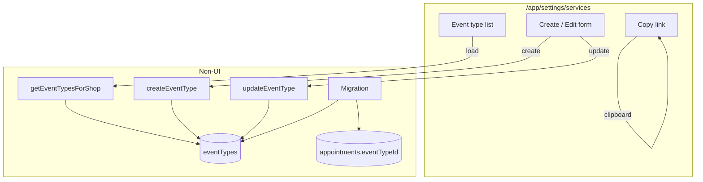
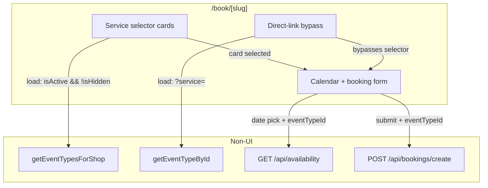
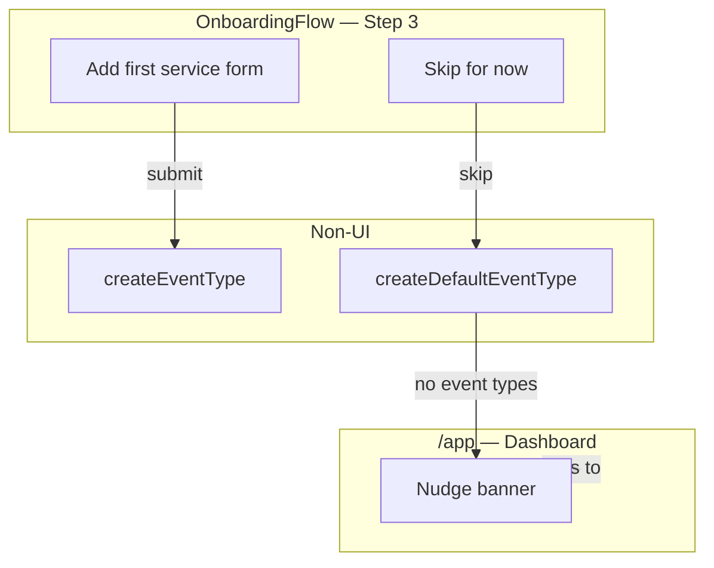
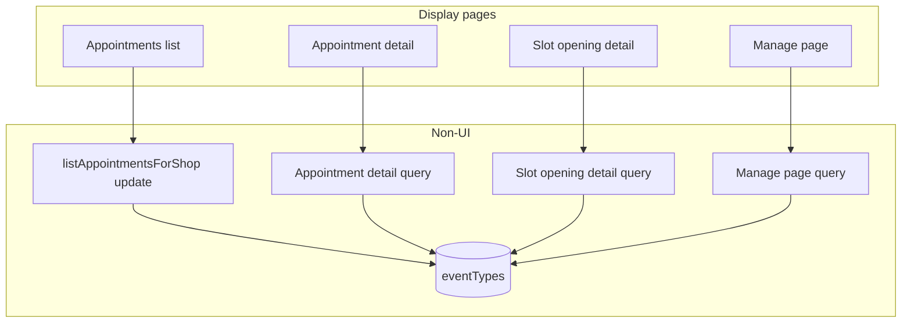
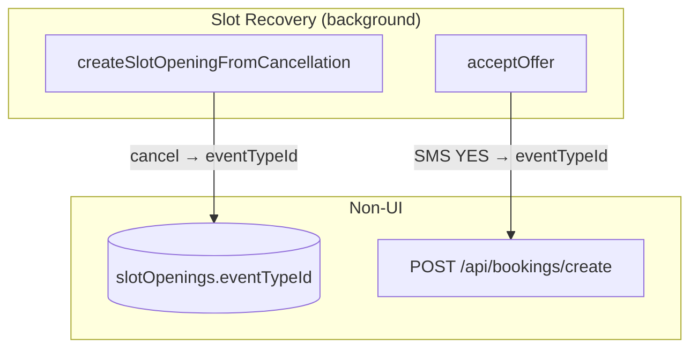

# Multiple Event Types — Slices

Derived from `shaping.md` Detail B breadboard. Five vertical slices, each ending in demo-able UI.

---

## Slice Overview

| Slice | Name | Demo |
|-------|------|------|
| V1 | Schema + Services Management | Owner creates and manages event types at `/app/settings/services` |
| V2 | Customer Booking Flow | Customer selects a service, sees correct slots, completes a booking |
| V3 | Onboarding Step 3 | New owner reaches Step 3 during onboarding; skip creates a default service |
| V4 | Service Name Display | Service name visible in appointments list, detail, slot opening, and manage page |
| V5 | Slot Recovery Scoping | Cancelled booking opens a typed slot; recovered booking preserves the event type |

---

## V1 — Schema + Services Management

**Demo:** Owner navigates to `/app/settings/services`, sees their migrated default service, creates a second one, edits it, copies its booking link, and toggles it hidden.

### UI Affordances

| ID | Place | Affordance | Wires Out |
|----|-------|-----------|-----------|
| U6 | `/app/settings/services` | Event type list — name, duration, buffer, deposit override, hidden badge, active status per row | loads via N4 |
| U7 | `/app/settings/services` | Create / Edit form — name, description, duration (multiples of slot grid), buffer radio (None / 5 min / 10 min), optional deposit override, hidden toggle, active toggle | save → N8 (create) or N10 (update) |
| U8 | `/app/settings/services` | "Copy link" button — writes `[appUrl]/book/[shopSlug]?service=<id>` to clipboard | client-side only |

### Non-UI Affordances

| ID | Name | Type | Notes |
|----|------|------|-------|
| N1 | `eventTypes` table | Data store | `id, shopId, name, description, durationMinutes, bufferMinutes CHECK IN (0,5,10) default 0, depositAmountCents nullable, isHidden bool default false, isActive bool default true, isDefault bool default false, sortOrder int, createdAt, updatedAt` |
| N2 | `appointments.eventTypeId` | Data store | Nullable FK → `eventTypes.id`, `onDelete set null` — added in this slice, populated by migration |
| N4 | `getEventTypesForShop(shopId, filters?)` | Query | Returns event types; accepts `{ isActive, isHidden }` filters |
| N8 | `createEventType` server action | Handler | Creates event type; enforces `bufferMinutes IN (0,5,10)` |
| N10 | `updateEventType` server action | Handler | Updates event type fields; same validation as N8 |
| N17 | Migration script | Script | Inserts one default `eventType` per existing shop from `bookingSettings.slotMinutes`; sets `isDefault=true`; backfills `appointments.eventTypeId` |

### Wiring



---

## V2 — Customer Booking Flow

**Demo:** Customer visits `/book/[shop-slug]`, sees service cards, picks "Colour Session (60 min)", calendar shows slots sized to 60 min, books it. Separately: visit `/book/[shop-slug]?service=<id>` for a hidden service — selector is skipped, correct service loads directly.

### UI Affordances

| ID | Place | Affordance | Wires Out |
|----|-------|-----------|-----------|
| U1 | `/book/[slug]` | Service selector — card grid of active, visible event types; each card shows name, duration, and buffer (e.g. "60 min · 10 min prep") | loads via N4; card selection → U3 |
| U2 | `/book/[slug]` | Direct-link bypass — when `?service=<id>` present, hides selector and shows service name as context header | loads via N5 → U3 |
| U3 | `/book/[slug]` | Calendar + booking form (existing) — now receives `selectedEventTypeId` from U1 or U2 | date pick → N6; submit → N7 |

### Non-UI Affordances

| ID | Name | Type | Notes |
|----|------|------|-------|
| N4 | `getEventTypesForShop(shopId, filters?)` | Query | Called with `{ isActive: true, isHidden: false }` for the selector |
| N5 | `getEventTypeById(id)` | Query | Single event type lookup for direct-link bypass |
| N6 | `GET /api/availability?shop=&date=&service=` | Handler | Uses `eventType.durationMinutes` when `service` param present; falls back to `bookingSettings.slotMinutes`. **Availability filter changes from exact start-time matching to interval overlap** — fetches `(startsAt, endsAt)` of existing appointments and removes candidate slots where `slot.startsAt < existing.endsAt AND slot.endsAt > existing.startsAt`. Required because variable durations break the current start-time-only deduplication. |
| N7 | `POST /api/bookings/create` | Handler | Accepts `eventTypeId`; computes `endsAt = startsAt + durationMinutes`; resolves deposit as `eventType.depositAmountCents ?? shopPolicy.depositAmountCents`; applies tier override with risk-tier-only floor clamp. **Adds explicit overlap query before insert** (catches races and duration mismatches that `appointments_shop_starts_unique` constraint cannot). |

### Wiring



---

## V3 — Onboarding Step 3

**Demo:** New shop owner completes Business Type → Shop Details → lands on Step 3 "Add your first service", fills in the form and submits. Separately: click "Skip for now" → lands on dashboard with a nudge banner prompting them to set up services.

### UI Affordances

| ID | Place | Affordance | Wires Out |
|----|-------|-----------|-----------|
| U4 | `OnboardingFlow` Step 3 | Add first service form — name input, duration selector, buffer radio (None / 5 min / 10 min), optional deposit override | submit → N8 → redirect to `/app` |
| U5 | `OnboardingFlow` Step 3 | "Skip for now" button | → N9 → redirect to `/app` |
| U9 | `/app/settings/services` | Dashboard nudge banner — shown when `getEventTypesForShop` returns no active event types | links to `/app/settings/services` |

### Non-UI Affordances

| ID | Name | Type | Notes |
|----|------|------|-------|
| N8 | `createEventType` server action | Handler | Reused from V1 |
| N9 | `createDefaultEventType(shopId)` | Handler | Skip path: `name="Service"`, `durationMinutes=slotMinutes`, `bufferMinutes=0`, `isHidden=false`, `isDefault=true` |
| N18 | `createShop` contract change | Handler | Currently `createShop` calls `redirect('/app?created=true')` immediately, terminating the server action before `OnboardingFlow` can advance to Step 3. Must be changed to return `{ shopId: string }` instead. `OnboardingFlow.handleSubmit` uses the returned shopId to advance to Step 3; navigation to `/app` happens only after Step 3 completes or is skipped. |

### Wiring



---

## V4 — Service Name Display

**Demo:** Owner views the appointments list and sees a "Service" column. Opens an appointment detail — service name shown. Opens a slot opening — service name shown. Customer visits their manage link — service name shown in booking summary.

### UI Affordances

| ID | Place | Affordance | Wires Out |
|----|-------|-----------|-----------|
| U10 | `/app/appointments` | "Service" column in appointments table | populated via N11 |
| U11 | `/app/appointments/[id]` | Service name in appointment detail card | populated via N12 |
| U12 | `/app/slot-openings/[id]` | Service name label for this slot opening | populated via N13 |
| U13 | `/manage/[token]` | Service name in customer-facing booking summary | populated via N14 |

### Non-UI Affordances

| ID | Name | Type | Notes |
|----|------|------|-------|
| N11 | `listAppointmentsForShop` update | Query | Left-join `eventTypes` on `appointments.eventTypeId`; adds `eventTypeName` |
| N12 | Appointment detail query update | Query | Left-join `eventTypes`; adds `eventTypeName` |
| N13 | Slot opening detail query update | Query | Left-join `eventTypes` on `slotOpenings.eventTypeId`; adds `eventTypeName` |
| N14 | Manage page query update | Query | Left-join `eventTypes` on `appointments.eventTypeId`; adds `eventTypeName` |

### Wiring



---

## V5 — Slot Recovery Scoping

**Demo:** Cancel a booked appointment → slot opening is created with the correct service name visible at `/app/slot-openings/[id]`. Customer replies YES to the offer SMS → recovered booking is for the same service with the correct duration and deposit.

### UI Affordances

No new UI affordances — V4 already surfaces the service name on the slot opening detail page. This slice is pure backend wiring.

### Non-UI Affordances

| ID | Name | Type | Notes |
|----|------|------|-------|
| N3 | `slotOpenings.eventTypeId` | Data store | Nullable FK → `eventTypes.id`, `onDelete set null` — schema column added in this slice |
| N15 | `createSlotOpeningFromCancellation` update | Handler | Reads `appointment.eventTypeId`; passes it into `slotOpenings` insert → N3 |
| N16 | `acceptOffer` update | Handler | Reads `slotOpening.eventTypeId`; forwards to `createAppointment` (N7) |

### Wiring



---

## Dependency Order

```
V1 (schema + services) ← must go first; everything reads N1
  └── V2 (booking flow) ← needs N1 for event type selection and N7 changes
        └── V3 (onboarding) ← reuses N8 from V1; demo is richer after V2 works end-to-end
              └── V4 (display) ← reads N1/N2 via joins; needs appointments with eventTypeId from V2
                    └── V5 (slot recovery) ← needs appointments.eventTypeId (V2) and display (V4) to verify
```
