# Appointments Page — Presentation Layer Update

**Appetite:** ~0.5–1 day  
**Prerequisite:** None — data layer is complete and correct  
**Source analysis:** `docs/shaping/appointments-update/26-04-22_21-37-57_appointments_page_implementation/analysis_report.md`

---

## Frame

### Problem

The `/app/appointments` page is functional and its data layer is complete. The implementation spec is ~60% satisfied. The remaining gap is entirely in the visual presentation layer:

1. **No financial outcome badge hierarchy.** `financialOutcome` renders as plain capitalized text. All five states (settled, voided, unresolved, refunded, disputed) look identical — a user cannot scan the column and identify problem records at a glance. The spec explicitly calls out "outcome badge hierarchy" as a designer focus.

2. **Three categories of 1px border violations.** Outcome cards, both table wrappers, and every table row separator use `border: 1px solid` or `borderTop: 1px solid`. DESIGN.md's No-Line Rule strictly prohibits this: *"Standard 1px solid borders are strictly prohibited for sectioning. Boundaries are created through background shifts."*

3. **Appointments table has no section header.** The Slot Recovery section has an `<h2>` + description. The Appointments table appears raw after the stat cards with no named zone. Users cannot orient before scanning.

4. **No tonal separation between two conceptually distinct tables.** Appointments (transaction record) and Slot Recovery (operational recovery log) are visually indistinct — only vertical spacing separates them.

5. **Empty states are unstyled `
` tags.** The spec calls out "empty states for each section" as a designer focus. Current empty states give no context, no icon, and no actionable copy.

### Outcome

- Scanning the Appointments table, the owner can instantly distinguish settled, voided, and disputed records by color.
- The page reads as the Atelier design system — tonal layering instead of borders, ambient shadow instead of outlines, whitespace as the row separator.
- Both sections have clear structural identity: named header, description, and a designed empty state.
- Slot Recovery is visually contained in its own tonal zone, distinct from the main transaction table.
- No database changes, no query changes, no new files. All changes contained in `page.tsx`.

---

## Requirements (R)

| ID | Requirement | Status |
|----|-------------|--------|
| R0 | The Appointments page must satisfy the full implementation spec: badge hierarchy, design system compliance, structural clarity, and designed empty states | Core goal |
| R1 | `financialOutcome` must render as a `FinancialOutcomeBadge` with semantic color per severity: settled → success green, voided → error red, unresolved → muted, refunded → warning amber, disputed → error red + bold | Must-have |
| R2 | All 1px solid border styles (outcome cards, both table wrappers, all table row separators) must be removed and replaced with tonal background shifts and ambient shadow per DESIGN.md No-Line Rule | Must-have |
| R3 | The Appointments table must have a section `<h2>` header and description line, giving it structural parity with the existing Slot Recovery section | Must-have |
| R4 | The Slot Recovery section must be visually enclosed in a `surface-container-low` tonal background container to distinguish it from the main Appointments table | Must-have |
| R5 | Both sections must have designed empty states: icon (Lucide) + heading + contextual copy that explains what will appear when conditions are met | Must-have |
| R6 | `paymentStatus` must render as a styled badge with semantic color: paid → success, pending → brand, unpaid → muted, failed → error | Nice-to-have |
| R7 | All existing functional behavior must be preserved and no new files created — data queries, conflict banner, slot recovery link, no-show risk badge, "View" navigation, and `ReconcilePaymentsButton` remain unchanged; all edits are in `src/app/app/appointments/page.tsx` only | Constraint |

---

## Shape A: Surgical Presentation Fixes in page.tsx

No alternative shapes considered. The analysis confirmed one path: targeted changes to the presentation layer of a single file. No new abstractions, no redesign, no data layer involvement.

| Part | Mechanism | Flag |
|------|-----------|:----:|
| **A1** | **`FinancialOutcomeBadge` component** | |
| A1.1 | Add inline component at bottom of `page.tsx` alongside `SlotStatusBadge` | |
| A1.2 | Styles map: `settled` → success-subtle/success, `voided` → error-subtle/error, `unresolved` → surface-overlay/text-tertiary, `refunded` → warning-subtle/warning, `disputed` → error-subtle/error + fontWeight 600 | |
| A1.3 | Replace `{appointment.financialOutcome}` with `<FinancialOutcomeBadge outcome={appointment.financialOutcome} />` | |
| **A2** | **`PaymentStatusBadge` component** | |
| A2.1 | Add inline component using same pill pattern as `SlotStatusBadge` | |
| A2.2 | Styles map: `paid` → success-subtle/success, `pending` → brand-subtle/brand, `unpaid` → surface-overlay/text-tertiary, `failed` → error-subtle/error | |
| A2.3 | Replace plain-text `paymentStatus` render with `<PaymentStatusBadge status={appointment.paymentStatus} />` | |
| **A3** | **Design system border compliance** | |
| A3.1 | Outcome cards: remove `border: "1px solid var(--color-border-default)"`, replace `color-surface-raised` background with `color-surface-container-lowest` | |
| A3.2 | Both table wrappers: remove `border: "1px solid..."`, add `boxShadow: "0px 20px 40px rgba(26, 28, 27, 0.06)"` and `background: "var(--color-surface-container-lowest)"` | |
| A3.3 | All table rows: remove `style={{ borderTop: "1px solid var(--color-border-hairline)" }}`, add `className="transition-colors hover:bg-[var(--color-surface-container-low)]"` | |
| **A4** | **Section structure** | |
| A4.1 | Wrap appointments table block in `<section className="space-y-3">` with `<h2>All Appointments</h2>` + description `
` | |
| A4.2 | Wrap Slot Recovery `<section>` in tonal container: `className="space-y-3 rounded-2xl p-6"` + `style={{ background: "var(--color-surface-container-low)" }}` | |
| **A5** | **Designed empty states** | |
| A5.1 | Appointments empty state: centered flex container, `Calendar` Lucide icon in `surface-container-high` circle, heading "No appointments yet", sub-copy pointing to booking link | |
| A5.2 | Slot Recovery empty state: centered flex container, `RefreshCw` Lucide icon in `surface-container-high` circle, heading "No slots recovered yet", sub-copy explaining the mechanic | |
| A5.3 | Add `import { Calendar as CalendarIcon, RefreshCw as RefreshCwIcon } from "lucide-react"` to imports | |

---

## Fit Check (R × A)

| Req | Requirement | Status | A |
|-----|-------------|--------|---|
| R0 | The Appointments page must satisfy the full implementation spec: badge hierarchy, design system compliance, structural clarity, and designed empty states | Core goal | ✅ |
| R1 | `financialOutcome` must render as a `FinancialOutcomeBadge` with semantic color per severity: settled → success green, voided → error red, unresolved → muted, refunded → warning amber, disputed → error red + bold | Must-have | ✅ |
| R2 | All 1px solid border styles (outcome cards, both table wrappers, all table row separators) must be removed and replaced with tonal background shifts and ambient shadow per DESIGN.md No-Line Rule | Must-have | ✅ |
| R3 | The Appointments table must have a section `<h2>` header and description line, giving it structural parity with the existing Slot Recovery section | Must-have | ✅ |
| R4 | The Slot Recovery section must be visually enclosed in a `surface-container-low` tonal background container to distinguish it from the main Appointments table | Must-have | ✅ |
| R5 | Both sections must have designed empty states: icon (Lucide) + heading + contextual copy that explains what will appear when conditions are met | Must-have | ✅ |
| R6 | `paymentStatus` must render as a styled badge with semantic color: paid → success, pending → brand, unpaid → muted, failed → error | Nice-to-have | ✅ |
| R7 | All existing functional behavior must be preserved and no new files created — data queries, conflict banner, slot recovery link, no-show risk badge, "View" navigation, and `ReconcilePaymentsButton` remain unchanged; all edits are in `src/app/app/appointments/page.tsx` only | Constraint | ✅ |

Shape A passes all requirements. No alternative shapes needed.

---

## Detail A: Breadboard

### UI Affordances

| ID | Affordance | Place | Wires Out |
|----|-----------|-------|-----------|
| U1 | Page header: "Appointments" title + shop name subtitle + `ReconcilePaymentsButton` | Page Header | — |
| U2 | `ConflictAlertBanner` — conditional, renders only when `conflictCount > 0`, links to conflicts page | Page Header | → `/app/conflicts` |
| U3 | Outcome cards ×3 — Settled / Voided / Unresolved counts, last 7 days | Outcome Cards | ← N3 |
| U4 | Appointments section header — `<h2>All Appointments</h2>` + description line **[NEW]** | Appointments Section | — |
| U5 | Appointments table — one row per appointment from `listAppointmentsForShop` | Appointments Section | ← N1, N5; rows → U6, U7, U8; "View" → `/app/appointments/[id]` |
| U6 | `FinancialOutcomeBadge` — pill badge, severity-mapped color (settled / voided / unresolved / refunded / disputed) **[NEW]** | Appointments Table Row | — |
| U7 | `PaymentStatusBadge` — pill badge, semantic color (paid / pending / unpaid / failed) **[NEW]** | Appointments Table Row | — |
| U8 | `NoShowRiskBadge` — existing, unchanged | Appointments Table Row | — |
| U9 | Appointments empty state — Calendar icon + "No appointments yet" + booking-link copy **[NEW]** | Appointments Section | — |
| U10 | Slot Recovery section — `surface-container-low` tonal container, `rounded-2xl p-6` **[NEW]** | Slot Recovery Section | — |
| U11 | Slot Recovery table — one row per slot opening from `listSlotOpeningsForShop` | Slot Recovery Section | ← N2, N5; rows → U12; "View booking" → `/app/appointments/[recoveredId]`; "View slot" → `/app/slot-openings/[id]` |
| U12 | `SlotStatusBadge` — existing (open / filled / expired), unchanged | Slot Recovery Table Row | — |
| U13 | Slot Recovery empty state — RefreshCw icon + "No slots recovered yet" + mechanic-explanation copy **[NEW]** | Slot Recovery Section | — |

### Non-UI Affordances

| ID | Affordance | Wires Out |
|----|-----------|-----------|
| N1 | `listAppointmentsForShop(shopId)` — existing query, status IN (booked, pending, ended), last 7d + upcoming | → U5 |
| N2 | `listSlotOpeningsForShop(shopId)` — existing query, with `recoveredAppointmentId` join | → U11 |
| N3 | `getOutcomeSummaryForShop(shopId)` — existing query, last 7d outcome counts | → U3 |
| N4 | `getConflictCount(shopId)` — existing query | → U2 |
| N5 | `getBookingSettingsForShop(shopId)` — timezone for `Intl.DateTimeFormat` formatters | → U5, U11 |

### Wiring Diagram

```mermaid
flowchart TB
    subgraph server["SERVER: Promise.all data fetch"]
        N1["N1: listAppointmentsForShop"]
        N2["N2: listSlotOpeningsForShop"]
        N3["N3: getOutcomeSummaryForShop"]
        N4["N4: getConflictCount"]
        N5["N5: getBookingSettingsForShop"]
    end

    subgraph pageHeader["PLACE: Page Header"]
        U1["U1: Title + ReconcilePaymentsButton"]
        U2["U2: ConflictAlertBanner (conditional)"]
    end

    subgraph outcomeCards["PLACE: Outcome Cards"]
        U3["U3: Settled / Voided / Unresolved ×3"]
    end

    subgraph apptSection["PLACE: Appointments Section"]
        U4["U4: h2 + description [NEW]"]
        subgraph apptTable["Appointments Table"]
            U5["U5: Table rows"]
            U6["U6: FinancialOutcomeBadge [NEW]"]
            U7["U7: PaymentStatusBadge [NEW]"]
            U8["U8: NoShowRiskBadge"]
        end
        U9["U9: Empty state — Calendar [NEW]"]
    end

    subgraph recoverySection["PLACE: Slot Recovery Section — tonal container [NEW]"]
        subgraph recoveryTable["Slot Recovery Table"]
            U11["U11: Table rows"]
            U12["U12: SlotStatusBadge"]
        end
        U13["U13: Empty state — RefreshCw [NEW]"]
    end

    %% Server → UI (dashed = data supply)
    N1 -.->|appointments| U5
    N2 -.->|slotOpenings| U11
    N3 -.->|outcomeSummary| U3
    N4 -.->|conflictCount| U2
    N5 -.->|timezone| U5
    N5 -.->|timezone| U11

    %% Row → badge components (solid = renders)
    U5 --> U6
    U5 --> U7
    U5 --> U8
    U11 --> U12

    %% Conditional: empty vs table
    U5 -.->|"length === 0"| U9
    U11 -.->|"length === 0"| U13

    %% Node styling
    classDef ui fill:#ffb6c1,stroke:#d87093,color:#000
    classDef nonui fill:#d3d3d3,stroke:#808080,color:#000
    class U1,U2,U3,U4,U5,U6,U7,U8,U9,U10,U11,U12,U13 ui
    class N1,N2,N3,N4,N5 nonui
```

**Legend:**
- **Pink nodes (U)** = UI affordances (things users see / rendered components)
- **Grey nodes (N)** = Non-UI affordances (server queries — all existing, all unchanged)
- **Solid lines** = component renders (parent → child)
- **Dashed lines** = data supply (query → component) or conditional branch (length === 0 → empty state)
