# Slices — Appointments Page Presentation Layer Update

**Shape:** A — Surgical Presentation Fixes in `page.tsx`  
**File:** `src/app/app/appointments/page.tsx` (all changes)  
**Date:** 2026-04-22

---

## Slicing Rationale

Three slices, ordered by the priority matrix (P0 → P1 → P2). Each ends in demo-able UI. V1 and V2 satisfy all Must-have requirements; V3 is the Nice-to-have and can be deferred independently.

---

## V1: Outcome Badge + Design System Compliance

**Satisfies:** R0 (partial), R1, R2

### Affordances

**New:**

| ID | Affordance |
|----|-----------|
| U6 | `FinancialOutcomeBadge` — pill badge, severity-mapped color (settled / voided / unresolved / refunded / disputed) |

**Modified (style changes only):**

| ID | Change |
|----|--------|
| U3 | Outcome cards: remove `border: 1px solid`, replace `color-surface-raised` → `color-surface-container-lowest` |
| U5 | Appointments table wrapper: remove `border: 1px solid`, add ambient shadow; rows: remove `borderTop`, add hover bg |
| U11 | Slot Recovery table wrapper: remove `border: 1px solid`, add ambient shadow; rows: remove `borderTop`, add hover bg |

### Steps

1. Add `FinancialOutcomeBadge` component at bottom of `page.tsx` (alongside `SlotStatusBadge`)
2. Replace `{appointment.financialOutcome}` with `<FinancialOutcomeBadge outcome={appointment.financialOutcome} />`
3. Outcome cards: remove `border` prop, change `background` to `var(--color-surface-container-lowest)`
4. Both table `overflow-hidden` divs: remove `border` prop, add `boxShadow: "0px 20px 40px rgba(26, 28, 27, 0.06)"` and `background: "var(--color-surface-container-lowest)"`
5. All table `<tr>` rows: remove `style={{ borderTop: ... }}`, add `className="transition-colors hover:bg-[var(--color-surface-container-low)]"`

### Demo

Open `/app/appointments`. The outcome column shows colored pills — green for settled, red for voided, muted for unresolved. No 1px borders visible anywhere on the page. Cards float off the background without lines. Table rows separate by whitespace alone with a subtle hover state.

---

## V2: Section Structure + Empty States

**Satisfies:** R0 (completes), R3, R4, R5

### Affordances

**New:**

| ID | Affordance |
|----|-----------|
| U4 | Appointments section header — `<h2>All Appointments</h2>` + description line |
| U9 | Appointments empty state — Calendar icon + "No appointments yet" heading + booking-link copy |
| U10 | Slot Recovery section — `surface-container-low` tonal container (`rounded-2xl p-6`) |
| U13 | Slot Recovery empty state — RefreshCw icon + "No slots recovered yet" heading + mechanic-explanation copy |

### Steps

1. Add `import { Calendar as CalendarIcon, RefreshCw as RefreshCwIcon } from "lucide-react"` to imports
2. Wrap the appointments table block in `<section className="space-y-3">` with `<h2>All Appointments</h2>` + description `
`
3. Replace plain-text appointments empty state `
` with designed empty state component (CalendarIcon + heading + copy)
4. Wrap Slot Recovery `<section>` in tonal container: add `className="space-y-3 rounded-2xl p-6"` + `style={{ background: "var(--color-surface-container-low)" }}`
5. Replace plain-text slot recovery empty state `
` with designed empty state component (RefreshCwIcon + heading + copy)

### Demo

Open `/app/appointments`. Page now has two clearly named zones: "All Appointments" (header + table) and "Slot Recovery" (in a soft tonal inset container). To verify empty states: temporarily return `[]` from `listAppointmentsForShop` locally — see the Calendar empty state with correct copy. Restore, then do the same for `listSlotOpeningsForShop` — see the RefreshCw empty state.

---

## V3: Payment Status Badge

**Satisfies:** R6

### Affordances

**New:**

| ID | Affordance |
|----|-----------|
| U7 | `PaymentStatusBadge` — pill badge, semantic color (paid / pending / unpaid / failed) |

### Steps

1. Add `PaymentStatusBadge` component at bottom of `page.tsx`
2. Replace `
{appointment.paymentStatus}
` with `<PaymentStatusBadge status={appointment.paymentStatus} />`
3. Remove the `
` amount sub-row — merge the amount into a second line below the badge or keep as-is depending on column width preference

> **Note:** The amount sub-row (`currencyFormatter(...)`) is in the same `<td>` as paymentStatus. Keep the amount display — only replace the status label itself with the badge. The `<td>` then contains: `<PaymentStatusBadge />` on line 1, amount string on line 2 (existing pattern).

### Demo

Open `/app/appointments`. Payment column shows colored pills — green "paid", blue "pending", muted "unpaid", red "failed" — with the amount displayed below the badge in each cell.

---

## Sliced Breadboard

```mermaid
flowchart TB
    subgraph server["SERVER: Promise.all (unchanged)"]
        N1["N1: listAppointmentsForShop"]
        N2["N2: listSlotOpeningsForShop"]
        N3["N3: getOutcomeSummaryForShop"]
        N4["N4: getConflictCount"]
        N5["N5: getBookingSettingsForShop"]
    end

    subgraph pageHeader["PLACE: Page Header (unchanged)"]
        U1["U1: Title + ReconcilePaymentsButton"]
        U2["U2: ConflictAlertBanner"]
    end

    subgraph slice1["V1: OUTCOME BADGE + BORDER COMPLIANCE"]
        subgraph outcomeCards["PLACE: Outcome Cards"]
            U3["U3: Cards ×3 — border removed"]
        end
        subgraph apptTable["Appointments Table — border removed"]
            U5["U5: Table rows — hairline removed"]
            U6["U6: FinancialOutcomeBadge ✦NEW"]
            U8["U8: NoShowRiskBadge"]
        end
        subgraph recoveryTable["Slot Recovery Table — border removed"]
            U11["U11: Table rows — hairline removed"]
            U12["U12: SlotStatusBadge"]
        end
    end

    subgraph slice2["V2: SECTION STRUCTURE + EMPTY STATES"]
        U4["U4: h2 + description ✦NEW"]
        U9["U9: Appointments empty state ✦NEW"]
        subgraph recoverySection["Slot Recovery — tonal container ✦NEW"]
            U10["U10: surface-container-low wrapper ✦NEW"]
            U13["U13: Slot Recovery empty state ✦NEW"]
        end
    end

    subgraph slice3["V3: PAYMENT STATUS BADGE"]
        U7["U7: PaymentStatusBadge ✦NEW"]
    end

    %% Slice ordering (invisible)
    slice1 ~~~ slice2
    slice2 ~~~ slice3

    %% Server wires
    N1 -.->|appointments| U5
    N2 -.->|slotOpenings| U11
    N3 -.->|outcomeSummary| U3
    N4 -.->|conflictCount| U2
    N5 -.->|timezone| U5
    N5 -.->|timezone| U11

    %% Row → badge
    U5 --> U6
    U5 --> U7
    U5 --> U8
    U11 --> U12

    %% Conditional empty states
    U5 -.->|"length === 0"| U9
    U11 -.->|"length === 0"| U13

    %% Slice styling
    style slice1 fill:#e8f5e9,stroke:#4caf50,stroke-width:2px
    style slice2 fill:#e3f2fd,stroke:#2196f3,stroke-width:2px
    style slice3 fill:#fff3e0,stroke:#ff9800,stroke-width:2px

    %% Nested subgraphs transparent
    style outcomeCards fill:transparent,stroke:#888,stroke-width:1px
    style apptTable fill:transparent,stroke:#888,stroke-width:1px
    style recoveryTable fill:transparent,stroke:#888,stroke-width:1px
    style recoverySection fill:transparent,stroke:#888,stroke-width:1px
    style pageHeader fill:transparent,stroke:#ccc,stroke-width:1px,stroke-dasharray:4
    style server fill:transparent,stroke:#ccc,stroke-width:1px,stroke-dasharray:4

    %% Node styling
    classDef ui fill:#ffb6c1,stroke:#d87093,color:#000
    classDef nonui fill:#d3d3d3,stroke:#808080,color:#000
    class U1,U2,U3,U4,U5,U6,U7,U8,U9,U10,U11,U12,U13 ui
    class N1,N2,N3,N4,N5 nonui
```

**Legend:**
- **Green zone (V1)** — Outcome badge + all border compliance
- **Blue zone (V2)** — Section structure + designed empty states
- **Orange zone (V3)** — Payment status badge (Nice-to-have, deferrable)
- **Pink nodes (U)** = UI affordances
- **Grey nodes (N)** = Server queries (all unchanged)

---

## Slices Grid

|  |  |  |
|:--|:--|:--|
| **V1: OUTCOME BADGE + BORDER COMPLIANCE** ⏳ PENDING  • `FinancialOutcomeBadge` component • Outcome column → colored pills • All 1px borders removed • Tonal bg + ambient shadow • Row hover state  *Demo: Outcome column has colored badges; no borders on page* | **V2: SECTION STRUCTURE + EMPTY STATES** ⏳ PENDING  • Appointments `<h2>` + description • Slot Recovery tonal container • Appointments empty state designed • Slot Recovery empty state designed • Lucide icon imports  *Demo: Two named sections; toggle empty data to see designed states* | **V3: PAYMENT STATUS BADGE** ⏳ PENDING  • `PaymentStatusBadge` component • Payment column → colored pills • Amount sub-row preserved • • &nbsp; • • &nbsp;  *Demo: Payment column — red "failed", green "paid", blue "pending"* |
