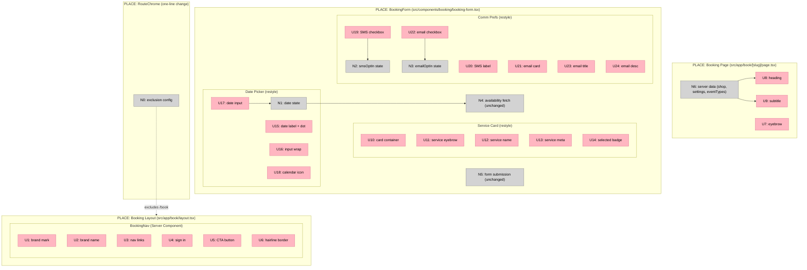

# Booking Page Reskin — Shaping Document

**Scope:** Restyle 5 booking page components to match Atelier Light design system
**Appetite:** Now
**Constraint:** Design change only — no new functionality

---

## Frame

### Source

Five feature specs in `docs/shaping/booking-page/feature-specs/`:
- `01-navigation-header.html` — Marketing nav bar
- `02-page-header.html` — Eyebrow + heading + subtitle
- `03-service-card.html` — Selected service display with badge
- `04-date-picker.html` — Styled date input with required dot
- `07-communication-preferences.html` — SMS inline + email card checkboxes

All specs state: "Design change only — no new functionality."

### Problem

- The booking page (`/book/[slug]`) uses `--color-*` tokens (Deep Ledger dark theme) which are forbidden — the codebase standard is `--al-*` (Atelier Light)
- The existing `SiteHeader` (which already renders on the booking page via `RouteChrome`) uses old tokens and is `fixed top-0`, while the spec calls for a non-fixed, AL-styled nav
- The `BookingForm` component (1237 lines) has service card, date picker, and communication preferences all inlined with old styling
- Visual mismatch: the booking page looks like a different product from the dashboard

### Outcome

- 5 booking page components styled to Atelier Light spec
- All `--color-*` tokens replaced with `--al-*` tokens in affected code
- Existing booking flow (form submission, Stripe payments, availability loading) unchanged
- No regressions in E2E tests

---

## Requirements (R)

| ID | Requirement | Status |
|----|-------------|--------|
| R0 | Restyle 5 booking page components to match Atelier Light feature specs | Core goal |
| R1 | Replace all `--color-*` tokens with `--al-*` tokens in booking page code | Must-have |
| R2 | Navigation: non-fixed (scrolls with page), brand mark + name, nav links, sign-in, gradient CTA | Must-have |
| R3 | Page header: 11px eyebrow "Book an appointment", 32px heading "Book with [slug]", 16px subtitle "[Service] · [Duration]" | Must-have |
| R4 | Service card: `#f4f4f2` bg, eyebrow "Selected service", service name, "[duration] · [timezone]" meta, green "Selected" pill badge | Must-have |
| R5 | Date picker: 13px/800 label with 6px navy required dot, white input wrap with hairline-strong border, 16px/700 navy input text, calendar icon, focus ring | Must-have |
| R6 | Comm prefs: SMS = inline 20px checkbox (unchecked default); Email = card with `#f4f4f2` bg, 20px checkbox (checked default), title + description | Must-have |
| R7 | No functional changes — existing booking/payment/availability flow must work identically | Must-have |
| R8 | Unstuffed components (time-slot-grid, contact-form, confirm-CTA, footer) must not break visually when adjacent components are restyled | Must-have |

---

## Current State (CURRENT)

The booking page `/book/[slug]` has this structure:

| Layer | File | What it does |
|-------|------|-------------|
| Layout | `src/app/layout.tsx` | Loads fonts (Manrope, Material Symbols), wraps in `RouteChrome` |
| Chrome | `src/components/layout/route-chrome.tsx` | For non-app, non-auth routes: renders `SiteHeader` + `SiteFooter` around `<main>` |
| Nav | `src/components/site-header.tsx` | Fixed marketing nav, `--color-*` tokens, framer-motion scroll detection, session-aware auth links |
| Page | `src/app/book/[slug]/page.tsx` | Server component. Loads shop, settings, event types. Renders page header + `BookingForm` or `ServiceSelector` |
| Form | `src/components/booking/booking-form.tsx` | 1237-line client component. Contains: service card, date input, time slots, contact fields, comm prefs, submit button, payment step, success state |
| Selector | `src/components/booking/service-selector.tsx` | Multi-service picker (when >1 service exists), delegates to `BookingForm` |

**Token usage:** Everything uses `--color-*` or hardcoded hex/Tailwind classes. Zero `--al-*` references.

**Fonts:** Manrope is loaded as `--font-manrope-raw` (via next/font). Material Symbols loaded via Google Fonts link. Both available globally.

**Nav positioning:** `SiteHeader` is `fixed top-0 z-50`. `RouteChrome` adds `pt-16` to `<main>` to compensate. Spec wants non-fixed nav that scrolls with page.

---

## Shapes

### A: In-place reskin (modify existing files)

Restyle the existing components directly. Modify `SiteHeader` for the booking page, update `page.tsx`, and change styles inside `booking-form.tsx`.

| Part | Mechanism | Flag |
|------|-----------|:----:|
| **A1** | Modify `SiteHeader` to use `--al-*` tokens and conditionally remove `fixed` positioning on `/book/*` routes | |
| **A2** | Update `page.tsx` page header markup: add eyebrow, restyle heading/subtitle to spec | |
| **A3** | Restyle service card section inside `booking-form.tsx`: change bg, add green badge pill, swap tokens | |
| **A4** | Restyle date input inside `booking-form.tsx`: wrap in custom container, add required dot, swap tokens | |
| **A5** | Restyle comm prefs inside `booking-form.tsx`: custom checkbox styling, card layout for email, swap tokens | |

### B: Booking layout + extracted components

Create a booking-specific layout that bypasses `RouteChrome`'s shared nav. Extract the 5 components into individual files. Compose in page.

| Part | Mechanism | Flag |
|------|-----------|:----:|
| **B1** | Create `src/app/book/layout.tsx` that renders its own `BookingNav` (non-fixed, AL-styled). Add `/book` to `RouteChrome`'s exclusion list | |
| **B2** | Create `BookingNav` server component: brand mark (Material Symbol), brand name, nav links, sign-in, gradient CTA. Non-fixed. All `--al-*` | |
| **B3** | Update `page.tsx` page header: eyebrow + heading + subtitle with AL tokens | |
| **B4** | Create `BookingServiceCard` component: extract from booking-form.tsx, restyle to spec (card bg, eyebrow, meta, green badge) | |
| **B5** | Create `BookingDateField` component: extract from booking-form.tsx, custom input wrap with required dot, focus ring, calendar icon | |
| **B6** | Create `BookingCommPrefs` component: extract from booking-form.tsx, two checkbox variants (inline + card) | |
| **B7** | Wire extracted components back into `BookingForm` — pass state/handlers via props, maintain existing form submission logic | |

### C: Booking layout + restyle inline

Create the booking-specific layout (like B), but restyle components in-place inside booking-form.tsx (like A) instead of extracting.

| Part | Mechanism | Flag |
|------|-----------|:----:|
| **C1** | Create `src/app/book/layout.tsx` + `BookingNav` (same as B1+B2) | |
| **C2** | Update `page.tsx` page header inline (same as A2) | |
| **C3** | Restyle service card, date picker, comm prefs inside `booking-form.tsx` (same as A3+A4+A5) | |

---

## Fit Check

| Req | Requirement | Status | A | B | C |
|-----|-------------|--------|---|---|---|
| R0 | Restyle 5 booking page components to match Atelier Light feature specs | Core goal | ✅ | ✅ | ✅ |
| R1 | Replace all `--color-*` tokens with `--al-*` tokens in booking page code | Must-have | ✅ | ✅ | ✅ |
| R2 | Navigation: non-fixed (scrolls with page), brand mark + name, nav links, sign-in, gradient CTA | Must-have | ✅ | ✅ | ✅ |
| R3 | Page header: 11px eyebrow, 32px heading, 16px subtitle | Must-have | ✅ | ✅ | ✅ |
| R4 | Service card: #f4f4f2 bg, eyebrow, name, meta, green badge | Must-have | ✅ | ✅ | ✅ |
| R5 | Date picker: label with required dot, styled input wrap, focus ring | Must-have | ✅ | ✅ | ✅ |
| R6 | Comm prefs: inline SMS checkbox, card email checkbox | Must-have | ✅ | ✅ | ✅ |
| R7 | No functional changes — existing flow works identically | Must-have | ❌ | ✅ | ✅ |
| R8 | Unstyled components don't break visually alongside restyled ones | Must-have | ✅ | ✅ | ✅ |

**Notes:**
- A fails R7: Modifying `SiteHeader` (A1) changes the nav for ALL marketing routes (landing page, manage page, etc.), not just the booking page. This is a side effect beyond the booking page scope. Making it route-conditional adds complexity to a shared component and risks breaking other pages.

---

## Architecture Conflicts Identified

| # | Conflict | Impact | Resolution |
|---|----------|--------|------------|
| 1 | `SiteHeader` is shared across all non-app/non-auth routes. Spec wants non-fixed nav. | Changing SiteHeader affects landing page, manage page, etc. | Shape B/C: Create booking-specific layout to isolate changes |
| 2 | `booking-form.tsx` is 1237 lines. All 3 form-level components (service card, date picker, comm prefs) are inlined. | Inline restyling increases coupling. Extraction increases file count but improves maintainability. | Shape B extracts; Shape C accepts the coupling |
| 3 | Stripe Elements `appearance` uses dark theme (`night`, `#1d2738`). | Payment step will look jarring against AL-styled booking page. | Out of scope for this batch (spec 08 not included), but note as future issue |
| 4 | 4 of 9 booking page specs NOT included (time-slot-grid, contact-form, confirm-CTA, footer). | Mixed styling: some components AL-styled, some still old tokens. | R8 handles this — ensure unstyled components don't break |
| 5 | `RouteChrome` adds `pt-16` padding to compensate for fixed SiteHeader. | Booking layout with non-fixed nav must NOT have this padding. | Booking layout excludes the `pt-16` |
| 6 | Current `SiteHeader` uses `framer-motion` for scroll detection and session-aware auth links. | BookingNav can be simpler: no scroll detection needed (non-fixed), auth state optional. | BookingNav is a much simpler component |

---

## Recommendation

**Shape C** (booking layout + restyle inline) is the best fit:

- **Speed:** Fewer files to create than B. No component extraction overhead.
- **Risk:** Low. Isolates changes to booking page via layout. Doesn't touch shared `SiteHeader`.
- **Simplicity:** `BookingNav` is the only new component. Other changes are styling swaps in existing files.

Shape B's component extraction is premature — these components are only used in `booking-form.tsx` and the remaining 4 specs (when they ship) will likely change the same code again. Extracting now means extracting twice.

Shape A's SiteHeader modification has unacceptable blast radius.

**Selected shape: C**

---

## Spike Findings

### Spike 1: RouteChrome Exclusion ([full report](./spike-routechrome-exclusion.md))

- **Single-line change:** Add `"/book"` to `APP_ROUTE_PREFIXES` in `route-chrome.tsx`. Existing prefix logic handles it.
- **No `pt-16`:** Correct. Non-fixed nav needs no padding compensation.
- **No other `/book` routes:** Only `/book/[slug]/page.tsx` exists.
- **No SiteFooter:** Booking layout should render BookingNav + children only. Spec 09 (footer) is out of scope.
- **BookingNav can be a Server Component:** No framer-motion, no scroll detection, no session state needed. Static links + CTA.

### Spike 2: Mixed Styling Coexistence ([full report](./spike-mixed-styling.md))

- **Both token sets coexist:** `--color-*` and `--al-*` are both defined in `globals.css` and active on every page. No CSS changes needed.
- **shadcn bridge helps:** `<Input>`/`<Label>` from shadcn already resolve to AL values via `:root` mappings. Contact form fields will blend with restyled components.
- **Tolerable visual artifact:** Time-slot grid will use teal `--color-brand` on a light page background — off-brand but functional. Resolved when spec 05 ships.
- **Stripe Elements isolated:** Payment step is behind a state transition, not visible alongside restyled components. No conflict during mixed period.
- **No blocking issues.** Mixed styling is safe for the 5-of-9 partial reskin.

### Shape Update

All parts of Shape C are confirmed feasible with no flagged unknowns. The spike findings validate:
- C1: RouteChrome exclusion is a one-line change + new layout file
- C2: Page header restyling is straightforward markup change
- C3: Inline restyling in booking-form.tsx is safe — both token sets coexist, no visual conflicts at boundaries

---

## Detail C: Breadboard

### UI Affordances

| ID | Place | Affordance | Spec | Wires Out |
|----|-------|-----------|------|-----------|
| U1 | BookingNav | Brand mark | 32px navy square, radius 8px, Material Symbol `dashboard_customize` white | — |
| U2 | BookingNav | Brand name | "ASTRO", 18px/800, 0.04em tracking, uppercase, navy | — |
| U3 | BookingNav | Nav links | "How it works", "Features", "Pricing", "FAQ". 14px/600, muted `#43474f`, hover bg `#eeeeec`, radius 10px | Link to `/#how-it-works` etc. |
| U4 | BookingNav | Sign in link | Plain text, same style as nav links | Link to `/login` |
| U5 | BookingNav | CTA button | "Start free trial", navy gradient, white text, 13px/700, radius 12px, shadow | Link to `/register` |
| U6 | BookingNav | Hairline border | Bottom: `1px solid rgba(195,198,209,0.20)` | — |
| U7 | BookingPage | Eyebrow | "Book an appointment", 11px/800, 0.2em tracking, uppercase, `#43474f` @ 0.55 opacity | — |
| U8 | BookingPage | Heading | "Book with [slug]", 32px/800, -0.02em tracking, navy `#001e40` | Reads `shop.name` from server data |
| U9 | BookingPage | Subtitle | "[Service] · [Duration]", 16px/400, muted `#43474f` | Reads `eventType.name` + `durationMinutes` from server data |
| U10 | BookingForm | Service card | `#f4f4f2` bg, radius 16px, flex row, 20px/24px padding | — |
| U11 | BookingForm | Service eyebrow | "Selected service", 10px/800, 0.2em tracking, uppercase, muted @ 0.55 | — |
| U12 | BookingForm | Service name | `selectedEventTypeName`, 16px/700, navy | Reads `selectedEventTypeName` prop |
| U13 | BookingForm | Service meta | "[duration] · [timezone]", 13px, muted `#43474f` | Reads `effectiveDurationMinutes` + `timezone` props |
| U14 | BookingForm | Selected badge | Green pill: `#0e7a55` text on `rgba(14,122,85,0.10)` bg, 6px green dot, "Selected", 11px/700, 0.16em tracking, radius 9999px | — |
| U15 | BookingForm | Date label | "Date", 13px/800, navy. 6px navy dot (required indicator) | — |
| U16 | BookingForm | Date input wrap | White bg, `1px solid rgba(195,198,209,0.50)`, radius 12px, 14px/16px padding. Focus: navy border + `0 0 0 3px rgba(0,30,64,0.12)` | — |
| U17 | BookingForm | Date input | `<input type="date">`, 16px/700 navy text, transparent bg, no border | → N1 (sets `date` state) |
| U18 | BookingForm | Calendar icon | Material Symbol, 20px, muted `#737780`, right-aligned | — |
| U19 | BookingForm | SMS checkbox | 20px square, 2px border `rgba(195,198,209,0.50)`, radius 6px. Unchecked default. Checked: navy bg + border, white checkmark | → N2 (sets `smsOptIn` state) |
| U20 | BookingForm | SMS label | "Send me SMS updates about this booking.", 14px/500, `#1a1c1b` | — |
| U21 | BookingForm | Email card | `#f4f4f2` bg, radius 12px, 16px/20px padding, flex row with gap 12px | — |
| U22 | BookingForm | Email checkbox | Same 20px square as U19. Checked by default (navy bg, white checkmark) | → N3 (sets `emailOptIn` state) |
| U23 | BookingForm | Email title | "Send me email reminders.", 14px/700, `#1a1c1b` | — |
| U24 | BookingForm | Email description | "Get an email reminder about 24 hours before your appointment. You can opt out later.", 13px, muted `#43474f`, line-height 1.5 | — |

### Non-UI Affordances

| ID | Place | Affordance | Notes |
|----|-------|-----------|-------|
| N0 | RouteChrome | Exclusion config | Add `"/book"` to `APP_ROUTE_PREFIXES`. One-line change. |
| N1 | BookingForm | `date` state | Existing `useState`. Wired from U17. Unchanged. |
| N2 | BookingForm | `smsOptIn` state | Existing `useState(false)`. Wired from U19. Unchanged. |
| N3 | BookingForm | `emailOptIn` state | Existing `useState(true)`. Wired from U22. Unchanged. |
| N4 | BookingForm | Availability fetch | Existing `useEffect`. Triggered by N1 change. Unchanged. |
| N5 | BookingForm | Form submission | Existing `handleSubmit`. Unchanged. |
| N6 | BookingPage | Server data | Existing `getShopBySlug`, `getBookingSettingsForShop`, `getEventTypesForShop`. Unchanged. |

### Wiring Diagram

**Legend:**
- **Pink nodes (U)** = UI affordances (things users see/interact with)
- **Grey nodes (N)** = Code affordances (data stores, handlers, services)
- **Solid lines** = Wires Out (calls, triggers, writes)
- **Dashed lines** = Returns To (return values, config effects)
