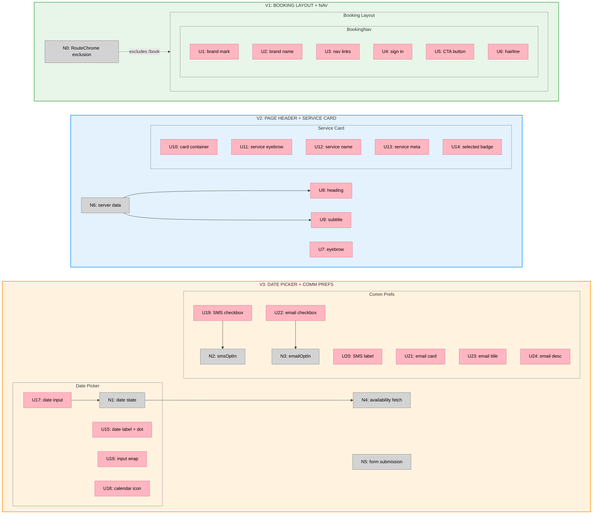

# Booking Page Reskin — Slices

**Selected shape:** C (Booking layout + restyle inline)
**Source:** [Shaping document](./booking-page-reskin-shape.md)

---

## Sliced Breadboard



---

## Slices Grid

|  |  |  |
|:--|:--|:--|
| **[V1: BOOKING LAYOUT + NAV](./v1-plan.md)**<br>✅ COMPLETE<br><br>• Add `/book` to RouteChrome exclusions<br>• Create `src/app/book/layout.tsx`<br>• Create `BookingNav` server component<br>• Brand mark + name + links + CTA<br><br>*Demo: Visit `/book/[slug]` — AL-styled nav, scrolls with page, no fixed header* | **[V2: PAGE HEADER + SERVICE CARD](./v2-plan.md)**<br>✅ COMPLETE<br><br>• Restyle page header in `page.tsx`<br>• Add eyebrow / heading / subtitle<br>• Restyle service card in `booking-form.tsx`<br>• Add green "Selected" badge pill<br><br>*Demo: Page shows editorial header, service card with green badge* | **[V3: DATE PICKER + COMM PREFS](./v3-plan.md)**<br>✅ COMPLETE<br><br>• Restyle date input with required dot<br>• Custom input wrap + calendar icon<br>• Restyle SMS inline checkbox<br>• Restyle email card checkbox<br><br>*Demo: Date field and checkboxes match Atelier Light spec* |

---

## Slice Dependencies

```
V1 (layout + nav) → V2 (header + service card) → V3 (date + prefs)
```

V1 must land first because the layout change (RouteChrome exclusion + booking layout) sets up the page background (`#f9f9f7`) and removes the old SiteHeader. V2 and V3 restyle components that sit inside this new layout.

V2 before V3 is a soft dependency — both modify `booking-form.tsx` so sequential ordering prevents merge conflicts.
