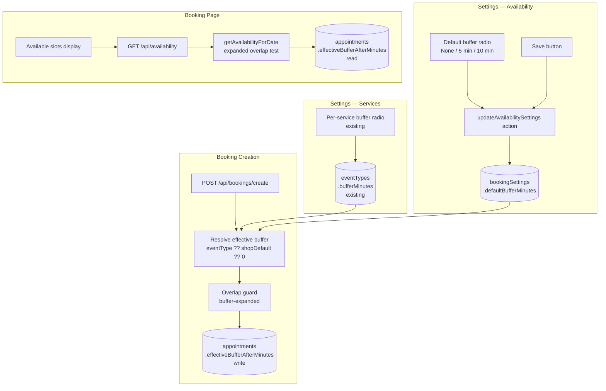

# Detail C + Option X: Breadboard

**Shape:** C1 + C2 + C3-B + C4-B + C5-A + Option X
**Date:** 2026-04-01

---

## UI Affordances

| ID | Place | Affordance | Type |
|----|-------|------------|------|
| U1 | `/app/settings/availability` | Default buffer control — radio group: None / 5 min / 10 min | Input |
| U2 | `/app/settings/availability` | Save availability settings button (existing) | Action |
| U3 | `/app/settings/services` | Per-service buffer radio group: None / 5 min / 10 min (already exists on `EventTypeForm`) | Input |
| U4 | `/book/[slug]` | Available time slots — buffer windows silently absent, no label or explanation | Display |

**Note — U3:** The per-service buffer UI (`EventTypeForm`) already exists and is wired to the schema. No UI change needed here. It ships as-is.

---

## Non-UI Affordances

| ID | Name | What it does |
|----|------|-------------|
| N1 | `bookingSettings.defaultBufferMinutes` | New integer column. Default 0. Check constraint: `IN (0, 5, 10)`. Shop-level fallback when event type has no buffer set. |
| N2 | `appointments.effectiveBufferAfterMinutes` | New integer column (Option X). Default 0. Captures resolved buffer at booking creation time. Availability reads from here — no JOIN needed. |
| N3 | `updateAvailabilitySettings` action | Extended to accept, validate (`z.union([z.literal(0), z.literal(5), z.literal(10)])`), and write `defaultBufferMinutes` to `bookingSettings`. |
| N4 | `getAvailabilityForDate()` | Extended overlap test. Reads `effectiveBufferAfterMinutes` from each booked appointment row. `blockedEnd = endsAt + effectiveBufferAfterMinutes`. Slot excluded if `slot.startsAt < blockedEnd`. |
| N5 | `createAppointment()` — buffer resolver | Resolves effective buffer for the new appointment: `eventType.bufferMinutes ?? bookingSettings.defaultBufferMinutes ?? 0`. Writes result to `appointments.effectiveBufferAfterMinutes`. |
| N6 | `createAppointment()` — overlap guard | Extended overlap check. Reads `effectiveBufferAfterMinutes` from existing appointments. Tests: `newStartsAt < existingEndsAt + existingBuffer`. Throws `SlotTakenError` if any row matches. |
| N7 | `AvailabilitySettingsForm` component | Extended with U1 (default buffer radio group). Passes value through to N3. |

---

## Wiring

### Place: `/app/settings/availability`

```
U1 (default buffer radio) ──► N3 (updateAvailabilitySettings action)
U2 (save button)          ──►     └──► N1 (bookingSettings.defaultBufferMinutes)
                                  └──► revalidatePath("/app/settings/availability")
                                  └──► revalidatePath("/book/[slug]")
```

### Place: `/app/settings/services`

```
U3 (per-service buffer radio) ──► createEventType / updateEventType action (existing)
                                      └──► eventTypes.bufferMinutes (existing column, no change)
```

### Place: `/book/[slug]` — availability check

```
Customer selects date
  └──► GET /api/availability?shop=x&date=YYYY-MM-DD
         └──► getAvailabilityForDate()
                └──► query booked appointments
                       SELECT startsAt, endsAt, effectiveBufferAfterMinutes   ← N2 added
                       WHERE shopId = ? AND status IN ('booked','pending') AND overlaps date
                └──► N4: filter slots
                       blockedEnd = endsAt + effectiveBufferAfterMinutes
                       exclude slot if slot.startsAt < blockedEnd
                └──► return filtered slots ──► U4 (visible available slots)
```

### Place: `/api/bookings/create` — booking creation

```
Customer submits booking (startsAt, eventTypeId)
  └──► createAppointment()
         └──► fetch bookingSettings (already in flight)
         └──► fetch eventType.bufferMinutes (already fetched for duration)
         └──► N5: resolve buffer
                effectiveBuffer = eventType.bufferMinutes ?? defaultBufferMinutes ?? 0
         └──► N6: overlap guard
                SELECT id FROM appointments
                WHERE shopId = ? AND status IN ('booked','pending')
                AND startsAt < (newEndsAt)
                AND (endsAt + effectiveBufferAfterMinutes * interval '1 min') > newStartsAt
                LIMIT 1
                → throws SlotTakenError if match found
         └──► INSERT appointment
                { ...existing fields, effectiveBufferAfterMinutes: effectiveBuffer }   ← N2 written
```

---

## Mermaid Diagram



---

## Orthogonal Concerns

Two concerns are independent and can be built in any order:

| Concern | Parts | Why independent |
|---------|-------|-----------------|
| **Shop-level default** | U1, N1, N3, N7 | Purely additive to `bookingSettings` + settings UI. Does not touch availability or creation logic beyond the resolver already needed for C1/C2. |
| **Wire-up + Option X** | N2, N4, N5, N6 | Touches `appointments` schema and the two query functions. Does not require the shop default to exist — resolver falls back to 0 if `defaultBufferMinutes` is null. |

This means the two slices are:
- **V1** — Wire-up + Option X (C1 + C2 + N2): schema migration, overlap test, creation guard
- **V2** — Shop default (C5-A): schema migration, settings UI, resolver reads shop default

V1 can ship and be verified independently. V2 adds the shop-level fallback on top.
