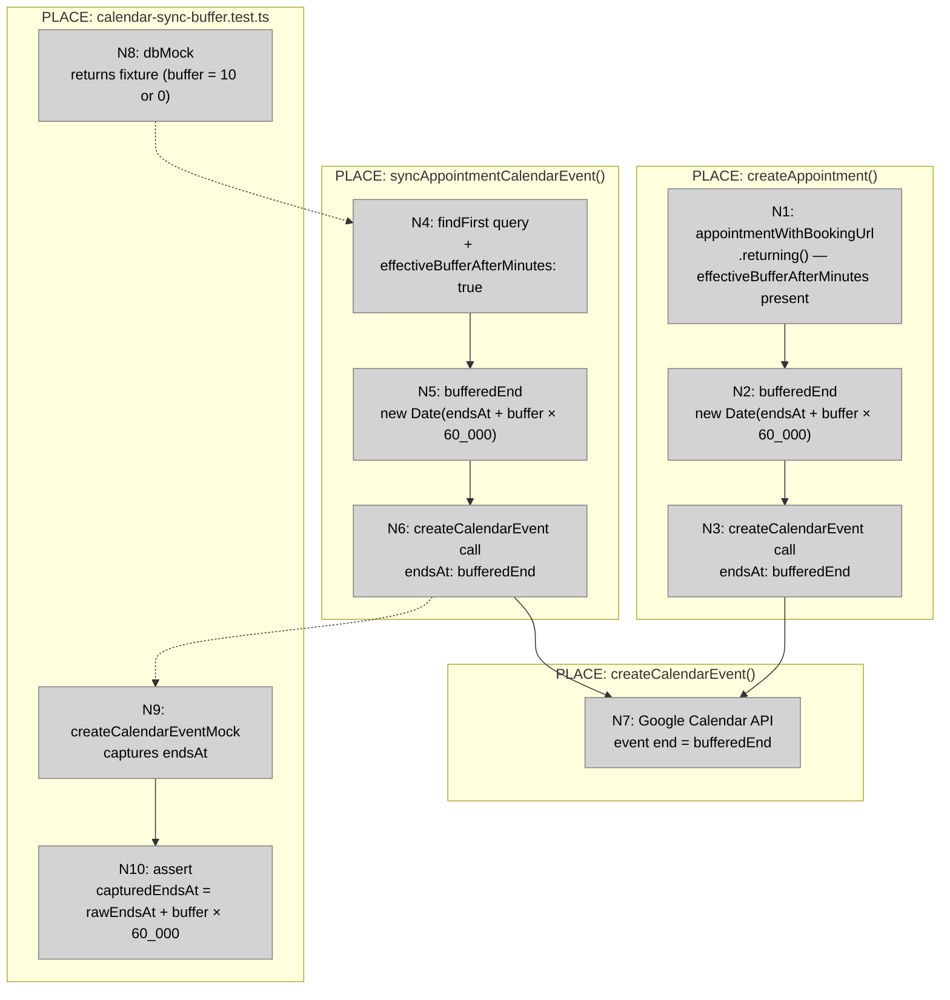
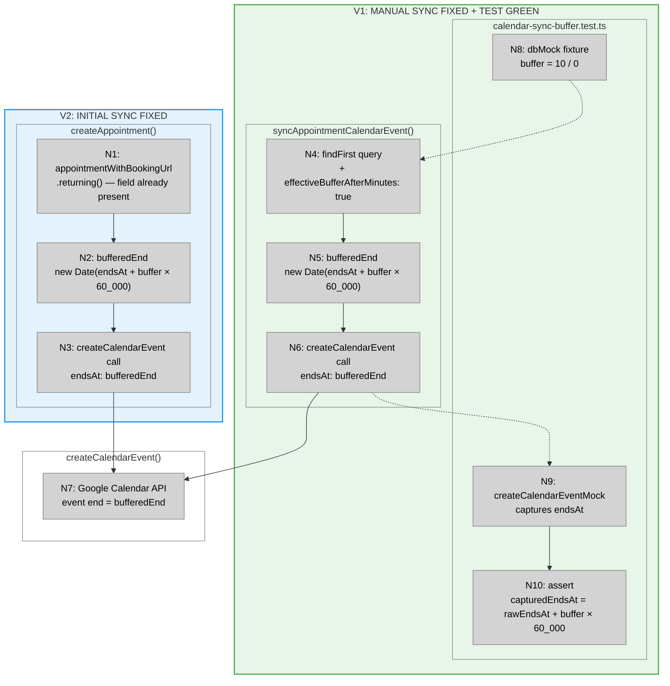

# Calendar Sync Buffer Fix — Shaping

**Source:** `docs/shaping/buffer-time/review-01.md` (Finding #1, High severity)
**Date:** 2026-04-08
**Status:** Shape selected — ready to implement

---

## Frame

### Source

> **Finding #1 — Calendar sync still exports raw appointment end time and ignores the booked buffer**
>
> Initial calendar sync during booking passes raw `appointmentWithBookingUrl.endsAt` to `createCalendarEvent`
> in `src/lib/queries/appointments.ts` (L943). Manual sync also passes raw `appointment.endsAt` (L1270).
> Both paths ignore `effectiveBufferAfterMinutes`, even though the feature now treats that buffer as part
> of the provider's blocked time.
>
> Fix instruction: In both calendar sync paths, send `endsAt + effectiveBufferAfterMinutes` to
> `createCalendarEvent`. Add a test proving an appointment with `effectiveBufferAfterMinutes = 10` creates
> a calendar event ending 10 minutes later than raw `endsAt`.

### Problem

The app blocks the provider's time through `endsAt + effectiveBufferAfterMinutes`. Google Calendar is told the provider is free at raw `endsAt`. These two representations of "when is the provider free" disagree.

A shop owner with a 10-minute cleanup buffer sees themselves free at 2:00 PM in Google Calendar, while the app rejects any booking between 2:00 and 2:10 PM. That inconsistency creates manual double-booking risk and breaks the mental model of "buffer is real."

### Outcome

Both calendar sync paths export a Google Calendar event whose end time equals `endsAt + effectiveBufferAfterMinutes`. The provider's blocked window is consistent between the app and their calendar.

---

## Requirements (R)

| ID | Requirement | Status |
|----|-------------|--------|
| R0 | Initial booking sync (inside `createAppointment`) passes the buffered end time to `createCalendarEvent` | Must-have |
| R1 | Manual sync (`syncAppointmentCalendarEvent`) passes the buffered end time to `createCalendarEvent` | Must-have |
| R2 | `appointment.endsAt` in the database is not changed — only the value sent to the external API changes | Must-have |
| R3 | A test proves `syncAppointmentCalendarEvent` calls `createCalendarEvent` with `endsAt + 10 min` when `effectiveBufferAfterMinutes = 10` | Must-have |
| R4 | Same test proves `effectiveBufferAfterMinutes = 0` produces no change to the exported end time | Must-have |

---

## Selected Shape: A — Inline buffered-end computation at each call site

### A: Inline buffered-end computation at both sync paths

**Final composition: A1 + A2 + A3**

| Part | Mechanism |
|------|-----------|
| **A1** | **Initial sync: computation only** |
| A1 | `appointmentWithBookingUrl` is the result of `.returning()` after the insert/update — Drizzle returns the full row, so `effectiveBufferAfterMinutes` is already present on the object. One change: replace `endsAt: appointmentWithBookingUrl.endsAt` with `endsAt: new Date(appointmentWithBookingUrl.endsAt.getTime() + appointmentWithBookingUrl.effectiveBufferAfterMinutes * 60_000)`. No query change needed. |
| **A2** | **Manual sync: query gap, then computation** |
| A2.1 | `syncAppointmentCalendarEvent` uses an explicit `columns` allowlist (L1219–1230). `effectiveBufferAfterMinutes` is absent from it. Add `effectiveBufferAfterMinutes: true`. This is a prerequisite: without it, the TypeScript type of `appointment` has no `effectiveBufferAfterMinutes` property and A2.2 cannot compile. A2 needs two changes where A1 needs one — that asymmetry is the core structural difference between the two paths. |
| A2.2 | Replace `endsAt: appointment.endsAt` with `endsAt: new Date(appointment.endsAt.getTime() + appointment.effectiveBufferAfterMinutes * 60_000)`. Identical computation to A1. |
| **A3** | **Test through `syncAppointmentCalendarEvent`** |
| A3.1 | Mock `db.query.appointments.findFirst` to return a minimal appointment fixture with `effectiveBufferAfterMinutes = 10`. Mock `createCalendarEvent`. Call `syncAppointmentCalendarEvent`. Assert `createCalendarEvent` is called with `endsAt` equal to `rawEndsAt + 600_000 ms`. |
| A3.2 | Repeat with `effectiveBufferAfterMinutes = 0`. Assert `createCalendarEvent` is called with `endsAt` equal to `rawEndsAt`. This is the arithmetic identity: `T + 0 = T` — no special case in the production code, just verified in the test. |

**Why `syncAppointmentCalendarEvent` is the test entry point and not `createAppointment`:**
`syncAppointmentCalendarEvent` is an exported top-level function and takes only an `appointmentId` — it can be isolated with a DB mock and a `createCalendarEvent` mock. `createAppointment` is a large transaction function with many dependencies; isolating the calendar-sync branch at unit level requires mocking too much context to be legible. A1 and A2 share the identical computation — if the test proves A2.2 correct, A1 is correct by pattern identity. If that is not sufficient, an integration test is the right level, not an additional unit test.

---

## Breadboard

### Non-UI Affordances

| ID | Affordance | Place | Wires Out |
|----|-----------|-------|-----------|
| N1 | `appointmentWithBookingUrl` — `.returning()` result; `effectiveBufferAfterMinutes` already present, no query change needed | `createAppointment()` | → N2 |
| N2 | `bufferedEnd` — `new Date(endsAt.getTime() + effectiveBufferAfterMinutes * 60_000)` | `createAppointment()` | → N3 |
| N3 | `createCalendarEvent({ ..., endsAt: bufferedEnd })` call | `createAppointment()` | → N7 |
| N4 | `db.query.appointments.findFirst` — columns allowlist now includes `effectiveBufferAfterMinutes: true` | `syncAppointmentCalendarEvent()` | → N5 |
| N5 | `bufferedEnd` — same computation as N2 | `syncAppointmentCalendarEvent()` | → N6 |
| N6 | `createCalendarEvent({ ..., endsAt: bufferedEnd })` call | `syncAppointmentCalendarEvent()` | → N7 |
| N7 | `createCalendarEvent()` — creates Google Calendar event; `end` field now equals `bufferedEnd` | `google-calendar.ts` | (external API) |
| N8 | `dbMock.query.appointments.findFirst` — returns fixture with `effectiveBufferAfterMinutes = 10` or `0` | `calendar-sync-buffer.test.ts` | -.-> N4 |
| N9 | `createCalendarEventMock` — intercepts N6→N7, captures `endsAt` arg | `calendar-sync-buffer.test.ts` | → N10 |
| N10 | `expect(capturedEndsAt).toBe(rawEndsAt + buffer × 60_000)` | `calendar-sync-buffer.test.ts` | — |

### Wiring by Place



**Legend:**
- **Grey nodes (N)** = code affordances (data, computations, calls)
- **Solid lines** = wires out (calls, data flow)
- **Dashed lines** = returns to / intercepts (mock substitutions)

**Key observations from the breadboard:**

1. **Parallel structure.** A1 (N1→N2→N3) and A2 (N4→N5→N6) are structurally identical — same computation, same target. The only pre-change difference is that N4 didn't carry `effectiveBufferAfterMinutes` out.

2. **Single convergence point.** Both paths flow into N7. The test only needs to cover one path (A2 via N4→N5→N6) to prove the computation is correct — A1 shares the same expression.

3. **Test intercepts at N6→N7.** N8 replaces what N4 reads from the DB; N9 intercepts what N6 sends to N7. The computation (N5) is exercised but not directly asserted — the assertion is on the output at N10.

---

## Fit Check: R × A

| Req | Requirement | Status | A |
|-----|-------------|--------|---|
| R0 | Initial booking sync passes buffered end time to `createCalendarEvent` | Must-have | ✅ |
| R1 | Manual sync passes buffered end time to `createCalendarEvent` | Must-have | ✅ |
| R2 | `appointment.endsAt` in the database is not changed | Must-have | ✅ |
| R3 | Test proves `syncAppointmentCalendarEvent` exports `endsAt + 10 min` when buffer = 10 | Must-have | ✅ |
| R4 | Test proves `effectiveBufferAfterMinutes = 0` produces no change to exported end | Must-have | ✅ |

**Notes:**
- R2: `new Date(endsAt.getTime() + buffer * 60_000)` constructs a new `Date` object in memory. The DB row is not touched. ✅ by construction.
- R3/R4: Covered by A3.1 and A3.2 respectively. Both assertions live in the same test block — same fixture, different `effectiveBufferAfterMinutes` values.

**Shape A passes all requirements. Selected.**

---

## What does NOT change

| Area | Reason |
|------|--------|
| `appointment.endsAt` DB column | Stores raw service end — unchanged by design |
| `createCalendarEvent` signature | `endsAt: Date` already accepts any `Date` value |
| Conflict scanner (`calendar-conflicts.ts`) | Out of scope — review-01 Finding #2 |
| Slot recovery eligibility (`slot-recovery.ts`) | Out of scope — review-01 Finding #3 |

---

## Call-site diff sketch

### A1 — Initial sync (L943–948, inside `createAppointment`)

```diff
  const calendarEventInput: Parameters<typeof createCalendarEvent>[0] = {
    shopId: input.shopId,
    customerName: customer.fullName,
    startsAt: appointmentWithBookingUrl.startsAt,
-   endsAt: appointmentWithBookingUrl.endsAt,
+   endsAt: new Date(
+     appointmentWithBookingUrl.endsAt.getTime() +
+     appointmentWithBookingUrl.effectiveBufferAfterMinutes * 60_000
+   ),
    bookingUrl,
  };
```

### A2 — Manual sync (`syncAppointmentCalendarEvent`, L1218–1274)

```diff
  const appointment = await db.query.appointments.findFirst({
    where: (table, { eq }) => eq(table.id, appointmentId),
    columns: {
      id: true,
      shopId: true,
      customerId: true,
      startsAt: true,
      endsAt: true,
+     effectiveBufferAfterMinutes: true,   // A2.1 — prerequisite for A2.2
      status: true,
      paymentStatus: true,
      paymentRequired: true,
      bookingUrl: true,
      calendarEventId: true,
    },
  });

  // ...

  const calendarEventInput: Parameters<typeof createCalendarEvent>[0] = {
    shopId: appointment.shopId,
    customerName: customer.fullName,
    startsAt: appointment.startsAt,
-   endsAt: appointment.endsAt,
+   endsAt: new Date(                      // A2.2
+     appointment.endsAt.getTime() +
+     appointment.effectiveBufferAfterMinutes * 60_000
+   ),
    bookingUrl: appointment.bookingUrl ?? null,
  };
```

---

## Test sketch (A3)

File: `src/lib/__tests__/calendar-sync-buffer.test.ts`

```typescript
// vi.hoisted: mock createCalendarEvent, db.query.appointments.findFirst,
//             and the guard checks (shop, customer lookups, calendarEventId check)

describe("syncAppointmentCalendarEvent — buffered end time", () => {
  const rawEndsAt = new Date("2026-04-10T14:00:00Z");

  it("exports endsAt + buffer when effectiveBufferAfterMinutes = 10", async () => {
    mockAppointment({ endsAt: rawEndsAt, effectiveBufferAfterMinutes: 10 });
    await syncAppointmentCalendarEvent("appt-1");
    expect(createCalendarEventMock).toHaveBeenCalledWith(
      expect.objectContaining({
        endsAt: new Date(rawEndsAt.getTime() + 10 * 60_000),
      })
    );
  });

  it("exports raw endsAt when effectiveBufferAfterMinutes = 0", async () => {
    mockAppointment({ endsAt: rawEndsAt, effectiveBufferAfterMinutes: 0 });
    await syncAppointmentCalendarEvent("appt-1");
    expect(createCalendarEventMock).toHaveBeenCalledWith(
      expect.objectContaining({ endsAt: rawEndsAt }),
    );
  });
});
```

---

## Slices

### V1: Manual sync fixed + test green

**Parts:** A2.1, A2.2, A3

**Affordances:**

| ID | Affordance | Change |
|----|-----------|--------|
| N4 | `findFirst` query in `syncAppointmentCalendarEvent` | Add `effectiveBufferAfterMinutes: true` to `columns` |
| N5 | `bufferedEnd` computation | New — `new Date(endsAt + buffer × 60_000)` |
| N6 | `createCalendarEvent` call | Replace `endsAt: appointment.endsAt` with `endsAt: bufferedEnd` |
| N8 | `dbMock` fixture | New test file — fixture with buffer = 10 and buffer = 0 |
| N9 | `createCalendarEventMock` | New — intercepts call, captures `endsAt` |
| N10 | assertions | New — proves N6 sends buffered end |

**Demo:** `pnpm test src/lib/__tests__/calendar-sync-buffer.test.ts` — 2 assertions pass.

**Requirements closed:** R1, R2, R3, R4

---

### V2: Initial sync fixed

**Parts:** A1

**Affordances:**

| ID | Affordance | Change |
|----|-----------|--------|
| N1 | `appointmentWithBookingUrl` | No change — field already present from `.returning()` |
| N2 | `bufferedEnd` computation | New — same expression as V1's N5 |
| N3 | `createCalendarEvent` call | Replace `endsAt: appointmentWithBookingUrl.endsAt` with `endsAt: bufferedEnd` |

**Demo:** `pnpm lint && pnpm typecheck` — clean. The expression is identical to the proven V1 computation; no additional test is added.

**Requirements closed:** R0

---

### Sliced breadboard



### Slices grid

|  |  |
|:--|:--|
| **[V1: MANUAL SYNC FIXED + TEST GREEN](./calendar-sync-buffer-v1-plan.md)**<br>⏳ PENDING<br><br>• Add `effectiveBufferAfterMinutes` to `findFirst` columns<br>• Compute `bufferedEnd` in `syncAppointmentCalendarEvent`<br>• Pass `bufferedEnd` to `createCalendarEvent`<br>• New test file — 2 assertions (buffer=10, buffer=0)<br><br>*Demo: `pnpm test calendar-sync-buffer` — 2 pass* | **[V2: INITIAL SYNC FIXED](./calendar-sync-buffer-v2-plan.md)**<br>⏳ PENDING<br><br>• Compute `bufferedEnd` in `createAppointment`<br>• Pass `bufferedEnd` to `createCalendarEvent`<br>• Field already present — no query change<br>• No new test — pattern proven by V1<br><br>*Demo: `pnpm lint && pnpm typecheck` — clean* |
