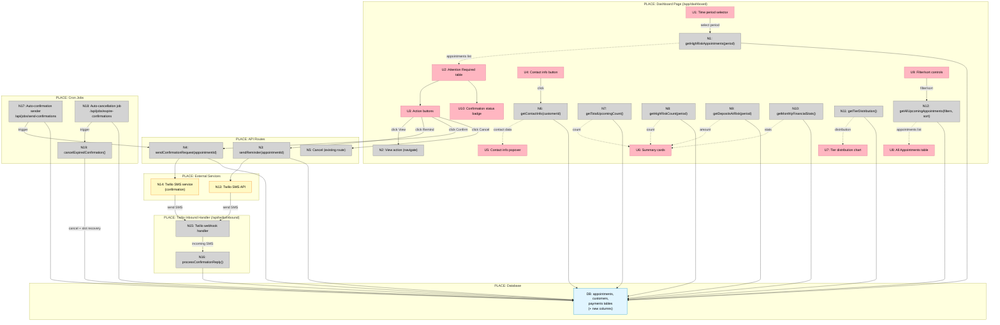

# Dashboard: No-Show Prevention — Shaping

Post-login dashboard for shop owners that prioritizes eliminating no-shows through customer trust scoring and immediate action on high-risk appointments.

---

## Frame

### Problem

- Shop owners using traditional booking systems lose money from no-shows
- They don't have visibility into which customers are reliable vs risky
- When a cancellation happens, they don't know which waitlisted customer to offer the slot to
- They can't proactively manage their customer base health
- Traditional dashboards focus on revenue metrics, not no-show prevention
- High-risk appointments are buried in calendar views without clear risk indicators
- No immediate action mechanism for risky appointments

### Outcome

- Shop owner lands on dashboard and immediately sees their no-show risk landscape
- High-risk appointments surfaced prominently with actionable data
- They can take immediate action (view, remind, confirm, cancel) without extra navigation
- They understand financial impact of tier system (deposits at risk, deposits retained)
- They see customer tier distribution as supporting context
- They can identify reliability trends and patterns

---

## Requirements (R)

| ID | Requirement | Status |
|----|-------------|--------|
| **R0** | Dashboard enables immediate action on high-risk appointments | Core goal |
| **R1** | High-risk appointments surfaced prominently in "Attention Required" section | Must-have |
| **R2** | Risk indicators visible at a glance (tier badge, late-cancel history, score) | Must-have |
| **R3** | Quick actions per appointment: View, Send reminder, Cancel, Contact info, Send confirmation request | Must-have |
| **R4** | Configurable time period for "Attention Required" section | Must-have |
| **R5** | Show tier distribution chart | Must-have |
| **R6** | Show financial impact metrics (deposits at risk, deposits retained, refunds) | Must-have |
| **R7** | Filter/sort all appointments by risk level, time, tier | Must-have |
| **R8** | Contact info (phone, email) easily accessible per appointment | Must-have |
| **R9** | SMS confirmation flow for high-risk appointments: manual trigger + automatic scheduling | Must-have |
| **R10** | Automatic cancellation if customer doesn't confirm within deadline | Must-have |
| **R11** | Customer can confirm via SMS reply "YES" | Must-have |

---

## Shape D: Action-First Dashboard

Focus on "what needs attention now" at the top, supporting data below.

| Part | Mechanism | Flag |
|------|-----------|:----:|
| **D1** | **Attention Required section** | |
| D1.1 | Query: appointments with (risk tier OR score <40 OR voidedLast90Days ≥2) AND time within selected period | |
| D1.2 | Time period selector: dropdown (Next 24h / Next 3 days / Next 7 days / Next 14 days) | |
| D1.3 | Table columns: Customer name + tier badge, Time, Service, Risk score, Void count (90d), Confirmation status, Actions | |
| D1.4 | Actions per row: View \| Remind \| Confirm \| Cancel buttons | |
| D1.5 | Confirmation status badge: None / Pending (yellow) / Confirmed (green) / Expired (red) | |
| **D2** | **Summary cards row** | |
| D2.1 | Card: Total upcoming appointments (next 30 days) | |
| D2.2 | Card: High-risk count (from D1 query) | |
| D2.3 | Card: Deposits at risk (sum of deposits for high-risk appointments) | |
| D2.4 | Card: This month stats (deposits retained, refunds issued) | |
| **D3** | **Tier distribution chart** | |
| D3.1 | Donut chart: top tier count (green), neutral tier count (yellow), risk tier count (red) | |
| D3.2 | Shows current customer base distribution across all customers | |
| **D4** | **All Upcoming Appointments section** | |
| D4.1 | Table: all appointments next 30 days, same columns as D1.3 | |
| D4.2 | Sortable by: time (asc/desc), risk score, tier | |
| D4.3 | Filter dropdowns: Tier (all/top/neutral/risk), Time range | |
| D4.4 | Same action buttons as D1.4 | |
| **D5** | **Action handlers** | |
| D5.1 | View: navigate to `/app/appointments/[id]` | |
| D5.2 | Remind: send SMS "Reminder: appointment at [shop] on [date] at [time]. Manage: [link]" via Twilio | |
| D5.3 | Confirm: trigger manual confirmation request → calls D6 | |
| D5.4 | Cancel: navigate to cancel flow (existing `/api/manage/[token]/cancel`) | |
| D5.5 | Contact info: popover showing customer phone + email with copy-to-clipboard buttons | |
| **D6** | **Confirmation request system** | |
| D6.1 | Database: add `confirmationStatus` ENUM('none', 'pending', 'confirmed', 'expired') DEFAULT 'none' to appointments table | |
| D6.2 | Database: add `confirmationSentAt` timestamp NULL to appointments table | |
| D6.3 | Database: add `confirmationDeadline` timestamp NULL to appointments table | |
| D6.4 | `sendConfirmationRequest(appointmentId)`: creates SMS "Reply YES to confirm your appointment on [date] at [time] or it will be cancelled" | |
| D6.5 | Set confirmationStatus = 'pending', confirmationSentAt = now(), confirmationDeadline = now() + 24 hours | |
| D6.6 | SMS sent via Twilio with appointmentId stored in Twilio message SID metadata for redundancy | |
| **D7** | **Automatic confirmation sender (cron job)** | |
| D7.1 | Job runs every hour: `/api/jobs/send-confirmations` | |
| D7.2 | Query: high-risk appointments (tier=risk OR score<40 OR voids≥2) AND startsAt between 24-48 hours from now AND confirmationStatus='none' | |
| D7.3 | For each: call sendConfirmationRequest(appointmentId) | |
| **D8** | **Twilio inbound handler (YES reply processing)** | |
| D8.1 | Extend existing `/api/twilio/inbound/route.ts` | |
| D8.2 | Match incoming phone number to appointments with confirmationStatus='pending' (may return multiple) | |
| D8.3 | Check Twilio message SID metadata for appointmentId (primary match) | |
| D8.4 | Fallback: if no metadata, use phone number + pending status + closest appointment by time | |
| D8.5 | If body contains "YES" (case-insensitive): set confirmationStatus='confirmed', send "Thanks! Your appointment is confirmed." | |
| D8.6 | If no match found: existing fallback behavior | |
| **D9** | **Automatic cancellation job** | |
| D9.1 | Job runs every hour: `/api/jobs/expire-confirmations` | |
| D9.2 | Query: appointments with confirmationStatus='pending' AND confirmationDeadline < now() | |
| D9.3 | For each: set confirmationStatus='expired', call existing cancellation logic, trigger slot recovery | |

---

## Fit Check

| Req | Requirement | Status | D |
|-----|-------------|--------|---|
| **R0** | Dashboard enables immediate action on high-risk appointments | Core goal | ✅ |
| **R1** | High-risk appointments surfaced prominently in "Attention Required" section | Must-have | ✅ |
| **R2** | Risk indicators visible at a glance (tier badge, late-cancel history, score) | Must-have | ✅ |
| **R3** | Quick actions per appointment: View, Send reminder, Cancel, Contact info, Send confirmation request | Must-have | ✅ |
| **R4** | Configurable time period for "Attention Required" section | Must-have | ✅ |
| **R5** | Show tier distribution chart | Must-have | ✅ |
| **R6** | Show financial impact metrics (deposits at risk, deposits retained, refunds) | Must-have | ✅ |
| **R7** | Filter/sort all appointments by risk level, time, tier | Must-have | ✅ |
| **R8** | Contact info (phone, email) easily accessible per appointment | Must-have | ✅ |
| **R9** | SMS confirmation flow for high-risk appointments: manual trigger + automatic scheduling | Must-have | ✅ |
| **R10** | Automatic cancellation if customer doesn't confirm within deadline | Must-have | ✅ |
| **R11** | Customer can confirm via SMS reply "YES" | Must-have | ✅ |

**Notes:**
- All requirements satisfied
- D1-D4 handle dashboard UI (R0-R8)
- D5-D9 handle confirmation system (R9-R11)
- D7.2: Automatic confirmations sent for appointments 24-48 hours away
- D6.5: 24-hour deadline for customer response
- D8: Redundant matching via metadata + phone number fallback

---

## Breadboard

### UI Affordances

| ID | Affordance | Place | Wires Out To |
|----|------------|-------|--------------|
| **U1** | Time period selector dropdown | Dashboard Page | N1 |
| **U2** | Attention Required table | Dashboard Page | N1, U3 |
| **U3** | Action buttons (View \| Remind \| Confirm \| Cancel) | Dashboard Page (per row) | N2, N3, N4, N5 |
| **U4** | Contact info button | Dashboard Page (per row) | N6 |
| **U5** | Contact info popover | Dashboard Page | — |
| **U6** | Summary cards row (4 cards) | Dashboard Page | N7, N8, N9, N10 |
| **U7** | Tier distribution donut chart | Dashboard Page | N11 |
| **U8** | All Appointments table | Dashboard Page | N12, U9 |
| **U9** | Filter/sort controls | Dashboard Page | N12 |
| **U10** | Confirmation status badge | Dashboard Page (per row) | — |

### Non-UI Affordances

| ID | Affordance | Place | Wires Out To | Returns To |
|----|------------|-------|--------------|------------|
| **N1** | `getHighRiskAppointments(period)` query | Dashboard Page | DB: appointments, customers | U2 |
| **N2** | View action handler | Dashboard Page | — (navigate) | — |
| **N3** | `sendReminder(appointmentId)` | `/api/appointments/[id]/remind` | N13, DB: appointments | U3 |
| **N4** | `sendConfirmationRequest(appointmentId)` | `/api/appointments/[id]/confirm` | N14, DB: appointments | U3 |
| **N5** | Cancel action handler | Dashboard Page | — (navigate to /api/manage/[token]/cancel) | — |
| **N6** | `getContactInfo(customerId)` query | Dashboard Page | DB: customers | U5 |
| **N7** | `getTotalUpcomingCount()` query | Dashboard Page | DB: appointments | U6 |
| **N8** | `getHighRiskCount(period)` query | Dashboard Page | DB: appointments, customers | U6 |
| **N9** | `getDepositsAtRisk(period)` query | Dashboard Page | DB: appointments, payments | U6 |
| **N10** | `getMonthlyFinancialStats()` query | Dashboard Page | DB: appointments, payments | U6 |
| **N11** | `getTierDistribution()` query | Dashboard Page | DB: customers | U7 |
| **N12** | `getAllUpcomingAppointments(filters, sort)` query | Dashboard Page | DB: appointments, customers | U8 |
| **N13** | Twilio SMS service (reminder) | Server | Twilio API | N3 |
| **N14** | Twilio SMS service (confirmation request) | Server | Twilio API, DB: appointments | N4, N17 |
| **N15** | Twilio inbound webhook handler | `/api/twilio/inbound` | N16, DB: appointments | — |
| **N16** | `processConfirmationReply(phone, body, messageSid)` | `/api/twilio/inbound` | DB: appointments | N15 |
| **N17** | Auto-confirmation sender cron | `/api/jobs/send-confirmations` | N14, DB: appointments | — |
| **N18** | Auto-cancellation cron | `/api/jobs/expire-confirmations` | N19, DB: appointments | — |
| **N19** | `cancelExpiredConfirmation(appointmentId)` | `/api/jobs/expire-confirmations` | Existing cancel logic, slot recovery | N18 |
| **DB** | Database schema changes | PostgreSQL | — | All queries |

### Database Schema Changes (DB)

| Table | Column | Type | Notes |
|-------|--------|------|-------|
| appointments | confirmationStatus | ENUM('none', 'pending', 'confirmed', 'expired') | DEFAULT 'none' |
| appointments | confirmationSentAt | timestamp NULL | When confirmation was requested |
| appointments | confirmationDeadline | timestamp NULL | When confirmation expires (sentAt + 24h) |

---

## Wiring Diagram

**Legend:**
- **Pink nodes (U)** = UI affordances (things users see/interact with)
- **Grey nodes (N)** = Code affordances (handlers, queries, services)
- **Blue nodes (DB)** = Database
- **Yellow nodes** = External services (Twilio)
- **Solid lines** = Wires Out (calls, triggers, writes)
- **Dashed lines** = Returns To (return values, data reads)

---

## Key Flows

### Flow 1: Shop owner views dashboard
1. U1 (period selector) → N1 (query high-risk) → DB → U2 (display table)
2. U6 (summary cards) ← N7-N10 (metrics queries) ← DB
3. U7 (tier chart) ← N11 (tier distribution) ← DB
4. U8 (all appointments) ← N12 (query all) ← DB

### Flow 2: Shop owner manually sends confirmation
1. U3 (click Confirm button) → N4 (sendConfirmationRequest) → N14 (Twilio SMS) → DB (update status)
2. DB: set confirmationStatus='pending', confirmationSentAt=now(), confirmationDeadline=now()+24h

### Flow 3: Customer replies YES
1. N15 (Twilio webhook receives SMS) → N16 (processConfirmationReply)
2. N16 matches phone + messageSid → DB (find appointment)
3. N16 updates DB: confirmationStatus='confirmed'

### Flow 4: Automatic confirmation sending
1. N17 (cron runs hourly) → DB (query appointments 24-48h away, high-risk, status='none')
2. For each → N4 (sendConfirmationRequest) → N14 (Twilio SMS) → DB (update status)

### Flow 5: Automatic cancellation
1. N18 (cron runs hourly) → DB (query confirmationStatus='pending' AND deadline passed)
2. For each → N19 (cancelExpiredConfirmation) → existing cancel logic + slot recovery → DB

---

## Design Decisions

### Confirmation Timing
- **Trigger window**: 24-48 hours before appointment
- **Response deadline**: 24 hours from confirmation request sent
- **Why**: Gives customers enough time to respond while protecting shop from last-minute no-shows

### High-Risk Criteria
Appointment flagged as high-risk if ANY of:
- Customer tier = 'risk'
- Customer score < 40
- Customer voidedLast90Days ≥ 2

### Confirmation Status States
- **none**: Default, no confirmation requested
- **pending**: Confirmation SMS sent, awaiting customer reply
- **confirmed**: Customer replied "YES"
- **expired**: Deadline passed without confirmation → triggers auto-cancellation

### SMS Matching Strategy
Primary: Twilio message SID metadata (stores appointmentId)
Fallback: Phone number + confirmationStatus='pending' + closest upcoming appointment

---

## Implementation Notes

### Prerequisites
- Existing Twilio integration (`src/lib/twilio.ts`)
- Existing cancellation logic (`/api/manage/[token]/cancel`)
- Existing slot recovery system (`src/lib/slot-recovery.ts`)
- Existing tier/scoring system (`src/lib/scoring.ts`)

### New Files Required
- `/app/app/dashboard/page.tsx` - Main dashboard component
- `/app/api/appointments/[id]/remind/route.ts` - Reminder SMS endpoint
- `/app/api/appointments/[id]/confirm/route.ts` - Manual confirmation endpoint
- `/app/api/jobs/send-confirmations/route.ts` - Auto-confirmation cron
- `/app/api/jobs/expire-confirmations/route.ts` - Auto-cancellation cron
- `src/lib/queries/dashboard.ts` - Dashboard queries (N1, N7-N12)

### Database Migration
Create migration to add three new columns to `appointments` table:
- `confirmationStatus` ENUM (default 'none')
- `confirmationSentAt` timestamp NULL
- `confirmationDeadline` timestamp NULL

### Cron Configuration
Configure Vercel Cron or similar to run:
- `/api/jobs/send-confirmations` - Every hour
- `/api/jobs/expire-confirmations` - Every hour

---

## Questions for Implementation

Before slicing this for implementation, clarify:

1. **Dashboard route**: Should this be `/app/dashboard` or `/app` (root after login)?

2. **Authentication**: Does the existing auth system automatically protect `/app/*` routes?

3. **Cron job infrastructure**: Do you already have a cron system set up, or do we need to configure Vercel Cron?

4. **Twilio message metadata**: Can we store appointmentId in Twilio message metadata, or rely purely on phone number matching?

5. **Slot recovery integration**: When N19 cancels an expired confirmation, should it immediately trigger the existing slot recovery offer loop?

6. **Existing `/app` route**: Is there currently a dashboard at `/app`, or does it redirect elsewhere?
