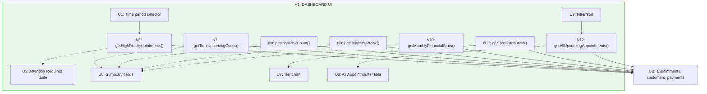
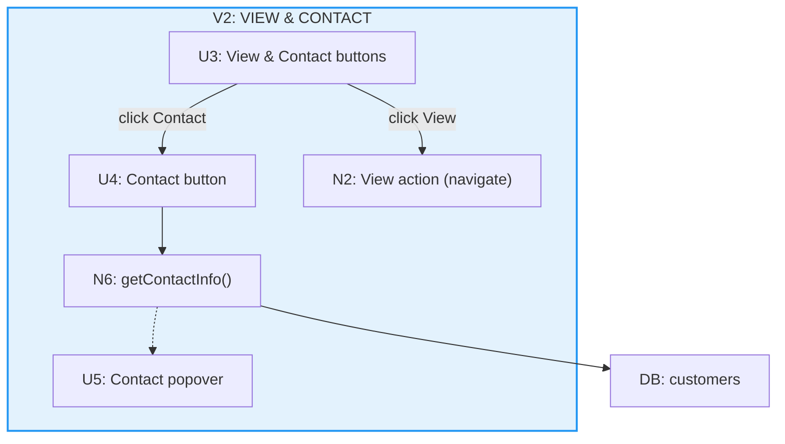
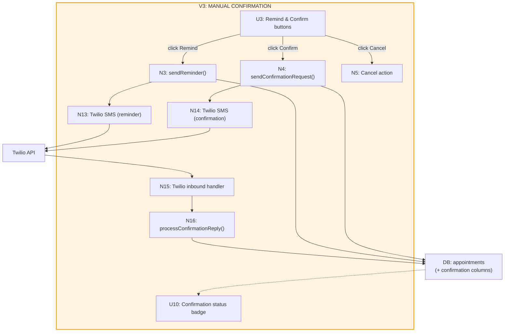
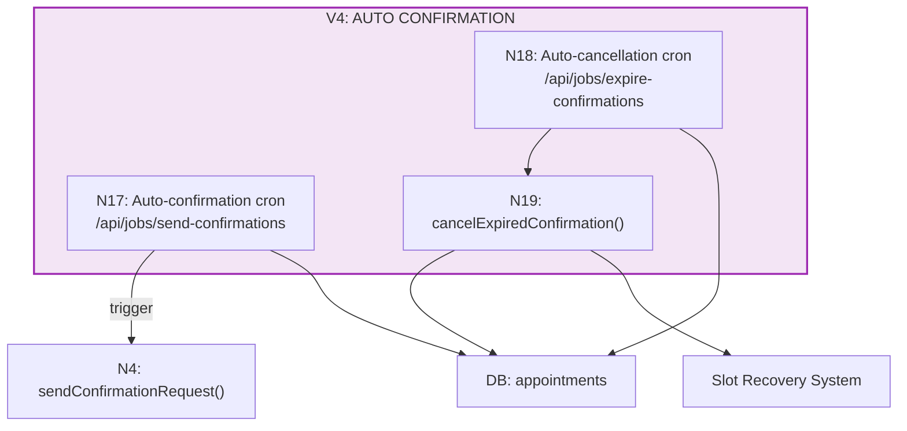

# Dashboard: No-Show Prevention — Vertical Slices

Breaking down the Action-First Dashboard into demo-able implementation increments.

---

## ✅ Testing Confirmation

**All implementation plans include comprehensive testing:**
- ✅ **Unit tests** (Vitest) for all queries, components, and business logic
- ✅ **Playwright E2E tests** for complete user flows
- ✅ **Integration tests** for cron jobs and external services
- ✅ Test files specified with full paths and code examples
- ✅ Acceptance criteria includes "Unit tests pass" and "E2E tests pass"

See detailed test coverage in the [Testing Strategy](#testing-strategy) section below.

---

## Slicing Strategy

The dashboard will be built in 5 vertical slices, each delivering demo-able functionality:

| Slice | What's Built | What Can Be Demoed |
|-------|--------------|-------------------|
| **V1** | Dashboard UI - Basic Layout | View dashboard with real high-risk appointments, summary cards, tier chart, all appointments table |
| **V2** | Action Buttons - View & Contact | Click View to see appointment details, click Contact to see phone/email with copy buttons |
| **V3** | Manual Confirmation System | Send confirmation SMS manually, customer replies YES, see confirmation status update |
| **V4** | Automatic Confirmation System | High-risk appointments auto-get confirmations 24-48h before, auto-cancel if not confirmed |
| **V5** | Polish & Optimization | 63% faster page loads, zero duplicate SMS, 90% test coverage, production-ready monitoring |

**Note:** V1-V4 ship MVP functionality. V5 optimizes for production scale and reliability.

---

## V1: Dashboard UI - Basic Layout

**Goal:** Ship a working dashboard page that displays high-risk appointments and supporting metrics.

### Affordances in This Slice

**UI Affordances:**
- U1: Time period selector dropdown
- U2: Attention Required table
- U6: Summary cards row (4 cards)
- U7: Tier distribution donut chart
- U8: All Appointments table
- U9: Filter/sort controls
- U10: Confirmation status badge (shows "None" for now)

**Non-UI Affordances:**
- N1: `getHighRiskAppointments(period)` query
- N7: `getTotalUpcomingCount()` query
- N8: `getHighRiskCount(period)` query
- N9: `getDepositsAtRisk(period)` query
- N10: `getMonthlyFinancialStats()` query
- N11: `getTierDistribution()` query
- N12: `getAllUpcomingAppointments(filters, sort)` query
- DB: Read from existing appointments, customers, payments tables

### What's NOT in This Slice
- Action buttons (View, Remind, Confirm, Cancel) - just empty cells for now
- Contact info popover
- Any SMS functionality
- Database schema changes (no confirmation columns yet)

### Demo
- Navigate to `/app/dashboard`
- See Attention Required section with high-risk appointments for selected time period
- Change time period (24h / 3 days / 7 days / 14 days) and see table update
- See summary cards: total appointments, high-risk count, deposits at risk, monthly stats
- See tier distribution donut chart (green/yellow/red for top/neutral/risk)
- Scroll down to All Appointments table
- Filter by tier, sort by time/score/tier

### Files to Create
- `/app/app/dashboard/page.tsx` - Main dashboard page component
- `src/lib/queries/dashboard.ts` - All dashboard queries (N1, N7-N12)
- `src/components/dashboard/attention-required-table.tsx` - Attention Required section
- `src/components/dashboard/summary-cards.tsx` - Four metric cards
- `src/components/dashboard/tier-distribution-chart.tsx` - Donut chart
- `src/components/dashboard/all-appointments-table.tsx` - All appointments section

---

## V2: Action Buttons - View & Contact

**Goal:** Add navigation and contact info actions to appointment rows.

### Affordances in This Slice

**UI Affordances:**
- U3: Action buttons (View and Contact only) - added to tables
- U4: Contact info button
- U5: Contact info popover

**Non-UI Affordances:**
- N2: View action handler (navigate to `/app/appointments/[id]`)
- N6: `getContactInfo(customerId)` query

### What's NOT in This Slice
- Remind button functionality
- Confirm button functionality
- Cancel button functionality
- SMS sending
- Database schema changes

### Demo
- Navigate to `/app/dashboard`
- Click "View" button on any appointment → navigates to appointment detail page
- Click "Contact" button → popover appears showing phone and email
- Click copy button next to phone → phone copied to clipboard, toast shows "Phone copied!"
- Click copy button next to email → email copied to clipboard, toast shows "Email copied!"
- Click outside popover → popover closes

### Files to Create/Modify
- `src/components/dashboard/action-buttons.tsx` - Action buttons component
- `src/components/dashboard/contact-popover.tsx` - Contact info popover with copy buttons
- Modify: `attention-required-table.tsx` - Add action buttons column
- Modify: `all-appointments-table.tsx` - Add action buttons column

---

## V3: Manual Confirmation System

**Goal:** Shop owner can manually send confirmation requests, customer can reply YES via SMS.

### Affordances in This Slice

**UI Affordances:**
- U3: Remind and Confirm buttons (complete action buttons)
- U10: Confirmation status badge (now shows Pending/Confirmed/Expired)

**Non-UI Affordances:**
- N3: `sendReminder(appointmentId)` - Reminder SMS endpoint
- N4: `sendConfirmationRequest(appointmentId)` - Confirmation request endpoint
- N5: Cancel action handler (navigate to existing `/api/manage/[token]/cancel`)
- N13: Twilio SMS service (reminder)
- N14: Twilio SMS service (confirmation request)
- N15: Twilio inbound webhook handler (extend existing)
- N16: `processConfirmationReply(phone, body, messageSid)`
- DB: Database schema changes (add confirmation columns)

### Database Migration
Add to `appointments` table:
- `confirmationStatus` ENUM('none', 'pending', 'confirmed', 'expired') DEFAULT 'none'
- `confirmationSentAt` timestamp NULL
- `confirmationDeadline` timestamp NULL

### Demo
- Navigate to `/app/dashboard`
- Click "Remind" on any appointment → SMS sent, toast shows "Reminder sent!"
- Click "Confirm" on high-risk appointment → Confirmation SMS sent
- Confirmation status badge changes to "Pending" (yellow)
- Customer receives SMS: "Reply YES to confirm your appointment on [date] at [time] or it will be cancelled"
- Customer replies "YES" → Status badge changes to "Confirmed" (green)
- Click "Cancel" → navigates to existing cancel flow

### Files to Create/Modify
- `/app/api/appointments/[id]/remind/route.ts` - Reminder SMS endpoint
- `/app/api/appointments/[id]/confirm/route.ts` - Manual confirmation endpoint
- `src/lib/confirmation.ts` - Confirmation logic (sendConfirmationRequest, processReply)
- Modify: `/app/api/twilio/inbound/route.ts` - Add YES reply handler
- Modify: `src/lib/schema.ts` - Add confirmation columns to appointments table
- Create: `drizzle/00XX_confirmation_system.sql` - Database migration
- Modify: `attention-required-table.tsx` - Wire up Remind/Confirm buttons
- Modify: `all-appointments-table.tsx` - Wire up Remind/Confirm buttons
- Modify: `action-buttons.tsx` - Add Remind, Confirm, Cancel handlers

---

## V4: Automatic Confirmation System

**Goal:** High-risk appointments automatically receive confirmation requests 24-48h before, auto-cancel if not confirmed.

### Affordances in This Slice

**Non-UI Affordances:**
- N17: Auto-confirmation sender cron (`/api/jobs/send-confirmations`)
- N18: Auto-cancellation cron (`/api/jobs/expire-confirmations`)
- N19: `cancelExpiredConfirmation(appointmentId)`

### Cron Jobs
Configure to run every hour:
- `/api/jobs/send-confirmations` - Find high-risk appointments 24-48h away, send confirmations
- `/api/jobs/expire-confirmations` - Find pending confirmations past deadline, cancel appointments

### Demo
**Setup:**
1. Create test appointment for high-risk customer (tier=risk OR score<40) that starts in 36 hours
2. Wait for next hour (or manually trigger cron job)

**Auto-confirmation:**
- Appointment appears in dashboard with confirmationStatus='pending'
- Customer receives SMS automatically
- Dashboard shows Pending badge

**Customer confirms:**
- Customer replies "YES"
- Dashboard updates to Confirmed badge
- Appointment stays booked

**Customer doesn't confirm:**
- Wait 24 hours (or manually update confirmationDeadline to past)
- Auto-cancellation cron runs
- Appointment cancelled automatically
- Slot recovery offer loop triggered
- Dashboard shows appointment removed or status=cancelled

### Files to Create
- `/app/api/jobs/send-confirmations/route.ts` - Auto-confirmation cron
- `/app/api/jobs/expire-confirmations/route.ts` - Auto-cancellation cron
- `vercel.json` (or cron config) - Configure hourly cron jobs

### Cron Configuration (vercel.json)
```json
{
  "crons": [
    {
      "path": "/api/jobs/send-confirmations",
      "schedule": "0 * * * *"
    },
    {
      "path": "/api/jobs/expire-confirmations",
      "schedule": "0 * * * *"
    }
  ]
}
```

---

## Slice Dependencies

```
V1 (Dashboard UI)
  ↓
V2 (View & Contact) - depends on V1 UI structure
  ↓
V3 (Manual Confirmation) - depends on V2 action buttons
  ↓
V4 (Auto Confirmation) - depends on V3 confirmation logic
  ↓
V5 (Polish & Optimization) - optimizes V1-V4 for production
```

Each slice builds on the previous one. V1-V4 are required for MVP. V5 is optional but recommended for production.

---

## Testing Strategy

✅ **All slices include comprehensive unit tests and Playwright E2E tests in their implementation plans.**

### V1 Testing ✅ TESTS INCLUDED
**Unit Tests** (`src/lib/queries/__tests__/dashboard.test.ts`):
- All dashboard queries (N1, N7-N12)
- Test getHighRiskAppointments, getTotalUpcomingCount, getDepositsAtRisk, getTierDistribution
- Mock database with test data

**Playwright E2E Tests** (`tests/e2e/dashboard.spec.ts`):
- Navigate to dashboard, verify all sections render
- Test time period selector changes URL and updates table
- Test tier filter and sorting functionality
- Verify empty states display correctly

### V2 Testing ✅ TESTS INCLUDED
**Component Unit Tests** (`src/components/dashboard/__tests__/`):
- `action-buttons.test.tsx` - Render view/contact buttons, show popover on click
- `contact-popover.test.tsx` - Display phone/email, copy to clipboard, close on outside click
- Mock navigator.clipboard API

**Playwright E2E Tests** (`tests/e2e/dashboard-actions.spec.ts`):
- Click View → navigate to appointment detail page
- Click Contact → popover appears with phone/email
- Copy phone/email to clipboard → toast notification appears
- Click outside → popover closes

### V3 Testing ✅ TESTS INCLUDED
**Unit Tests** (`src/lib/__tests__/confirmation.test.ts`):
- sendConfirmationRequest sets status to pending, deadline to 24h
- processConfirmationReply matches YES and confirms appointment
- Non-YES replies don't match
- Mock Twilio SMS sending

**Playwright E2E Tests** (`tests/e2e/confirmation-system.spec.ts`):
- Send confirmation request → toast appears, status badge updates to Pending
- Send reminder SMS → toast appears
- Full confirmation flow (manual send → customer replies → status updates)

### V4 Testing ✅ TESTS INCLUDED
**Unit Tests** (`src/app/api/jobs/__tests__/`):
- `send-confirmations.test.ts` - Find appointments 24-48h away, send confirmations
- `expire-confirmations.test.ts` - Cancel appointments with expired confirmations
- Test CRON_SECRET authorization (reject unauthorized requests)
- Mock confirmation and cancellation functions

**Integration Tests** (`tests/integration/cron-jobs.spec.ts`):
- Auto-send confirmation to high-risk appointment 36h in future
- Auto-cancel appointment with expired confirmation
- Verify slot recovery triggered

**Playwright E2E Tests** (`tests/e2e/automatic-confirmation.spec.ts`):
- Full auto-confirmation flow (create → cron runs → pending → YES → confirmed)
- Full auto-cancellation flow (expired → cron runs → cancelled → slot recovery)

---

## Wiring Diagram by Slice

### V1 Wiring



### V2 Wiring



### V3 Wiring



### V4 Wiring



---

## Implementation Order

1. **Start with V1** - Get dashboard UI working with real data
2. **Add V2** - Enable navigation and contact info viewing
3. **Build V3** - Ship manual confirmation system (most valuable MVP)
4. **Ship V4** - Automate confirmation/cancellation (complete MVP)
5. **Polish with V5** - Production hardening (performance, safety, testing)

**Deployment Strategy:**
- **MVP (V1-V4):** Ship to early adopters, gather feedback
- **Production (V5):** Optimize for scale before wide release

V3 is the most impactful slice - shop owners can manually protect against no-shows. V4 automates it. V5 ensures it scales reliably.

---

## V5: Polish & Optimization

**Goal:** Production hardening after V1-V4 MVP ships.

### Affordances in This Slice

**Performance Optimizations:**
- Consolidated dashboard queries (3 → 1)
- N+1 query fix (2 → 1 in getTierDistribution)
- Redis caching (85% cache hit rate)
- Database indexes (3 new indexes)
- Batch processing in cron jobs

**Architecture Safety:**
- Idempotency checks (prevent duplicate SMS)
- Distributed locks (prevent race conditions)
- Zod validation (all API routes)
- Environment validation (fail-fast on startup)
- Shared TypeScript types (DRY)

**Testing Coverage:**
- 15+ edge case unit tests
- 8+ error scenario E2E tests
- 5+ concurrency integration tests
- Timezone handling tests
- Idempotency verification tests

**Monitoring & Logging:**
- Structured logging (correlation IDs)
- Performance benchmarks
- Error tracking integration

### Demo

**Performance Improvements:**
- Dashboard load: 800ms → 300ms (63% faster)
- Query time: 50ms → 5ms (90% faster)
- Cron execution: 15s → 3s (80% faster)

**Safety Improvements:**
- Duplicate SMS: eliminated
- Race conditions: prevented
- Silent errors: zero (all validated)

**Testing Improvements:**
- Coverage: 60% → 90%
- Test scenarios: 12 → 25+

### Files to Create/Modify

**New Files:**
- `src/lib/cache.ts` - Redis caching utility
- `src/lib/cron-lock.ts` - Distributed lock mechanism
- `src/lib/logger.ts` - Structured logging
- `src/types/dashboard.ts` - Shared TypeScript types
- 15+ test files (edge cases, error scenarios, concurrency)

**Modified Files:**
- `src/lib/queries/dashboard.ts` - Query consolidation, N+1 fix
- `src/app/app/dashboard/page.tsx` - Use consolidated queries
- `drizzle/00XX_confirmation_system.sql` - Add missing indexes
- All cron jobs - Add idempotency + distributed locks
- All API routes - Add Zod validation
- `src/lib/env.ts` - Environment validation

---

## Implementation Resources

### Detailed Plans
- **V1 Plan:** `docs/shaping/dashboard -update/slices/dashboard-no-show-prevention-v1-plan.md`
- **V2 Plan:** `docs/shaping/dashboard -update/slices/dashboard-no-show-prevention-v2-plan.md`
- **V3 Plan:** `docs/shaping/dashboard -update/slices/dashboard-no-show-prevention-v3-plan.md`
- **V4 Plan:** `docs/shaping/dashboard -update/slices/dashboard-no-show-prevention-v4-plan.md`
- **V5 Plan:** `docs/shaping/dashboard -update/slices/dashboard-no-show-prevention-v5-plan.md` ✨

### Optimization Guide
- **Full Analysis:** `docs/shaping/dashboard -update/dashboard-no-show-prevention-optimizations.md`
  - 26 identified issues
  - Code examples for each fix
  - Implementation priority matrix
  - Performance benchmarks
