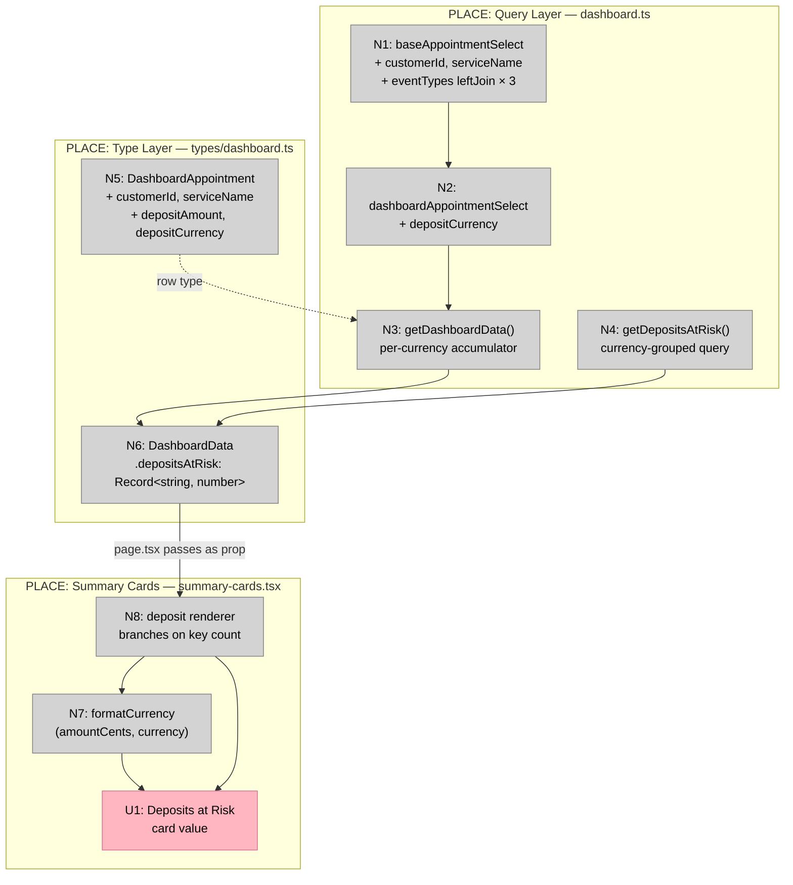

# Bet 1 — Correctness Sprint

**Appetite:** ~1–2 days  
**Prerequisite:** None — must ship before Bets 2, 3, 4  
**Source analysis:** `docs/shaping/dashboard-ui/26-04-15_07-28-20_dashboard_ui_post_clarification_implementation_scope/analysis_report.md`

---

## Frame

### Problem

Four live data errors exist in the currently-shipped dashboard. No new feature work can proceed safely until they are resolved:

1. **Deposits-at-risk card is currency-blind.** `getDepositsAtRisk()` sums `amountCents` across all currencies into a single scalar and returns it. The component's `formatCurrency` hardcodes `currency: "USD"`. A shop collecting GBP deposits sees a USD total — factually wrong.

2. **`customerId` is declared in `DashboardAppointment` but never selected.** `baseAppointmentSelect` (lines 25–38 of `dashboard.ts`) does not include `appointments.customerId`. The type and the query are out of sync. Bet 2 requires this field for customer deduplication; it cannot proceed until the select is correct.

3. **`serviceName` is declared in `DashboardAppointment` but never selected.** `baseAppointmentSelect` includes no join to `eventTypes`, so `serviceName` is always absent from query results. Bet 3's search feature uses this field; it will break without the join.

### Outcome

- Deposits-at-risk card shows factually correct amounts in the correct currency for all shops, single and multi-currency alike.
- `DashboardAppointment` rows returned by all queries match the declared type — no missing fields, no TypeScript type drift.
- Bets 2 and 3 are unblocked; their prerequisite fields exist in query results before those bets start.
- No layout changes, no new routes, no schema migrations, no product decisions required.

---

## Requirements (R)

| ID | Requirement | Status |
|----|-------------|--------|
| R0 | Correct 4 live data bugs with no new schema tables, no new API routes, and no product decisions | Core goal |
| R1 | Deposits query groups by `payments.currency` and produces a currency-keyed amount map; `DashboardData.depositsAtRisk` is `Record<string, number>` not `number` | Must-have |
| R2 | `SummaryCards` renders the currency map correctly: one currency → amount formatted in that currency; more than one currency → `"Multiple currencies"` neutral label | Must-have |
| R3 | `customerId` is selected in `baseAppointmentSelect`; all queries using that select return a populated `customerId` field | Must-have |
| R4 | `serviceName` is selected in `baseAppointmentSelect` via a left join to `eventTypes` on `appointments.eventTypeId`; field is `null` when no service is linked | Must-have |
| R5 | The `High-Risk Appointments` card label is not changed in this bet — label change belongs to Bet 2 | Constraint |

---

## Shape A: Fix in place

No alternative shapes. All 4 fixes are surgical changes to existing files — no new abstractions, no redesign.

| Part | Mechanism | Flag |
|------|-----------|:----:|
| **A1** | **Currency-aware deposits accumulation** | |
| A1.1 | Add `depositCurrency: payments.currency` to `dashboardAppointmentSelect` | |
| A1.2 | Replace scalar `depositsAtRisk` accumulation in `getDashboardData()` with `Record<string, number>` accumulation: `acc[currency] = (acc[currency] ?? 0) + depositAmount` | |
| A1.3 | Update `DashboardData.depositsAtRisk` type in `src/types/dashboard.ts`: `number` → `Record<string, number>` | |
| A1.4 | Update `getDepositsAtRisk()` (lines 120–146): GROUP BY `payments.currency`, return `Record<string, number>` | |
| **A2** | **Currency-aware deposit rendering** | |
| A2.1 | Update `SummaryCards.depositsAtRisk` prop: `number` → `Record<string, number>` | |
| A2.2 | Replace `formatCurrency(depositsAtRisk)` with a renderer that inspects the map: one key → `formatCurrency(amount, currency)`; multiple keys → render the string `"Multiple currencies"` | |
| A2.3 | Add `currency` parameter to `formatCurrency(amountCents, currency)` — remove hardcoded `"USD"` | |
| **A3** | **`customerId` type drift fix** | |
| A3.1 | Add `customerId: appointments.customerId` to `baseAppointmentSelect` (line 25 block, `dashboard.ts`) | |
| **A4** | **`serviceName` type drift fix** | |
| A4.1 | Import `eventTypes` from `@/lib/schema` in `dashboard.ts` | |
| A4.2 | Add `serviceName: eventTypes.name` to `baseAppointmentSelect` | |
| A4.3 | Add `.leftJoin(eventTypes, eq(eventTypes.id, appointments.eventTypeId))` to `getHighRiskAppointments()`, `getAllUpcomingAppointments()`, and the main query in `getDashboardData()` | |

---

## Fit Check (R × A)

| Req | Requirement | Status | A |
|-----|-------------|--------|---|
| R0 | Correct 4 live data bugs with no new schema tables, no new API routes, and no product decisions | Core goal | ✅ |
| R1 | Deposits query groups by `payments.currency` and produces a currency-keyed amount map; `DashboardData.depositsAtRisk` is `Record<string, number>` not `number` | Must-have | ✅ |
| R2 | `SummaryCards` renders the currency map correctly: one currency → amount formatted in that currency; more than one currency → `"Multiple currencies"` neutral label | Must-have | ✅ |
| R3 | `customerId` is selected in `baseAppointmentSelect`; all queries using that select return a populated `customerId` field | Must-have | ✅ |
| R4 | `serviceName` is selected in `baseAppointmentSelect` via a left join to `eventTypes` on `appointments.eventTypeId`; field is `null` when no service is linked | Must-have | ✅ |
| R5 | The `High-Risk Appointments` card label is not changed in this bet — label change belongs to Bet 2 | Constraint | ✅ |

---

## Sufficient Conditions (Definition of Done)

A feature is not done when it renders. Each requirement has a verification checklist.

### R1 + R2 — Currency correctness

- [ ] Single-currency shop: deposits card shows the correct amount in that shop's currency (not USD)
- [ ] Multi-currency shop: deposits card shows `"Multiple currencies"` — not a blended total, not a per-currency list
- [ ] `formatCurrency` no longer hardcodes `"USD"` when the shop's currency differs
- [ ] `DashboardData.depositsAtRisk` TypeScript type is `Record<string, number>` — compiler rejects `number` assignments

### R3 — `customerId` selected

- [ ] `getDashboardData()` rows have a non-null `customerId` for all appointments
- [ ] `getHighRiskAppointments()` rows have a non-null `customerId`
- [ ] `getAllUpcomingAppointments()` rows have a non-null `customerId`
- [ ] No TypeScript error when accessing `appointment.customerId` downstream

### R4 — `serviceName` joined

- [ ] `serviceName` is populated for appointments that have an `eventTypeId`
- [ ] `serviceName` is `null` for appointments with no `eventTypeId` (left join, not inner)
- [ ] No TypeScript error when accessing `appointment.serviceName` downstream
- [ ] All three query functions (`getHighRiskAppointments`, `getAllUpcomingAppointments`, `getDashboardData` main query) include the `eventTypes` join

### R5 — Label unchanged

- [ ] `summary-cards.tsx` still renders `High-Risk Appointments` after Bet 1 merges

---

## No-Gos

- Do not redesign card layout or spacing
- Do not change the attention queue
- Do not implement Bet 2 logic (customer-level KPI, `customerId` deduplication) — that bet starts after this one is verified
- Do not add `pg_trgm`, `eventTypes` filter logic, or any Bet 3 search plumbing
- Do not run `pnpm db:generate` or `pnpm db:migrate` — no schema changes required

---

## Files in Scope

| File | Change |
|------|--------|
| `src/lib/queries/dashboard.ts` | A1.1, A1.2, A1.4, A3.1, A4.1, A4.2, A4.3 |
| `src/types/dashboard.ts` | A1.3 |
| `src/components/dashboard/summary-cards.tsx` | A2.1, A2.2, A2.3 |

---

## Detail A — Breadboard

### UI Affordances

| ID | Affordance | Place | Wires Out |
|----|-----------|-------|-----------|
| U1 | Deposits at Risk card value | `summary-cards.tsx` | — |

### Non-UI Affordances

| ID | Affordance | Place | Wires Out |
|----|-----------|-------|-----------|
| N1 | `baseAppointmentSelect` — adds `customerId` + `serviceName` fields; adds `eventTypes` left join to `getHighRiskAppointments`, `getAllUpcomingAppointments`, `getDashboardData` | `dashboard.ts` | N2 |
| N2 | `dashboardAppointmentSelect` — adds `depositCurrency: payments.currency` (spreads N1) | `dashboard.ts` | N3 |
| N3 | `getDashboardData()` per-currency accumulator — loops N2 rows; builds `Record<string, number>` | `dashboard.ts` | N6 |
| N4 | `getDepositsAtRisk()` — groups by `payments.currency`; returns `Record<string, number>` | `dashboard.ts` | N6 |
| N5 | `DashboardAppointment` type — adds `customerId`, `serviceName`, `depositAmount`, `depositCurrency` | `types/dashboard.ts` | N3 (row type constraint) |
| N6 | `DashboardData.depositsAtRisk: Record<string, number>` | `types/dashboard.ts` | N8 (page passes as prop) |
| N7 | `formatCurrency(amountCents, currency)` — removes hardcoded `"USD"` | `summary-cards.tsx` | U1 |
| N8 | Deposit renderer — 1 key → calls N7; n > 1 keys → `"Multiple currencies"` | `summary-cards.tsx` | N7, U1 |

### Wiring

**Legend:**
- **Pink nodes (U)** = UI affordances (things users see)
- **Grey nodes (N)** = Code affordances (data stores, handlers, types)
- **Solid lines** = Wires Out (calls, produces, extends)
- **Dashed lines** = Returns To (type constraints, data reads)

**Note on `page.tsx`:** `src/app/app/dashboard/page.tsx` is unchanged — it destructures `depositsAtRisk` from `getDashboardData()` and passes it directly to `<SummaryCards />`. The type change on `DashboardData.depositsAtRisk` (N6) propagates through automatically; TypeScript will enforce the updated prop type at the call site.
