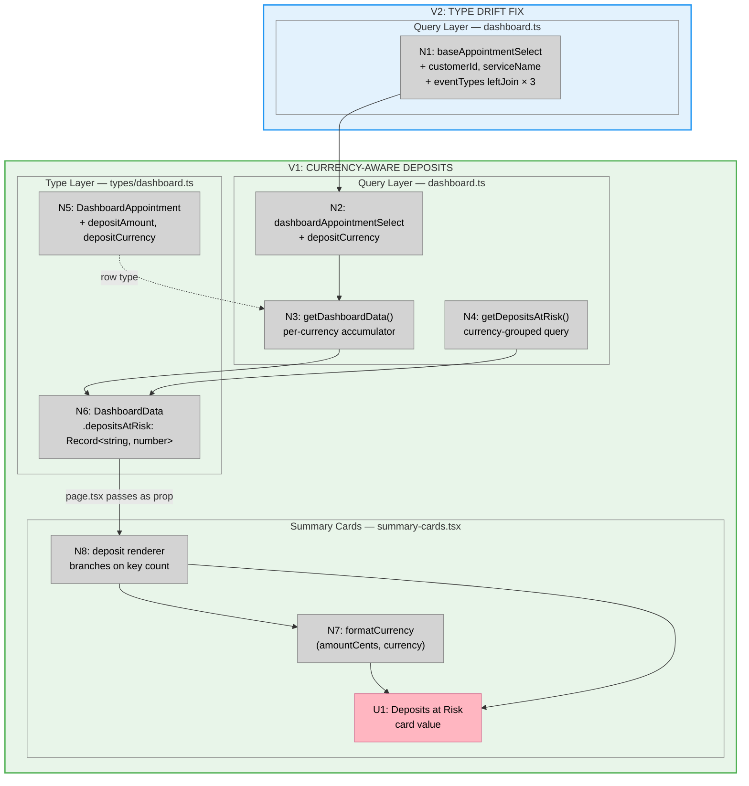

# Bet 1 — Slices

**Shape:** A (Fix in place)  
**Breadboard source:** `shaping.md` → Detail A

---

## Slices

### V1: Currency-Aware Deposits

**Scope:** End-to-end fix for the deposits-at-risk card — from query through type through component.

| ID | Affordance | Change |
|----|-----------|--------|
| N2 | `dashboardAppointmentSelect` | Add `depositCurrency: payments.currency` |
| N3 | `getDashboardData()` accumulator | Replace scalar sum with `Record<string, number>` per-currency loop |
| N4 | `getDepositsAtRisk()` | Group by `payments.currency`; return `Record<string, number>` |
| N5 | `DashboardAppointment` type | Add `depositAmount: number`, `depositCurrency: string \| null` |
| N6 | `DashboardData.depositsAtRisk` | Type change: `number` → `Record<string, number>` |
| N7 | `formatCurrency(amountCents, currency)` | Add `currency` param; remove hardcoded `"USD"` |
| N8 | Deposit renderer | Branch on `Object.keys(depositsAtRisk).length`; call N7 or return `"Multiple currencies"` |
| U1 | Deposits at Risk card value | Renders output of N8 |

**Files touched:** `dashboard.ts`, `types/dashboard.ts`, `summary-cards.tsx`

**Demo:** Deposits at Risk card shows the correct currency symbol (not always USD) for a single-currency shop. A multi-currency shop sees `"Multiple currencies"` instead of a blended total.

**Verify with sufficient conditions:**
- [ ] Single-currency shop: card shows correct currency symbol
- [ ] Multi-currency shop: card shows `"Multiple currencies"`
- [ ] `formatCurrency` no longer hardcodes `"USD"`
- [ ] `DashboardData.depositsAtRisk` TypeScript type is `Record<string, number>` — compiler rejects `number` assignments

---

### V2: Type Drift — customerId + serviceName

**Scope:** Make `baseAppointmentSelect` match the existing `DashboardAppointment` type declaration. No type file changes — the type is already correct; the select is behind.

| ID | Affordance | Change |
|----|-----------|--------|
| N1 | `baseAppointmentSelect` | Add `customerId: appointments.customerId`; add `serviceName: eventTypes.name`; add `.leftJoin(eventTypes, eq(eventTypes.id, appointments.eventTypeId))` to `getHighRiskAppointments`, `getAllUpcomingAppointments`, `getDashboardData` |

**Files touched:** `dashboard.ts` only

**Demo:** `pnpm typecheck` passes with 0 errors. `appointment.customerId` and `appointment.serviceName` are non-undefined in runtime rows.

**Verify with sufficient conditions:**
- [ ] `pnpm typecheck` exits 0
- [ ] `pnpm lint` exits 0
- [ ] `getDashboardData()`, `getHighRiskAppointments()`, `getAllUpcomingAppointments()` all return rows with populated `customerId`
- [ ] Rows where `eventTypeId` is set have non-null `serviceName`; rows without have `null`

---

## Sliced Breadboard

**Legend:**
- **Green** = V1: Currency-Aware Deposits
- **Blue** = V2: Type Drift Fix
- **Pink nodes** = UI affordances
- **Grey nodes** = Code affordances

---

## Slices Grid

|  |  |
|:--|:--|
| **V1: CURRENCY-AWARE DEPOSITS** ⏳ PENDING  • `dashboardAppointmentSelect` + `depositCurrency` • `getDashboardData()` per-currency accumulator • `getDepositsAtRisk()` grouped query • `formatCurrency` + deposit renderer  *Demo: Deposits card shows correct currency; multi-currency → "Multiple currencies"* | **V2: TYPE DRIFT FIX** ⏳ PENDING  • `baseAppointmentSelect` + `customerId` + `serviceName` • `eventTypes` left join added to 3 query fns • `pnpm typecheck` exits 0 • • &nbsp;  *Demo: `pnpm typecheck` passes clean; customerId + serviceName populated in rows* |

---

## Sequencing Note

V1 first — it fixes the user-visible bug and validates the type-cascade path (`dashboard.ts` → `types/dashboard.ts` → `page.tsx` → `summary-cards.tsx`) before V2 touches the same query file.

V2 is the unblocking step for downstream bets: `customerId` unlocks Bet 2, `serviceName` unlocks Bet 3. Ship V2 before starting either.
