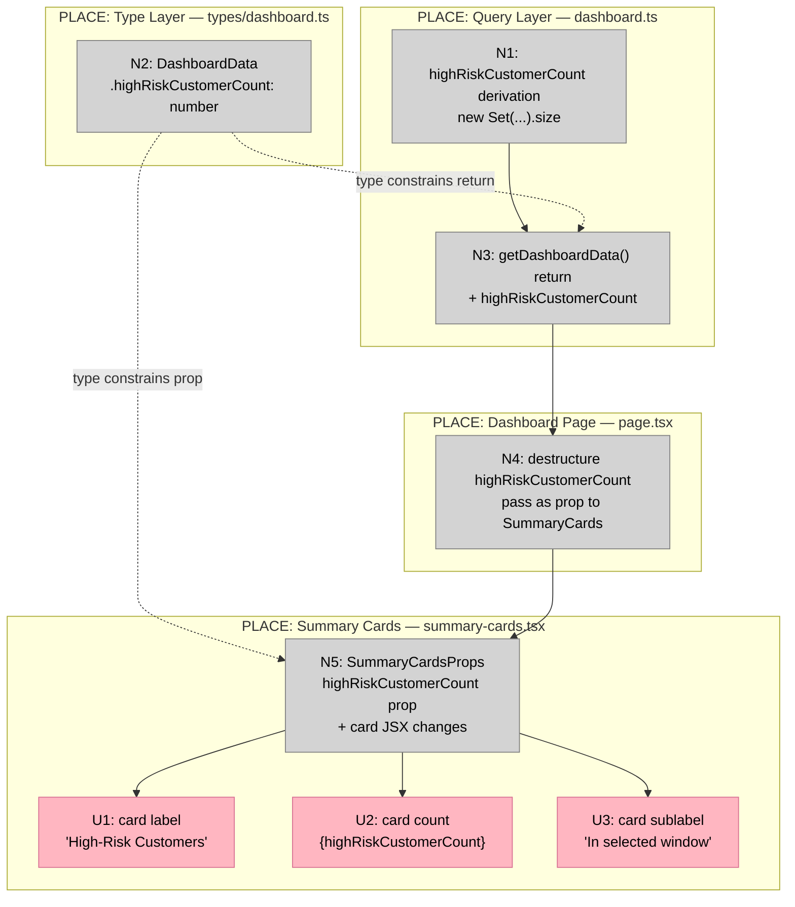

# Bet 2 — High-Risk Customers KPI

**Appetite:** ~0.5–1 day  
**Prerequisite:** Bet 1 V2 merged — `customerId` must be selected in `baseAppointmentSelect`  
**Source analysis:** `docs/shaping/dashboard-ui/26-04-15_07-28-20_dashboard_ui_post_clarification_implementation_scope/analysis_report.md`

---

## Frame

### Problem

The current High-Risk card on the dashboard counts **appointments**, not **customers**. A single customer with two booked appointments in the window is counted twice. This overstates risk exposure and misleads the shop owner: seeing "4 high-risk" when there are actually 2 distinct customers at risk is not the same problem.

The card label also reads "High-Risk Appointments" — which is the wrong noun once the KPI is customer-level.

### Outcome

- The High-Risk card shows the count of **distinct customers** with at least one high-risk booked appointment in the selected window.
- A customer with 2 appointments in the window counts as 1.
- The count responds to the period selector.
- Card label reads `High-Risk Customers`. Sublabel reads `In selected window`.
- No new query. No schema change. The data is already in `highRiskAppointments`; the fix is deduplication.

---

## Requirements (R)

| ID | Requirement | Status |
|----|-------------|--------|
| R0 | Replace the appointment-count KPI with a distinct-customer-count KPI on the High-Risk card | Core goal |
| R1 | `getDashboardData()` derives `highRiskCustomerCount` by Set-deduplicating `customerId` across `highRiskAppointments` — no new DB query, no schema change | Must-have |
| R2 | `DashboardData` exposes `highRiskCustomerCount: number` as a dedicated field; `highRiskAppointments.length` is never used as a substitute | Must-have |
| R3 | `SummaryCards` receives `highRiskCustomerCount` as its own prop; card label reads `High-Risk Customers`; sublabel reads `In selected window` | Must-have |
| R4 | The count changes when the period selector changes — `highRiskCustomerCount` is derived from the period-scoped `highRiskAppointments` | Must-have |
| R5 | A customer with multiple booked appointments in the window contributes exactly 1 to the count | Must-have |
| R6 | Cancelled and non-booked appointments are not counted — guaranteed by the existing `status = 'booked'` query filter; must remain true after this change | Must-have |
| R7 | A risk-tier customer with no booked appointment in the selected window contributes 0 — guaranteed by the appointment-scoped query; must remain true | Must-have |

---

## Shape A: Set deduplication in getDashboardData()

No alternative shapes. The `highRiskAppointments` array is already computed in memory; deduplication is a one-liner on top of it. No query change needed once Bet 1 V2 provides `customerId`.

| Part | Mechanism | Flag |
|------|-----------|:----:|
| **A1** | **Derive `highRiskCustomerCount`** | |
| A1 | In `getDashboardData()`, after the `highRiskAppointments` loop: `const highRiskCustomerCount = new Set(highRiskAppointments.map((a) => a.customerId)).size` | |
| **A2** | **Type layer** | |
| A2 | `DashboardData` — add `highRiskCustomerCount: number` | |
| **A3** | **Return value** | |
| A3 | `getDashboardData()` return object — add `highRiskCustomerCount` | |
| **A4** | **Page prop threading** | |
| A4 | `DashboardPage` — destructure `highRiskCustomerCount` from `dashboardData`; replace `highRiskCount={highRiskAppointments.length}` with `highRiskCustomerCount={highRiskCustomerCount}` | |
| **A5** | **Card update** | |
| A5.1 | `SummaryCardsProps` — rename `highRiskCount: number` → `highRiskCustomerCount: number` | |
| A5.2 | Card label — `High-Risk Appointments` → `High-Risk Customers` | |
| A5.3 | Card sublabel — add `
In selected window
` below the count | |
| A5.4 | Card value — render `highRiskCustomerCount` instead of `highRiskCount` | |

---

## Fit Check (R × A)

| Req | Requirement | Status | A |
|-----|-------------|--------|---|
| R0 | Replace the appointment-count KPI with a distinct-customer-count KPI on the High-Risk card | Core goal | ✅ |
| R1 | `getDashboardData()` derives `highRiskCustomerCount` by Set-deduplicating `customerId` across `highRiskAppointments` — no new DB query, no schema change | Must-have | ✅ |
| R2 | `DashboardData` exposes `highRiskCustomerCount: number` as a dedicated field; `highRiskAppointments.length` is never used as a substitute | Must-have | ✅ |
| R3 | `SummaryCards` receives `highRiskCustomerCount` as its own prop; card label reads `High-Risk Customers`; sublabel reads `In selected window` | Must-have | ✅ |
| R4 | The count changes when the period selector changes — `highRiskCustomerCount` is derived from the period-scoped `highRiskAppointments` | Must-have | ✅ |
| R5 | A customer with multiple booked appointments in the window contributes exactly 1 to the count | Must-have | ✅ |
| R6 | Cancelled and non-booked appointments are not counted — guaranteed by the existing `status = 'booked'` query filter; must remain true after this change | Must-have | ✅ |
| R7 | A risk-tier customer with no booked appointment in the selected window contributes 0 — guaranteed by the appointment-scoped query; must remain true | Must-have | ✅ |

---

## Sufficient Conditions (Definition of Done)

### R1 + R2 — Derivation and type

- [ ] `getDashboardData()` contains a `new Set(...).size` deduplication over `highRiskAppointments`
- [ ] `DashboardData.highRiskCustomerCount` field exists and is typed `number`
- [ ] `highRiskAppointments.length` does not appear as the source for the High-Risk card value anywhere in the call chain

### R3 — Card prop and label

- [ ] `SummaryCardsProps` has `highRiskCustomerCount: number` (not `highRiskCount`)
- [ ] Card label renders `High-Risk Customers`
- [ ] Card sublabel renders `In selected window`
- [ ] Card value renders `highRiskCustomerCount`

### R4 — Period responsiveness

- [ ] Count is 0 when `periodHours = 1` and all high-risk appointments start beyond 1 hour
- [ ] Count increases when `periodHours` is widened to include those appointments

### R5–R7 — Deduplication correctness (test cases from analysis)

- [ ] 1 customer × 3 appointments in window → `highRiskCustomerCount = 1`
- [ ] 1 customer × 1 in-window + 1 out-of-window → `highRiskCustomerCount = 1`
- [ ] Cancelled appointment in window → `highRiskCustomerCount = 0` (query filter)
- [ ] Risk-tier customer, 0 upcoming bookings → `highRiskCustomerCount = 0` (no row in result)

---

## No-Gos

- Do not add a new DB query for the customer count — the Set deduplication is over the already-loaded `highRiskAppointments` array
- Do not change the `AttentionRequiredTable` — it still receives `highRiskAppointments` and is not part of this bet
- Do not change any other card (deposits, total upcoming, this month)
- Do not touch Bet 3 or Bet 4 logic

---

## Files in Scope

| File | Parts |
|------|-------|
| `src/types/dashboard.ts` | A2 |
| `src/lib/queries/dashboard.ts` | A1, A3 |
| `src/app/app/dashboard/page.tsx` | A4 |
| `src/components/dashboard/summary-cards.tsx` | A5.1–A5.4 |

---

## Detail A — Breadboard

### UI Affordances

| ID | Affordance | Place | Wires Out |
|----|-----------|-------|-----------|
| U1 | High-Risk card label: `High-Risk Customers` | `summary-cards.tsx` | — |
| U2 | High-Risk card count value: `{highRiskCustomerCount}` | `summary-cards.tsx` | — |
| U3 | High-Risk card sublabel: `In selected window` | `summary-cards.tsx` | — |

### Non-UI Affordances

| ID | Affordance | Place | Wires Out |
|----|-----------|-------|-----------|
| N1 | `highRiskCustomerCount` derivation — `new Set(highRiskAppointments.map(a => a.customerId)).size` (after the existing `highRiskAppointments` loop) | `dashboard.ts` | N3 |
| N2 | `DashboardData.highRiskCustomerCount: number` — new type field | `types/dashboard.ts` | N3, N4 |
| N3 | `getDashboardData()` return — adds `highRiskCustomerCount` to the returned object | `dashboard.ts` | N4 |
| N4 | Page — destructures `highRiskCustomerCount` from `dashboardData`; replaces `highRiskCount={highRiskAppointments.length}` with `highRiskCustomerCount={highRiskCustomerCount}` | `page.tsx` | N5 |
| N5 | `SummaryCardsProps` — renames `highRiskCount` → `highRiskCustomerCount`; card JSX: label + count + sublabel | `summary-cards.tsx` | U1, U2, U3 |

### Wiring

**Legend:**
- **Pink nodes (U)** = UI affordances (things users see)
- **Grey nodes (N)** = Code affordances (data, handlers, types)
- **Solid lines** = Wires Out (produces, calls, passes)
- **Dashed lines** = Returns To (type constraints)

**Note:** N1 reads `highRiskAppointments` — an existing array computed earlier in the same function. It is not a new affordance; N1 is a single line appended after the existing loop that consumes it.
