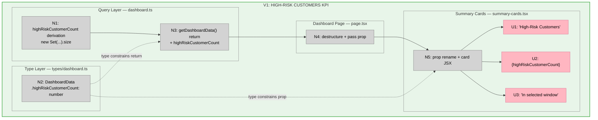

# Bet 2 — Slices

**Shape:** A (Set deduplication in getDashboardData)  
**Breadboard source:** `shaping.md` → Detail A

---

## Why one slice

The dependency chain is strictly linear — N1 → N3 → N4 → N5 → UI. Every node requires its predecessor:

- N1 (derivation) must exist before N3 (return) can include the field
- N2 (type) must exist before N3 (return) and N5 (prop) are type-correct
- N3 (return) must exist before N4 (page destructure) compiles
- N4 (page prop) must exist before N5 (component) receives the value
- N5 (component) must exist before U1/U2/U3 render

There is no intermediate cut that produces demo-able UI. Splitting would create a horizontal layer (query + type only, no visible output) — the wrong shape for a slice. The bet appetite is ~0.5 day. One slice is the right structure.

---

## V1: High-Risk Customers KPI

**All affordances ship together.**

| ID | Affordance | Change |
|----|-----------|--------|
| N1 | `highRiskCustomerCount` derivation | Add `new Set(highRiskAppointments.map(a => a.customerId)).size` after the existing loop in `getDashboardData()` |
| N2 | `DashboardData.highRiskCustomerCount` | Add `highRiskCustomerCount: number` to the interface |
| N3 | `getDashboardData()` return | Add `highRiskCustomerCount` to the returned object |
| N4 | Dashboard Page prop | Destructure `highRiskCustomerCount` from `dashboardData`; replace `highRiskCount={highRiskAppointments.length}` with `highRiskCustomerCount={highRiskCustomerCount}` |
| N5 | `SummaryCardsProps` + card JSX | Rename `highRiskCount` → `highRiskCustomerCount`; update label, count, sublabel |
| U1 | Card label | `High-Risk Appointments` → `High-Risk Customers` |
| U2 | Card count | Renders `highRiskCustomerCount` |
| U3 | Card sublabel | Add `In selected window` |

**Files touched:** `types/dashboard.ts`, `dashboard.ts`, `page.tsx`, `summary-cards.tsx`

**Demo:** High-Risk card shows the count of distinct customers (not appointments). A shop with one customer and two high-risk appointments sees `1`, not `2`. Label reads `High-Risk Customers`. Sublabel reads `In selected window`.

**Verify with sufficient conditions:**
- [ ] `pnpm typecheck` exits 0
- [ ] `pnpm lint` exits 0
- [ ] `pnpm test` exits 0
- [ ] 1 customer × 3 appointments in window → `highRiskCustomerCount = 1`
- [ ] 1 customer × 1 in-window + 1 out-of-window → `highRiskCustomerCount = 1`
- [ ] Cancelled appointment in window → `highRiskCustomerCount = 0`
- [ ] Risk-tier customer, 0 upcoming bookings → `highRiskCustomerCount = 0`
- [ ] `highRiskAppointments.length` does not appear as the source for the card value
- [ ] Card label reads `High-Risk Customers`
- [ ] Card sublabel reads `In selected window`

---

## Sliced Breadboard

---

## Slices Grid

|  |
|:--|
| **V1: HIGH-RISK CUSTOMERS KPI** ⏳ PENDING  • `new Set(highRiskAppointments.map(a => a.customerId)).size` • `DashboardData.highRiskCustomerCount: number` • Page props threaded; `highRiskAppointments.length` removed • Card: label + count + sublabel  *Demo: 1 customer × 2 appointments → card shows 1, not 2* |
