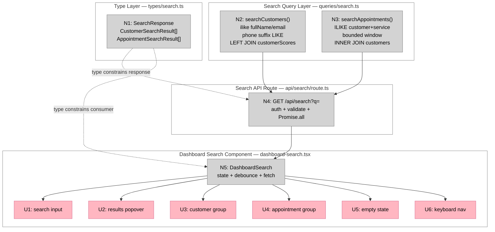

# Bet 3 — Global Search Quick-Find

**Appetite:** ~2–3 days  
**Prerequisite:** Bet 1 complete (`serviceName` join confirmed working — used in appointment results)  
**Source analysis:** `docs/shaping/dashboard-ui/26-04-15_07-28-20_dashboard_ui_post_clarification_implementation_scope/analysis_report.md`

---

## Frame

### Problem

The dashboard has no way to quickly locate a specific customer or appointment. Shop owners must navigate to the Customers list and scroll, or open Appointments and filter — neither is fast for a name-lookup scenario.

The dashboard mock shows a search bar with the placeholder "Search appointments or clients." The intent is a quick-find navigator: type a name, email, phone, or service — see grouped results — click to navigate. Not a table filter.

### Outcome

- Shop owner types a name, email, phone, or service name into a search control on the dashboard
- Grouped results (Customers + Appointments) appear in a popover below the input
- Selecting a result navigates to the existing detail route for that entity
- No dashboard table state is mutated; the dashboard renders normally behind the popover

---

## Requirements (R)

| ID | Requirement | Status |
|----|-------------|--------|
| R0 | The dashboard has a quick-find control for navigating to customers or appointments by name, email, phone, or service — not a table filter | Core goal |
| R1 | All results are shop-scoped: `shopId` derived from the authenticated session on the server; no `shopId` from the client; unauthenticated requests return 401 | Must-have |
| R2 | Customer search: case-insensitive partial match on `fullName` and `email`; digit-suffix match on `phone`; max 5 results; results include `id`, `fullName`, `email`, `phone`, `tier`, and destination href `/app/customers/[id]` | Must-have |
| R3 | Appointment search: case-insensitive partial match on customer `fullName`, `email`, `phone`, and service `eventTypes.name`; bounded to `endsAt >= now() - 7 days` AND `status IN ('pending','booked','ended')`; max 5 results; results include `id`, `startsAt`, `status`, `customerName`, `eventTypeName`, and destination href `/app/appointments/[id]` | Must-have |
| R4 | Server-side input guards before any DB call: trim query; reject text < 2 non-space chars; reject phone-style queries with < 4 extracted digits; max length 80 chars; short queries return empty results (not errors) | Must-have |
| R5 | Selecting a result navigates to the destination route; no auto-redirect while typing; empty state handled without error | Must-have |
| R6 | No schema changes, no new tables, no `pg_trgm`, no fuzzy matching — bounded `ILIKE` only in v1 | Must-have |

---

## Shape A: Bounded ILIKE search with new API route

No alternative shapes. The data is already available in the existing tables with per-shop indexes; bounded `ILIKE` within shop-scoped queries is the right v1 mechanism. No search subsystem needed.

| Part | Mechanism | Flag |
|------|-----------|:----:|
| **A1** | **`GET /api/search?q=` route** | |
| A1 | `src/app/api/search/route.ts` — authenticate via `auth.api.getSession`; derive shop via `getShopByOwnerId`; validate `q` (trim, max 80, min 2 non-space chars, phone guard); run A2 + A3 in `Promise.all`; return `{ query, customers, appointments }` | |
| **A2** | **`searchCustomers(shopId, q)` query** | |
| A2 | `src/lib/queries/search.ts` — `ilike(fullName, '%q%') OR ilike(email, '%q%') OR phone LIKE '%{digits}'`; LEFT JOIN `customerScores` for `tier`; WHERE `shopId`; LIMIT 5; returns `CustomerSearchResult[]` | |
| **A3** | **`searchAppointments(shopId, q)` query** | |
| A3 | `src/lib/queries/search.ts` — INNER JOIN `customers`; LEFT JOIN `eventTypes`; `ilike(fullName, %) OR ilike(email, %) OR phone LIKE '%{digits}' OR ilike(eventTypes.name, %)`; WHERE `shopId`, `status IN (pending, booked, ended)`, `endsAt >= now() - 7 days`; LIMIT 5; returns `AppointmentSearchResult[]` | |
| **A4** | **`DashboardSearch` client component** | |
| A4 | `src/components/dashboard/dashboard-search.tsx` — controlled input; 300ms debounce; fetch A1; render grouped results popover; keyboard nav (up/down/Enter/Esc); navigate on select via `useRouter().push(href)` | |
| **A5** | **Dashboard page header mount** | |
| A5 | `src/app/app/dashboard/page.tsx` — add `<DashboardSearch />` to the `<header>` section below title/subtitle | |

---

## Fit Check (R × A)

| Req | Requirement | Status | A |
|-----|-------------|--------|---|
| R0 | Quick-find navigator on dashboard | Core goal | ✅ |
| R1 | Shop-scoped, session-derived, 401 on unauthenticated | Must-have | ✅ |
| R2 | Customer search: fullName/email/phone, tier, max 5, href | Must-have | ✅ |
| R3 | Appointment search: bounded window, customer + service fields, max 5, href | Must-have | ✅ |
| R4 | Server-side input guards before DB call | Must-have | ✅ |
| R5 | Navigate on select; empty state handled | Must-have | ✅ |
| R6 | No schema changes, no pg_trgm, ILIKE only | Must-have | ✅ |

---

## Sufficient Conditions (Definition of Done)

### R1 — Auth
- [ ] `GET /api/search` without a valid session returns 401
- [ ] `shopId` never accepted from query params or request body

### R2 — Customer search
- [ ] Partial name match returns customer result
- [ ] Partial email match returns customer result
- [ ] Digit-suffix phone match returns customer (e.g. query "5550100" matches stored "+12025550100")
- [ ] Results capped at 5
- [ ] Result `href` is `/app/customers/[id]`
- [ ] `tier` field is present (null when no score computed)

### R3 — Appointment search
- [ ] Customer name match returns appointment in window
- [ ] Service name match returns appointment in window
- [ ] Cancelled appointment not returned (status filter)
- [ ] Out-of-window appointment not returned (`endsAt < now() - 7 days`)
- [ ] Results capped at 5
- [ ] Result `href` is `/app/appointments/[id]`

### R4 — Guards
- [ ] Query `"a"` (1 char) returns `{ customers: [], appointments: [] }` — no DB call
- [ ] Query `""` (blank) returns empty — no DB call
- [ ] Query > 80 chars returns 400
- [ ] `"55"` (2 digits, < 4) — phone guard triggers; falls back to text match (or empty if no text match)

### R5 — UI
- [ ] Selecting a customer result navigates to `/app/customers/[id]`
- [ ] Selecting an appointment result navigates to `/app/appointments/[id]`
- [ ] Zero results shows empty state without throwing
- [ ] Pressing Esc closes the popover

---

## No-Gos

- Do not implement fuzzy/typo-tolerant matching
- Do not add `pg_trgm` or full-text indexes
- Do not support cross-shop search
- Do not search services as standalone destinations
- Do not filter or mutate dashboard table state via the search bar
- Do not add saved searches, recent history, or search analytics
- Do not change `AttentionRequiredTable`, `AllAppointmentsTable`, or any other dashboard component

---

## Files in Scope

| File | Action | Parts |
|------|--------|-------|
| `src/app/api/search/route.ts` | Create | A1 |
| `src/lib/queries/search.ts` | Create | A2, A3 |
| `src/components/dashboard/dashboard-search.tsx` | Create | A4 |
| `src/app/app/dashboard/page.tsx` | Modify | A5 |

---

## Detail A — Breadboard

### UI Affordances

| ID | Affordance | Place | Wires Out |
|----|-----------|-------|-----------|
| U1 | Search input — text field, placeholder `"Search appointments or clients"`, `aria-label="Quick search"` | `dashboard-search.tsx` | — |
| U2 | Results popover — appears below input when results exist or empty state triggers; dismisses on Esc or outside click | `dashboard-search.tsx` | — |
| U3 | Customer group — header label `"Customers"` + result items (name, tier badge, email) | `dashboard-search.tsx` | — |
| U4 | Appointment group — header label `"Appointments"` + result items (customer name, service or "No service", date) | `dashboard-search.tsx` | — |
| U5 | Empty state — shown when query is valid (≥ 2 chars) but returns zero results | `dashboard-search.tsx` | — |
| U6 | Keyboard navigation — up/down to highlight, Enter to navigate, Esc to dismiss | `dashboard-search.tsx` | — |

### Non-UI Affordances

| ID | Affordance | Place | Wires Out |
|----|-----------|-------|-----------|
| N1 | `SearchResponse` type — `{ query: string; customers: CustomerSearchResult[]; appointments: AppointmentSearchResult[] }` | `src/types/search.ts` | N4, N5 |
| N2 | `searchCustomers(shopId, q)` — `ilike(fullName)` OR `ilike(email)` OR phone suffix LIKE; LEFT JOIN `customerScores`; LIMIT 5 | `src/lib/queries/search.ts` | N4 |
| N3 | `searchAppointments(shopId, q)` — INNER JOIN `customers`; LEFT JOIN `eventTypes`; ILIKE customer fields + service name; bounded window; LIMIT 5 | `src/lib/queries/search.ts` | N4 |
| N4 | `GET /api/search?q=` — auth via `auth.api.getSession`; shop via `getShopByOwnerId`; validate `q`; `Promise.all([N2, N3])`; return N1 | `src/app/api/search/route.ts` | N5 |
| N5 | `DashboardSearch` — state: `{ query, results, activeIndex, open }`; 300ms debounce; fetch N4; keyboard handlers | `src/components/dashboard/dashboard-search.tsx` | U1–U6 |

### Wiring

**Legend:**
- **Pink nodes (U)** = UI affordances (things users see)
- **Grey nodes (N)** = Code affordances (data, handlers, types)
- **Solid lines** = Wires Out (produces, calls, passes)
- **Dashed lines** = Returns To (type constraints)
