# Bet 3 — Slices

**Shape:** A (Bounded ILIKE search with new API route)  
**Breadboard source:** `shaping.md` → Detail A

---

## Why two slices

The two result groups — customers and appointments — are independently searchable and can be shipped without each other:

- V1 (Customer Quick-Find): `searchCustomers` + route (appointments: []) + UI customers group → demo: search "John", navigate to customer
- V2 (Appointment Search): `searchAppointments` + extend route + add appointment group to UI → demo: search "Haircut", navigate to appointment

The dependency chain splits cleanly here: N2 and N3 are parallel queries; the route wires them separately into the response. The UI popover renders groups independently.

**Why not a single slice:**  
The appetite is 2–3 days. Two slices each ship a useful, independently demo-able result. V1 alone is a complete quick-find for customers. V2 adds the appointment dimension without changing the customer behavior.

---

## V1: Customer Quick-Find

**Affordances in scope:**

| ID | Affordance | Change |
|----|-----------|--------|
| N1 | `SearchResponse`, `CustomerSearchResult`, `AppointmentSearchResult` types | Create `src/types/search.ts` |
| N2 | `searchCustomers(shopId, q)` | Create `src/lib/queries/search.ts` |
| N4 | `GET /api/search?q=` route — customers only; `appointments: []` | Create `src/app/api/search/route.ts` |
| N5 | `DashboardSearch` client component — customers group only | Create `src/components/dashboard/dashboard-search.tsx` |
| U1 | Search input | Part of N5 |
| U2 | Results popover | Part of N5 |
| U3 | Customer group (header + items + tier badges) | Part of N5 |
| U5 | Empty state | Part of N5 |
| U6 | Keyboard navigation (up/down/Enter/Esc) | Part of N5 |
| A5 | Mount `<DashboardSearch />` in dashboard page header | Modify `src/app/app/dashboard/page.tsx` |

**Files touched:**

| File | Action |
|------|--------|
| `src/types/search.ts` | Create |
| `src/lib/queries/search.ts` | Create |
| `src/app/api/search/route.ts` | Create |
| `src/components/dashboard/dashboard-search.tsx` | Create |
| `src/app/app/dashboard/page.tsx` | Modify |
| `src/app/api/search/__tests__/route.test.ts` | Create |

**Demo:** Search "John" → customer result appears → click → navigates to `/app/customers/[id]`.

**Verify with sufficient conditions:**
- [ ] `pnpm typecheck` exits 0
- [ ] `pnpm lint` exits 0
- [ ] `pnpm test` exits 0
- [ ] `GET /api/search` without session → 401
- [ ] Query `"a"` (1 char) → 200 `{ customers: [], appointments: [] }`
- [ ] Query longer than 80 chars → 400
- [ ] Valid query → 200 with `customers` array and `appointments: []`
- [ ] `href` field on each customer result is `/app/customers/[id]`
- [ ] `tier` field is `null` when customer has no score

---

## V2: Appointment Search

**Affordances added:**

| ID | Affordance | Change |
|----|-----------|--------|
| N3 | `searchAppointments(shopId, q)` | Extend `src/lib/queries/search.ts` |
| N4 | Route extended — wire N3 into `Promise.all`; return real appointments | Extend `src/app/api/search/route.ts` |
| N5 | Component extended — render appointment group | Extend `src/components/dashboard/dashboard-search.tsx` |
| U4 | Appointment group (header + items) | Part of extended N5 |

**Files touched:**

| File | Action |
|------|--------|
| `src/lib/queries/search.ts` | Extend — add `searchAppointments` |
| `src/app/api/search/route.ts` | Extend — add N3 to `Promise.all` |
| `src/components/dashboard/dashboard-search.tsx` | Extend — add U4 group |
| `src/app/api/search/__tests__/route.test.ts` | Extend — add appointment tests |

**Demo:** Search "Haircut" → appointment result appears alongside any customer results → click → navigates to `/app/appointments/[id]`.

**Verify with sufficient conditions:**
- [ ] `pnpm typecheck` exits 0
- [ ] `pnpm lint` exits 0
- [ ] `pnpm test` exits 0
- [ ] Service name match returns appointment result
- [ ] Customer name match returns appointment result
- [ ] `status = 'cancelled'` appointment not returned
- [ ] `endsAt < now() - 7 days` appointment not returned
- [ ] `href` field is `/app/appointments/[id]`
- [ ] `eventTypeName` is `null` when appointment has no service

---

## Sliced Breadboard

```mermaid
flowchart TB
    subgraph slice1["V1: CUSTOMER QUICK-FIND"]
        subgraph searchQueries1["Query Layer — queries/search.ts"]
            N2["N2: searchCustomers()\nilike fullName/email\nphone suffix LIKE"]
        end
        subgraph typeLayer["Type Layer — types/search.ts"]
            N1["N1: SearchResponse\nCustomerSearchResult\nAppointmentSearchResult"]
        end
        subgraph searchRoute1["Search Route — api/search/route.ts"]
            N4v1["N4: GET /api/search?q=\nauth + validate\nappointments: []"]
        end
        subgraph dashSearch1["Dashboard Search — dashboard-search.tsx"]
            N5v1["N5: DashboardSearch\ncustomers group only"]
            U1["U1: search input"]
            U2["U2: results popover"]
            U3["U3: customer group"]
            U5["U5: empty state"]
            U6["U6: keyboard nav"]
        end
    end

    subgraph slice2["V2: APPOINTMENT SEARCH"]
        subgraph searchQueries2["Query Layer — queries/search.ts (extended)"]
            N3["N3: searchAppointments()\nbounded window\nINNER JOIN customers"]
        end
        subgraph searchRoute2["Search Route (extended)"]
            N4v2["N4: extend — wire N3\nreturn real appointments"]
        end
        subgraph dashSearch2["Dashboard Search (extended)"]
            N5v2["N5: extend — add appt group"]
            U4["U4: appointment group"]
        end
    end

    N2 --> N4v1
    N1 -.->|type constrains| N4v1
    N4v1 --> N5v1
    N5v1 --> U1
    N5v1 --> U2
    N5v1 --> U3
    N5v1 --> U5
    N5v1 --> U6

    N3 --> N4v2
    N4v2 --> N5v2
    N5v2 --> U4

    style slice1 fill:#e8f5e9,stroke:#4caf50,stroke-width:2px
    style slice2 fill:#e3f2fd,stroke:#2196f3,stroke-width:2px
    style searchQueries1 fill:transparent,stroke:#888,stroke-width:1px
    style typeLayer fill:transparent,stroke:#888,stroke-width:1px
    style searchRoute1 fill:transparent,stroke:#888,stroke-width:1px
    style dashSearch1 fill:transparent,stroke:#888,stroke-width:1px
    style searchQueries2 fill:transparent,stroke:#888,stroke-width:1px
    style searchRoute2 fill:transparent,stroke:#888,stroke-width:1px
    style dashSearch2 fill:transparent,stroke:#888,stroke-width:1px

    classDef ui fill:#ffb6c1,stroke:#d87093,color:#000
    classDef nonui fill:#d3d3d3,stroke:#808080,color:#000
    class U1,U2,U3,U4,U5,U6 ui
    class N1,N2,N3,N4v1,N4v2,N5v1,N5v2 nonui
```

---

## Slices Grid

|  |
|:--|
| **V1: CUSTOMER QUICK-FIND** ⏳ PENDING  • `searchCustomers()` — ILIKE fullName/email, phone digit-suffix • `GET /api/search?q=` — auth, validation, `appointments: []` • `DashboardSearch` — customers group, keyboard nav • Mounted in dashboard page header  *Demo: search "John" → customer result → click → navigate to customer page* |
| **V2: APPOINTMENT SEARCH** ⏳ PENDING  • `searchAppointments()` — ILIKE customer+service fields, bounded window • Route extended — N3 wired into Promise.all • Component extended — appointment group added  *Demo: search "Haircut" → appointment result → click → navigate to appointment page* |
