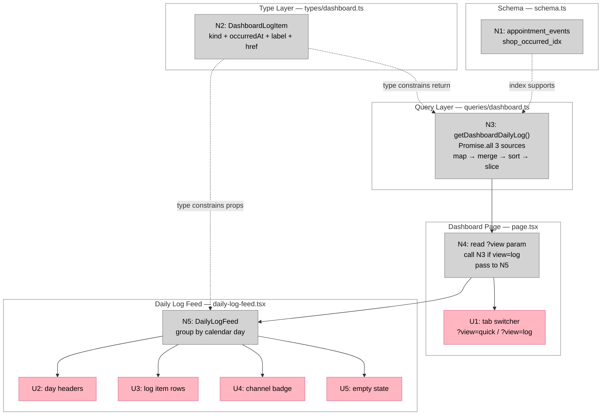

# Bet 4 — Daily Log Tab

**Appetite:** ~2–3 days  
**Prerequisite:** Bet 1 complete  
**Source analysis:** `docs/shaping/dashboard-ui/26-04-15_07-28-20_dashboard_ui_post_clarification_implementation_scope/analysis_report.md`

---

## Frame

### Problem

The dashboard currently shows only the Quick View — metrics and tables scoped to upcoming appointments. There is no way for the shop owner to see what has recently happened: bookings that came in, appointments that were cancelled, outcomes that resolved, and messages that were sent or failed.

The activity that backs this view already exists in the data model. Three append-only or durable sources are available: `appointments.createdAt`, `appointment_events` (emitting `cancelled` and `outcome_resolved`), and `message_log`. None of this is surfaced anywhere.

The risk is shipping a surface that implies richer event coverage than the system actually has. Presenting payment lifecycle items or slot recovery events would require data that doesn't exist as append-only records yet.

### Outcome

- Dashboard gains a **Daily Log** tab alongside Quick View
- Tab switches via `?view=log` / `?view=quick` query params — no new route
- The log shows a reverse-chronological timeline of: new bookings, cancellations, resolved outcomes, and sent/failed messages
- Items are grouped by calendar day; each links to the relevant appointment detail
- No payment lifecycle, no slot recovery, no unread state, no row-level actions

---

## Requirements (R)

| ID | Requirement | Status |
|----|-------------|--------|
| R0 | The dashboard has a Daily Log tab that shows a read-only passive operational timeline of recent appointment and message activity — not a notification center, not a filter on existing tables | Core goal |
| R1 | Tab switching via `?view=log` / `?view=quick` query params on the existing dashboard route; default (no param) is Quick View; no new route or layout added | Must-have |
| R2 | Log items come from exactly three sources merged in memory, sorted descending by `occurredAt`, last 7 days, max 50 items total: (a) `appointments.createdAt` — synthetic appointment-created items; (b) `appointment_events` WHERE `type IN ('cancelled', 'outcome_resolved')`; (c) `message_log` WHERE `purpose != 'slot_recovery_offer'` | Must-have |
| R3 | Excluded from the log: payment lifecycle events (`payment_succeeded`, `payment_failed`, `refund_issued`, `refund_failed`, `dispute_opened`); slot recovery offer messages; customer confirmation replies (not logged in any current source — cannot appear) | Must-have |
| R4 | Each log item displays customer name (not phone), an event label, and a timestamp; items with an `appointmentId` link to `/app/appointments/[id]`; no item displays a raw phone number | Must-have |
| R5 | UI groups items by calendar day (descending); within each day items are newest-first; no unread/read state; no row-level actions | Must-have |
| R6 | Schema change: one new index `appointment_events(shop_id, occurred_at desc)` applied via `pnpm db:generate` + `pnpm db:migrate`; no new tables | Must-have |

---

## Shape A: Three-source merge in getDashboardDailyLog

No alternative shapes. The data is already in three existing tables; a bounded in-memory merge is the right mechanism. No event bus, no new table, no materialized view needed at this scale.

| Part | Mechanism | Flag |
|------|-----------|:----:|
| **A1** | **Schema index** | |
| A1 | Add `.index("appointment_events_shop_occurred_idx").on(table.shopId, table.occurredAt)` to `appointmentEvents` in `src/lib/schema.ts`; run `db:generate` + `db:migrate` | |
| **A2** | **`DashboardLogItem` type** | |
| A2 | Add to `src/types/dashboard.ts`: `{ id, kind, occurredAt, appointmentId, customerName, eventLabel, channel, href }` — a single normalized shape all three sources map into | |
| **A3** | **`getDashboardDailyLog(shopId, opts)` query** | |
| A3 | `src/lib/queries/dashboard.ts` — `Promise.all` of three bounded queries; map each to `DashboardLogItem`; merge; sort desc by `occurredAt`; slice to `limit` | |
| **A4** | **Tab switcher + page wiring** | |
| A4 | `src/app/app/dashboard/page.tsx` — add `view?: string` to `searchParams`; render tab switcher (Quick View / Daily Log); if `view === "log"` call `getDashboardDailyLog` and render `<DailyLogFeed>`; else render existing Quick View content | |
| **A5** | **`DailyLogFeed` component** | |
| A5 | `src/components/dashboard/daily-log-feed.tsx` — groups items by calendar day using `toLocaleDateString`; renders day headers + item rows; each item is a link when `href` is present | |

---

## Fit Check (R × A)

| Req | Requirement | Status | A |
|-----|-------------|--------|---|
| R0 | Daily Log tab — passive operational timeline | Core goal | ✅ |
| R1 | `?view=log` / `?view=quick` param on existing route | Must-have | ✅ |
| R2 | Three sources merged, 7 days, max 50 | Must-have | ✅ |
| R3 | Payment lifecycle, slot recovery, confirmation replies excluded | Must-have | ✅ |
| R4 | Customer name (not phone), event label, timestamp, appointment link | Must-have | ✅ |
| R5 | Grouped by day, newest-first, no unread, no actions | Must-have | ✅ |
| R6 | Index migration, no new tables | Must-have | ✅ |

---

## Sufficient Conditions (Definition of Done)

### R1 — Tab switching
- [ ] `/app/dashboard` (no param) renders Quick View
- [ ] `/app/dashboard?view=quick` renders Quick View
- [ ] `/app/dashboard?view=log` renders Daily Log
- [ ] Unknown `view` param falls back to Quick View

### R2 — Sources and scope
- [ ] Log includes items derived from `appointments.createdAt` within last 7 days
- [ ] Log includes `cancelled` events from `appointment_events` within last 7 days
- [ ] Log includes `outcome_resolved` events from `appointment_events` within last 7 days
- [ ] Log includes `message_log` items (excluding `slot_recovery_offer`) within last 7 days
- [ ] Total items capped at 50
- [ ] Items sorted newest-first across all three sources

### R3 — Exclusions
- [ ] No `payment_succeeded`, `payment_failed`, `refund_issued`, `refund_failed`, or `dispute_opened` items appear — even if such rows exist in `appointment_events`
- [ ] No `slot_recovery_offer` message items appear

### R4 — Item display
- [ ] Customer name appears on every item that has a customer (not phone number)
- [ ] Item links to `/app/appointments/[id]` when `appointmentId` is present
- [ ] `outcome_resolved` item label reflects the financial outcome (e.g., "Outcome: settled", "Outcome: refunded")
- [ ] Message item label reflects the purpose and status (e.g., "Reminder sent", "Booking confirmation failed")

### R5 — UI
- [ ] Items are grouped under calendar-day headers
- [ ] No unread badge, dot, or counter on any item
- [ ] No action buttons or destructive controls on any row

### R6 — Migration
- [ ] `appointment_events_shop_occurred_idx` index exists after migration
- [ ] `pnpm db:generate` produces a valid migration for the new index
- [ ] `pnpm db:migrate` applies without error

---

## No-Gos

- Do not add payment lifecycle items (`payment_succeeded`, `payment_failed`, `refund_issued`, `refund_failed`, `dispute_opened`) — the webhook does not write these as append-only events; the data is not trustworthy for a timeline
- Do not add slot recovery items — `slot_offers` mutates in place; `message_log` does not record these; there is no append-only slot recovery stream
- Do not add customer confirmation reply items — `processConfirmationReply()` updates state in place; no durable event record exists
- Do not add unread/read state — no notification model exists
- Do not add row-level actions (dismiss, archive, resolve)
- Do not add pagination — the 7-day/50-item bound is the scope; deeper history is deferred
- Do not add a new route or change the layout structure for the Daily Log tab

---

## Files in Scope

| File | Action | Parts |
|------|--------|-------|
| `src/lib/schema.ts` | Modify | A1 |
| `src/types/dashboard.ts` | Modify | A2 |
| `src/lib/queries/dashboard.ts` | Modify | A3 |
| `src/app/app/dashboard/page.tsx` | Modify | A4 |
| `src/components/dashboard/daily-log-feed.tsx` | Create | A5 |

---

## Detail A — Breadboard

### UI Affordances

| ID | Affordance | Place | Wires Out |
|----|-----------|-------|-----------|
| U1 | Tab switcher — two links: "Quick View" (`?view=quick`) and "Daily Log" (`?view=log`); active tab visually distinguished | `page.tsx` | — |
| U2 | Day header — calendar date label (e.g., "Apr 16") separating each group of items | `daily-log-feed.tsx` | — |
| U3 | Log item row — event label, customer name, relative or absolute time; link wrapper when `href` is present | `daily-log-feed.tsx` | — |
| U4 | Channel badge — `sms` / `email` indicator on message items | `daily-log-feed.tsx` | — |
| U5 | Empty state — message when log is empty (no activity in the last 7 days) | `daily-log-feed.tsx` | — |

### Non-UI Affordances

| ID | Affordance | Place | Wires Out |
|----|-----------|-------|-----------|
| N1 | `appointment_events_shop_occurred_idx` index — `(shopId, occurredAt)` | `src/lib/schema.ts` | — |
| N2 | `DashboardLogItem` type — `{ id, kind, occurredAt: Date, appointmentId: string \| null, customerName: string \| null, eventLabel: string, channel: "sms" \| "email" \| null, href: string \| null }` | `src/types/dashboard.ts` | N3, N5 |
| N3 | `getDashboardDailyLog(shopId, { days, limit })` — `Promise.all` of three bounded queries → map → merge → sort → slice | `src/lib/queries/dashboard.ts` | N4 |
| N4 | Dashboard page — reads `?view` param; calls N3 when `view === "log"`; passes result to N5 | `src/app/app/dashboard/page.tsx` | N5, U1 |
| N5 | `DailyLogFeed` — groups N2 items by calendar day; renders U2, U3, U4, U5 | `src/components/dashboard/daily-log-feed.tsx` | U2–U5 |

### Wiring

**Legend:**
- **Pink nodes (U)** = UI affordances (things users see)
- **Grey nodes (N)** = Code affordances (data, handlers, types)
- **Solid lines** = Wires Out (produces, calls, passes)
- **Dashed lines** = Returns To (type constraints / index support)

**Note on three-source merge (N3):** The three sub-queries run in parallel via `Promise.all`. Each maps to `DashboardLogItem[]`. The merge is a simple `[...source1, ...source2, ...source3].sort((a, b) => b.occurredAt.getTime() - a.occurredAt.getTime()).slice(0, limit)`. No database-level UNION needed.
