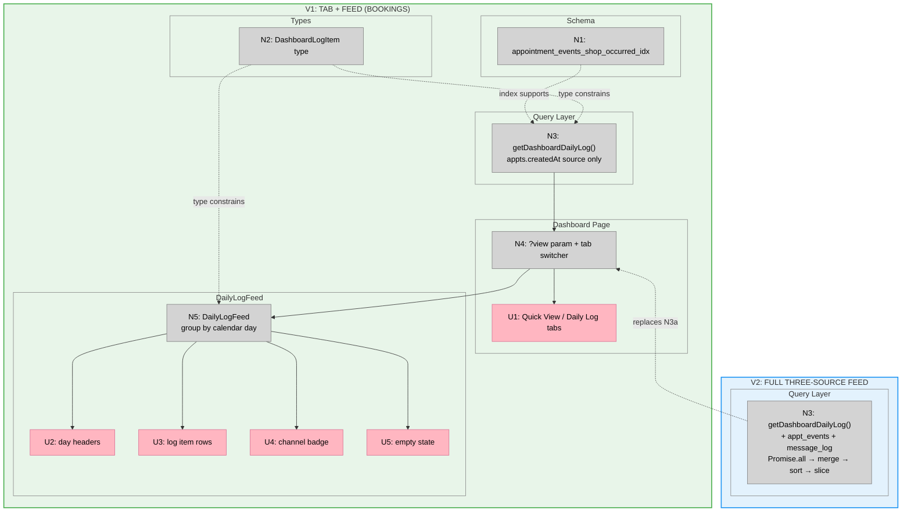

# Bet 4 — Daily Log Tab: Slices

**Shape:** A — Three-source merge in getDashboardDailyLog  
**Appetite:** ~2–3 days

---

## Overview

| Slice | Name | What it delivers |
|-------|------|-----------------|
| **V1** | Tab + Feed (Bookings) | Schema index, type, tab switcher, DailyLogFeed component, single source (appointments.createdAt) |
| **V2** | Full Three-Source Feed | Extends getDashboardDailyLog with cancelled/resolved events and message_log items |

---

## V1 — Tab + Feed (Bookings)

**Demo:** `/app/dashboard?view=log` shows a working tab switcher and a feed of new booking events from the last 7 days, grouped by calendar day with customer names and links to appointment detail pages. Empty state shows when no activity exists.

### UI Affordances

| ID | Affordance | Place |
|----|-----------|-------|
| U1 | Tab switcher — Quick View / Daily Log links; active tab visually distinguished | `page.tsx` |
| U2 | Day header — calendar date label (e.g., "Apr 16, 2026") above each day's group | `daily-log-feed.tsx` |
| U3 | Log item row — event label, customer name, timestamp; link wrapper when `href` present | `daily-log-feed.tsx` |
| U4 | Channel badge — `sms` / `email` pill (no message items in V1; renders when present in V2) | `daily-log-feed.tsx` |
| U5 | Empty state — "No activity in the last 7 days" when log is empty | `daily-log-feed.tsx` |

### Non-UI Affordances

| ID | Affordance | Place |
|----|-----------|-------|
| N1 | `appointment_events_shop_occurred_idx` index on `(shopId, occurredAt)` — schema change + migration | `src/lib/schema.ts` |
| N2 | `DashboardLogItem` type: `{ id, kind, occurredAt, appointmentId, customerName, eventLabel, channel, href }` | `src/types/dashboard.ts` |
| N3 | `getDashboardDailyLog(shopId, { days, limit })` — appointments.createdAt source only; maps to `DashboardLogItem[]` | `src/lib/queries/dashboard.ts` |
| N4 | Dashboard page — reads `?view` param; renders tab switcher (U1); if `view === "log"` calls N3 and renders N5; else renders existing Quick View | `src/app/app/dashboard/page.tsx` |
| N5 | `DailyLogFeed` component — groups items by calendar day; renders U2, U3, U4, U5 | `src/components/dashboard/daily-log-feed.tsx` |

### Excluded from V1

- `appointment_events` source (cancelled + outcome_resolved events)
- `message_log` source (sent/failed messages)

---

## V2 — Full Three-Source Feed

**Demo:** Daily Log shows items from all three sources merged newest-first: new bookings, cancellations, resolved outcomes (with financial outcome label), and sent/failed messages (with channel badge and purpose label). 50-item cap applies across the full merged set.

### UI Affordances

| ID | Affordance | Note |
|----|-----------|------|
| U4 | Channel badge — now appears on real message items from `message_log` | Already implemented in N5 (V1); no component changes needed |

### Non-UI Affordances

| ID | Affordance | Place |
|----|-----------|-------|
| N3 | `getDashboardDailyLog` — extend to `Promise.all` three sub-queries; add `appointment_events` (cancelled + outcome_resolved) and `message_log` sources; merge → sort → slice | `src/lib/queries/dashboard.ts` |

---

## Sliced Breadboard

**Legend:**
- **Pink nodes (U)** = UI affordances (things users see)
- **Grey nodes (N)** = Code affordances (data, handlers, types)
- **Solid lines** = Wires Out (produces, calls, passes)
- **Dashed lines** = Returns To / type constraints / replaces

---

## Slices Grid

|  |  |
|:--|:--|
| **[V1: Tab + Feed (Bookings)](./v1-plan.md)** ⏳ PENDING  • Schema index + migration • DashboardLogItem type • getDashboardDailyLog (bookings only) • Tab switcher + DailyLogFeed component  *Demo: `/app/dashboard?view=log` shows tab switcher + booking events grouped by day* | **[V2: Full Three-Source Feed](./v2-plan.md)** ⏳ PENDING  • Add cancelled + outcome_resolved source • Add message_log source (exclude slot_recovery_offer) • Promise.all merge with 50-item cap • Channel badge visible on message items  *Demo: Log shows bookings, cancellations, outcomes, and messages merged newest-first* |
