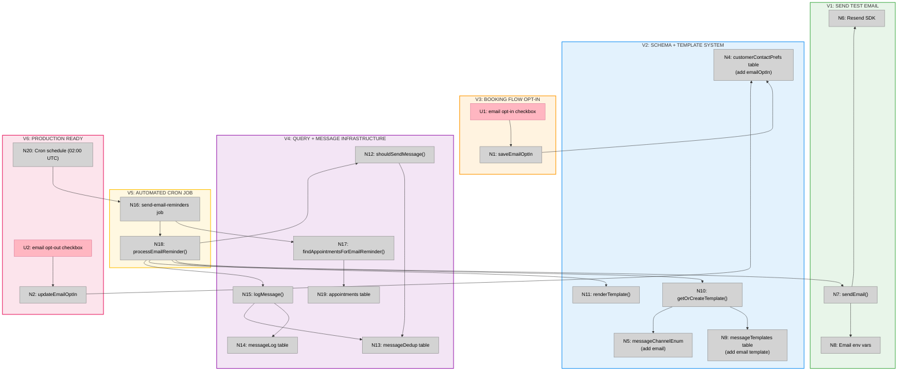

# Email Reminders — Big Picture

**Selected shape:** B (Separate Email Reminder Job)

---

## Frame

### Problem

- Customers miss appointments because they only receive manual SMS reminders
- Email reminders are a baseline expectation in all modern scheduling software (Calendly, Timely, Cal.com all have it)
- No way to reach customers who prefer email over SMS
- Manual reminder process doesn't scale and creates operational burden

### Outcome

- Customers automatically receive email reminders 24 hours before appointments
- Shop owners can customize email templates with booking details
- System works within Vercel Hobby plan constraints (uses 9th/final cron slot)
- No-show rate decreases through multi-channel reminder strategy (SMS + Email)
- Foundation in place for future enhancements (multiple reminder timing, custom intervals)

---

## Shape

### Fit Check (R × B)

| Req | Requirement | Status | B |
|-----|-------------|--------|---|
| R0 | Send automated email reminders before appointments | Core goal | ✅ |
| R1 | Support customizable reminder timing (default 24h before) | Must-have | ✅ |
| R2 | Support customizable email templates with booking details | Must-have | ✅ |
| R3 | Work within Vercel Hobby plan cron job limits (8/9 used) | Must-have | ✅ |
| R4 | Include booking details in email (time, date, service, manage link) | Must-have | ✅ |
| R5 | Reuse existing message infrastructure (templates, deduplication, logging) | Must-have | ✅ |
| R6 | Extend messageChannelEnum to support "email" | Must-have | ✅ |
| R7 | Send to ALL customers (not just high-risk like current SMS) | Must-have | ✅ |
| R8 | Handle email delivery failures gracefully | Leaning yes | ✅ |
| R9 | Track email delivery status (sent/delivered/bounced) | Leaning yes | ✅ |
| R10 | Allow customers to opt out of email reminders | Leaning yes | ✅ |
| R11 | Support multiple reminder emails per appointment (e.g., 24h + 1h) | Nice-to-have | ✅ |

### Parts

| Part | Mechanism | Flag |
|------|-----------|:----:|
| **B1** | **Email service integration** | |
| B1.1 | Resend SDK for email delivery | |
| B1.2 | Add env vars: `RESEND_API_KEY`, `EMAIL_FROM_ADDRESS` | |
| B1.3 | Install `resend` npm package | |
| B1.4 | Create `src/lib/email.ts` with `sendEmail()` function | |
| **B2** | **Extend schema for email support** | |
| B2.1 | Add "email" to `messageChannelEnum` | |
| B2.2 | Add `emailOptIn: boolean` to `customerContactPrefs` table | |
| B2.3 | Create migration with `pnpm db:generate` | |
| **B3** | **Email template creation** | |
| B3.1 | Create `appointment_reminder_24h_email` template in DB | |
| B3.2 | HTML email template with booking details, manage link | |
| B3.3 | Template variables: `{{customerName}}`, `{{startsAt}}`, `{{bookingUrl}}`, etc. | |
| **B4** | **New send-email-reminders job** | |
| B4.1 | Create `src/app/api/jobs/send-email-reminders/route.ts` | |
| B4.2 | Add to `vercel.json` cron schedule (uses 9th slot) | |
| B4.3 | Query all appointments in configurable time window (default 24h) | |
| B4.4 | Send email to customers with `emailOptIn = true` | |
| B4.5 | Use existing deduplication and logging infrastructure | |
| **B5** | **Independent timing configuration** | |
| B5.1 | Email job runs at 02:00 UTC (1 hour before SMS at 03:00) | |
| B5.2 | Can target different window than SMS in future | |
| **B6** | **Default opt-in behavior** | |
| B6.1 | Set `emailOptIn = true` by default for new bookings | |
| B6.2 | Allow opt-out via manage booking page | |

### Breadboard

```mermaid
flowchart TB
    subgraph bookingForm["PLACE: Booking Form"]
        U1["U1: email opt-in checkbox"]
        N1["N1: saveEmailOptIn"]
    end

    subgraph manageBooking["PLACE: Manage Booking Page"]
        U2["U2: email opt-out checkbox"]
        N2["N2: updateEmailOptIn"]
    end

    subgraph shopSettings["PLACE: Shop Settings (Future)"]
        U3["U3: email settings panel"]
        N3["N3: updateEmailSettings"]
    end

    subgraph database["PLACE: Database"]
        N4["N4: customerContactPrefs table"]
        N9["N9: messageTemplates table"]
        N13["N13: messageDedup table"]
        N14["N14: messageLog table"]
        N19["N19: appointments table"]
    end

    subgraph messageLib["PLACE: Message Infrastructure (src/lib/messages.ts)"]
        N10["N10: getOrCreateTemplate()"]
        N11["N11: renderTemplate()"]
        N12["N12: shouldSendMessage()"]
        N15["N15: logMessage()"]
    end

    subgraph emailLib["PLACE: Email Service (src/lib/email.ts)"]
        N6["N6: Resend SDK"]
        N7["N7: sendEmail()"]
        N8["N8: Email env vars"]
    end

    subgraph cronJob["PLACE: Email Reminder Job"]
        N16["N16: send-email-reminders job"]
        N17["N17: findAppointmentsForEmailReminder()"]
        N18["N18: processEmailReminder()"]
        N20["N20: Cron schedule (02:00 UTC)"]
    end

    subgraph schema["PLACE: Schema"]
        N5["N5: messageChannelEnum"]
    end

    %% Booking flow
    U1 -->|check/uncheck| N1
    N1 --> N4

    %% Manage flow
    U2 -->|check/uncheck| N2
    N2 --> N4

    %% Settings flow (future)
    U3 -->|configure| N3
    N3 --> N4

    %% Cron trigger
    N20 -->|triggers daily| N16
    N16 --> N17
    N17 --> N19
    N17 -.->|returns appointments| N16
    N16 --> N18

    %% Email processing flow
    N18 --> N12
    N12 --> N13
    N12 -.->|should send?| N18
    N18 --> N10
    N10 --> N9
    N10 -.->|returns template| N18
    N18 --> N11
    N11 -.->|returns HTML| N18
    N18 --> N7
    N7 --> N6
    N7 --> N8
    N7 -.->|delivery result| N18
    N18 --> N15
    N15 --> N14
    N15 --> N13

    %% Schema reference
    N15 --> N5

    %% Styling
    classDef ui fill:#ffb6c1,stroke:#d87093,color:#000
    classDef nonui fill:#d3d3d3,stroke:#808080,color:#000
    class U1,U2,U3 ui
    class N1,N2,N3,N4,N5,N6,N7,N8,N9,N10,N11,N12,N13,N14,N15,N16,N17,N18,N19,N20 nonui
```

**Legend:**
- **Pink nodes (U)** = UI affordances (things users see/interact with)
- **Grey nodes (N)** = Code affordances (data stores, handlers, services)
- **Solid lines** = Wires Out (calls, triggers, writes)
- **Dashed lines** = Returns To (return values, data store reads)

---

## Slices

### Sliced Breadboard

### Slices Grid

|  |  |  |
|:--|:--|:--|
| **[V1: SEND TEST EMAIL](./email-reminders-v1-plan.md)** ⏳ PENDING  • Install Resend SDK • Create sendEmail() function • Add email env vars • Test API endpoint  *Demo: Hit /api/test-email, receive email in inbox* | **[V2: SCHEMA + TEMPLATE SYSTEM](./email-reminders-v2-plan.md)** ⏳ PENDING  • Add "email" to messageChannelEnum • Add emailOptIn to customerContactPrefs • Run migration • Seed email template in DB  *Demo: Template renders with booking data* | **[V3: BOOKING FLOW OPT-IN](./email-reminders-v3-plan.md)** ⏳ PENDING  • Email opt-in checkbox (default true) • Save to customerContactPrefs • Handle existing customers • &nbsp;  *Demo: Book appointment, verify emailOptIn=true in DB* |
| **[V4: QUERY + MESSAGE INFRASTRUCTURE](./email-reminders-v4-plan.md)** ⏳ PENDING  • findAppointmentsForEmailReminder() • Manual send API endpoint • Deduplication integration • Message logging integration  *Demo: Send email manually, see in messageLog, dedup prevents duplicate* | **[V5: AUTOMATED CRON JOB](./email-reminders-v5-plan.md)** ⏳ PENDING  • send-email-reminders job • CRON_SECRET auth • Advisory locks • Batch processing + error handling  *Demo: Trigger job manually, emails sent automatically* | **[V6: PRODUCTION READY](./email-reminders-v6-plan.md)** ⏳ PENDING  • Add to vercel.json cron (02:00 UTC) • Opt-out control on manage page • E2E tests • Monitoring/alerting  *Demo: End-to-end flow + opt-out works* |

---

## Key Decisions

**Email provider:** Resend
- Built for Next.js ecosystem
- Free tier: 3,000 emails/month
- Excellent TypeScript DX
- Good deliverability

**Cron timing:** 02:00 UTC daily
- Runs 1 hour before SMS reminders (03:00 UTC)
- Targets appointments 23-25 hours away
- Uses 9th/final Vercel Hobby plan cron slot

**Default opt-in:** true
- Customers receive emails by default
- Must opt out explicitly via manage booking page
- Follows industry standard (Calendly, Timely, Cal.com)

**Infrastructure reuse:** Maximum
- Uses existing message template system
- Uses existing deduplication (`messageDedup`)
- Uses existing logging (`messageLog`)
- Follows SMS reminder pattern closely

**Query scope:** All customers
- Unlike SMS (high-risk only), emails go to everyone
- Filtered by `emailOptIn = true`
- Status must be "booked"

---

## Success Metrics

After V6 deployment:

- ✅ Email reminders sent automatically 24h before appointments
- ✅ Customers can opt in (default) and opt out
- ✅ Email delivery tracked in `messageLog`
- ✅ Zero duplicate emails (deduplication works)
- ✅ No-show rate decreases (measure over 30 days)
- ✅ Email delivery rate > 95%
- ✅ Customer complaints about spam < 1%

---

## Future Enhancements

After V6 is stable, consider:

- **Multiple reminder timing** (R11): Add 1-hour reminder, 48-hour reminder
- **Custom templates per shop**: Allow shop owners to customize email content
- **Email analytics**: Track open rates, click rates via Resend webhooks
- **A/B testing**: Test different email content for effectiveness
- **Localization**: Multi-language email templates
- **Rich templates**: Use React Email for better-designed emails
