# Email Reminders — Shaping

**Status:** Shape B selected, resolving flagged unknowns
**Date:** 2026-03-17
**Selected shape:** B (Separate Email Reminder Job)

---

## Frame

### Source

> Users expect both email AND SMS reminders. We have SMS (manual), but email is table stakes.
>
> **Competitor coverage:**
> - Calendly: ✅ (customizable timing, templates)
> - Timely: ✅ (automated, customizable timing)
> - Cal.com: ✅ (workflow-based email triggers)

### Problem

- Customers miss appointments because they only receive manual SMS reminders
- Email reminders are a baseline expectation in all modern scheduling software
- No way to reach customers who prefer email over SMS
- Manual reminder process doesn't scale and creates operational burden

### Outcome

- Customers automatically receive email reminders before appointments
- Shop owners can customize reminder timing (e.g., 24 hours, 1 hour before)
- Shop owners can customize email templates with booking details
- System works within Vercel Hobby plan constraints (limited cron jobs)
- No-show rate decreases through multi-channel reminder strategy

---

## Requirements (R)

| ID | Requirement | Status |
|----|-------------|--------|
| R0 | Send automated email reminders before appointments | Core goal |
| R1 | Support customizable reminder timing (X hours/days before appointment) | Must-have |
| R2 | Support customizable email templates with booking details | Must-have |
| R3 | Work within Vercel Hobby plan cron job limits | Must-have |
| R4 | Include booking details in email (time, date, service, location) | Must-have |
| R5 | Include manage booking link in email | Must-have |
| R6 | Handle email delivery failures gracefully | Undecided |
| R7 | Track email delivery status (sent/delivered/bounced) | Undecided |
| R8 | Allow customers to opt out of email reminders | Undecided |
| R9 | Support multiple reminder emails per appointment (e.g., 24h + 1h) | Undecided |

---

## Codebase Investigation Findings

### Current State

**Email infrastructure:** ❌ None exists
- No email service provider configured (no SendGrid, Postmark, Resend, AWS SES)
- No email env vars in `env.example` or `src/lib/env.ts`
- No email libraries in `package.json`

**Customer email collection:** ✅ Already in place
- `customers.email` field exists (required, unique per shop)
- Booking form collects and validates email addresses
- Email normalized to lowercase before storage
- Location: `src/lib/schema.ts:333`, `src/components/booking/booking-form.tsx`

**Cron job capacity:** ⚠️ 8 of 9 slots used (Vercel Hobby plan)
- Current jobs: resolve-outcomes, expire-offers, recompute-scores, recompute-no-show-stats, send-reminders, send-confirmations, expire-confirmations, scan-calendar-conflicts
- **One slot available** for new cron job OR must enhance existing job
- Location: `vercel.json`

**Current reminder system:** SMS only, high-risk targeting
- Job: `send-reminders` runs daily at 03:00 UTC
- Queries appointments 23-25 hours before start time
- **Only sends to high-risk customers** (no-show prediction)
- Uses Twilio for SMS delivery
- Location: `src/app/api/jobs/send-reminders/route.ts`

**Message infrastructure:** ✅ Excellent foundation
- Template system with versioning (`messageTemplates` table)
- Deduplication (`messageDedup` table)
- Message logging (`messageLog` table)
- Template rendering with mustache syntax: `{{variable_name}}`
- **Currently supports `"sms"` channel only** - needs extension to `"email"`
- Location: `src/lib/messages.ts`, `src/lib/schema.ts:150`

**Customer contact preferences:** Partial
- `customerContactPrefs` table exists
- Tracks `smsOptIn` (boolean)
- **No `emailOptIn` field yet** - needs extension
- Location: `src/lib/schema.ts:424-438`

**Available data for emails:**
- Customer: fullName, email, phone
- Appointment: startsAt, endsAt, shopName, timezone
- Payment: amountCents, currency
- Manage link: bookingUrl (already generated)

### Key Architectural Patterns to Follow

**SMS sending pattern** (`src/lib/twilio.ts`):
- Dedicated service module with error handling
- Idempotent message sending
- Integration with message logging system

**Message template pattern** (`src/lib/messages.ts`):
- `getOrCreateTemplate()` - versioned templates
- `renderTemplate()` - variable substitution
- `shouldSendMessage()` - deduplication check
- `logMessage()` - delivery tracking

**Job pattern** (`src/app/api/jobs/send-reminders/route.ts`):
- `CRON_SECRET` authentication
- PostgreSQL advisory locks (prevent concurrent runs)
- Query appointments in time window
- Process in batches
- Error handling per message

---

## Requirements (R) — Refined

| ID | Requirement | Status |
|----|-------------|--------|
| R0 | Send automated email reminders before appointments | Core goal |
| R1 | Support customizable reminder timing (default 24h before) | Must-have |
| R2 | Support customizable email templates with booking details | Must-have |
| R3 | Work within Vercel Hobby plan cron job limits (8/9 used) | Must-have |
| R4 | Include booking details in email (time, date, service, manage link) | Must-have |
| R5 | Reuse existing message infrastructure (templates, deduplication, logging) | Must-have |
| R6 | Extend messageChannelEnum to support "email" | Must-have |
| R7 | Send to ALL customers (not just high-risk like current SMS) | Must-have |
| R8 | Handle email delivery failures gracefully | Leaning yes |
| R9 | Track email delivery status (sent/delivered/bounced) | Leaning yes |
| R10 | Allow customers to opt out of email reminders | Leaning yes |
| R11 | Support multiple reminder emails per appointment (e.g., 24h + 1h) | Nice-to-have |

---

## CURRENT: Existing System

| Part | Mechanism |
|------|-----------|
| **CURRENT-1** | SMS reminders via send-reminders cron job |
| CURRENT-1.1 | Runs daily at 03:00 UTC |
| CURRENT-1.2 | Queries high-risk appointments 23-25h before start |
| CURRENT-1.3 | Sends SMS via Twilio using `appointment_reminder_24h` template |
| **CURRENT-2** | Message infrastructure |
| CURRENT-2.1 | Template storage with versioning (`messageTemplates` table) |
| CURRENT-2.2 | Deduplication (`messageDedup` table) |
| CURRENT-2.3 | Message logging (`messageLog` table) |
| CURRENT-2.4 | Channel enum: only "sms" supported |
| **CURRENT-3** | Customer contact preferences |
| CURRENT-3.1 | `customerContactPrefs` table with `smsOptIn` field |
| CURRENT-3.2 | No email opt-in tracking |

---

## Solution Shapes

### A: Enhance Existing send-reminders Job (SMS + Email)

Extend the current `send-reminders` job to handle both SMS and email in a single cron run.

| Part | Mechanism | Flag |
|------|-----------|:----:|
| **A1** | **Email service integration** | ⚠️ |
| A1.1 | Choose email provider (Resend recommended for Next.js) | ⚠️ |
| A1.2 | Add env vars: `EMAIL_API_KEY`, `EMAIL_FROM_ADDRESS` | |
| A1.3 | Install email SDK (e.g., `resend` npm package) | |
| A1.4 | Create `src/lib/email.ts` with `sendEmail()` function | |
| **A2** | **Extend schema for email support** | |
| A2.1 | Add "email" to `messageChannelEnum` | |
| A2.2 | Add `emailOptIn: boolean` to `customerContactPrefs` table | |
| A2.3 | Create migration with `pnpm db:generate` | |
| **A3** | **Email template creation** | |
| A3.1 | Create `appointment_reminder_24h_email` template in DB | |
| A3.2 | HTML email template with booking details, manage link | |
| A3.3 | Template variables: `{{customerName}}`, `{{startsAt}}`, `{{bookingUrl}}`, etc. | |
| **A4** | **Enhance send-reminders job** | |
| A4.1 | Change query to target ALL customers (not just high-risk) | |
| A4.2 | For each appointment: send SMS (if opted in) AND email (if opted in) | |
| A4.3 | Use existing deduplication and logging infrastructure | |
| A4.4 | Handle email delivery failures (catch errors, log) | |
| **A5** | **Default opt-in behavior** | |
| A5.1 | Set `emailOptIn = true` by default for new bookings | |
| A5.2 | Allow opt-out via manage booking page | |

**Pros:**
- Uses existing cron slot (no new job needed)
- Reuses all message infrastructure
- Single job handles multi-channel reminders
- Simple architecture

**Cons:**
- Job runs longer (more messages to send)
- Couples email and SMS timing (both at 24h)
- Can't easily have different timing for email vs. SMS

---

### B: Separate Email Reminder Job

Create a dedicated `send-email-reminders` cron job using the last available Vercel slot.

| Part | Mechanism | Flag |
|------|-----------|:----:|
| **B1** | **Email service integration** | ⚠️ |
| B1.1 | Same as A1 (choose provider, env vars, SDK, `sendEmail()`) | ⚠️ |
| **B2** | **Extend schema for email support** | |
| B2.1 | Same as A2 (add "email" to enum, add `emailOptIn`, migration) | |
| **B3** | **Email template creation** | |
| B3.1 | Same as A3 (template in DB, HTML, variables) | |
| **B4** | **New send-email-reminders job** | |
| B4.1 | Create `src/app/api/jobs/send-email-reminders/route.ts` | |
| B4.2 | Add to `vercel.json` cron schedule (uses 9th slot) | |
| B4.3 | Query all appointments in configurable time window (default 24h) | |
| B4.4 | Send email to customers with `emailOptIn = true` | |
| B4.5 | Use existing deduplication and logging infrastructure | |
| **B5** | **Independent timing configuration** | |
| B5.1 | Email job can run at different time than SMS (e.g., 02:00 vs. 03:00) | |
| B5.2 | Email can target different window (e.g., 48h before vs. 24h for SMS) | |
| **B6** | **Default opt-in behavior** | |
| B6.1 | Same as A5 (default true, opt-out via manage page) | |

**Pros:**
- Independent timing for email vs. SMS
- Cleaner separation of concerns
- Can configure different reminder windows

**Cons:**
- Uses last available cron slot (no more slots after this)
- Two jobs to maintain
- Slightly more code duplication

---

### C: Event-Driven Email (No Cron Needed)

Send email immediately after booking, scheduled for delivery 24h before appointment using email provider's scheduled send feature.

| Part | Mechanism | Flag |
|------|-----------|:----:|
| **C1** | **Email service with scheduled send** | ⚠️ |
| C1.1 | Choose provider supporting scheduled send (Resend supports this) | ⚠️ |
| C1.2 | Add env vars: `EMAIL_API_KEY`, `EMAIL_FROM_ADDRESS` | |
| C1.3 | Install email SDK with scheduled send capability | |
| C1.4 | Create `src/lib/email.ts` with `scheduleEmail()` function | |
| **C2** | **Extend schema for email support** | |
| C2.1 | Same as A2 (add "email" to enum, add `emailOptIn`, migration) | |
| C2.2 | Add `scheduledEmailId: text` to `appointments` table (track scheduled email) | |
| **C3** | **Email template creation** | |
| C3.1 | Same as A3 (template in DB, HTML, variables) | |
| **C4** | **Schedule email at booking time** | |
| C4.1 | In booking creation flow, after payment succeeds | |
| C4.2 | Calculate send time: `startsAt - 24 hours` | |
| C4.3 | Call email provider's scheduled send API | |
| C4.4 | Store `scheduledEmailId` on appointment record | |
| **C5** | **Handle cancellations** | |
| C5.1 | On appointment cancellation, cancel scheduled email | |
| C5.2 | Call email provider's cancel API with `scheduledEmailId` | |
| **C6** | **Handle reschedules** | ⚠️ |
| C6.1 | Cancel old scheduled email | ⚠️ |
| C6.2 | Schedule new email for new time | ⚠️ |
| **C7** | **Default opt-in behavior** | |
| C7.1 | Same as A5 (default true, opt-out via manage page) | |

**Pros:**
- No cron job needed (saves the last slot for future features)
- Exact timing (not limited to daily cron runs)
- Scales better (no batch processing)

**Cons:**
- Depends on email provider supporting scheduled send + cancel
- More complex cancellation/reschedule logic
- Can't easily change reminder timing after booking
- Harder to debug (email scheduled externally)

---

## Fit Check

| Req | Requirement | Status | A | B | C |
|-----|-------------|--------|---|---|---|
| R0 | Send automated email reminders before appointments | Core goal | ✅ | ✅ | ✅ |
| R1 | Support customizable reminder timing (default 24h before) | Must-have | ✅ | ✅ | ❌ |
| R2 | Support customizable email templates with booking details | Must-have | ✅ | ✅ | ✅ |
| R3 | Work within Vercel Hobby plan cron job limits (8/9 used) | Must-have | ✅ | ✅ | ✅ |
| R4 | Include booking details in email (time, date, service, manage link) | Must-have | ✅ | ✅ | ✅ |
| R5 | Reuse existing message infrastructure (templates, deduplication, logging) | Must-have | ✅ | ✅ | ✅ |
| R6 | Extend messageChannelEnum to support "email" | Must-have | ✅ | ✅ | ✅ |
| R7 | Send to ALL customers (not just high-risk like current SMS) | Must-have | ✅ | ✅ | ✅ |
| R8 | Handle email delivery failures gracefully | Leaning yes | ✅ | ✅ | ✅ |
| R9 | Track email delivery status (sent/delivered/bounced) | Leaning yes | ✅ | ✅ | ✅ |
| R10 | Allow customers to opt out of email reminders | Leaning yes | ✅ | ✅ | ✅ |
| R11 | Support multiple reminder emails per appointment (e.g., 24h + 1h) | Nice-to-have | ❌ | ✅ | ❌ |

**Notes:**
- **C fails R1:** Timing is fixed at booking time (startsAt - 24h). Can't easily change to 48h or 1h without rescheduling all emails.
- **A fails R11:** Single job run = single reminder timing. Can't send 24h + 1h reminders without running job twice or complicating logic.
- **C fails R11:** Would need to schedule multiple emails per booking, increasing complexity significantly.

---

## Decision

**Selected:** Shape B (Separate Email Reminder Job)

**Rationale:**
- ✅ Independent timing control for email vs. SMS
- ✅ Can add multiple email reminders later (24h, 1h)
- ✅ Clean separation of concerns
- ✅ Passes all fit checks (11/11)
- Trade-off: Uses last cron slot (acceptable for table-stakes feature)

---

## Resolving Flagged Unknowns

### B1: Email Service Integration ⚠️ → ✅

**Decision:** Use **Resend**

**Rationale:**
- Built specifically for Next.js/React ecosystem
- Excellent TypeScript support and DX
- Simple API (`resend.emails.send()`)
- Free tier: 3,000 emails/month, 100 emails/day (sufficient for MVP)
- Good deliverability (built by ex-Postmark team)
- Active development and Next.js community adoption

**Comparison:**

| Provider | Free Tier | DX | Deliverability | Next.js Focus |
|----------|-----------|-----|----------------|---------------|
| **Resend** | 3k/mo, 100/day | ⭐⭐⭐ | ⭐⭐⭐ | ⭐⭐⭐ |
| Postmark | 100/mo | ⭐⭐ | ⭐⭐⭐ | ⭐ |
| SendGrid | 100/day | ⭐ | ⭐⭐ | ⭐ |
| AWS SES | 62k/mo* | ⭐ | ⭐⭐⭐ | ⭐ |

*AWS SES requires AWS account, more complex setup

**Implementation:**
```bash
pnpm add resend
```

```typescript
// src/lib/email.ts
import { Resend } from 'resend';

const resend = new Resend(process.env.RESEND_API_KEY);

export async function sendEmail({
  to,
  subject,
  html,
}: {
  to: string;
  subject: string;
  html: string;
}) {
  return await resend.emails.send({
    from: process.env.EMAIL_FROM_ADDRESS!,
    to,
    subject,
    html,
  });
}
```

**Environment variables needed:**
- `RESEND_API_KEY` - API key from https://resend.com/api-keys
- `EMAIL_FROM_ADDRESS` - Verified sender email (e.g., `reminders@yourdomain.com`)

**Flagged unknown B1 resolved:** ✅

---

## Detail B: Concrete Implementation

### UI Affordances

| ID | Affordance | Place | Wires Out |
|----|------------|-------|-----------|
| U1 | Email opt-in checkbox (default checked) | Booking form | → N1 |
| U2 | Email opt-out checkbox | Manage booking page | → N2 |
| U3 | Email reminder settings panel | Shop settings page (future) | → N3 |

### Non-UI Affordances

| ID | Affordance | Place | Wires Out | Returns To |
|----|------------|-------|-----------|------------|
| **N1** | **saveEmailOptIn** | Booking creation flow | → N4 (save to DB) | U1 |
| **N2** | **updateEmailOptIn** | Manage booking handler | → N4 (update DB) | U2 |
| **N3** | **updateEmailSettings** | Settings handler (future) | → N4 (save template/timing) | U3 |
| **N4** | **customerContactPrefs table** | Database | | N1, N2 |
| **N5** | **messageChannelEnum** | Schema | | N14 |
| **N6** | **Resend SDK** | Email service | | N7 |
| **N7** | **sendEmail()** | src/lib/email.ts | → N6 (Resend API) | N15 |
| **N8** | **Email env vars** | Environment | | N7 |
| **N9** | **messageTemplates table** | Database | | N10 |
| **N10** | **getOrCreateTemplate()** | src/lib/messages.ts | → N9 (query) | N11 |
| **N11** | **renderTemplate()** | src/lib/messages.ts | | N15 |
| **N12** | **shouldSendMessage()** | src/lib/messages.ts | → N13 (check dedup) | N15 |
| **N13** | **messageDedup table** | Database | | N12 |
| **N14** | **messageLog table** | Database | | N15 |
| **N15** | **logMessage()** | src/lib/messages.ts | → N14 (insert), → N13 (insert) | N16 |
| **N16** | **send-email-reminders job** | src/app/api/jobs/send-email-reminders/route.ts | → N17 (query), → N18 (process) | Cron |
| **N17** | **findAppointmentsForEmailReminder()** | src/lib/queries/appointments.ts | → N19 (query DB) | N16 |
| **N18** | **processEmailReminder()** | Job handler | → N12, → N10, → N11, → N7, → N15 | N16 |
| **N19** | **appointments table** | Database | | N17 |
| **N20** | **Cron schedule** | vercel.json | → N16 (trigger at 02:00 UTC) | |

### Wiring Diagram

```mermaid
flowchart TB
    subgraph bookingForm["PLACE: Booking Form"]
        U1["U1: email opt-in checkbox"]
        N1["N1: saveEmailOptIn"]
    end

    subgraph manageBooking["PLACE: Manage Booking Page"]
        U2["U2: email opt-out checkbox"]
        N2["N2: updateEmailOptIn"]
    end

    subgraph shopSettings["PLACE: Shop Settings (Future)"]
        U3["U3: email settings panel"]
        N3["N3: updateEmailSettings"]
    end

    subgraph database["PLACE: Database"]
        N4["N4: customerContactPrefs table"]
        N9["N9: messageTemplates table"]
        N13["N13: messageDedup table"]
        N14["N14: messageLog table"]
        N19["N19: appointments table"]
    end

    subgraph messageLib["PLACE: Message Infrastructure (src/lib/messages.ts)"]
        N10["N10: getOrCreateTemplate()"]
        N11["N11: renderTemplate()"]
        N12["N12: shouldSendMessage()"]
        N15["N15: logMessage()"]
    end

    subgraph emailLib["PLACE: Email Service (src/lib/email.ts)"]
        N6["N6: Resend SDK"]
        N7["N7: sendEmail()"]
        N8["N8: Email env vars"]
    end

    subgraph cronJob["PLACE: Email Reminder Job"]
        N16["N16: send-email-reminders job"]
        N17["N17: findAppointmentsForEmailReminder()"]
        N18["N18: processEmailReminder()"]
        N20["N20: Cron schedule (02:00 UTC)"]
    end

    subgraph schema["PLACE: Schema"]
        N5["N5: messageChannelEnum"]
    end

    %% Booking flow
    U1 -->|check/uncheck| N1
    N1 --> N4

    %% Manage flow
    U2 -->|check/uncheck| N2
    N2 --> N4

    %% Settings flow (future)
    U3 -->|configure| N3
    N3 --> N4

    %% Cron trigger
    N20 -->|triggers daily| N16
    N16 --> N17
    N17 --> N19
    N17 -.->|returns appointments| N16
    N16 --> N18

    %% Email processing flow
    N18 --> N12
    N12 --> N13
    N12 -.->|should send?| N18
    N18 --> N10
    N10 --> N9
    N10 -.->|returns template| N18
    N18 --> N11
    N11 -.->|returns HTML| N18
    N18 --> N7
    N7 --> N6
    N7 --> N8
    N7 -.->|delivery result| N18
    N18 --> N15
    N15 --> N14
    N15 --> N13

    %% Schema reference
    N15 --> N5

    %% Styling
    classDef ui fill:#ffb6c1,stroke:#d87093,color:#000
    classDef nonui fill:#d3d3d3,stroke:#808080,color:#000
    class U1,U2,U3 ui
    class N1,N2,N3,N4,N5,N6,N7,N8,N9,N10,N11,N12,N13,N14,N15,N16,N17,N18,N19,N20 nonui
```



**Legend:**
- **Pink nodes (U)** = UI affordances (things users see/interact with)
- **Grey nodes (N)** = Code affordances (data stores, handlers, services)
- **Solid lines** = Wires Out (calls, triggers, writes)
- **Dashed lines** = Returns To (return values, data store reads)

---

## Implementation Notes

### Database Migration Order

1. **Add email support to messageChannelEnum** (N5)
   - Modify `src/lib/schema.ts` line 150
   - Change `pgEnum("message_channel", ["sms"])` to `pgEnum("message_channel", ["sms", "email"])`

2. **Add emailOptIn to customerContactPrefs** (N4)
   - Modify `src/lib/schema.ts` line 424-438
   - Add `emailOptIn: boolean("email_opt_in").default(true).notNull()`

3. **Generate and run migration**
   ```bash
   pnpm db:generate
   pnpm db:migrate
   ```

### Environment Variables to Add

Add to `env.example` and `.env`:
```bash
# Email service (Resend)
RESEND_API_KEY=re_xxxxxxxxxxxx
EMAIL_FROM_ADDRESS=reminders@yourdomain.com
```

Add to `src/lib/env.ts`:
```typescript
RESEND_API_KEY: z.string().min(1),
EMAIL_FROM_ADDRESS: z.string().email(),
```

### File Creation Order

1. **src/lib/email.ts** (N7)
   - Create `sendEmail()` function using Resend SDK
   - Error handling and logging
   - Follow pattern from `src/lib/twilio.ts`

2. **src/lib/queries/appointments.ts** (N17)
   - Add `findAppointmentsForEmailReminder()` query
   - Similar to existing `findHighRiskAppointments()` but:
     - Include ALL customers (not just high-risk)
     - Filter by `emailOptIn = true`
     - Query window: 23-25 hours before `startsAt`

3. **src/app/api/jobs/send-email-reminders/route.ts** (N16, N18)
   - Create new cron job endpoint
   - CRON_SECRET authentication
   - PostgreSQL advisory locks
   - Process appointments in batches
   - Use existing message infrastructure (N10, N11, N12, N15)

4. **vercel.json** (N20)
   - Add cron schedule: `"schedule": "0 2 * * *"` (02:00 UTC)
   - This runs 1 hour before SMS reminders (03:00 UTC)

5. **Message template** (N9)
   - Create `appointment_reminder_24h_email` template in database
   - HTML email with booking details, manage link
   - Variables: `{{customerName}}`, `{{startsAt}}`, `{{endsAt}}`, `{{shopName}}`, `{{bookingUrl}}`

6. **Booking form** (U1, N1)
   - Add email opt-in checkbox (default checked)
   - Save to `customerContactPrefs` on booking creation

7. **Manage booking page** (U2, N2)
   - Add email opt-out checkbox
   - Update `customerContactPrefs` on change

---

## Testing Strategy

1. **Unit tests**
   - `src/lib/__tests__/email.test.ts` - sendEmail() function
   - `src/lib/__tests__/queries-appointments.test.ts` - findAppointmentsForEmailReminder()

2. **E2E tests**
   - Create test booking with email opt-in
   - Mock Resend API
   - Trigger send-email-reminders job
   - Verify email sent via messageLog

3. **Manual testing**
   - Use Resend test mode (emails sent to test inbox)
   - Create booking 23-25 hours in future
   - Wait for cron trigger or manually call job endpoint
   - Check email delivery in Resend dashboard

---

## Next: Slicing

Ready to slice Shape B into vertical implementation increments?
