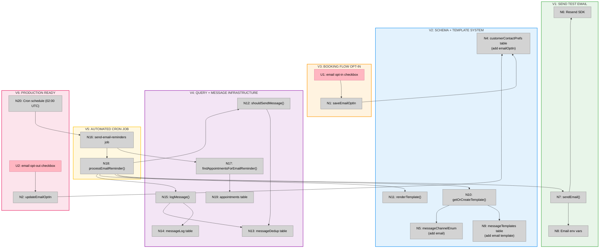

# Email Reminders — Slices

**Shape:** B (Separate Email Reminder Job)
**Date:** 2026-03-17

---

## Slice Definitions

### V1: Send Test Email

**Goal:** Prove email infrastructure works end-to-end.

**Scope:**
- Install Resend SDK (`pnpm add resend`)
- Create `src/lib/email.ts` with `sendEmail()` function
- Add environment variables (`RESEND_API_KEY`, `EMAIL_FROM_ADDRESS`)
- Create test API endpoint at `/api/test-email`

**Demo:** Hit `/api/test-email`, receive email in inbox with hardcoded content.

**Files:**
- `package.json` - add resend dependency
- `src/lib/env.ts` - add email env vars
- `env.example` - document new vars
- `src/lib/email.ts` - NEW
- `src/app/api/test-email/route.ts` - NEW (temporary, remove later)

---

### V2: Schema + Template System

**Goal:** Database supports email channel and templates render correctly.

**Scope:**
- Extend `messageChannelEnum` to include "email"
- Add `emailOptIn` field to `customerContactPrefs` table
- Generate and run migration
- Create `appointment_reminder_24h_email` template in `messageTemplates` table
- Add seed script or manual SQL to insert template

**Demo:** Template renders with booking data (create test that renders HTML with appointment variables).

**Files:**
- `src/lib/schema.ts` - modify enums and tables
- `drizzle/NNNN_email_support.sql` - NEW (generated migration)
- `scripts/seed-email-template.sql` - NEW (template seed script)
- `src/lib/__tests__/messages.test.ts` - add email template rendering test

**Migration steps:**
```bash
pnpm db:generate
pnpm db:migrate
```

**Template content:**
```sql
INSERT INTO message_templates (key, version, channel, subject_template, body_template)
VALUES (
  'appointment_reminder_24h',
  1,
  'email',
  'Reminder: Appointment tomorrow at {{startsAt}}',
  '<html>
    <body>
      <h1>Hi {{customerName}},</h1>
      <p>This is a reminder about your appointment tomorrow:</p>
      <ul>
        <li><strong>Shop:</strong> {{shopName}}</li>
        <li><strong>Time:</strong> {{startsAt}} - {{endsAt}}</li>
      </ul>
      <p><a href="{{bookingUrl}}">Manage your booking</a></p>
    </body>
  </html>'
);
```

---

### V3: Booking Flow Opt-In

**Goal:** Customers opt into email reminders during booking.

**Scope:**
- Add email opt-in checkbox to booking form (default checked)
- Save `emailOptIn` to `customerContactPrefs` when booking is created
- If customer already exists, update their preferences

**Demo:** Book appointment with email opt-in checked, verify `customerContactPrefs.emailOptIn = true` in database.

**Files:**
- `src/components/booking/booking-form.tsx` - add checkbox UI
- `src/app/api/bookings/create/route.ts` - save emailOptIn to DB
- `src/lib/schema.ts` - verify customerContactPrefs has emailOptIn (from V2)

**UI addition to booking form:**
```tsx
<Checkbox
  id="emailOptIn"
  checked={emailOptIn}
  onCheckedChange={setEmailOptIn}
  defaultChecked={true}
/>
<label htmlFor="emailOptIn">
  Send me email reminders about my appointment
</label>
```

---

### V4: Query + Message Infrastructure

**Goal:** Find appointments to remind and integrate with deduplication/logging.

**Scope:**
- Create `findAppointmentsForEmailReminder()` query
  - Find appointments 23-25 hours before `startsAt`
  - Customer has `emailOptIn = true`
  - Appointment status is "booked"
  - Return: appointmentId, customerId, customerName, customerEmail, startsAt, endsAt, bookingUrl, shopName
- Create manual send endpoint `/api/appointments/[id]/send-email-reminder`
- Integrate with `shouldSendMessage()` (deduplication)
- Integrate with `logMessage()` (tracking)
- Use `getOrCreateTemplate()` and `renderTemplate()` from messages.ts

**Demo:** Manually trigger email for specific appointment via API, see email in inbox, check `messageLog` table for record, try sending again and verify dedup prevents duplicate.

**Files:**
- `src/lib/queries/appointments.ts` - add findAppointmentsForEmailReminder()
- `src/app/api/appointments/[id]/send-email-reminder/route.ts` - NEW (manual send endpoint)
- `src/lib/__tests__/queries-appointments.test.ts` - add tests for new query

**Query signature:**
```typescript
export async function findAppointmentsForEmailReminder() {
  const now = new Date();
  const windowStart = new Date(now.getTime() + 23 * 60 * 60 * 1000);
  const windowEnd = new Date(now.getTime() + 25 * 60 * 60 * 1000);

  return db
    .select({
      appointmentId: appointments.id,
      customerId: customers.id,
      customerName: customers.fullName,
      customerEmail: customers.email,
      startsAt: appointments.startsAt,
      endsAt: appointments.endsAt,
      bookingUrl: appointments.bookingUrl,
      shopName: shops.name,
    })
    .from(appointments)
    .innerJoin(customers, eq(appointments.customerId, customers.id))
    .innerJoin(shops, eq(appointments.shopId, shops.id))
    .leftJoin(customerContactPrefs, eq(customerContactPrefs.customerId, customers.id))
    .where(
      and(
        eq(appointments.status, "booked"),
        gte(appointments.startsAt, windowStart),
        lte(appointments.startsAt, windowEnd),
        or(
          eq(customerContactPrefs.emailOptIn, true),
          isNull(customerContactPrefs.emailOptIn) // Default to true if no pref record
        )
      )
    );
}
```

---

### V5: Automated Cron Job

**Goal:** Email reminders sent automatically via cron job.

**Scope:**
- Create `src/app/api/jobs/send-email-reminders/route.ts`
- CRON_SECRET authentication
- PostgreSQL advisory locks (prevent concurrent runs)
- Batch processing of appointments
- Error handling (catch per-message errors, continue processing)
- Use `findAppointmentsForEmailReminder()` from V4
- Process each appointment: check dedup → get template → render → send → log

**Demo:** Create appointment 24 hours in future, manually trigger job via `curl` with CRON_SECRET, verify email arrives and appears in messageLog.

**Files:**
- `src/app/api/jobs/send-email-reminders/route.ts` - NEW
- `src/lib/__tests__/send-email-reminders.test.ts` - NEW (unit tests)

**Job structure (follow pattern from send-reminders):**
```typescript
export async function POST(req: Request) {
  // 1. Verify CRON_SECRET
  // 2. Acquire PostgreSQL advisory lock
  // 3. Query appointments via findAppointmentsForEmailReminder()
  // 4. For each appointment:
  //    a. shouldSendMessage() - check dedup
  //    b. getOrCreateTemplate() - get email template
  //    c. renderTemplate() - populate variables
  //    d. sendEmail() - deliver via Resend
  //    e. logMessage() - record in messageLog + messageDedup
  // 5. Release advisory lock
  // 6. Return summary (sent count, failed count)
}
```

**Manual trigger for testing:**
```bash
curl -X POST http://localhost:3000/api/jobs/send-email-reminders \
  -H "x-cron-secret: $CRON_SECRET"
```

---

### V6: Production Ready

**Goal:** End-to-end automation with opt-out control.

**Scope:**
- Add cron schedule to `vercel.json` (02:00 UTC daily)
- Add opt-out control to manage booking page
- Update `customerContactPrefs.emailOptIn` when customer opts out
- Add monitoring/alerting for job failures
- E2E tests

**Demo:**
1. Book appointment 23 hours in future → wait for 02:00 UTC cron → email arrives automatically
2. Visit manage booking page → opt out of emails → verify no email sent on next cron run
3. Check job logs in Vercel for success/failure metrics

**Files:**
- `vercel.json` - add cron schedule
- `src/components/manage/manage-booking-view.tsx` - add opt-out checkbox
- `src/app/api/manage/[token]/update-preferences/route.ts` - NEW (update emailOptIn)
- `tests/e2e/email-reminders.spec.ts` - NEW (E2E test)

**Cron schedule addition:**
```json
{
  "crons": [
    {
      "path": "/api/jobs/send-email-reminders",
      "schedule": "0 2 * * *"
    }
  ]
}
```

**Opt-out UI:**
```tsx
<Checkbox
  id="emailOptOut"
  checked={!emailOptIn}
  onCheckedChange={(checked) => {
    updateEmailOptIn(!checked);
  }}
/>
<label htmlFor="emailOptOut">
  I don't want to receive email reminders
</label>
```

---

## Sliced Breadboard



---

## Slices Grid

|  |  |  |
|:--|:--|:--|
| **[V1: SEND TEST EMAIL](./email-reminders-v1-plan.md)**<br>⏳ PENDING<br><br>• Install Resend SDK<br>• Create sendEmail() function<br>• Add email env vars<br>• Test API endpoint<br><br>*Demo: Hit /api/test-email, receive email in inbox* | **[V2: SCHEMA + TEMPLATE SYSTEM](./email-reminders-v2-plan.md)**<br>⏳ PENDING<br><br>• Add "email" to messageChannelEnum<br>• Add emailOptIn to customerContactPrefs<br>• Run migration<br>• Seed email template in DB<br><br>*Demo: Template renders with booking data* | **[V3: BOOKING FLOW OPT-IN](./email-reminders-v3-plan.md)**<br>⏳ PENDING<br><br>• Email opt-in checkbox (default true)<br>• Save to customerContactPrefs<br>• Handle existing customers<br>• &nbsp;<br><br>*Demo: Book appointment, verify emailOptIn=true in DB* |
| **[V4: QUERY + MESSAGE INFRASTRUCTURE](./email-reminders-v4-plan.md)**<br>⏳ PENDING<br><br>• findAppointmentsForEmailReminder()<br>• Manual send API endpoint<br>• Deduplication integration<br>• Message logging integration<br><br>*Demo: Send email manually, see in messageLog, dedup prevents duplicate* | **[V5: AUTOMATED CRON JOB](./email-reminders-v5-plan.md)**<br>⏳ PENDING<br><br>• send-email-reminders job<br>• CRON_SECRET auth<br>• Advisory locks<br>• Batch processing + error handling<br><br>*Demo: Trigger job manually, emails sent automatically* | **[V6: PRODUCTION READY](./email-reminders-v6-plan.md)**<br>⏳ PENDING<br><br>• Add to vercel.json cron (02:00 UTC)<br>• Opt-out control on manage page<br>• E2E tests<br>• Monitoring/alerting<br><br>*Demo: End-to-end flow + opt-out works* |

---

## Dependencies Between Slices

- **V1 → V2:** V2 needs email sending to test template rendering
- **V2 → V3:** V3 needs schema (emailOptIn field) from V2
- **V3 → V4:** V4 queries customerContactPrefs which needs emailOptIn from V2/V3
- **V4 → V5:** V5 uses query and message infrastructure from V4
- **V5 → V6:** V6 adds cron schedule to existing job from V5

**Critical path:** V1 → V2 → V3 → V4 → V5 → V6 (must implement in order)

---

## Success Criteria

After V6 is complete:

- ✅ Customers receive email reminders 24 hours before appointments
- ✅ Emails include booking details and manage link
- ✅ Customers can opt in during booking (default checked)
- ✅ Customers can opt out via manage booking page
- ✅ Email delivery is tracked in messageLog
- ✅ Deduplication prevents duplicate emails
- ✅ Cron job runs daily at 02:00 UTC automatically
- ✅ All tests pass (unit + E2E)
- ✅ Works within Vercel Hobby plan constraints (9th cron slot used)
