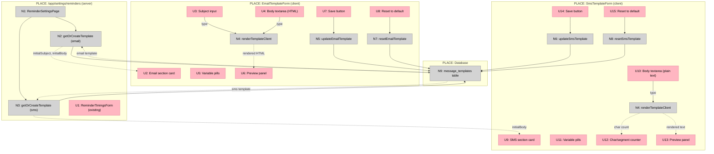
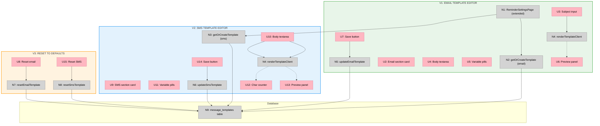

# Email/SMS Template Management — Big Picture

**Selected shape:** A — Inline sections on the reminders page

---

## Frame

### Problem

- Shop owners cannot see what their email and SMS reminders say; templates are seeded from code defaults with no visibility in the app
- There is no way to personalise reminder content — tone, wording, and calls-to-action are all fixed in code
- `/app/settings/reminders` only exposes timing configuration (when to send), not content configuration (what to send)
- Debugging wrong-content reminders requires direct database inspection

### Outcome

- Owners can view and edit email and SMS reminder templates from the reminders settings page
- Template variables (`{{shopName}}`, `{{appointmentTime}}`, etc.) are documented inline so owners cannot accidentally break them
- Live preview with sample data lets owners verify output before saving
- Saved templates are picked up on the next reminder send without disrupting message logs or in-flight dedup

---

## Shape

### Fit Check (R × A)

| Req | Requirement | Status | A |
|-----|-------------|--------|---|
| R0 | Owner can view the current email reminder template (subject + body) | Core goal | ✅ |
| R1 | Owner can view the current SMS reminder template body | Core goal | ✅ |
| R2 | Owner can edit and save the email reminder template (subject + body) | Core goal | ✅ |
| R3 | Owner can edit and save the SMS reminder template body | Core goal | ✅ |
| R4 | Available template variables are shown inline so owners do not accidentally remove them | Must-have | ✅ |
| R5 | Owner can preview the rendered template with sample data before saving | Must-have | ✅ |
| R6 | Saved template is used on the next reminder send | Must-have | ✅ |
| R7 | Saves preserve message_log integrity — existing log rows still reference the correct historical template | Must-have | ✅ |
| R8 | Template UI lives within the reminders page — no new nav item | Must-have | ✅ |
| R9 | Owner can send a test email or SMS to verify rendered output | Nice-to-have — defer to V2 | ✅ |

### Parts

| Part | Mechanism | Flag |
|------|-----------|:----:|
| **A1** | Server component loads both templates via `getOrCreateTemplate` at page load; passes initial values + shop name as props | |
| **A2** | `EmailTemplateForm` client component — subject `<input>` + body `<textarea>`; `useTransition` + server action save; dirty-check guard | |
| **A3** | `SmsTemplateForm` client component — body `<textarea>`; 160-char SMS segment counter; `useTransition` + server action save | |
| **A4** | `updateEmailTemplate` / `updateSmsTemplate` server actions — query max version for key+channel, `INSERT` at `maxVersion + 1`; `revalidatePath` | |
| **A5** | `renderTemplateClient()` — verbatim copy of `renderTemplate` logic inlined in each form; runs on every keystroke; no API call | |
| **A6** | Variable reference pills — read-only `{{token}}` chips with description tooltip; shown beside each editor | |
| **A7** | `resetEmailTemplate` / `resetSmsTemplate` server actions — insert code-default body at `maxVersion + 1` | |

### Breadboard

**Legend:**
- **Pink nodes (U)** = UI affordances
- **Grey nodes (N)** = Code affordances
- **Solid lines** = Wires Out
- **Dashed lines** = Returns To

---

## Slices

|  |  |  |
|:--|:--|:--|
| **V1: EMAIL TEMPLATE EDITOR** ✅ COMPLETE  • Extend reminders page to load email template • `EmailTemplateForm`: subject + body textarea • Variable pills + live HTML preview • `updateEmailTemplate` server action (new version insert)  *Demo: Edit subject, preview updates live, save — cron picks up new template* | **V2: SMS TEMPLATE EDITOR** ✅ COMPLETE  • Extend page load to fetch SMS template • `SmsTemplateForm`: textarea + char/segment counter • Variable pills + live plain-text preview • `updateSmsTemplate` server action  *Demo: Edit SMS body, counter ticks, preview shows rendered text, save* | **V3: RESET TO DEFAULTS** ✅ COMPLETE  • Reset button + inline confirmation on both forms • `resetEmailTemplate` + `resetSmsTemplate` actions • Inserts code default at maxVersion + 1 • &nbsp;  *Demo: Corrupt a template, hit reset, factory default restored* |
