# Email/SMS Template Management — Shaping

**Status:** Shape A selected, breadboarded, ready to slice
**Selected shape:** A — Inline sections on the reminders page

---

## Requirements (R)

| ID | Requirement | Status |
|----|-------------|--------|
| R0 | Owner can view the current email reminder template (subject + body) | Core goal |
| R1 | Owner can view the current SMS reminder template body | Core goal |
| R2 | Owner can edit and save the email reminder template (subject + body) | Core goal |
| R3 | Owner can edit and save the SMS reminder template body | Core goal |
| R4 | Available template variables are shown inline so owners do not accidentally remove them | Must-have |
| R5 | Owner can preview the rendered template with sample data before saving | Must-have |
| R6 | Saved template is used on the next reminder send | Must-have |
| R7 | Saves preserve message_log integrity — existing log rows still reference the correct historical template | Must-have |
| R8 | Template UI lives within the reminders page — no new nav item | Must-have |
| R9 | Owner can send a test email or SMS to verify rendered output | Nice-to-have — defer to slice 2 |

---

## CURRENT

| Part | Mechanism |
|------|-----------|
| **C1** | `/app/settings/reminders` — server page; loads `bookingSettings.reminderTimings` and renders `ReminderTimingsForm` only |
| **C2** | `message_templates` table — `id`, `key`, `version`, `channel`, `subjectTemplate`, `bodyTemplate`; channels: `sms` \| `email` |
| **C3** | `getOrCreateTemplate(key, channel, version, defaults)` — seeds from code defaults on first use; returns existing row on subsequent calls |
| **C4** | `getLatestTemplate(key, channel)` — selects highest version for key+channel; used by send functions at send time |
| **C5** | `renderTemplate(body, data)` — pure `{{variable}}` regex substitution; no I/O, no side effects; safe to inline client-side |
| **C6** | Two active template keys: `appointment_reminder_24h` (email + SMS) and `booking_confirmation` (SMS only) |
| **C7** | Email vars (camelCase): `{{customerName}}`, `{{shopName}}`, `{{appointmentDate}}`, `{{appointmentTime}}`, `{{bookingUrl}}` |
| **C8** | SMS vars (snake_case): `{{shop_name}}`, `{{time}}`, `{{manage_link}}` |
| **C9** | `/api/test-template` — unauthenticated dev GET endpoint; renders email template with mock data, sends via Resend |

---

## Shape A: Inline sections on the reminders page

Extend `/app/settings/reminders` with two new sections below the existing timing form — one for the email template (subject + HTML body) and one for the SMS template (plain-text body). No new route, no new nav item.

| Part | Mechanism |
|------|-----------|
| **A1** | Server component loads both templates via `getOrCreateTemplate` at page load; passes initial values + shop name as props |
| **A2** | `EmailTemplateForm` client component — subject `<input>` + body `<textarea>`; `useTransition` + server action save; dirty-check guard |
| **A3** | `SmsTemplateForm` client component — body `<textarea>`; 160-char SMS segment counter; `useTransition` + server action save |
| **A4** | `updateEmailTemplate` / `updateSmsTemplate` server actions — query max version for key+channel, `INSERT` at `maxVersion + 1`; `revalidatePath` |
| **A5** | `renderTemplateClient()` — verbatim copy of `renderTemplate` logic inlined in each form; runs on every keystroke; no API call |
| **A6** | Variable reference pills — read-only display of available `{{variable}}` tokens with descriptions; shown beside the editor |
| **A7** | `resetEmailTemplate` / `resetSmsTemplate` server actions — insert code-default body at `maxVersion + 1`; same mechanism as A4 |

---

## Fit Check (R × A)

| Req | Requirement | Status | A |
|-----|-------------|--------|---|
| R0 | Owner can view the current email reminder template (subject + body) | Core goal | ✅ |
| R1 | Owner can view the current SMS reminder template body | Core goal | ✅ |
| R2 | Owner can edit and save the email reminder template (subject + body) | Core goal | ✅ |
| R3 | Owner can edit and save the SMS reminder template body | Core goal | ✅ |
| R4 | Available template variables are shown inline so owners do not accidentally remove them | Must-have | ✅ |
| R5 | Owner can preview the rendered template with sample data before saving | Must-have | ✅ |
| R6 | Saved template is used on the next reminder send | Must-have | ✅ |
| R7 | Saves preserve message_log integrity — existing log rows still reference the correct historical template | Must-have | ✅ |
| R8 | Template UI lives within the reminders page — no new nav item | Must-have | ✅ |
| R9 | Owner can send a test email or SMS to verify rendered output | Nice-to-have — defer | ✅ |

**Notes:**
- R7: Satisfied by inserting a new `version` row rather than overwriting. `getLatestTemplate` picks `max(version)` at send time. Old `message_log` rows keep their `templateId` UUID reference intact.
- R6: `getLatestTemplate` (not `getOrCreateTemplate`) is what the send jobs use — it picks the highest version, so a saved row is picked up immediately on the next cron run.
- R9: Deferred. `/api/test-template` exists as a dev escape hatch. Full test-send UI (auth-gated, draft body, send to owner email) is slice 2 scope.

---

## Detail A: Breadboard

### UI Affordances

| ID | Affordance | Place | Wires Out |
|----|------------|-------|-----------|
| U1 | Timing section — existing `ReminderTimingsForm` | Reminders page | (existing, unchanged) |
| U2 | Email section card — section header + layout wrapper | `EmailTemplateForm` | — |
| U3 | Subject `<input>` — single-line text | `EmailTemplateForm` | → N4 (re-render preview) |
| U4 | Body `<textarea>` — multi-line HTML | `EmailTemplateForm` | → N4 (re-render preview) |
| U5 | Variable pills — read-only `{{token}}` chips with description tooltip | `EmailTemplateForm` | — |
| U6 | Preview panel — rendered HTML output with sample data | `EmailTemplateForm` | ← N4 |
| U7 | Save button — disabled when clean or pending | `EmailTemplateForm` | → N5 |
| U8 | Reset to default link | `EmailTemplateForm` | → N7 |
| U9 | SMS section card — section header + layout wrapper | `SmsTemplateForm` | — |
| U10 | Body `<textarea>` — plain-text SMS body | `SmsTemplateForm` | → N4 (re-render preview + counter) |
| U11 | Variable pills — read-only `{{token}}` chips | `SmsTemplateForm` | — |
| U12 | Char/segment counter — `"142 chars · 1 SMS segment"` | `SmsTemplateForm` | ← N4 |
| U13 | Preview panel — rendered plain-text output with sample data | `SmsTemplateForm` | ← N4 |
| U14 | Save button — disabled when clean or pending | `SmsTemplateForm` | → N6 |
| U15 | Reset to default link | `SmsTemplateForm` | → N8 |

### Non-UI Affordances

| ID | Affordance | Place | Wires Out | Returns To |
|----|------------|-------|-----------|------------|
| N1 | `ReminderSettingsPage` server component | `/app/settings/reminders/page.tsx` | → N2, N3 | — |
| N2 | `getOrCreateTemplate("appointment_reminder_24h", "email", 1, defaults)` | `src/lib/messages.ts` | → N9 (query/insert) | N1 |
| N3 | `getOrCreateTemplate("appointment_reminder_24h", "sms", 1, defaults)` | `src/lib/messages.ts` | → N9 (query/insert) | N1 |
| N4 | `renderTemplateClient(body, sampleData)` — inlined pure fn | `EmailTemplateForm` / `SmsTemplateForm` | — | U6, U12, U13 |
| N5 | `updateEmailTemplate(subject, body)` server action | `reminders/actions.ts` | → N9 (INSERT new version) | U7 |
| N6 | `updateSmsTemplate(body)` server action | `reminders/actions.ts` | → N9 (INSERT new version) | U14 |
| N7 | `resetEmailTemplate()` server action | `reminders/actions.ts` | → N9 (INSERT default at maxVersion+1) | U8 |
| N8 | `resetSmsTemplate()` server action | `reminders/actions.ts` | → N9 (INSERT default at maxVersion+1) | U15 |
| N9 | `message_templates` table | Database | — | N2, N3, N5, N6, N7, N8 |

### Sample Data (passed server → client as props)

Email sample: `{ customerName: "Alex Johnson", shopName: shop.name, appointmentDate: "Wednesday, May 1, 2026", appointmentTime: "2:00 PM – 3:00 PM", bookingUrl: "https://example.com/manage/preview" }`

SMS sample: `{ shop_name: shop.name, time: "5/1/26, 2:00 PM", manage_link: "Manage: https://example.com/manage/preview " }`

`shop.name` is injected server-side so the preview reflects the real shop name.

### Wiring Diagram

```mermaid
flowchart TB
    subgraph remindersPage["PLACE: /app/settings/reminders (server)"]
        N1["N1: ReminderSettingsPage"]
        N2["N2: getOrCreateTemplate (email)"]
        N3["N3: getOrCreateTemplate (sms)"]
        U1["U1: ReminderTimingsForm (existing)"]
    end

    subgraph emailForm["PLACE: EmailTemplateForm (client)"]
        U2["U2: Email section card"]
        U3["U3: Subject input"]
        U4["U4: Body textarea (HTML)"]
        U5["U5: Variable pills"]
        U6["U6: Preview panel"]
        U7["U7: Save button"]
        U8["U8: Reset to default"]
        N4e["N4: renderTemplateClient"]
    end

    subgraph smsForm["PLACE: SmsTemplateForm (client)"]
        U9["U9: SMS section card"]
        U10["U10: Body textarea (plain text)"]
        U11["U11: Variable pills"]
        U12["U12: Char/segment counter"]
        U13["U13: Preview panel"]
        U14["U14: Save button"]
        U15["U15: Reset to default"]
        N4s["N4: renderTemplateClient"]
    end

    subgraph actions["PLACE: Server Actions (reminders/actions.ts)"]
        N5["N5: updateEmailTemplate"]
        N6["N6: updateSmsTemplate"]
        N7["N7: resetEmailTemplate"]
        N8["N8: resetSmsTemplate"]
    end

    subgraph db["PLACE: Database"]
        N9["N9: message_templates table"]
    end

    %% Page load
    N1 --> N2
    N1 --> N3
    N2 --> N9
    N3 --> N9
    N9 -.->|template rows| N2
    N9 -.->|template rows| N3
    N2 -.->|initialSubject, initialBody| U2
    N3 -.->|initialBody| U9

    %% Email editing
    U3 -->|type| N4e
    U4 -->|type| N4e
    N4e -.->|rendered HTML| U6
    U7 -->|save| N5
    U8 -->|reset| N7
    N5 --> N9
    N7 --> N9

    %% SMS editing
    U10 -->|type| N4s
    N4s -.->|rendered text| U13
    N4s -.->|char count| U12
    U14 -->|save| N6
    U15 -->|reset| N8
    N6 --> N9
    N8 --> N9

    %% Styling
    classDef ui fill:#ffb6c1,stroke:#d87093,color:#000
    classDef nonui fill:#d3d3d3,stroke:#808080,color:#000
    class U1,U2,U3,U4,U5,U6,U7,U8,U9,U10,U11,U12,U13,U14,U15 ui
    class N1,N2,N3,N4e,N4s,N5,N6,N7,N8,N9 nonui
```

**Legend:**
- **Pink nodes (U)** = UI affordances (things users see/interact with)
- **Grey nodes (N)** = Code affordances (data stores, handlers, services)
- **Solid lines** = Wires Out (calls, triggers, writes)
- **Dashed lines** = Returns To (return values, data reads)
