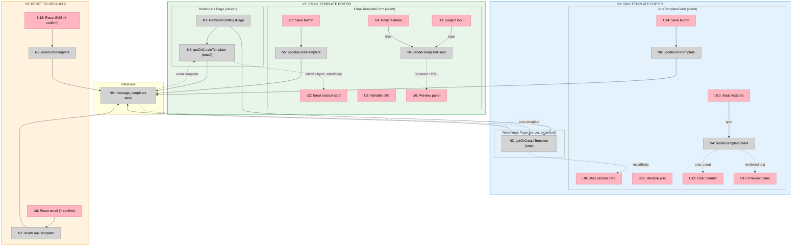

# Email/SMS Template Management — Slices

**Shape:** A — Inline sections on the reminders page
**Status:** Sliced, ready to plan

---

## Slice Definitions

### V1 — Email template editor

Everything needed to view, edit, preview, and save the email reminder template.

**Affordances in this slice:**

| ID | Affordance | Type |
|----|------------|------|
| N1 | `ReminderSettingsPage` extended to load email template via `getOrCreateTemplate` | Non-UI |
| N2 | `getOrCreateTemplate("appointment_reminder_24h", "email", 1, defaults)` | Non-UI |
| N9 | `message_templates` table (read + write) | Non-UI |
| N5 | `updateEmailTemplate(subject, body)` server action — queries max version, inserts at `maxVersion + 1`, `revalidatePath` | Non-UI |
| N4 | `renderTemplateClient(body, sampleData)` — inlined pure fn in `EmailTemplateForm` | Non-UI |
| U2 | Email section card below `ReminderTimingsForm` | UI |
| U3 | Subject `<input>` | UI |
| U4 | Body `<textarea>` (HTML) | UI |
| U5 | Variable pills — `{{customerName}}`, `{{shopName}}`, `{{appointmentDate}}`, `{{appointmentTime}}`, `{{bookingUrl}}` | UI |
| U6 | Preview panel — live-rendered HTML with sample data | UI |
| U7 | Save button — `useTransition`, dirty-check guard, "Saved" feedback | UI |

**Wiring (this slice only):**
```
N1 (page load) → N2 → N9 → initial values passed to EmailTemplateForm
U3 / U4 (type) → N4 → U6 (preview re-renders)
U7 (save) → N5 → N9 (INSERT new version row)
```

**Demo:** Owner opens `/app/settings/reminders`, scrolls below timing section, sees email template with subject and body pre-loaded. Edits subject line, preview updates instantly. Clicks Save — next cron job picks up the new template.

---

### V2 — SMS template editor

Everything needed to view, edit, preview, and save the SMS reminder template. Includes char/segment counter.

**Affordances in this slice:**

| ID | Affordance | Type |
|----|------------|------|
| N3 | `getOrCreateTemplate("appointment_reminder_24h", "sms", 1, defaults)` | Non-UI |
| N6 | `updateSmsTemplate(body)` server action — same version-insert mechanism as N5 | Non-UI |
| N4 | `renderTemplateClient` inlined in `SmsTemplateForm` | Non-UI |
| U9 | SMS section card below email section | UI |
| U10 | Body `<textarea>` (plain text) | UI |
| U11 | Variable pills — `{{shop_name}}`, `{{time}}`, `{{manage_link}}` | UI |
| U12 | Char/segment counter — `"142 chars · 1 SMS segment"` (segments = `Math.ceil(chars / 160)`) | UI |
| U13 | Preview panel — rendered plain text | UI |
| U14 | Save button — same pattern as U7 | UI |

**Wiring (this slice only):**
```
N1 (page load, extended) → N3 → N9 → initial body passed to SmsTemplateForm
U10 (type) → N4 → U13 (preview), U12 (counter)
U14 (save) → N6 → N9 (INSERT new version row)
```

**Demo:** Owner scrolls further, sees SMS template. Edits body — char counter ticks up in real time, preview shows rendered text with `{{shop_name}}` replaced by the real shop name. Clicks Save.

---

### V3 — Reset to defaults

Adds reset-to-default to both forms. Safety net if an owner corrupts a template.

**Affordances in this slice:**

| ID | Affordance | Type |
|----|------------|------|
| N7 | `resetEmailTemplate()` server action — inserts code-default subject + body at `maxVersion + 1` | Non-UI |
| N8 | `resetSmsTemplate()` server action — inserts code-default body at `maxVersion + 1` | Non-UI |
| U8 | "Reset to default" link on `EmailTemplateForm` — confirmation dialog before action | UI |
| U15 | "Reset to default" link on `SmsTemplateForm` — same pattern | UI |

**Wiring (this slice only):**
```
U8 (confirm reset) → N7 → N9 (INSERT default at maxVersion+1)
U15 (confirm reset) → N8 → N9 (INSERT default at maxVersion+1)
```

**Demo:** Owner accidentally deletes `{{bookingUrl}}` from the email body, saves. Opens reset dialog, confirms. Template reverts to factory default. Next send uses the restored template.

---

## Sliced Breadboard



**Legend:**
- **Pink nodes (U)** = UI affordances
- **Grey nodes (N)** = Code affordances
- **Solid lines** = Wires Out
- **Dashed lines** = Returns To

---

## Slices Grid

|  |  |  |
|:--|:--|:--|
| **V1: EMAIL TEMPLATE EDITOR**<br>✅ COMPLETE<br><br>• Extend reminders page to load email template<br>• `EmailTemplateForm`: subject + body textarea<br>• Variable pills + live HTML preview<br>• `updateEmailTemplate` server action (new version insert)<br><br>*Demo: Edit subject, preview updates live, save — cron picks up new template* | **V2: SMS TEMPLATE EDITOR**<br>✅ COMPLETE<br><br>• Extend page load to fetch SMS template<br>• `SmsTemplateForm`: textarea + char/segment counter<br>• Variable pills + live plain-text preview<br>• `updateSmsTemplate` server action<br><br>*Demo: Edit SMS body, counter ticks, preview shows rendered text, save* | **V3: RESET TO DEFAULTS**<br>✅ COMPLETE<br><br>• Reset button + inline confirmation on both forms<br>• `resetEmailTemplate` + `resetSmsTemplate` actions<br>• Inserts code default at maxVersion + 1<br>• &nbsp;<br><br>*Demo: Corrupt a template, hit reset, factory default restored* |
