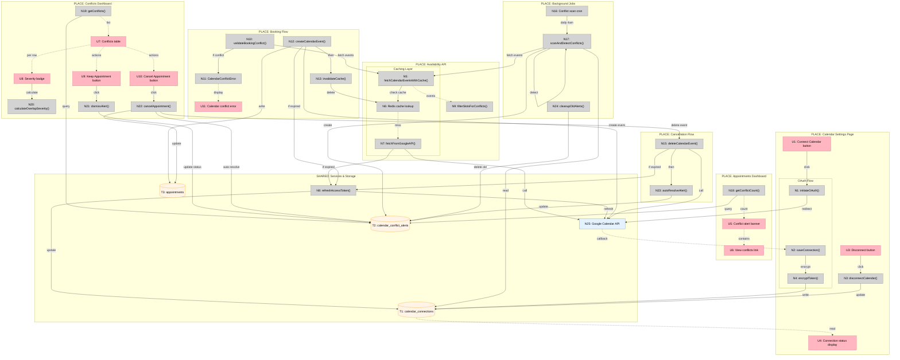

# Google Calendar Integration — Shaping

## Frame

### Problem
- Shop owners manage availability manually in the booking system, separate from their personal calendar
- Double-booking risk: customers can book slots that conflict with shop owner's existing calendar events
- No automatic calendar blocking: when a booking is made, shop owners must manually add it to their Google Calendar to track their schedule
- Manual sync overhead: cancellations and updates in the booking system require manual calendar updates

### Outcome
- Shop owners connect a single Google Calendar once via OAuth
- New bookings automatically appear in that Google Calendar as events
- Slots that conflict with existing calendar events are blocked from customer booking
- System alerts shop owners to conflicts between existing appointments and calendar events
- Dashboard remains the source of truth for all booking updates

---

## Requirements (R)

| ID | Requirement | Status |
|----|-------------|--------|
| **R0** | Shop owners can authenticate with Google via OAuth and select which calendar to sync to | Core goal |
| **R1** | New bookings create calendar events automatically (one-way: booking system → calendar) | Must-have |
| **R2** | When checking availability, system fetches calendar events and excludes conflicting slots | Must-have |
| **R3** | During new booking creation, system prevents double-booking by checking calendar conflicts | Must-have |
| **R4** | System scans existing appointments and warns shop owners about calendar conflicts | Must-have |
| **R5** | Booking cancellations delete the corresponding calendar event | Must-have |
| **R6** | Only future bookings (from connection point forward) are synced, not historical bookings | Must-have |
| **R7** | OAuth token refresh handles expired credentials without manual re-authentication | Must-have |
| **R8** | Booking updates (reschedules) update the calendar event to the new time | Must-have |
| **R9** | All-day events in Google Calendar block the entire day's availability | Must-have |
| **R10** | Calendar sync failures (event creation/update/delete) fail the booking operation | Must-have |
| **R11** | Shop owners can disconnect calendar integration and stop syncing | Nice-to-have |

---

## CURRENT: Existing System

| Part | Mechanism | Location |
|------|-----------|----------|
| **CURRENT-1** | **Booking creation** | |
| CURRENT-1.1 | POST `/api/bookings/create` → `createAppointment()` | `src/app/api/bookings/create/route.ts:34`, `src/lib/queries/appointments.ts:479` |
| CURRENT-1.2 | Creates appointment + payment + policy version snapshot | `src/lib/queries/appointments.ts:628-671` |
| CURRENT-1.3 | Returns appointment details + Stripe client secret | `src/app/api/bookings/create/route.ts:95-127` |
| **CURRENT-2** | **Availability calculation** | |
| CURRENT-2.1 | GET `/api/availability?shop={slug}&date={date}` | `src/app/api/availability/route.ts:10` |
| CURRENT-2.2 | `getAvailabilityForDate()` generates slots based on shop hours | `src/lib/queries/appointments.ts:122-195` |
| CURRENT-2.3 | Filters out slots with existing appointments (status=booked/pending) | `src/lib/queries/appointments.ts:166-194` |
| CURRENT-2.4 | Returns available slots array | `src/app/api/availability/route.ts:35-43` |
| **CURRENT-3** | **Cancellation** | |
| CURRENT-3.1 | POST `/api/manage/[token]/cancel` → validate token | `src/app/api/manage/[token]/cancel/route.ts:24-32` |
| CURRENT-3.2 | `calculateCancellationEligibility()` checks refund eligibility | `src/app/api/manage/[token]/cancel/route.ts:65-72` |
| CURRENT-3.3 | If eligible: `processRefund()` + update appointment/payment | `src/app/api/manage/[token]/cancel/route.ts:74-96` |
| CURRENT-3.4 | If not eligible: mark cancelled + settled | `src/app/api/manage/[token]/cancel/route.ts:99-165` |
| **CURRENT-4** | **Database schema** | |
| CURRENT-4.1 | `shops` table with owner_user_id | `src/lib/schema.ts:165-189` |
| CURRENT-4.2 | `appointments` table with startsAt, endsAt, status | `src/lib/schema.ts:401-471` |
| CURRENT-4.3 | `payments` table with Stripe payment intent | `src/lib/schema.ts:503-540` |
| CURRENT-4.4 | `user` table from BetterAuth | `src/lib/schema.ts:20-35` |
| **CURRENT-5** | **Infrastructure** | |
| CURRENT-5.1 | Upstash Redis with `getRedisClient()`, locks, cooldowns with TTL | `src/lib/redis.ts` |
| CURRENT-5.2 | Vercel Cron Jobs in `vercel.json` with CRON_SECRET auth + PostgreSQL advisory locks | `vercel.json`, `src/app/api/jobs/*` |
| CURRENT-5.3 | `GOOGLE_CLIENT_ID` and `GOOGLE_CLIENT_SECRET` defined (optional, for social login) | `src/lib/env.ts:17-18` |

---

## Shape Options

### A: Event Sync Only (No Conflict Detection)

One-way sync without conflict detection in availability API.

| Part | Mechanism |
|------|-----------|
| **A1** | **OAuth flow + token storage** |
| A1.1 | OAuth route: `/api/settings/calendar/connect` → redirect to Google OAuth consent |
| A1.2 | Callback route: `/api/settings/calendar/callback` → exchange code for access/refresh tokens |
| A1.3 | New table: `calendar_connections` (shopId, provider="google", calendarId, accessToken encrypted, refreshToken encrypted, expiresAt) |
| A1.4 | Settings UI: "Connect Google Calendar" button |
| **A2** | **Create calendar events on booking** |
| A2.1 | Modify `createAppointment()` to call `createCalendarEvent()` after appointment created |
| A2.2 | New module: `src/lib/google-calendar.ts` with `createCalendarEvent(connection, appointment)` |
| A2.3 | Store Google event ID on appointment: add `calendarEventId` column to appointments table |
| A2.4 | Handle token refresh in `google-calendar.ts` if access token expired |
| **A3** | **Update calendar events on reschedule** |
| A3.1 | New API route: `/api/appointments/[id]/reschedule` |
| A3.2 | Update appointment + call `updateCalendarEvent(connection, appointment, newStartsAt)` |
| A3.3 | Use Google Calendar API `events.update()` |
| **A4** | **Delete calendar events on cancellation** |
| A4.1 | Modify `/api/manage/[token]/cancel` to call `deleteCalendarEvent()` before refund |
| A4.2 | Use Google Calendar API `events.delete()` |
| A4.3 | Graceful handling: if delete fails, log warning but continue cancellation |
| **A5** | **Manual conflict warning (UI only)** |
| A5.1 | Dashboard UI: "Check calendar conflicts" button |
| A5.2 | Fetches calendar events for shop's upcoming appointments |
| A5.3 | Displays warning badges on conflicting appointments |

**Fails:**
- R2 (availability API doesn't check calendar conflicts)
- R3 (no conflict prevention during booking)
- R9 (all-day events don't block slots)

---

### B: Full Conflict Detection (Requirements Match)

One-way sync with real-time conflict detection in availability API.

| Part | Mechanism |
|------|-----------|
| **B1** | **OAuth flow + token storage** |
| B1.1 | OAuth route: `/api/settings/calendar/connect` → redirect to Google OAuth consent with calendar.readonly + calendar.events scopes |
| B1.2 | Callback route: `/api/settings/calendar/callback` → exchange authorization code for access/refresh tokens |
| B1.3 | New table: `calendar_connections` (shopId, provider="google", calendarId, accessTokenEncrypted, refreshTokenEncrypted, expiresAt, connectedAt) |
| B1.4 | Settings UI: `/app/settings/calendar` page with "Connect Google Calendar" button + calendar selection dropdown |
| B1.5 | Store tokens encrypted using `crypto.createCipheriv()` with secret from env |
| **B2** | **Create calendar events on booking** |
| B2.1 | Modify `createAppointment()` in transaction to call `createCalendarEvent()` after appointment insert, before commit |
| B2.2 | New module: `src/lib/google-calendar.ts` with `createCalendarEvent(connection, appointment)` → Google Calendar API `events.insert()` |
| B2.3 | Add `calendarEventId` column (text, nullable) to appointments table |
| B2.4 | Token refresh: check `expiresAt` before API call, refresh if expired using `refreshTokenEncrypted` |
| B2.5 | If calendar event creation fails → rollback transaction, throw error, fail booking (R10) |
| B2.6 | After successful creation: call `invalidateCalendarCache(shopId, dateStr)` |
| **B3** | **Conflict detection in availability API** |
| B3.1 | Modify `getAvailabilityForDate()` to call `fetchCalendarEventsWithCache(connection, shopId, dateStr)` |
| B3.2 | New function: `fetchCalendarEventsWithCache()` checks Redis cache first (key: `calendar_events:{shopId}:{date}`) |
| B3.3 | Cache hit: return cached events | Cache miss/Redis unavailable: fetch from Google Calendar API |
| B3.4 | Fetch from API: `calendar.events.list()` with timeMin/timeMax for day range in shop timezone |
| B3.5 | Transform events to minimal structure: `{id, start, end, isAllDay}`, cache with 180s TTL |
| B3.6 | Filter slots: exclude any slot where `(slot.startsAt < event.end) && (slot.endsAt > event.start)` |
| B3.7 | Handle all-day events: if `event.isAllDay === true`, exclude ALL slots for that date (R9) |
| B3.8 | Return filtered slots array |
| **B4** | **Conflict validation during booking** |
| B4.1 | In `createAppointment()` before creating appointment: fetch calendar events for appointment date |
| B4.2 | Check if `(appointment.startsAt < event.end) && (appointment.endsAt > event.start)` for any event |
| B4.3 | If conflict detected: throw `CalendarConflictError` with event details |
| B4.4 | Booking API catches error, returns 409 Conflict: `{error: "Calendar conflict", conflictingEvent: {...}}` |
| **B5** | **Update calendar events on reschedule** |
| B5.1 | New API route: `/api/appointments/[id]/reschedule` (POST with `{newStartsAt: ISO string}`) |
| B5.2 | Validate new time against calendar conflicts using same logic as B4 |
| B5.3 | Update appointment + call `updateCalendarEvent(connection, calendarEventId, newStartsAt, newEndsAt)` in transaction |
| B5.4 | Use Google Calendar API `events.patch()` to update start/end times |
| B5.5 | If update fails → rollback transaction, return error (R10) |
| B5.6 | After successful update: invalidate cache for old date AND new date |
| **B6** | **Delete calendar events on cancellation** |
| B6.1 | Modify `/api/manage/[token]/cancel` to call `deleteCalendarEvent(connection, calendarEventId)` in transaction |
| B6.2 | Use Google Calendar API `events.delete()` |
| B6.3 | If delete fails → log error but allow cancellation to proceed (graceful degradation, not critical path) |
| B6.4 | After cancellation: call `invalidateCalendarCache(shopId, dateStr)` |
| **B7** | **Conflict scanning for existing appointments** |
| B7.1 | New cron job: `/api/jobs/scan-calendar-conflicts` runs daily at 4:00 AM UTC (`0 4 * * *`) |
| B7.2 | Vercel cron config in `vercel.json`, uses CRON_SECRET auth + PostgreSQL advisory lock (lockId: 482180) |
| B7.3 | Query shops with calendar connections, then for each shop: query booked appointments in next 30 days |
| B7.4 | Fetch calendar events for date range covering all appointments (min start → max end) |
| B7.5 | Detect conflicts: any overlap between appointment and event using same logic as B3 |
| B7.6 | For each conflict: check if alert already exists (unique: `appointmentId + calendarEventId + status='pending'`) |
| B7.7 | If no existing alert: insert into `calendar_conflict_alerts` with event snapshot (summary, start, end, isAllDay) |
| B7.8 | Auto-resolve past appointments: mark alerts as `status='auto_resolved'` where `appointment.endsAt < now()` |
| B7.9 | Cleanup: delete resolved alerts older than 30 days |
| **B7-UI** | **Conflict alerts dashboard** |
| B7-UI.1 | Alert banner on `/app/appointments` page: shows count of pending conflicts with link to `/app/conflicts` |
| B7-UI.2 | New page: `/app/conflicts` with table of pending alerts (columns: time, customer, conflicting event, severity badge, actions) |
| B7-UI.3 | Severity badges: Full (100% overlap, red), High (50-99%, orange), Partial (<50%, yellow), All-Day (purple) |
| B7-UI.4 | Actions per alert: "Keep Appointment" (dismiss) or "Cancel Appointment" (trigger cancel flow) |
| B7-UI.5 | Dismiss action: update alert `status='dismissed'`, `resolutionAction='dismissed'`, `resolvedAt=now` |
| B7-UI.6 | Cancel action: call cancel API → on success, auto-resolve alert with `resolutionAction='appointment_cancelled'` |
| **B8** | **Disconnect calendar** |
| B8.1 | Settings UI: "Disconnect Google Calendar" button on `/app/settings/calendar` |
| B8.2 | API route: `/api/settings/calendar/disconnect` → soft delete connection (set `disconnectedAt = now`) |
| B8.3 | Stop syncing future bookings (don't call `createCalendarEvent()` if connection disconnected) |
| B8.4 | Existing calendar events remain in Google Calendar (manual cleanup by shop owner) |

---

### C: Deferred Conflict Detection (Async)

One-way sync with eventual consistency on conflict detection.

| Part | Mechanism |
|------|-----------|
| **C1** | **OAuth flow + token storage** |
| C1.1 | OAuth route: `/api/settings/calendar/connect` → redirect to Google OAuth consent |
| C1.2 | Callback route: `/api/settings/calendar/callback` → exchange code for tokens |
| C1.3 | New table: `calendar_connections` (shopId, provider, calendarId, tokens encrypted) |
| **C2** | **Create calendar events on booking** |
| C2.1 | Modify `createAppointment()` to enqueue calendar sync job (background) |
| C2.2 | Background worker processes queue and creates calendar events |
| C2.3 | Retry logic for failed calendar event creation |
| **C3** | **Background conflict detection** |
| C3.1 | Cron job runs every 15 minutes: fetches calendar events |
| C3.2 | Compares against booked appointments |
| C3.3 | Creates conflict alerts in dashboard |
| **C4** | **No real-time blocking** |
| C4.1 | Availability API does NOT check calendar (performance optimization) |
| C4.2 | Conflicts detected asynchronously, user warned in dashboard |

**Fails:**
- R2 (no real-time conflict blocking in availability)
- R3 (no conflict prevention during booking)
- R10 (calendar sync is async, booking succeeds even if sync fails)

---

## Fit Check

| Req | Requirement | Status | A | B | C |
|-----|-------------|--------|---|---|---|
| R0 | Shop owners can authenticate with Google via OAuth and select which calendar to sync to | Core goal | ✅ | ✅ | ✅ |
| R1 | New bookings create calendar events automatically (one-way: booking system → calendar) | Must-have | ✅ | ✅ | ✅ |
| R2 | When checking availability, system fetches calendar events and excludes conflicting slots | Must-have | ❌ | ✅ | ❌ |
| R3 | During new booking creation, system prevents double-booking by checking calendar conflicts | Must-have | ❌ | ✅ | ❌ |
| R4 | System scans existing appointments and warns shop owners about calendar conflicts | Must-have | ✅ | ✅ | ✅ |
| R5 | Booking cancellations delete the corresponding calendar event | Must-have | ✅ | ✅ | ✅ |
| R6 | Only future bookings (from connection point forward) are synced, not historical bookings | Must-have | ✅ | ✅ | ✅ |
| R7 | OAuth token refresh handles expired credentials without manual re-authentication | Must-have | ✅ | ✅ | ✅ |
| R8 | Booking updates (reschedules) update the calendar event to the new time | Must-have | ✅ | ✅ | ✅ |
| R9 | All-day events in Google Calendar block the entire day's availability | Must-have | ❌ | ✅ | ❌ |
| R10 | Calendar sync failures (event creation/update/delete) fail the booking operation | Must-have | ✅ | ✅ | ❌ |
| R11 | Shop owners can disconnect calendar integration and stop syncing | Nice-to-have | ✅ | ✅ | ✅ |

**Notes:**
- A fails R2, R3, R9: No conflict detection in availability API; all-day events not handled
- C fails R2, R3, R10: Async design means no real-time blocking; calendar sync can fail without blocking booking
- **B passes all requirements** ✅

---

## Selected Shape: B (Full Conflict Detection)

Shape B is the only option that satisfies all must-have requirements. It provides:
- Real-time conflict detection in availability API
- Conflict validation during booking creation
- Synchronous calendar event creation (fails booking if calendar sync fails)
- All-day event support

All design unknowns have been resolved through spikes. Implementation is ready.

---

## Spike Findings Summary

Two spikes were conducted to resolve flagged unknowns in Shape B:

### Spike 1: Calendar Event Caching (B3.5)

**Document:** `docs/shaping/spike-calendar-caching.md`

**Decisions:**

1. **Infrastructure:** Use existing Upstash Redis (no new setup required)

2. **Cache Key:** `calendar_events:{shopId}:{date}` (per-day granularity)
   - Example: `calendar_events:550e8400-e29b-41d4-a716-446655440000:2024-03-15`

3. **TTL:** 180 seconds (3 minutes)
   - Balances freshness vs API rate limits
   - ~90% reduction in Google Calendar API calls

4. **Invalidation Rules:**
   - Invalidate on our writes: create/update/delete calendar events
   - External changes (Google Calendar UI): rely on TTL expiration

5. **Fallback:** Graceful degradation
   - Redis unavailable → fetch from Google Calendar API directly
   - Google Calendar API unavailable → return error (can't validate conflicts)

6. **Data Structure:**
```typescript
interface CachedCalendarEvent {
  id: string;           // Event ID
  start: string;        // ISO 8601 datetime
  end: string;          // ISO 8601 datetime
  isAllDay: boolean;    // True = blocks entire day (R9)
}
```

**Implementation:**
- Module: `src/lib/google-calendar-cache.ts`
- Functions: `fetchCalendarEventsWithCache()`, `invalidateCalendarCache()`

---

### Spike 2: Conflict Scanning Job (B7)

**Document:** `docs/shaping/spike-conflict-scanning.md`

**Decisions:**

1. **Cron Schedule:** Daily at 4:00 AM UTC (`0 4 * * *`)
   - Follows existing Vercel cron pattern
   - Uses CRON_SECRET auth + PostgreSQL advisory lock

2. **Query Strategy:** Appointments-first
   - Fetch shops with calendar connections
   - For each shop: query upcoming booked appointments (next 30 days)
   - Fetch calendar events for appointment date range
   - Detect conflicts, create alerts

3. **Database Schema:** `calendar_conflict_alerts` table
```typescript
{
  id: uuid,
  shopId: uuid,
  appointmentId: uuid,
  calendarEventId: text,
  calendarEventSummary: text,        // Snapshot
  calendarEventStart: timestamp,     // Snapshot
  calendarEventEnd: timestamp,       // Snapshot
  isAllDayEvent: boolean,
  status: 'pending' | 'dismissed' | 'auto_resolved',
  resolutionAction: 'dismissed' | 'appointment_cancelled' | 'appointment_ended' | null,
  detectedAt: timestamp,
  resolvedAt: timestamp,
}
```
   - Unique constraint: `(appointmentId, calendarEventId, status)`

4. **Dashboard UI:**
   - Primary: Alert banner on `/app/appointments` page
   - Secondary: Dedicated `/app/conflicts` page with table view
   - Severity badges: Full (red), High (orange), Partial (yellow), All-Day (purple)

5. **Shop Owner Actions:**
   - "Keep Appointment" → Dismiss alert (`status='dismissed'`)
   - "Cancel Appointment" → Trigger cancel flow → Auto-resolve alert

6. **Alert Lifecycle:**
   - Created: When conflict detected by cron job
   - Resolved: Manual dismiss OR auto (appointment cancelled/ended)
   - Deleted: 30 days after resolution (cleanup old alerts)

7. **Severity Calculation:**
```typescript
overlapPercent = (overlap duration / appointment duration) × 100
full: >= 100%
high: 50-99%
partial: < 50%
```

**Implementation:**
- Cron job: `src/app/api/jobs/scan-calendar-conflicts/route.ts`
- UI: `src/app/app/conflicts/page.tsx`
- Schema: Add to `src/lib/schema.ts`

---

## Breadboard: Shape B

### UI Affordances

| ID | Affordance | Place | Wires Out | Returns To |
|----|------------|-------|-----------|------------|
| **U1** | "Connect Google Calendar" button | Calendar Settings Page | N1 (initiateOAuth) | - |
| **U2** | Calendar selection dropdown | OAuth Callback Page | N2 (saveConnection) | - |
| **U3** | "Disconnect" button | Calendar Settings Page | N3 (disconnectCalendar) | - |
| **U4** | Connection status display | Calendar Settings Page | - | N1 (connection data) |
| **U5** | Conflict alert banner | Appointments Dashboard | N18 (getConflictCount) | N18 (count) |
| **U6** | "View conflicts →" link | Appointments Dashboard | - | - |
| **U7** | Conflicts table | Conflicts Dashboard | N19 (getConflicts) | N19 (conflicts list) |
| **U8** | Severity badge (Full/High/Partial/All-Day) | Conflicts Dashboard | - | N20 (calculateSeverity) |
| **U9** | "Keep Appointment" button | Conflicts Dashboard | N21 (dismissAlert) | - |
| **U10** | "Cancel Appointment" button | Conflicts Dashboard | N22 (cancelAppointment) | - |
| **U11** | Error message: "Calendar conflict" | Booking Page | - | N11 (conflict error) |

---

### Non-UI Affordances

| ID | Affordance | Type | Place | Wires Out | Returns To |
|----|------------|------|-------|-----------|------------|
| **N1** | `initiateOAuth()` | Handler | Calendar Settings | N25 (Google OAuth) | - |
| **N2** | `saveConnection()` | Handler | OAuth Callback | T1, N4 | - |
| **N3** | `disconnectCalendar()` | Handler | Calendar Settings | T1 | - |
| **N4** | `encryptToken()` | Service | OAuth Callback | - | - |
| **N5** | `fetchCalendarEventsWithCache()` | Service | Availability API | N6, N7 | - |
| **N6** | Redis cache lookup | Cache | Availability API | - | N5 |
| **N7** | `fetchFromGoogleAPI()` | Service | Availability API | N25, N8 | N5 |
| **N8** | `refreshAccessToken()` | Service | Calendar API Wrapper | N25, T1 | N7 |
| **N9** | `filterSlotsForConflicts()` | Logic | Availability API | - | - |
| **N10** | `validateBookingConflict()` | Logic | Booking Flow | N5 | - |
| **N11** | `CalendarConflictError` | Exception | Booking Flow | - | U11 |
| **N12** | `createCalendarEvent()` | Service | Booking Flow | N25, N8 | - |
| **N13** | `invalidateCache()` | Service | Booking Flow | N6 | - |
| **N14** | `updateCalendarEvent()` | Service | Reschedule Flow | N25, N8 | - |
| **N15** | `deleteCalendarEvent()` | Service | Cancellation Flow | N25, N8 | - |
| **N16** | Conflict scan cron job | Job | Background | N17, T2 | - |
| **N17** | `scanAndDetectConflicts()` | Logic | Background | N5, T1, T2 | - |
| **N18** | `getConflictCount()` | Query | Conflicts Dashboard | T2 | U5 |
| **N19** | `getConflicts()` | Query | Conflicts Dashboard | T2 | U7 |
| **N20** | `calculateOverlapSeverity()` | Logic | Conflicts Dashboard | - | U8 |
| **N21** | `dismissAlert()` | Handler | Conflicts Dashboard | T2 | - |
| **N22** | `cancelAppointment()` | Handler | Conflicts Dashboard | N15, T2, T3 | - |
| **N23** | `autoResolveAlert()` | Logic | Cancellation Flow | T2 | - |
| **N24** | `cleanupOldAlerts()` | Job | Background | T2 | - |
| **N25** | Google Calendar API | External | - | - | N7, N8, N12, N14, N15 |

---

### Data Stores (Tables)

| ID | Table | Columns | Accessed By |
|----|-------|---------|-------------|
| **T1** | `calendar_connections` | shopId, provider, calendarId, accessTokenEncrypted, refreshTokenEncrypted, expiresAt, connectedAt, disconnectedAt | N2, N3, N8, N17 |
| **T2** | `calendar_conflict_alerts` | id, shopId, appointmentId, calendarEventId, calendarEventSummary, calendarEventStart, calendarEventEnd, isAllDayEvent, status, resolutionAction, detectedAt, resolvedAt | N16, N17, N18, N19, N21, N22, N23, N24 |
| **T3** | `appointments` (updated) | ..., calendarEventId | N12, N22 |

---

### Wiring Diagram



**Legend:**
- **Pink nodes (U)** = UI affordances (things users see/interact with)
- **Grey nodes (N)** = Code affordances (handlers, services, logic)
- **Orange cylinders (T)** = Data stores (database tables)
- **Blue nodes (N25)** = External services
- **Solid lines** = Wires Out (calls, triggers, writes)
- **Dashed lines** = Returns To (return values, data reads)

---

## Database Schema Changes

New tables required:

### 1. calendar_connections
```sql
CREATE TABLE calendar_connections (
  id UUID PRIMARY KEY DEFAULT gen_random_uuid(),
  shop_id UUID NOT NULL REFERENCES shops(id) ON DELETE CASCADE,
  provider TEXT NOT NULL CHECK (provider = 'google'),
  calendar_id TEXT NOT NULL,
  access_token_encrypted TEXT NOT NULL,
  refresh_token_encrypted TEXT NOT NULL,
  expires_at TIMESTAMPTZ NOT NULL,
  connected_at TIMESTAMPTZ NOT NULL DEFAULT now(),
  disconnected_at TIMESTAMPTZ,
  created_at TIMESTAMPTZ NOT NULL DEFAULT now(),
  updated_at TIMESTAMPTZ NOT NULL DEFAULT now(),
  UNIQUE(shop_id, provider)
);
CREATE INDEX calendar_connections_shop_id_idx ON calendar_connections(shop_id);
```

### 2. appointments table update
```sql
ALTER TABLE appointments
  ADD COLUMN calendar_event_id TEXT;
CREATE INDEX appointments_calendar_event_id_idx ON appointments(calendar_event_id);
```

### 3. calendar_conflict_alerts
```sql
CREATE TABLE calendar_conflict_alerts (
  id UUID PRIMARY KEY DEFAULT gen_random_uuid(),
  shop_id UUID NOT NULL REFERENCES shops(id) ON DELETE CASCADE,
  appointment_id UUID NOT NULL REFERENCES appointments(id) ON DELETE CASCADE,
  calendar_event_id TEXT NOT NULL,
  calendar_event_summary TEXT,
  calendar_event_start TIMESTAMPTZ NOT NULL,
  calendar_event_end TIMESTAMPTZ NOT NULL,
  is_all_day_event BOOLEAN NOT NULL DEFAULT false,
  status TEXT NOT NULL DEFAULT 'pending' CHECK (status IN ('pending', 'dismissed', 'auto_resolved')),
  resolution_action TEXT CHECK (resolution_action IN ('dismissed', 'appointment_cancelled', 'appointment_ended')),
  detected_at TIMESTAMPTZ NOT NULL DEFAULT now(),
  resolved_at TIMESTAMPTZ,
  created_at TIMESTAMPTZ NOT NULL DEFAULT now(),
  UNIQUE(appointment_id, calendar_event_id, status)
);
CREATE INDEX calendar_conflict_alerts_shop_status_idx ON calendar_conflict_alerts(shop_id, status);
CREATE INDEX calendar_conflict_alerts_appointment_idx ON calendar_conflict_alerts(appointment_id);
```

---

## Environment Variables

Add to `.env`:
```bash
# Google Calendar Integration
GOOGLE_CALENDAR_CLIENT_ID=      # OAuth client ID (may reuse existing GOOGLE_CLIENT_ID)
GOOGLE_CALENDAR_CLIENT_SECRET=  # OAuth client secret (may reuse existing GOOGLE_CLIENT_SECRET)
CALENDAR_TOKEN_ENCRYPTION_KEY=  # 32-byte hex string for token encryption

# Upstash Redis (already exists)
UPSTASH_REDIS_REST_URL=         # Already configured
UPSTASH_REDIS_REST_TOKEN=       # Already configured

# Cron (already exists)
CRON_SECRET=                    # Already configured
```

---

## Implementation Modules

New modules to create:

1. **`src/lib/google-calendar.ts`**
   - `createCalendarEvent(connection, appointment)`
   - `updateCalendarEvent(connection, eventId, newStart, newEnd)`
   - `deleteCalendarEvent(connection, eventId)`
   - `fetchCalendarEventsForDay(connection, dateStr, timezone)`
   - `refreshAccessToken(connection)`

2. **`src/lib/google-calendar-cache.ts`**
   - `fetchCalendarEventsWithCache(connection, shopId, dateStr)`
   - `invalidateCalendarCache(shopId, dateStr)`

3. **`src/lib/calendar-conflicts.ts`**
   - `detectConflict(appointment, events)`
   - `calculateOverlapSeverity(appt, event)`

4. **`src/app/api/settings/calendar/connect/route.ts`**
   - OAuth initiation route

5. **`src/app/api/settings/calendar/callback/route.ts`**
   - OAuth callback handler

6. **`src/app/api/settings/calendar/disconnect/route.ts`**
   - Disconnect calendar integration

7. **`src/app/api/jobs/scan-calendar-conflicts/route.ts`**
   - Conflict scanning cron job

8. **`src/app/app/conflicts/page.tsx`**
   - Conflicts dashboard UI

9. **`src/app/app/settings/calendar/page.tsx`**
   - Calendar connection settings UI

---

## Vertical Slices

**Document:** `docs/shaping/google-calendar-integration-slices.md`

Breaking Shape B into 7 vertical slices, each demo-able with working UI and comprehensive test coverage.

### Slices Grid

|  |  |  |
|:--|:--|:--|
| **[V1: Connect Calendar (OAuth)](./google-calendar-integration-slices.md#v1-connect-calendar-oauth)**<br>⏳ PENDING<br><br>• OAuth flow (connect, callback)<br>• Token encryption + storage<br>• Calendar selection dropdown<br>• Connection status display<br>• Disconnect button<br><br>*Demo: Shop owner connects Google Calendar, sees "Connected to: My Calendar"* | **[V2: Create Events on Booking](./google-calendar-integration-slices.md#v2-create-events-on-booking)**<br>⏳ PENDING<br><br>• createCalendarEvent() service<br>• Transaction: create event after appointment<br>• Store calendarEventId<br>• Rollback if sync fails (R10)<br>• Invalidate cache<br><br>*Demo: New booking creates calendar event in Google Calendar* | **[V3: Block Conflicting Slots](./google-calendar-integration-slices.md#v3-block-conflicting-slots)**<br>⏳ PENDING<br><br>• fetchCalendarEventsWithCache()<br>• Redis cache (180s TTL)<br>• filterSlotsForConflicts()<br>• All-day event handling (R9)<br>• Graceful degradation<br><br>*Demo: Calendar events block slots in availability API* |
| **[V4: Prevent Conflict Bookings](./google-calendar-integration-slices.md#v4-prevent-conflict-bookings)**<br>⏳ PENDING<br><br>• validateBookingConflict()<br>• CalendarConflictError exception<br>• 409 response with event details<br>• Error message UI<br><br>*Demo: Booking shows "Calendar conflict" error* | **[V5: Delete Events on Cancel](./google-calendar-integration-slices.md#v5-delete-events-on-cancel)**<br>⏳ PENDING<br><br>• deleteCalendarEvent() service<br>• Integrate with cancel flow<br>• Graceful degradation<br>• Auto-resolve alerts (stub)<br><br>*Demo: Cancelled appointment deletes calendar event* | **[V6: Scan Conflicts (Cron Job)](./google-calendar-integration-slices.md#v6-scan-conflicts-cron-job)**<br>⏳ PENDING<br><br>• Conflict scan cron (daily 4am)<br>• scanAndDetectConflicts() logic<br>• Create calendar_conflict_alerts<br>• De-duplication<br>• Cleanup old alerts<br><br>*Demo: Background job detects conflicts, creates alerts in DB* |
| **[V7: Conflicts Dashboard](./google-calendar-integration-slices.md#v7-conflicts-dashboard)**<br>⏳ PENDING<br><br>• Alert banner on appointments page<br>• /app/conflicts page<br>• Severity badges (Full/High/Partial/All-Day)<br>• Keep Appointment (dismiss)<br>• Cancel Appointment (trigger cancel)<br><br>*Demo: Shop owner sees conflicts, can dismiss or cancel* | | |

### Slice Dependencies

```
V1 (OAuth)
 ├─→ V2 (Create Events) ────→ V5 (Delete Events)
 ├─→ V3 (Block Slots) ───────→ V4 (Prevent Conflicts)
 └─→ V6 (Scan Conflicts) ────→ V7 (Conflicts Dashboard)
```

**Recommended implementation order:** V1 → V2 → V3 → V4 → V5 → V6 → V7

**Estimated effort:** 13-16 days with full test coverage

### Test Regression Prevention

**Strategy for each slice:**

1. **Before:** Run full test suite (`pnpm test && pnpm test:e2e`) - establish baseline
2. **During:** Write new tests for slice (unit + integration + Playwright)
3. **During:** Mock calendar integration in existing tests where needed
4. **During:** Use conditional execution (if connection exists, sync calendar)
5. **After:** Run full test suite again - verify no regression

**Critical existing tests to monitor:**
- `src/lib/__tests__/booking.test.ts`
- `src/lib/queries/__tests__/appointments.test.ts`
- `tests/e2e/booking.spec.ts`
- `tests/e2e/manage-booking.spec.ts`
- `tests/e2e/payment-flow.spec.ts`

**New tests to add (40+ new test files across 7 slices):**
- Unit tests: 7 new test files
- Integration tests: Additions to existing API test files
- Playwright E2E: 6 new spec files

See detailed test requirements in `google-calendar-integration-slices.md`.

---

## Next Steps

✅ **Shaping complete** - All requirements defined, shape selected, breadboarded
✅ **Spikes complete** - All design unknowns resolved
✅ **Slices defined** - 7 vertical increments ready for implementation

**Ready for implementation** - Follow slices V1 through V7 in order
