# Landing Page — Shaping Doc

## Frame

### Problem
- The landing page and site header show boilerplate "Starter Kit" content from Leon van Zyl's agentic coding template
- There is zero explanation of what the product actually does
- The home page is a developer setup checklist, not a product landing page
- A potential customer visiting the site has no idea it is a booking platform for beauty professionals

### Outcome
- Beauty professionals immediately understand what Astro is and who it is for
- The landing page communicates the key value props (no-show protection, smart client scoring, slot recovery)
- The site looks and feels like a real SaaS product, not a template

---

## Requirements (R)

| ID | Requirement | Status |
|----|-------------|--------|
| R0 | Replace all "Starter Kit" boilerplate with Astro branding across header, footer, and home page | Core goal |
| R1 | Hero section: pain-focused headline targeting beauty professionals around no-shows, sub-headline, "Book a Demo" CTA | Must-have |
| R2 | "How it works" section: 3-step walkthrough of the Astro workflow | Must-have |
| R3 | Features section: deposit collection, smart client scoring, slot recovery, SMS confirmations, no-show protection, marketing tools, calendar | Must-have |
| R4 | Pricing section: monthly subscription tier(s) | Must-have |
| R5 | Final CTA section: repeat "Book a Demo" above the footer | Must-have |
| R6 | Site header: "Astro" logo/brand, nav links (Features, Pricing), "Book a Demo" CTA button | Must-have |
| R7 | Footer: remove Leon van Zyl credit and GitHub stars widget; replace with Astro copyright | Must-have |
| R8 | Remove developer setup checklist (SetupChecklist component) entirely | Must-have |
| R9 | Page targets beauty professionals specifically: language references stylists, salons, nail techs, barbers | Must-have |
| R10 | Differentiators prominently communicated: smart client scoring and slot recovery automation | Must-have |
| R11 | Scope limited to public pages only: home page, header, footer (no dashboard or booking page changes) | Out |
| R12 | `/app/*` and `/profile` routes protected by middleware — unauthenticated users redirected to `/login` | Must-have |
| R13 | `next.config.js` adds `optimizePackageImports: ['lucide-react']` to avoid 200-800ms barrel import cost | Must-have |
| R14 | Navbar is fixed (stays visible on scroll), starts transparent over the hero, transitions to frosted glass + shadow on scroll; flat nav links (no dropdowns); mobile: hamburger opens a right-side slide-in drawer | Must-have |
| R15 | Hero is full-screen (`min-h-screen`); background is a dark beauty salon photo (Unsplash placeholder) with `from-bg-dark/95 via-bg-dark/80 to-transparent` gradient overlay; two-column layout (left: text + CTA, right: floating phone mockup); phone shows appointment dashboard; `animate-float` CSS keyframe; `useReducedMotion()` disables animation | Must-have |
| R16 | Three alternating feature blocks (Scoring → Slot Recovery → Deposits); each block has an Unsplash image + floating `FloatCard` stat children; reusable `FeatureSection` component with `title`, `description`, `imageSrc`, `imagePosition`, `children` props | Must-have |
| R17 | `FeaturesCarousel` standalone section; tab pills (No-Show Protection, Marketing Tools, Calendar); Framer Motion `AnimatePresence` slide transitions + `drag="x"` swipe; feature-specific phone mockup screens; progress bar synced to active index | Must-have |
| R18 | Pricing section: `bg-bg-dark` section with `bg-bg-dark-secondary` card (`border border-primary/20`); monthly/annual toggle (`bg-primary` active pill); "Save 20%" chip (`bg-primary/15 text-primary`); `$XX/mo` placeholder; `aria-live="polite"` on price | Must-have |
| R19 | How It Works: `bg-bg-dark-secondary` section; 3 cards (Book → Protect → Recover) with `text-primary/20` step numbers, `text-primary` Lucide icons, `from-primary/20 via-primary to-primary/20` flow line; FM `whileInView` stagger 0/150/300ms; `useReducedMotion()` respected | Must-have |
| R20 | Final CTA: `bg-bg-dark` with `bg-gradient-to-br from-bg-dark via-primary-dark/20 to-bg-dark` + `bg-primary/10 blur-3xl` depth circles; centred headline + coral CTA + ghost button; single floating phone (booking confirmation); reuses `animate-float` from `tailwind.config.js` | Must-have |
| R21 | Footer: `bg-bg-dark border-t border-white/10`; centred logo + flat link row (`text-text-muted hover:text-white`) + copyright (`text-text-light-muted`); removes all boilerplate | Must-have |
| R22 | Framer Motion is the primary animation library; heavy FM components loaded via `next/dynamic`; `useReducedMotion()` replaces all manual `prefers-reduced-motion` checks; `framer-motion` + `lucide-react` in `optimizePackageImports` | Must-have |
| R23 | FAQ section: `bg-bg-dark-secondary`; 6 items across 4 topics; FM `AnimatePresence` height accordion; `divide-white/10` dividers; `aria-expanded` on triggers; chevron `motion.span` rotates 180°; positioned after Pricing, before Final CTA | Must-have |

---

## Design System

> Full reference: `docs/shaping/landing-page-design-system.md`

### Style
**Dark SaaS — Teal + Coral** — full dark-theme product. `bg-dark` (#1A1D21) base with `bg-dark-secondary` (#24282E) elevated surfaces. Teal primary (#3D8B8B) for brand and interactivity. Coral (#F4A58A) as the single CTA colour. Peach (#E8C4B8) for warm secondary accents. No light backgrounds anywhere.

### Color Tokens

| Token | Hex | Role |
|-------|-----|------|
| `bg-dark` | `#1A1D21` | Page base, hero, footer, pricing, CTA section |
| `bg-dark-secondary` | `#24282E` | Cards, how-it-works, features carousel, FAQ |
| `primary` | `#3D8B8B` | Brand teal — links, icons, flow line, active states |
| `primary-light` | `#5BA3A3` | Hover on primary elements |
| `primary-dark` | `#2A6B6B` | Pressed states, CTA section gradient |
| `accent-peach` | `#E8C4B8` | Warm badges, secondary highlights |
| `accent-coral` | `#F4A58A` | **Primary CTA buttons only** |
| `text-muted` | `#6B7280` | Body copy, descriptions |
| `text-light-muted` | `#A1A5AB` | Placeholders, meta text, copyright |

### Typography
**Inter** (`font-sans`) — 400/500/600/700/800. Display XL (`text-5xl lg:text-7xl font-bold`) for hero. Eyebrow labels in `text-xs uppercase tracking-widest text-primary`. Full scale in design system reference.

### Section Background Strategy
`bg-dark` → `bg-dark-secondary` → `bg-dark` → `bg-dark-secondary` alternating for rhythm. See full strategy table in design system reference.

### Landing Pattern
Hero → How It Works → Features (alternating) → Features Carousel → Pricing → FAQ → Final CTA → Footer

### UI Rules
- SVG icons only (Lucide) — no emojis as icons
- `cursor-pointer` on all interactive elements
- `transition-colors duration-200` on hover states
- WCAG AA minimum contrast on all text against dark backgrounds
- Responsive: 375px / 768px / 1024px / 1440px
- All keyframe animations defined in `tailwind.config.js` — no `globals.css` additions

---

## Animation Implementation Plan

Framer Motion is the primary animation library. CSS keyframes handle the phone float only (avoids JS overhead on a looping animation). All Framer Motion components are loaded via `next/dynamic` to avoid adding the full library to the initial bundle (Vercel `bundle-dynamic-imports` rule). `useReducedMotion()` from Framer Motion replaces all manual `prefers-reduced-motion` media query checks.

| Interaction | Tech | Implementation |
|---|---|---|
| Page Load | Framer Motion | `staggerChildren` on main container, 0.1s delay |
| Navbar Scroll | React State + FM | `useScroll` hook toggles `scrolled` state for bg/blur change |
| Hero Text Reveal | Framer Motion | `variants` with stagger, `y: 30 → 0`, `opacity: 0 → 1` |
| Hero Phone Float | CSS Animation | `animate-float` keyframe, 6s infinite (no JS overhead) |
| Scroll Reveal | Framer Motion | `whileInView` with `viewport={{ once: true, amount: 0.2 }}` |
| Section Fade Up | Framer Motion | `initial={{ opacity: 0, y: 30 }}` `animate={{ opacity: 1, y: 0 }}` |
| Button Hover | Tailwind + FM | `whileHover={{ scale: 1.02 }}` + shadow transition |
| Card Hover | Tailwind | `hover:-translate-y-1 hover:shadow-lg transition-all duration-300` |
| Counter Animation | Custom Hook | `useCountUp(target, duration)` with `requestAnimationFrame` |
| Carousel Slide | Framer Motion | `AnimatePresence` with slide variants |
| Accordion | Framer Motion | `AnimatePresence` + height animation — `faq-section.tsx` (C11) |
| Progress Bar | CSS + State | Width transition synced with carousel active index |
| Pill Float | Framer Motion | Staggered `whileInView` with randomised delays on `FloatCard` children |

### Bundle strategy
- Components that use Framer Motion are wrapped with `next/dynamic({ ssr: false })` where they are heavy animated entry points (hero, how-it-works, features carousel)
- Lightweight usages (`whileHover` on buttons, card hover) stay as inline Tailwind — no Framer Motion needed
- `framer-motion` added to `optimizePackageImports` in `next.config.js` alongside `lucide-react`

---

## Navigation Architecture

### Route Classification

| Route | Auth | Who |
|-------|------|-----|
| `/` | Public | Anyone (landing page) |
| `/book/[slug]` | Public | Customers booking appointments |
| `/manage/[token]` | Public | Customers managing via token link |
| `/(auth)/login` | Public | Business owners signing in |
| `/(auth)/register` | Public | New business owners signing up |
| `/(auth)/forgot-password` | Public | Password reset flow |
| `/(auth)/reset-password` | Public | Password reset completion |
| `/app/*` | **Protected** | Business owner dashboard |
| `/profile` | **Protected** | Business owner profile |
| `/api/jobs/*` | **Protected** (CRON_SECRET header) | Cron scheduler only |
| `/api/stripe/webhook` | Public (Stripe signature verified) | Stripe |
| `/api/bookings/create` | Public | Customer booking form |
| `/api/manage/[token]/cancel` | Public (token-based) | Customer cancel flow |
| `/api/availability` | Public | Customer booking form |
| `/api/auth/[...all]` | Public | Better Auth internal routes |

### Header States

| Context | Header shows |
|---------|-------------|
| Public pages (`/`, `/book/*`, `/manage/*`) | Logo · Features · Pricing · Login · **Book a Demo** |
| Auth pages (`/(auth)/*`) | Logo only (no nav clutter during sign-in) |
| App pages (`/app/*`) | Separate `app/layout.tsx` nav — already exists, no changes |

### Vercel Best Practice Notes

- **Middleware handles route gating only** — `src/middleware.ts` matches `/app/:path*` and `/profile`, checks Better Auth session, redirects to `/login` if absent
- **Server Actions still need internal auth checks** — middleware is not sufficient; any mutation in `/app/` must call `verifySession()` inside the action (Vercel `server-auth-actions` rule)
- **`optimizePackageImports`** — `lucide-react` barrel imports cost 200-800ms on cold starts; add to `next.config.js` experimental config

---

## Shape C: Full Astro Landing Page

| Part | Mechanism |
|------|-----------|
| **C1** | `layout.tsx` — update metadata (title, description); swap fonts to **Inter** via `next/font/google`; add `className="bg-bg-dark text-white"` to `<body>`; remove boilerplate components (SetupChecklist, StarterPromptModal) |
| **C2** | `site-header.tsx` — `"use client"` component; fixed positioning (`fixed top-0 z-50 w-full`); **`useScroll`** from Framer Motion drives `scrolled` boolean state — when `scrollY > 0` applies `backdrop-blur-md bg-white/80 shadow-sm`, transparent when at top (replaces manual `window.scroll` listener); flat nav links: Features · Pricing · Login; "Book a Demo" CTA button; mobile: hamburger (`Menu` icon) opens a right-side drawer (`translate-x-0` / `translate-x-full` CSS transition) with full nav links stacked vertically; drawer closes on link click or backdrop tap |
| **C3** | `page.tsx` Hero — full mechanism below |
| C3.1 | **Background:** `relative min-h-screen overflow-hidden`; Next.js `<Image fill priority object-cover>` sourced from `images.unsplash.com` (beauty salon photo, swap for production asset later); gradient overlay `absolute inset-0 bg-gradient-to-r from-bg-dark/95 via-bg-dark/80 to-transparent` on top |
| C3.2 | **Layout:** `container mx-auto grid grid-cols-1 lg:grid-cols-2 items-center gap-12 pt-24 pb-16 px-4`; `pt-24` accounts for fixed navbar height |
| C3.3 | **Left column:** hero text wrapped in Framer Motion `motion.div` with `variants` — `hidden: { opacity: 0, y: 30 }` → `visible: { opacity: 1, y: 0 }`; `staggerChildren: 0.15` so headline, sub-headline, and CTAs reveal sequentially; eyebrow label (`bg-primary/15 text-primary text-xs uppercase tracking-widest`); pain headline (`text-5xl lg:text-7xl font-bold text-white`); sub-headline (`text-lg text-text-muted`); two CTAs with `whileHover={{ scale: 1.02 }}`: primary "Book a Demo" (`bg-accent-coral hover:bg-[#F09070] text-bg-dark`) + secondary "See how it works" (`border border-white/30 text-white hover:bg-white/10`); social proof micro-line `text-sm text-text-light-muted`; `useReducedMotion()` disables stagger if true |
| C3.4 | **Right column:** phone mockup — CSS-only phone frame (`rounded-[2.5rem] border-4 border-white/20 bg-gray-900 shadow-2xl w-64 lg:w-72`); screen shows a static HTML mock of the appointment dashboard (today's date, 3 appointment rows with client name, time, tier badge); `"use client"` not needed — static HTML |
| C3.5 | **Float animation:** wrapping `
` around the phone; keyframe defined in `tailwind.config.js` (not `globals.css`) as part of the design system — `translateY(0 → -10px → 0)` 6s ease-in-out; `useReducedMotion()` disables `animate-float` class if true |
| **C4** | How It Works section — full mechanism below |
| C4.1 | **`src/components/landing/how-it-works.tsx`** — `"use client"`; section background `bg-bg-dark-secondary py-24`; eyebrow label above heading; section heading "How Astro works" centred, `text-4xl font-bold text-white`; sub-heading `text-text-muted` below |
| C4.2 | **Flow line:** `relative grid grid-cols-1 md:grid-cols-3 gap-8 max-w-5xl mx-auto`; absolutely-positioned `hidden md:block absolute top-14 left-[20%] right-[20%] h-0.5 bg-gradient-to-r from-primary/20 via-primary to-primary/20` sits behind the cards |
| C4.3 | **Step card structure:** `bg-bg-dark rounded-2xl p-8 border border-white/5 relative`; large step number `text-7xl font-black text-primary/20 leading-none mb-2`; Lucide icon `w-8 h-8 text-primary mb-4` wrapped in `
`; title `text-xl font-semibold text-white mb-2`; description `text-base text-text-muted leading-relaxed` |
| C4.4 | **Step data:** (1) "01" · `BookOpen` icon · "Clients book and pay a deposit" · "Share your booking link. Clients pick a time, pay a deposit upfront, and get an instant SMS confirmation." (2) "02" · `ShieldCheck` icon · "Astro protects your schedule" · "Risk clients are flagged automatically. Late cancellations keep your deposit — your time is never wasted." (3) "03" · `RefreshCw` icon · "Cancelled slots fill themselves" · "When someone cancels, Astro offers the slot to your best available clients. Your calendar stays full without you lifting a finger." |
| C4.5 | **Scroll animation:** each card is a `motion.div` with `whileInView={{ opacity: 1, y: 0 }}` `initial={{ opacity: 0, y: 30 }}` `viewport={{ once: true, amount: 0.2 }}` `transition={{ delay: 0 \| 0.15 \| 0.3, duration: 0.5 }}`; replaces earlier `IntersectionObserver` approach; `useReducedMotion()` checked at component level — if true, all `initial`/`animate` props set to visible state immediately |
| **C5** | Features section — full mechanism below |
| C5.1 | **`src/components/landing/feature-section.tsx`** — server component; props: `title: string`, `description: string`, `imageSrc: string`, `imagePosition: "left" \| "right"`, `children: ReactNode`; layout: `grid grid-cols-1 lg:grid-cols-2 items-center gap-16`; when `imagePosition="left"` image column renders first, text column second (and vice versa via `lg:order-*`); image container is `relative rounded-2xl overflow-hidden shadow-2xl`; children (floating stat cards) are positioned `absolute` within the image container |
| C5.2 | **`FloatCard` sub-component** (defined in same file) — `bg-bg-dark-secondary/90 backdrop-blur-sm rounded-xl px-4 py-3 border border-white/10 shadow-lg absolute flex items-center gap-3`; props: `value: string`, `label: string`, `className?: string`; value `text-2xl font-extrabold text-white`, label `text-xs text-text-light-muted`; staggered `whileInView` with randomised delay (Pill Float animation) |
| C5.3 | **Block 1 — Scoring** (`imagePosition="right"`): title "Know your clients before they walk in"; Unsplash salon photo; floating cards: `"94%"` + "client show-up rate" (top-right), `"3x"` + "fewer no-shows with risk flagging" (bottom-left) |
| C5.4 | **Block 2 — Slot Recovery** (`imagePosition="left"`): title "Never lose revenue when someone cancels"; Unsplash busy salon photo; floating cards: `"8 min"` + "average time to fill a cancelled slot" (top-left), `"£240"` + "avg. weekly recovery" (bottom-right) |
| C5.5 | **Block 3 — Deposits** (`imagePosition="right"`): title "Get paid before they even show up"; Unsplash payment/phone photo; floating cards: `"£0"` + "owed after a no-show" (top-right), `"100%"` + "deposit collection at booking" (bottom-left) |
| C5.6 | **`src/components/landing/features-carousel.tsx`** — `"use client"`; standalone section, full-width at all breakpoints (not mobile-only); covers complementary features distinct from alternating blocks |
| C5.6a | **Data:** three slides — (1) No-Show Protection: phone shows a risk-tier client alert screen with flagged client card + "High Risk" badge; (2) Marketing Tools: phone shows an SMS campaign composer with preview of a "We miss you" re-engagement message; (3) Calendar: phone shows a calendar week view with colour-coded appointment slots (booked/available/blocked) |
| C5.6b | **Tab pills:** `flex gap-2 justify-center mb-8`; each pill is a `<button>` — inactive: `bg-white border border-gray-200 text-gray-600 rounded-full px-5 py-2 text-sm`; active: `bg-slate-900 text-white rounded-full px-5 py-2 text-sm`; clicking calls `slide.scrollIntoView({ behavior: "smooth", inline: "start" })` on the corresponding slide ref |
| C5.6c | **Slider:** `AnimatePresence` from Framer Motion wraps the active slide; slide variants `enter: { x: 300, opacity: 0 }` → `center: { x: 0, opacity: 1 }` → `exit: { x: -300, opacity: 0 }`; `transition={{ type: "spring", stiffness: 300, damping: 30 }}`; active slide index driven by tab pill state; swipe gesture detected via `drag="x"` with `onDragEnd` threshold check (replaces CSS scroll snap); progress bar `
` width transitions via CSS `transition-all duration-300` synced to active index percentage |
| C5.6d | **Each slide layout:** two-column on desktop (`grid grid-cols-1 lg:grid-cols-2 items-center gap-12`); left: feature title (`text-3xl font-bold`), description (2–3 sentences), 3 bullet points with Lucide icons; right: CSS phone frame (`w-64 mx-auto rounded-[2.5rem] border-4 border-slate-200 bg-white shadow-2xl overflow-hidden`) containing the feature-specific static HTML screen from C5.6a; `FloatCard` stat overlays use staggered `whileInView` with randomised `delay` props (Pill Float animation from plan) |
| C5.7 | **Page layout:** alternating `FeatureSection` blocks (C5.3–C5.5) remain as their own section; `FeaturesCarousel` (C5.6) is a separate section below them — the two sections are additive, not mutually exclusive |
| **C6** | Pricing section — full mechanism below |
| C6.1 | **`src/components/landing/pricing-section.tsx`** — `"use client"`; section background `bg-bg-dark py-24`; centred layout `max-w-lg mx-auto` |
| C6.2 | **Toggle:** `useState<"monthly" \| "annual">("monthly")`; pill-style toggle inside `bg-bg-dark-secondary rounded-full p-1 border border-white/10`; inactive: `text-text-muted`; active: `bg-primary text-white rounded-full`; annual option shows inline "Save 20%" chip (`bg-primary/15 text-primary text-xs rounded-full px-2.5`) |
| C6.3 | **Card:** `bg-bg-dark-secondary rounded-2xl p-8 lg:p-10 border border-primary/20 shadow-2xl`; plan name `text-sm font-semibold uppercase tracking-widest text-primary`; price `$XX` + `/mo text-xl text-text-muted`; annual adds `"billed annually" text-sm text-text-light-muted` sub-label |
| C6.4 | **Feature list:** 8 items with Lucide `Check` icon `w-4 h-4 text-primary flex-shrink-0`; items: Unlimited bookings · Smart client scoring · Slot recovery automation · Stripe deposit collection · SMS confirmations · Cancellation policy enforcement · Business dashboard · Email support; each item `text-base text-text-muted` |
| C6.5 | **CTA:** `bg-accent-coral hover:bg-[#F09070] text-bg-dark w-full rounded-xl py-3.5 font-semibold transition-colors duration-200 cursor-pointer`; label "Book a Demo"; below: `text-sm text-text-light-muted text-center mt-3` "No credit card required" |
| **C11** | FAQ section — positioned between Pricing (C6) and Final CTA (C7) in page order |
| C11.1 | **`src/components/landing/faq-section.tsx`** — `"use client"`; section `bg-bg-dark-secondary py-24`; `max-w-3xl mx-auto px-4`; eyebrow label; centred heading `text-4xl font-bold text-white` + sub-heading `text-text-muted` |
| C11.2 | **Accordion state:** `useState<number \| null>(null)` — tracks open item index; clicking an open item closes it; clicking a different item closes the current and opens the new one |
| C11.3 | **Item structure:** `divide-y divide-white/10` list; each item has a `<button>` trigger (`aria-expanded={isOpen}` `aria-controls={id}`) with question text `text-left font-semibold text-white` and a `motion.span` chevron (`ChevronDown` `w-5 h-5 text-text-muted`); answer `motion.div` inside `AnimatePresence`: `initial={{ height: 0, opacity: 0 }}` → `animate={{ height: "auto", opacity: 1 }}` → `exit={{ height: 0, opacity: 0 }}` `overflow: hidden`; answer text `text-text-muted leading-relaxed pb-4` |
| C11.4 | **FAQ data — 6 items:** (1) "What happens if a client no-shows?" — Astro retains the deposit automatically and updates the client's reliability score; two or more no-shows in 90 days flags them as a risk client. (2) "Can clients cancel and get a refund?" — Cancelling before your cutoff triggers a full automatic refund; after the cutoff, you keep the deposit. No awkward conversations. (3) "How long does it take to get started?" — Most beauty professionals are live and taking bookings within 20 minutes. Set your availability, cancellation policy, and deposit amount, then share your link. (4) "Is there a free trial?" — Yes, [X]-day free trial, no credit card required. Every feature is available during the trial. (5) "Can I cancel anytime?" — Astro is month-to-month, no contracts. Cancel from your account settings at any time. (6) "Which calendar and payment apps does Astro work with?" — Astro integrates with Google Calendar and processes payments via Stripe. SMS confirmations go out through Twilio. |
| C11.5 | **`useReducedMotion()`** checked at component level; if true, `AnimatePresence` children rendered without transition (height animates instantly, no opacity fade) |
| **C7** | Final CTA section — positioned after FAQ (C11) in page order; full mechanism below |
| C7.1 | **`src/components/landing/cta-section.tsx`** — server component; background `bg-bg-dark`; `py-24 relative overflow-hidden` |
| C7.2 | **Background depth:** `bg-gradient-to-br from-bg-dark via-primary-dark/20 to-bg-dark` applied as inner div; two `bg-primary/10 blur-3xl rounded-full w-96 h-96 absolute pointer-events-none` blur circles at opposing corners |
| C7.3 | **Content:** `max-w-3xl mx-auto text-center relative z-10`; eyebrow label; headline `text-4xl lg:text-5xl font-bold text-white leading-tight mb-4`; sub-headline `text-lg text-text-muted mb-8 max-w-xl mx-auto`; two buttons: "Book a Demo" (`bg-accent-coral hover:bg-[#F09070] text-bg-dark px-8 py-3 rounded-xl font-semibold`) + "See how it works" (`border border-white/30 text-white hover:bg-white/10 px-8 py-3 rounded-xl`); `whileHover={{ scale: 1.02 }}` on both |
| C7.4 | **Floating phone:** `
`  wrapping the CSS phone frame — reuses the `animate-float` keyframe from `globals.css` (C3.5, no duplication); phone screen shows a booking confirmation state: green checkmark icon, "Booking Confirmed!" heading, client name + date/time + "Deposit paid £X" in a styled receipt-like layout; `prefers-reduced-motion` already handled globally in C3.5 via the `@media` block |
| **C8** | Footer — full mechanism below |
| C8.1 | **`src/components/site-footer.tsx`** — server component; `bg-bg-dark border-t border-white/10 py-12` |
| C8.2 | **Layout:** `flex flex-col items-center gap-6 max-w-7xl mx-auto px-4`; three stacked rows: (1) logo, (2) nav links, (3) copyright |
| C8.3 | **Logo row:** "Astro" in `text-xl font-bold text-white` — matches header brand text |
| C8.4 | **Link row:** `flex flex-wrap justify-center gap-x-8 gap-y-2`; links: Features · Pricing · Privacy Policy · Terms of Service · Contact; each `text-sm text-text-muted hover:text-white transition-colors duration-200 cursor-pointer`; Privacy/Terms link to `/privacy` and `/terms` (placeholder routes) |
| C8.5 | **Copyright row:** `text-sm text-text-light-muted text-center` "© 2025 Astro. All rights reserved." |
| **C9** | `src/middleware.ts` *(new)* — protect `/app/:path*` and `/profile` via Better Auth session check; redirect unauthenticated to `/login` |
| **C10** | `next.config.js` — add `optimizePackageImports: ['lucide-react', 'framer-motion']` to experimental config; add `images.remotePatterns` for `images.unsplash.com` (swap for own CDN in production) |

---

## Fit Check: R × C

| Req | Requirement | Status | C | Satisfied by |
|-----|-------------|--------|---|-------------|
| R0 | Replace all "Starter Kit" boilerplate with Astro branding across header, footer, and home page | Core goal | ✅ | C1, C2, C8 |
| R1 | Hero section: pain-focused headline targeting beauty professionals around no-shows, sub-headline, "Book a Demo" CTA | Must-have | ✅ | C3.3 |
| R2 | "How it works" section: 3-step walkthrough of the Astro workflow | Must-have | ✅ | C4 |
| R3 | Features section: deposit collection, smart client scoring, slot recovery, SMS confirmations, no-show protection, marketing tools, calendar | Must-have | ✅ | C5.3–C5.5 (deposits, scoring, slot recovery), C5.6a (no-show, marketing, calendar) |
| R4 | Pricing section: monthly subscription tier(s) | Must-have | ✅ | C6 |
| R5 | Final CTA section: repeat "Book a Demo" above the footer | Must-have | ✅ | C7 |
| R6 | Site header: "Astro" logo/brand, nav links (Features, Pricing), "Book a Demo" CTA button | Must-have | ✅ | C2 |
| R7 | Footer: remove Leon van Zyl credit and GitHub stars widget; replace with Astro copyright | Must-have | ✅ | C8 |
| R8 | Remove developer setup checklist (SetupChecklist component) entirely | Must-have | ✅ | C1 |
| R9 | Page targets beauty professionals specifically: language references stylists, salons, nail techs, barbers | Must-have | ✅ | C3.3, C5.3–C5.5, C5.6a copy |
| R10 | Differentiators prominently communicated: smart client scoring and slot recovery automation | Must-have | ✅ | C5.3 (scoring), C5.4 (slot recovery), C5.6a slide 1 |
| R11 | Scope limited to public pages only: home page, header, footer | Out | — | No dashboard or booking page changes made |
| R12 | `/app/*` and `/profile` routes protected by middleware — unauthenticated users redirected to `/login` | Must-have | ✅ | C9 |
| R13 | `next.config.js` adds `optimizePackageImports: ['lucide-react', 'framer-motion']` | Must-have | ✅ | C10 |
| R14 | Navbar fixed; transparent → `bg-bg-dark/80 backdrop-blur-md` on scroll via `useScroll`; flat links; mobile right-side drawer with `translate-x` transition | Must-have | ✅ | C2 |
| R15 | Hero full-screen; dark salon photo (Unsplash) + `from-bg-dark/95` overlay; two-column left text + right phone; `animate-float` keyframe; `useReducedMotion()` | Must-have | ✅ | C3.1–C3.5 |
| R16 | `FeatureSection` reusable component; three alternating blocks (Scoring, Slot Recovery, Deposits); `FloatCard` stat children; Unsplash images | Must-have | ✅ | C5.1–C5.5 |
| R17 | `FeaturesCarousel` standalone section; tab pills (No-Show Protection, Marketing Tools, Calendar); FM `AnimatePresence` slide transitions + `drag="x"` swipe; progress bar; feature-specific phone screens | Must-have | ✅ | C5.6a–C5.6d |
| R18 | Pricing: `bg-bg-dark` section, `bg-bg-dark-secondary` card (`border-primary/20`); monthly/annual toggle (`bg-primary` active); "Save 20%" chip; `$XX` placeholder; `aria-live="polite"` | Must-have | ✅ | C6.1–C6.5 |
| R19 | How It Works: `bg-bg-dark-secondary`; 3 cards (Book → Protect → Recover); `text-primary/20` step numbers; `from-primary/20 via-primary` flow line; FM `whileInView` stagger; `useReducedMotion()` | Must-have | ✅ | C4.1–C4.5 |
| R20 | CTA: `bg-bg-dark` + `via-primary-dark/20` gradient + `bg-primary/10 blur-3xl` circles; coral CTA + ghost button; floating phone (booking confirmation); reuses `animate-float` | Must-have | ✅ | C7.1–C7.4 |
| R21 | Footer: `bg-bg-dark border-t border-white/10`; centred logo + `text-text-muted` links + `text-text-light-muted` copyright; no boilerplate | Must-have | ✅ | C8.1–C8.5 |
| R22 | Framer Motion primary library; `next/dynamic` for heavy components; `useReducedMotion()` throughout; `framer-motion` + `lucide-react` in `optimizePackageImports` | Must-have | ✅ | C10, all animated components |
| R23 | FAQ: `bg-bg-dark-secondary`; 6 items; FM `AnimatePresence` height accordion; `divide-white/10`; `aria-expanded`; chevron `motion.span`; after Pricing, before Final CTA | Must-have | ✅ | C11.1–C11.5 |

**Notes:**
- R11 is an Out boundary — no part of Shape C touches `/app/*`, `/book/*`, or `/manage/*`
- Counter Animation (`useCountUp`) from the animation plan is unassigned — no requirement currently covers it; add R24 if you want to assign it to the `FloatCard` stat values

---

## Breadboard: Shape C

### UI Affordances

| ID | Affordance | Place | Wires Out |
|----|-----------|-------|-----------|
| U1 | Logo "Astro" text link | Navbar | → `/` |
| U2 | Nav links: Features · Pricing · Login | Navbar | → anchor scroll / `/login` |
| U3 | "Book a Demo" CTA button (navbar) | Navbar | → `/app` or demo form |
| U4 | Hamburger `Menu` icon (mobile) | Navbar | → N2 toggle drawer |
| U5 | Mobile slide-in drawer (right) | Navbar | → U2, U3 on link tap; → N2 close on backdrop tap |
| U6 | Hero eyebrow label + headline | Hero | — (display only) |
| U7 | Hero sub-headline | Hero | — (display only) |
| U8 | "Book a Demo" primary CTA (hero) | Hero | → `/app` or demo form |
| U9 | "See how it works" secondary CTA (hero) | Hero | → `#how-it-works` anchor |
| U10 | Social proof micro-line | Hero | — (display only) |
| U11 | Floating phone mockup (appointment dashboard) | Hero | — (display only, CSS float) |
| U12 | Section heading + eyebrow | How It Works | — (display only) |
| U13 | Step cards ×3 (icon, number, title, description) | How It Works | — (display only) |
| U14 | Gradient flow line | How It Works | — (display only) |
| U15 | `FeatureSection` blocks ×3 (image + text) | Feature Sections | — (display only) |
| U16 | `FloatCard` stat overlays (absolute positioned) | Feature Sections | — (display only) |
| U17 | Tab pills ×3 (No-Show · Marketing · Calendar) | Features Carousel | → N10 set active index |
| U18 | Carousel slides ×3 (text + phone mockup) | Features Carousel | → N12 drag gesture |
| U19 | Progress bar (width synced to active index) | Features Carousel | — (display only) |
| U20 | Monthly / Annual toggle | Pricing | → N14 set period |
| U21 | Pricing card (plan name, price, feature list) | Pricing | — (display only) |
| U22 | Pricing "Book a Demo" CTA button | Pricing | → `/app` or demo form |
| U23 | FAQ item triggers ×6 (question + chevron) | FAQ | → N16 toggle open index |
| U24 | FAQ answer panels ×6 (accordion body) | FAQ | — (display only, height animated) |
| U25 | CTA eyebrow + headline + sub-headline | Final CTA | — (display only) |
| U26 | "Book a Demo" primary CTA (final) | Final CTA | → `/app` or demo form |
| U27 | "See how it works" ghost button (final) | Final CTA | → `#how-it-works` anchor |
| U28 | Floating phone mockup (booking confirmation) | Final CTA | — (display only, CSS float) |
| U29 | Footer logo "Astro" | Footer | → `/` |
| U30 | Footer nav links (Features · Pricing · Privacy · Terms · Contact) | Footer | → anchors / placeholder routes |
| U31 | Footer copyright | Footer | — (display only) |

---

### Non-UI Affordances

| ID | Affordance | Type | Wires Out |
|----|-----------|------|-----------|
| N1 | `useScroll()` scroll position | FM hook (`"use client"`) | → U2/U3 navbar bg class toggle |
| N2 | `useState<boolean>` drawer open | React state (`"use client"`) | → U5 translate-x transition |
| N3 | FM `staggerChildren: 0.1` page load | FM animation | → U6, U7, U8, U9 sequential reveal |
| N4 | `animate-float` CSS keyframe (Tailwind) | CSS animation | → U11 (hero phone), U28 (CTA phone) |
| N5 | FM `variants` hero text stagger (`y: 30→0, opacity: 0→1`, delay 0.15s) | FM animation | → U6, U7, U8, U9 |
| N6 | FM `whileInView` scroll reveal (`viewport: once, amount: 0.2`) | FM animation | → U13 (step cards, stagger 0/150/300ms), U15 (feature blocks), U16 (FloatCards) |
| N7 | `useReducedMotion()` | FM hook | → suppresses N3, N4, N5, N6, N11, N15, N17 when true |
| N8 | Feature data array (3 blocks: Scoring, Slot Recovery, Deposits) | Static data | → U15, U16 |
| N9 | Carousel feature data (3 slides: No-Show, Marketing, Calendar) | Static data | → U17, U18 |
| N10 | `useState<number>` carousel active index | React state (`"use client"`) | → N11 AnimatePresence, N13 progress width, U17 active pill style |
| N11 | FM `AnimatePresence` + slide variants (spring, `x: 300→0→-300`) | FM animation | → U18 active slide transition |
| N12 | FM `drag="x"` + `onDragEnd` threshold | FM gesture | → N10 increment/decrement index |
| N13 | Progress bar width = `(activeIndex + 1) / 3 * 100%` | Derived CSS | → U19 width transition |
| N14 | `useState<"monthly"|"annual">` pricing period | React state (`"use client"`) | → N15, U21 price display, U20 active pill style |
| N15 | Annual price = `monthly × 0.8` (rounded) | Inline calculation | → U21 `aria-live` price span |
| N16 | `useState<number|null>` FAQ open index | React state (`"use client"`) | → N17 AnimatePresence |
| N17 | FM `AnimatePresence` accordion (`height: 0→"auto", opacity: 0→1`) | FM animation | → U24 panel height |
| N18 | `src/middleware.ts` Better Auth session check | Next.js middleware | → redirect to `/login` if no session on `/app/*`, `/profile` |
| N19 | `next.config.js` `optimizePackageImports` + `images.remotePatterns` | Build config | → bundle size, Unsplash image loading |
| N20 | `tailwind.config.js` design tokens + keyframes | Build config | → all colour tokens, `animate-float`, `animate-fade-up`, etc. |

---

### Wiring Diagram

```mermaid
flowchart TB
    subgraph global["PLACE: Global / Config"]
        N18["N18: middleware.ts<br>Better Auth session check"]
        N19["N19: next.config.js<br>optimizePackageImports + remotePatterns"]
        N20["N20: tailwind.config.js<br>design tokens + keyframes"]
        N7["N7: useReducedMotion()"]
    end

    subgraph navbar["PLACE: Navbar (site-header.tsx)"]
        N1["N1: useScroll()"]
        N2["N2: drawer useState"]
        U1["U1: Logo"]
        U2["U2: Nav links"]
        U3["U3: Book a Demo (nav)"]
        U4["U4: Hamburger btn"]
        U5["U5: Mobile drawer"]
    end

    subgraph hero["PLACE: Hero Section"]
        N3["N3: FM stagger page load"]
        N4["N4: animate-float CSS"]
        N5["N5: FM hero text variants"]
        U6["U6: Eyebrow + Headline"]
        U7["U7: Sub-headline"]
        U8["U8: Book a Demo (hero)"]
        U9["U9: See how it works"]
        U10["U10: Social proof"]
        U11["U11: Hero phone mockup"]
    end

    subgraph hiw["PLACE: How It Works (how-it-works.tsx)"]
        N6a["N6a: whileInView step cards<br>stagger 0/150/300ms"]
        U12["U12: Section heading"]
        U13["U13: Step cards ×3"]
        U14["U14: Flow line"]
    end

    subgraph features["PLACE: Feature Sections (feature-section.tsx)"]
        N6b["N6b: whileInView FloatCards<br>staggered random delay"]
        N8["N8: Feature data array"]
        U15["U15: FeatureSection ×3"]
        U16["U16: FloatCard stats"]
    end

    subgraph carousel["PLACE: Features Carousel (features-carousel.tsx)"]
        N9["N9: Carousel data array"]
        N10["N10: activeIndex useState"]
        N11["N11: AnimatePresence slides"]
        N12["N12: drag=x + onDragEnd"]
        N13["N13: progress width calc"]
        U17["U17: Tab pills ×3"]
        U18["U18: Slides + phone mockups"]
        U19["U19: Progress bar"]
    end

    subgraph pricing["PLACE: Pricing Section (pricing-section.tsx)"]
        N14["N14: period useState"]
        N15["N15: annual price calc"]
        U20["U20: Monthly/Annual toggle"]
        U21["U21: Pricing card"]
        U22["U22: Pricing CTA"]
    end

    subgraph faq["PLACE: FAQ Section (faq-section.tsx)"]
        N16["N16: openIndex useState"]
        N17["N17: AnimatePresence accordion"]
        U23["U23: FAQ triggers ×6"]
        U24["U24: Answer panels ×6"]
    end

    subgraph cta["PLACE: Final CTA (cta-section.tsx)"]
        U25["U25: Headline + sub-headline"]
        U26["U26: Book a Demo (CTA)"]
        U27["U27: See how it works"]
        U28["U28: CTA phone mockup"]
    end

    subgraph footer["PLACE: Footer (site-footer.tsx)"]
        U29["U29: Footer logo"]
        U30["U30: Footer links"]
        U31["U31: Copyright"]
    end

    %% Global wires
    N7 -.->|suppresses when true| N3
    N7 -.->|suppresses when true| N4
    N7 -.->|suppresses when true| N5
    N7 -.->|suppresses when true| N6a
    N7 -.->|suppresses when true| N6b
    N7 -.->|suppresses when true| N11
    N7 -.->|suppresses when true| N17
    N18 -.->|redirect to /login| navbar
    N19 -.->|unlocks Unsplash + bundle opt| hero
    N20 -.->|tokens + keyframes| navbar
    N20 -.->|tokens + keyframes| hero

    %% Navbar wires
    N1 -->|scrollY > 0: add blur/bg| U2
    U4 -->|click| N2
    N2 -->|true: translate-x-0| U5
    U5 -->|link tap / backdrop tap| N2

    %% Hero wires
    N3 -->|stagger 0.1s| U6
    N3 -->|stagger 0.1s| U7
    N3 -->|stagger 0.1s| U8
    N3 -->|stagger 0.1s| U9
    N5 -->|y:30→0 opacity:0→1| U6
    N4 -->|6s float loop| U11

    %% How It Works wires
    N6a -->|whileInView stagger| U13

    %% Feature Section wires
    N8 -->|data| U15
    N8 -->|data| U16
    N6b -->|random delay whileInView| U16

    %% Carousel wires
    N9 -->|data| U17
    N9 -->|data| U18
    U17 -->|click| N10
    N12 -->|drag end threshold| N10
    U18 -->|drag| N12
    N10 -->|active index| N11
    N10 -->|active index| N13
    N10 -->|active pill style| U17
    N11 -->|slide transition| U18
    N13 -->|width %| U19

    %% Pricing wires
    U20 -->|click| N14
    N14 -->|period| N15
    N15 -->|aria-live price| U21

    %% FAQ wires
    U23 -->|click| N16
    N16 -->|open index| N17
    N17 -->|height 0→auto| U24

    %% CTA wires
    N4 -->|6s float loop| U28

    classDef ui fill:#F4A58A,stroke:#E8943A,color:#1A1D21
    classDef nonui fill:#3D8B8B,stroke:#2A6B6B,color:#fff
    classDef config fill:#24282E,stroke:#A1A5AB,color:#fff

    class U1,U2,U3,U4,U5,U6,U7,U8,U9,U10,U11,U12,U13,U14,U15,U16,U17,U18,U19,U20,U21,U22,U23,U24,U25,U26,U27,U28,U29,U30,U31 ui
    class N1,N2,N3,N4,N5,N6a,N6b,N7,N8,N9,N10,N11,N12,N13,N14,N15,N16,N17,N18 nonui
    class N19,N20 config
```

**Legend:**
- **Coral nodes (U)** = UI affordances — things users see and interact with
- **Teal nodes (N)** = Code affordances — state, hooks, animations, data
- **Dark nodes (N19, N20)** = Build config — `next.config.js`, `tailwind.config.js`
- **Solid lines** = Wires Out (triggers, drives, calls)
- **Dashed lines** = Returns To (suppresses, gates, unlocks)

---

## Slices

> Full slices doc: `docs/shaping/landing-page-slices.md`

### Sliced Breadboard

```mermaid
flowchart TB
    subgraph slice1["V1: SITE SHELL"]
        subgraph config1["Config"]
            N19["N19: next.config.js"]
            N20["N20: tailwind.config.js"]
        end
        subgraph nav1["Navbar"]
            N1["N1: useScroll()"]
            N2["N2: drawer state"]
            U1["U1: Logo"]
            U2["U2: Nav links"]
            U3["U3: Book a Demo (nav)"]
            U4["U4: Hamburger"]
            U5["U5: Mobile drawer"]
        end
        subgraph foot1["Footer"]
            U29["U29: Footer logo"]
            U30["U30: Footer links"]
            U31["U31: Copyright"]
        end
        N18["N18: middleware.ts"]
        N7["N7: useReducedMotion()"]
    end

    subgraph slice2["V2: HERO"]
        N3["N3: FM stagger load"]
        N4["N4: animate-float CSS"]
        N5["N5: FM text variants"]
        U6["U6: Eyebrow + Headline"]
        U7["U7: Sub-headline"]
        U8["U8: Book a Demo (hero)"]
        U9["U9: See how it works"]
        U10["U10: Social proof"]
        U11["U11: Hero phone"]
    end

    subgraph slice3["V3: HOW IT WORKS + FEATURES"]
        N6a["N6a: whileInView cards"]
        N6b["N6b: whileInView FloatCards"]
        N8["N8: Feature data"]
        U12["U12: Section heading"]
        U13["U13: Step cards ×3"]
        U14["U14: Flow line"]
        U15["U15: FeatureSection ×3"]
        U16["U16: FloatCards"]
    end

    subgraph slice4["V4: CAROUSEL + PRICING"]
        N9["N9: Carousel data"]
        N10["N10: activeIndex"]
        N11["N11: AnimatePresence slides"]
        N12["N12: drag gesture"]
        N13["N13: progress calc"]
        N14["N14: period state"]
        N15["N15: price calc"]
        U17["U17: Tab pills ×3"]
        U18["U18: Slides + phones"]
        U19["U19: Progress bar"]
        U20["U20: Toggle"]
        U21["U21: Pricing card"]
        U22["U22: Pricing CTA"]
    end

    subgraph slice5["V5: FAQ + FINAL CTA"]
        N16["N16: openIndex"]
        N17["N17: AnimatePresence accordion"]
        U23["U23: FAQ triggers ×6"]
        U24["U24: Answer panels ×6"]
        U25["U25: CTA headline"]
        U26["U26: Book a Demo (CTA)"]
        U27["U27: See how it works"]
        U28["U28: CTA phone"]
    end

    %% Slice ordering
    slice1 ~~~ slice2
    slice2 ~~~ slice3
    slice3 ~~~ slice4
    slice4 ~~~ slice5

    %% Key cross-slice wires
    N7 -.->|suppresses| N3
    N7 -.->|suppresses| N4
    N7 -.->|suppresses| N6a
    N7 -.->|suppresses| N11
    N7 -.->|suppresses| N17
    N4 -->|reused| U28
    N1 --> U2
    U4 --> N2
    N2 --> U5
    N3 --> U6
    N4 --> U11
    N8 --> U15
    N8 --> U16
    N6a --> U13
    N6b --> U16
    U17 --> N10
    N12 --> N10
    N10 --> N11
    N10 --> N13
    N13 --> U19
    N14 --> N15
    N15 --> U21
    U23 --> N16
    N16 --> N17
    N17 --> U24

    %% Slice styling
    style slice1 fill:#e8f5e9,stroke:#4caf50,stroke-width:2px
    style slice2 fill:#e3f2fd,stroke:#2196f3,stroke-width:2px
    style slice3 fill:#fff3e0,stroke:#ff9800,stroke-width:2px
    style slice4 fill:#f3e5f5,stroke:#9c27b0,stroke-width:2px
    style slice5 fill:#fff8e1,stroke:#ffc107,stroke-width:2px

    style config1 fill:transparent,stroke:#888,stroke-width:1px
    style nav1 fill:transparent,stroke:#888,stroke-width:1px
    style foot1 fill:transparent,stroke:#888,stroke-width:1px

    classDef ui fill:#F4A58A,stroke:#E8943A,color:#1A1D21
    classDef nonui fill:#3D8B8B,stroke:#2A6B6B,color:#fff
    classDef config fill:#24282E,stroke:#A1A5AB,color:#fff

    class U1,U2,U3,U4,U5,U6,U7,U8,U9,U10,U11,U12,U13,U14,U15,U16,U17,U18,U19,U20,U21,U22,U23,U24,U25,U26,U27,U28,U29,U30,U31 ui
    class N1,N2,N3,N4,N5,N6a,N6b,N7,N8,N9,N10,N11,N12,N13,N14,N15,N16,N17,N18 nonui
    class N19,N20 config
```

### Slices Grid

|  |  |  |
|:--|:--|:--|
| **[V1: SITE SHELL](./landing-page-slices.md)** ⏳ PENDING  • `tailwind.config.js` tokens + keyframes • `next.config.js` bundle + image config • `layout.tsx` Inter font + dark body • `site-header.tsx` full rewrite • `site-footer.tsx` full rewrite • `middleware.ts` auth protection  *Demo: Branded navbar scroll effect + mobile drawer* | **[V2: HERO](./landing-page-slices.md)** ⏳ PENDING  • Hero full-screen with photo overlay • FM stagger text reveal • Floating phone (appointment dashboard) • `animate-float` CSS keyframe • Coral CTAs with `whileHover` • &nbsp;  *Demo: Hero animates on load* | **[V3: HOW IT WORKS + FEATURES](./landing-page-slices.md)** ⏳ PENDING  • `how-it-works.tsx` step cards + flow line • `feature-section.tsx` + `FloatCard` • 3 alternating blocks • FM `whileInView` stagger on scroll • Unsplash images per block  *Demo: Cards animate in on scroll* |
| **[V4: CAROUSEL + PRICING](./landing-page-slices.md)** ⏳ PENDING  • `features-carousel.tsx` AnimatePresence • Tab pills + drag swipe + progress bar • `pricing-section.tsx` dark card • Monthly/annual toggle (`aria-live`) • &nbsp;  *Demo: Swipe carousel + price toggle* | **[V5: FAQ + FINAL CTA](./landing-page-slices.md)** ⏳ PENDING  • `faq-section.tsx` accordion • `cta-section.tsx` dark gradient • Floating phone (booking confirmation) • Full page assembly in order • &nbsp;  *Demo: Complete page end-to-end* | &nbsp; |
