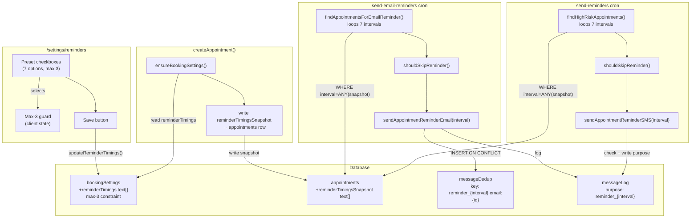

# Customizable Reminder Timing — Shaping Document

**Date:** 2026-03-20
**Appetite:** 1-2 weeks (small batch)
**Status:** Shaping in progress

---

## Frame

### Source

From competitive analysis (`docs/shaping/gap-analysis/competitive-table-stakes-p0-p1.md`):

> **2. Customizable Reminder Timing**
>
> **What it is:**
> - Shop owners configure when reminders send (e.g., 24h, 48h, 1 week before)
> - Different timing for different appointment types
> - Allows for business-specific preferences
>
> **Current state:** ❌ Missing
> **Competitor coverage:**
> - Calendly: ✅ (per event type)
> - Timely: ✅ (per service)
> - Cal.com: ✅ (workflow configuration)
>
> **Priority justification:**
> Automated reminders without timing control are useless. This is core to reminder effectiveness.

### Problem

- **One-size-fits-all timing:** Current system sends reminders at hardcoded 23-25h before appointment
- **Different business workflows:** Therapists need 48h for case prep, hairstylists need 2h for "you're coming today" reminder, recruiters need 10min for phone calls
- **No flexibility:** Shop owners cannot adjust timing to match their industry norms or customer expectations
- **Manual workarounds:** Shop owners must manually message customers at different times, defeating automation purpose

### Outcome

- Shop owners can configure when reminders send based on their business workflow
- System supports multiple reminders per appointment (e.g., 1 week + 24h pattern)
- Reminder timing aligns with industry norms for each business type
- Changes apply to new bookings only (existing appointments keep original timing)
- No customer spam (max 3 reminders enforced)

---

## Requirements (R)

| ID | Requirement | Status |
|----|-------------|--------|
| **R0** | Shop owners can configure when reminders send before appointments | Core goal |
| **R1** | 🟡 UI restricts to max 3 active reminder intervals ("Max 3" Policy); 4th checkbox disabled, schema enforces via check constraint | Must-have |
| **R2** | 🟡 Preset timing intervals optimized for call-based businesses: `10m`, `1h`, `2h`, `4h`, `24h`, `48h`, `1w` (15min removed) | Must-have |
| **R3** | Reminder timing applies to both SMS and email channels uniformly | Must-have |
| **R4** | Appointments booked within a reminder window skip that reminder (don't send retroactively) | Must-have |
| **R5** | Reminder timing captured at booking time (immutable per appointment) | Must-have |
| **R6** | 🟡 Each reminder window sends only once per appointment; dedup log must track both `appointment_id` AND the specific `interval` (e.g., `appointment_123_10m`, `appointment_123_24h`) to ensure idempotency across multiple reminders | Must-have |
| **R7** | All time calculations use shop timezone, not customer or server timezone | Must-have |
| **R8** | Changing shop timing settings affects only new bookings, not existing ones | Must-have |
| **R9** | UI enforces max 3 selections with clear warning when approaching limit | Must-have |
| **R10** | Backward compatible with existing 24h reminder dedup keys and message logs | Must-have |
| **R11** | Delivery within 1-2 week appetite (disciplined scope) | Constraint |
| **R12** | System warns/prevents spam (too many reminders) | Must-have |
| **R13** | 🟡 "Default-to-24h" Migration: all existing shops are migrated to `['24h']` on deploy; new shops also default to `['24h']`; skipping this migration causes silent failures for existing customers | Must-have |

---

## Current System (CURRENT)

### Implementation Details

**Hardcoded Timing:**
- Email reminders: 23-25h window before appointment
- SMS reminders: 23-25h window before appointment (HIGH-risk customers only)
- Cron schedule: Email job runs at 02:00 UTC daily

**Deduplication Strategy:**
- Email: `messageDedup` table with atomic PK constraint
  - Key format: `appointment_reminder_24h:email:{appointmentId}`
- SMS: Query `messageLog` table for existing records (read-then-write, less safe)
  - Purpose field: `appointment_reminder_24h`

**Query Pattern:**
```typescript
const windowStart = new Date(now + 23 * 60 * 60 * 1000);
const windowEnd = new Date(now + 25 * 60 * 60 * 1000);
// Query appointments WHERE startsAt BETWEEN windowStart AND windowEnd
```

**Cron Jobs:**
- `/api/jobs/send-email-reminders` - All customers with emailOptIn
- `/api/jobs/send-reminders` - Only HIGH-risk customers with smsOptIn
- Both use PostgreSQL advisory locks to prevent concurrent execution

### What Works

| Aspect | Current State |
|--------|---------------|
| Automated sending | ✅ Both email and SMS work |
| Deduplication | ✅ Prevents duplicate sends |
| Opt-in/opt-out | ✅ Respects customer preferences |
| Timezone handling | ✅ Uses shop timezone |
| Message logging | ✅ Comprehensive audit trail |

### What's Missing

| Aspect | Gap |
|--------|-----|
| Configurable timing | ❌ Hardcoded 23-25h window |
| Multiple reminders | ❌ Only one reminder per appointment |
| Late booking handling | ❌ Doesn't skip if booked within window |
| Per-interval dedup | ❌ Dedup key assumes single "24h" timing |

---

## Shapes (Solution Options)

### A: In-Place Extension (Minimal Change)

**Core idea:** Extend existing system with minimal structural changes

| Part | Mechanism |
|------|-----------|
| **A1** | Add `reminderTimings` array to `bookingSettings` table (default `["24h"]`) |
| **A2** | Add `reminderTimingsSnapshot` array to `appointments` table (captured at booking) |
| **A3** | Update dedup key format: `appointment_reminder_{interval}:email:{id}` |
| **A4** | Modify query to loop over intervals, scan window per interval (interval ± 1h) |
| **A5** | Add `shouldSkipReminder()` check if booked within window |
| **A6** | Simple checkbox UI in settings with max-3 enforcement |

**Pros:**
- Minimal code changes (extend, don't replace)
- Backward compatible (24h keys identical)
- Reuses existing dedup tables
- Fits 1-2 week appetite

**Cons:**
- Cron job loops over intervals (potential performance impact)
- Multiple queries per job run

---

### B: Dedicated Reminder Schedule Table

**Core idea:** New table to store reminder schedules separately

| Part | Mechanism |
|------|-----------|
| **B1** | Create `appointmentReminders` table: appointmentId, interval, sentAt, status |
| **B2** | Populate at booking time based on shop settings |
| **B3** | Cron queries `appointmentReminders` WHERE sendAt BETWEEN now AND now+5min |
| **B4** | Mark as sent after delivery |
| **B5** | UI same as Shape A (checkbox settings) |

**Pros:**
- Single query per cron run (performance)
- Explicit reminder schedule per appointment
- Easy to audit ("what reminders will this appointment get?")

**Cons:**
- New table + schema complexity
- Requires data migration for existing appointments
- More code to write (create/update/delete reminders)
- Violates 1-2 week appetite

---

### C: Event-Driven Reminder Queue

**Core idea:** Use job queue system for scheduled reminders

| Part | Mechanism |
|------|-----------|
| **C1** | Enqueue reminder jobs at booking time (e.g., Vercel Cron, Inngest, etc.) |
| **C2** | Each job scheduled for `appointmentStartsAt - interval` |
| **C3** | Job handler sends reminder, marks as sent |
| **C4** | Dedup via job idempotency keys |

**Pros:**
- Precise timing (not 5-min cron window)
- Scales better (distributed job processing)
- No scanning queries

**Cons:**
- Requires job queue infrastructure (not in codebase)
- Complexity explosion (queue setup, monitoring, retries)
- Violates appetite (multiple weeks to implement)
- Overkill for current scale

---

## Fit Check

| Req | Requirement | Status | A | B | C |
|-----|-------------|--------|---|---|---|
| R0 | Shop owners can configure when reminders send before appointments | Core goal | ✅ | ✅ | ✅ |
| R1 | 🟡 UI restricts to max 3 active reminder intervals ("Max 3" Policy) | Must-have | ✅ | ✅ | ✅ |
| R2 | 🟡 Preset timing intervals for call-based businesses: `10m`, `1h`, `2h`, `4h`, `24h`, `48h`, `1w` | Must-have | ✅ | ✅ | ✅ |
| R3 | Reminder timing applies to both SMS and email channels uniformly | Must-have | ✅ | ✅ | ✅ |
| R4 | Appointments booked within a reminder window skip that reminder | Must-have | ✅ | ✅ | ✅ |
| R5 | Reminder timing captured at booking time (immutable per appointment) | Must-have | ✅ | ✅ | ✅ |
| R6 | 🟡 Dedup log tracks both `appointment_id` AND `interval`; each (appointment, interval) pair sends only once | Must-have | ✅ | ✅ | ✅ |
| R7 | All time calculations use shop timezone | Must-have | ✅ | ✅ | ✅ |
| R8 | Changing shop timing settings affects only new bookings | Must-have | ✅ | ✅ | ✅ |
| R9 | UI enforces max 3 selections with clear warning | Must-have | ✅ | ✅ | ✅ |
| R10 | Backward compatible with existing 24h dedup keys | Must-have | ✅ | ❌ | ⚠️ |
| R11 | Delivery within 1-2 week appetite | Constraint | ✅ | ❌ | ❌ |
| R12 | System warns/prevents spam (too many reminders) | Must-have | ✅ | ✅ | ✅ |
| R13 | 🟡 "Default-to-24h" Migration: existing shops migrated to `['24h']` on deploy; new shops default to `['24h']` | Must-have | ✅ | ✅ | ✅ |

**Notes:**
- **Shape B fails R10:** New table breaks existing dedup mechanism
- **Shape B fails R11:** New table + migration logic exceeds 1-2 week appetite
- **Shape C fails R11:** Job queue infrastructure is multi-week effort
- **Shape C partial R10:** Depends on implementation (could preserve keys or break them)
- 🟡 **All shapes pass R13:** "Default-to-24h" migration is a one-time SQL UPDATE independent of shape; Shape A handles it cleanest via column DEFAULT + explicit backfill in the same migration file

---

## Selected Shape: A (In-Place Extension)

**Rationale:**
- Only shape that passes all must-haves
- Minimal code changes = fits appetite
- Backward compatible (critical for production safety)
- Reuses existing, proven dedup mechanism
- Performance acceptable (7 intervals × ~100ms query = <1 second total)

**Decision:** Proceed with Shape A for detailed breadboarding

---

## Detail A: In-Place Extension

### Database Schema Changes

**bookingSettings table:**
```typescript
export const bookingSettings = pgTable(
  "booking_settings",
  {
    shopId: uuid("shop_id").primaryKey().references(() => shops.id),
    slotMinutes: integer("slot_minutes").notNull(),
    timezone: text("timezone").notNull(),
    // NEW:
    reminderTimings: text("reminder_timings")
      .array()
      .notNull()
      .default(sql`ARRAY['24h']::text[]`),
  },
  (table) => [
    check("slot_minutes_valid", sql`${table.slotMinutes} in (15, 30, 45, 60, 90, 120)`),
    // NEW CONSTRAINTS:
    check("reminder_timings_max", sql`array_length(${table.reminderTimings}, 1) <= 3`),
    check("reminder_timings_min", sql`array_length(${table.reminderTimings}, 1) >= 1`),
    check(
      "reminder_timings_valid",
      // 🟡 15min removed; 10min renamed to 10m; call-based business preset list
      sql`${table.reminderTimings} <@ ARRAY['10m','1h','2h','4h','24h','48h','1w']::text[]`
    ),
  ]
);
```

**appointments table:**
```typescript
export const appointments = pgTable("appointments", {
  // ... existing fields ...
  // NEW:
  reminderTimingsSnapshot: text("reminder_timings_snapshot")
    .array()
    .notNull()
    .default(sql`ARRAY['24h']::text[]`),
});
```

### Core Logic Changes

**Snapshot Capture (at booking time):**
```typescript
// src/lib/queries/appointments.ts - createAppointment()
const settings = await ensureBookingSettings(tx, input.shopId);
const reminderTimingsSnapshot = settings?.reminderTimings ?? ["24h"];

const appointmentValues = {
  // ... existing fields ...
  reminderTimingsSnapshot,
};
```

**Multi-Window Query:**
```typescript
// src/lib/queries/appointments.ts - findAppointmentsForEmailReminder()
export const findAppointmentsForEmailReminder = async () => {
  const now = Date.now();
  const results = [];
  // 🟡 15min removed; 10min → 10m; optimized for call-based businesses
  const intervals = ["10m", "1h", "2h", "4h", "24h", "48h", "1w"];

  for (const interval of intervals) {
    const intervalMinutes = parseReminderInterval(interval);
    const windowStart = new Date(now + (intervalMinutes - 60) * 60 * 1000);
    const windowEnd = new Date(now + (intervalMinutes + 60) * 60 * 1000);

    const rows = await db
      .select({...})
      .from(appointments)
      .where(
        and(
          eq(appointments.status, "booked"),
          gte(appointments.startsAt, windowStart),
          lte(appointments.startsAt, windowEnd),
          sql`${interval} = ANY(${appointments.reminderTimingsSnapshot})`
        )
      );

    for (const row of rows) {
      if (shouldSkipReminder(row.startsAt, row.createdAt, interval)) continue;
      results.push({ ...row, reminderInterval: interval });
    }
  }

  return results;
};
```

**Skip Logic:**
```typescript
// src/lib/booking.ts
export const shouldSkipReminder = (
  appointmentStartsAt: Date,
  appointmentCreatedAt: Date,
  reminderInterval: string
): boolean => {
  const intervalMinutes = parseReminderInterval(reminderInterval);
  if (!intervalMinutes) return false;

  const leadTimeMs = appointmentStartsAt.getTime() - appointmentCreatedAt.getTime();
  const leadTimeMinutes = leadTimeMs / (1000 * 60);

  return leadTimeMinutes < intervalMinutes;
};
```

**Updated Dedup Key (Interval-Aware Logging):**
```typescript
// src/lib/messages.ts - sendAppointmentReminderEmail()
// 🟡 Dedup key encodes both appointment_id AND interval to ensure idempotency
//    across ALL configured reminder windows (R6)
const dedupKey = `appointment_reminder_${reminderInterval}:email:${appointmentId}`;
// Example for 24h: "appointment_reminder_24h:email:abc123" (identical to old format — backward compatible)
// Example for 10m: "appointment_reminder_10m:email:abc123"
// Example for 2h:  "appointment_reminder_2h:email:abc123"
// SMS messageLog purpose field follows same pattern: `appointment_reminder_${interval}`
```

### UI Components

#### Design Direction

**Aesthetic:** Utilitarian-precision — feels like a scheduling instrument, not a settings form. Dark theme matching the existing app shell (`--color-bg-dark-secondary`). Each preset is an interactive row with a monospace interval badge, a plain full label, and a right-aligned persona tag. Selection state uses the app's teal primary. Slot dots in the header give immediate count feedback without numbers cluttering the rows.

**Layout approach:** Divider-based list (mirrors `AvailabilitySettingsForm` day rows). No card-per-item — avoids visual noise when 7 items are stacked. A subtle `3/MAX` dot counter in the header corner doubles as the only indicator the user needs at a glance.

**Key interaction:** Checkboxes are replaced by full-row `<button aria-pressed>` — the entire row is the tap target on mobile. Disabled rows dim to 40% opacity to signal unavailability without red error states.

---

#### `src/app/app/settings/reminders/page.tsx`

```tsx
import { requireAuth } from "@/lib/auth/require-auth";
import { db } from "@/lib/db";
import { bookingSettings } from "@/lib/schema";
import { eq } from "drizzle-orm";
import { ReminderTimingsForm } from "@/components/settings/reminder-timings-form";

type Interval = "10m" | "1h" | "2h" | "4h" | "24h" | "48h" | "1w";

export default async function ReminderSettingsPage() {
  const session = await requireAuth();
  const shopId = session.user.shopId;

  const settings = await db.query.bookingSettings.findFirst({
    where: eq(bookingSettings.shopId, shopId),
  });

  const initialTimings = (settings?.reminderTimings as Interval[]) ?? ["24h"];

  return (
    <div className="space-y-8">
      <div>
        <h1 className="text-2xl font-semibold">Reminders</h1>
        <p className="mt-1 text-sm text-muted-foreground">
          Configure when automated reminders send before appointments.
        </p>
      </div>
      <div className="rounded-lg border p-6">
        <ReminderTimingsForm initialTimings={initialTimings} />
      </div>
    </div>
  );
}
```

---

#### `src/app/app/settings/reminders/actions.ts`

```ts
"use server";

import { requireAuth } from "@/lib/auth/require-auth";
import { db } from "@/lib/db";
import { bookingSettings } from "@/lib/schema";
import { eq } from "drizzle-orm";
import { z } from "zod";

const VALID_INTERVALS = ["10m", "1h", "2h", "4h", "24h", "48h", "1w"] as const;

const schema = z
  .array(z.enum(VALID_INTERVALS))
  .min(1, "At least one interval required")
  .max(3, "Maximum 3 intervals allowed");

export async function updateReminderTimings(timings: unknown) {
  const session = await requireAuth();
  const shopId = session.user.shopId;
  const parsed = schema.parse(timings);

  await db
    .update(bookingSettings)
    .set({ reminderTimings: parsed })
    .where(eq(bookingSettings.shopId, shopId));
}
```

---

#### `src/components/settings/reminder-timings-form.tsx`

```tsx
"use client";

import { useState, useTransition } from "react";
import { CheckIcon } from "lucide-react";
import { Button } from "@/components/ui/button";
import { updateReminderTimings } from "@/app/app/settings/reminders/actions";

type Interval = "10m" | "1h" | "2h" | "4h" | "24h" | "48h" | "1w";

const PRESETS: { value: Interval; badge: string; fullLabel: string; persona: string }[] = [
  { value: "10m", badge: "10 min", fullLabel: "10 minutes before", persona: "Phone calls"  },
  { value: "1h",  badge: "1 hr",   fullLabel: "1 hour before",     persona: "General"       },
  { value: "2h",  badge: "2 hr",   fullLabel: "2 hours before",    persona: "Hairstylists"  },
  { value: "4h",  badge: "4 hr",   fullLabel: "4 hours before",    persona: "General"       },
  { value: "24h", badge: "24 hr",  fullLabel: "24 hours before",   persona: "Most common"   },
  { value: "48h", badge: "48 hr",  fullLabel: "48 hours before",   persona: "Therapists"    },
  { value: "1w",  badge: "1 wk",   fullLabel: "1 week before",     persona: "Therapists"    },
];

const MAX = 3;

export function ReminderTimingsForm({ initialTimings }: { initialTimings: Interval[] }) {
  const [selected, setSelected] = useState<Interval[]>(initialTimings);
  const [isPending, startTransition] = useTransition();
  const [savedKey, setSavedKey] = useState(0);

  const atMax = selected.length >= MAX;
  const isDirty =
    selected.length !== initialTimings.length ||
    [...selected].sort().join() !== [...initialTimings].sort().join();

  function toggle(value: Interval) {
    setSelected((prev) => {
      if (prev.includes(value)) return prev.filter((v) => v !== value);
      if (prev.length >= MAX) return prev;
      return [...prev, value];
    });
    setSavedKey(0);
  }

  function handleSave() {
    startTransition(async () => {
      await updateReminderTimings(selected);
      setSavedKey((k) => k + 1);
    });
  }

  return (
    <div className="space-y-5">
      {/* Header row: label + slot-dot counter */}
      <div className="flex items-start justify-between gap-4">
        <p className="text-sm text-muted-foreground">
          Customers receive a reminder at each selected interval before their
          appointment. Changes apply to new bookings only.
        </p>
        <div
          className="flex shrink-0 items-center gap-1.5 pt-0.5"
          aria-label={`${selected.length} of ${MAX} slots used`}
        >
          {Array.from({ length: MAX }).map((_, i) => (
            <span
              key={i}
              className={`block h-2 w-2 rounded-full transition-colors duration-200 ${
                i < selected.length
                  ? "bg-[var(--color-primary)]"
                  : "bg-[rgba(255,255,255,0.12)]"
              }`}
            />
          ))}
          <span className="ml-1 font-mono text-xs text-muted-foreground">
            {selected.length}/{MAX}
          </span>
        </div>
      </div>

      {/* Max-reached warning */}
      {atMax && (
        <div className="rounded-md border border-[var(--color-accent-coral)]/25 bg-[var(--color-accent-coral)]/8 px-3.5 py-2.5">
          <p className="text-xs text-[var(--color-accent-coral)]">
            Max 3 reminders reached — deselect one to choose a different interval.
          </p>
        </div>
      )}

      {/* Preset rows */}
      <div className="divide-y divide-[var(--color-border-subtle)]">
        {PRESETS.map((preset) => {
          const isSelected = selected.includes(preset.value);
          const isDisabled = atMax && !isSelected;

          return (
            <button
              key={preset.value}
              type="button"
              onClick={() => !isDisabled && toggle(preset.value)}
              disabled={isDisabled}
              aria-pressed={isSelected}
              className={[
                "group flex w-full items-center gap-3 px-1 py-3 text-left transition-colors duration-150",
                isDisabled ? "cursor-not-allowed opacity-40" : "cursor-pointer",
                isSelected
                  ? "text-foreground"
                  : "text-muted-foreground hover:text-foreground",
              ].join(" ")}
            >
              {/* Check indicator */}
              <span
                className={[
                  "flex h-4 w-4 shrink-0 items-center justify-center rounded border transition-all duration-150",
                  isSelected
                    ? "border-[var(--color-primary)] bg-[var(--color-primary)]"
                    : "border-[var(--color-border-medium)] bg-transparent",
                ].join(" ")}
              >
                {isSelected && (
                  <CheckIcon className="h-2.5 w-2.5 text-white" strokeWidth={3} />
                )}
              </span>

              {/* Monospace interval badge */}
              <span
                className={[
                  "w-12 shrink-0 font-mono text-xs font-semibold tracking-tight",
                  isSelected
                    ? "text-[var(--color-primary-light)]"
                    : "text-muted-foreground",
                ].join(" ")}
              >
                {preset.badge}
              </span>

              {/* Full label */}
              <span className="flex-1 text-sm">{preset.fullLabel}</span>

              {/* Persona tag */}
              <span
                className={[
                  "shrink-0 rounded px-1.5 py-0.5 text-[10px] font-medium transition-opacity",
                  isSelected
                    ? "bg-[var(--color-primary)]/15 text-[var(--color-primary-light)] opacity-100"
                    : "bg-[rgba(255,255,255,0.06)] text-muted-foreground opacity-60 group-hover:opacity-80",
                ].join(" ")}
              >
                {preset.persona}
              </span>
            </button>
          );
        })}
      </div>

      {/* Save row */}
      <div className="flex items-center gap-3 pt-1">
        <Button
          onClick={handleSave}
          disabled={isPending || !isDirty || selected.length === 0}
          size="sm"
        >
          {isPending ? "Saving…" : "Save"}
        </Button>
        {savedKey > 0 && !isDirty && (
          <span className="text-xs text-[var(--color-success-green)]">Saved</span>
        )}
        {selected.length === 0 && (
          <span className="text-xs text-muted-foreground">
            Select at least one interval
          </span>
        )}
      </div>
    </div>
  );
}
```

---

## Breadboard: Shape A

### UI Affordances

| Affordance | Place | Type | Wires Out |
|------------|-------|------|-----------|
| Preset checkboxes (7 options) | `/settings/reminders` | Checkbox group | → `updateReminderTimings()` on save |
| Max-3 guard | `/settings/reminders` | Disables 4th checkbox when 3 selected | (client state only) |
| "Max 3 reached" banner | `/settings/reminders` | Conditional warning | (display only) |
| Save button | `/settings/reminders` | Submit | → `updateReminderTimings()` |

### Non-UI Affordances

| Affordance | Place | Type | Wires Out |
|------------|-------|------|-----------|
| `bookingSettings.reminderTimings` | DB | `text[]` column, default `['24h']`, max-3 + valid-values check | ← read by `ensureBookingSettings()`; ← written by `updateReminderTimings()` |
| `appointments.reminderTimingsSnapshot` | DB | `text[]` column, default `['24h']`, immutable after insert | ← written by `createAppointment()`; ← read by reminder queries |
| `messageDedup` | DB | Unchanged table; key format extended to include interval | ← written by `sendAppointmentReminderEmail()` |
| `messageLog` | DB | Unchanged table; `purpose` field pattern extended to include interval | ← written by `sendAppointmentReminderSMS()` |
| `NNNN_reminder_timings.sql` | `drizzle/` | Migration | Adds columns; backfills all shops to `['24h']`; backfills booked appointments to `['24h']` |
| `updateReminderTimings()` | `/settings/reminders/actions.ts` | NEW server action | → writes `bookingSettings.reminderTimings` |
| `ensureBookingSettings()` | `queries/appointments.ts` | Unchanged function | → reads `bookingSettings` (now returns `reminderTimings` via new column) |
| `createAppointment()` | `queries/appointments.ts` | EXTEND | → reads `reminderTimings` from settings; → writes `reminderTimingsSnapshot` to appointment row |
| `shouldSkipReminder(startsAt, createdAt, interval)` | `lib/reminders.ts` | NEW pure helper | Returns `true` if appointment was booked after the reminder window already passed (no DB) |
| `findAppointmentsForEmailReminder()` | `queries/appointments.ts` | EXTEND | Loops 7 intervals; each iteration queries `WHERE interval = ANY(reminderTimingsSnapshot)`; calls `shouldSkipReminder()`; returns `{...candidate, reminderInterval}` |
| `findHighRiskAppointments()` | `queries/appointments.ts` | EXTEND | Same loop pattern as above; filters to high-risk SMS candidates |
| `sendAppointmentReminderEmail(interval)` | `messages.ts` | EXTEND (new `reminderInterval` param) | Builds interval-aware dedup key `reminder_{interval}:email:{id}`; reads/inserts `messageDedup`; writes `messageLog` |
| `sendAppointmentReminderSMS(interval)` | `messages.ts` | EXTEND (new `reminderInterval` param) | Checks `messageLog` by `(appointmentId, purpose=reminder_{interval})`; writes `messageLog` on send |

### Wiring by Place

**`/settings/reminders`**
- Checkboxes → client state → max-3 guard prevents 4th selection
- Save → `updateReminderTimings()` → `bookingSettings.reminderTimings`

**Booking flow (`createAppointment`)**
- `ensureBookingSettings()` reads `reminderTimings` from `bookingSettings`
- `reminderTimings` captured as `reminderTimingsSnapshot` on the new appointment row (immutable from this point on)

**`send-email-reminders` cron**
- `findAppointmentsForEmailReminder()` loops 7 intervals → queries `appointments WHERE startsAt IN window AND interval=ANY(snapshot)` → `shouldSkipReminder()` filters late bookings → yields `{...candidate, reminderInterval}`
- `sendAppointmentReminderEmail(reminderInterval)` → atomic `messageDedup` insert (interval-aware key) → send → `messageLog`

**`send-reminders` cron**
- `findHighRiskAppointments()` same loop pattern → yields high-risk SMS candidates with `reminderInterval`
- `sendAppointmentReminderSMS(reminderInterval)` → checks `messageLog` for `(appointmentId, purpose)` → send → `messageLog`

**`drizzle/` migration**
- Adds `reminder_timings` to `bookingSettings` + `reminder_timings_snapshot` to `appointments`
- Backfills: `UPDATE booking_settings SET reminder_timings = ARRAY['24h'] WHERE reminder_timings IS NULL`
- Backfills: `UPDATE appointments SET reminder_timings_snapshot = ARRAY['24h'] WHERE reminder_timings_snapshot IS NULL AND status = 'booked'`

### Diagram



---

## Risks and Rabbit Holes

### Risk 1: Performance (Multiple Queries)

**Concern:** Looping over 7 intervals means 7 queries per cron run

**Mitigation:**
- Each query is fast (<100ms) with proper indexing
- Total time: 7 × 100ms = 700ms (acceptable for cron)
- Alternative: UNION ALL query (more complex, marginal gain)

**Decision:** Accept loop pattern for simplicity

### Risk 2: Timezone Confusion

**Concern:** "24 hours before" in what timezone?

**Mitigation:**
- Always use `bookingSettings.timezone`
- Existing pattern already established in codebase
- All appointment times stored as UTC, converted to shop timezone for display

**Decision:** Follow existing timezone pattern

### Risk 3: Race Conditions (SMS Dedup)

**Concern:** SMS uses read-then-write dedup (not atomic like email)

**Mitigation:**
- PostgreSQL advisory locks on cron jobs prevent concurrent execution
- Single job instance = no race condition
- Future improvement: Adopt email's atomic dedup pattern for SMS

**Decision:** Acceptable for 1-2 week appetite, add to future enhancements

### Risk 4: Migration Breaking Existing Reminders

**Concern:** Schema changes could disrupt current 24h reminders; skipping the data migration leaves existing shops with NULL `reminderTimings`, causing silent send failures for all their appointments

**Mitigation:**
- 🟡 **"Default-to-24h" Migration is required, not optional:** migration must include an explicit `UPDATE booking_settings SET reminder_timings = ARRAY['24h'] WHERE reminder_timings IS NULL` to backfill all existing shops
- 🟡 **Appointments also backfilled:** `UPDATE appointments SET reminder_timings_snapshot = ARRAY['24h'] WHERE reminder_timings_snapshot IS NULL AND status = 'booked'`
- Dedup key format identical for 24h interval (backward compatible)
- Backward compatible query (filter by snapshot array)
- Test on staging before production — verify all shops have `['24h']` set after migration

**Decision:** Zero-disruption migration plan; explicit backfill SQL is non-negotiable

---

## Edge Cases

| Scenario | Behavior | Handled By |
|----------|----------|------------|
| Customer books 30min before appointment | Skip reminders > 30min (1h, 24h, etc.) | `shouldSkipReminder()` |
| Shop changes reminder settings | Existing appointments keep old snapshot | Immutable snapshot |
| Cron job restarts mid-run | No duplicate sends | Existing dedup table |
| Shop selects 0 timings | Form validation prevents submission | Schema + UI validation |
| Shop tries 4+ timings | UI prevents, schema rejects | Max-3 at UI + schema |
| Invalid interval in database | Parser returns null, skips | Schema constraint + fallback |
| Appointment exactly at threshold (1h booked 1h before) | Don't skip (>= threshold is OK) | `shouldSkipReminder()` |

---

## No-Gos (Out of Scope)

**❌ NOT doing in this shape:**
- Per-event-type timing overrides (requires Multiple Event Types feature first)
- Per-customer timing preferences (requires customer segmentation)
- Time-of-day restrictions (e.g., "only send 9am-5pm")
- Custom interval input (e.g., "3.5 days before")
- A/B testing optimal timing (analytics feature)
- AI-suggested timing (overthinking)
- Different timing for SMS vs email
- Analytics/reporting on reminder effectiveness

---

## Success Criteria

**Functional:**
- Shop owners can select 1-3 reminder timings from presets
- UI enforces max 3 (disables 4th checkbox)
- Schema enforces max 3 (check constraint)
- Appointments capture timing snapshot at booking time
- Changing shop settings affects only new bookings
- Reminders send at all configured intervals
- Late bookings skip impossible reminders
- Deduplication works per interval
- 24h reminder keys match old format
- All calculations use shop timezone

**Non-functional:**
- Migration completes in <5 seconds
- Query performance <200ms per interval window
- Cron job completes in <10 seconds for 1000 appointments
- Settings UI loads in <1 second
- Zero disruption to existing 24h reminders

---

## Next Steps

1. ~~**Breadboard the selected shape**~~ ✅ Done — see Breadboard: Shape A section
2. ~~**Create spike for migration**~~ ✅ Resolved in-place — backfill SQL documented in R13 and Risk 4
3. ~~**Slice into vertical increments**~~ ✅ Done — see `customizable-reminder-timing-slices.md`
4. **Create Big Picture document** - One-page summary for driver/developer
