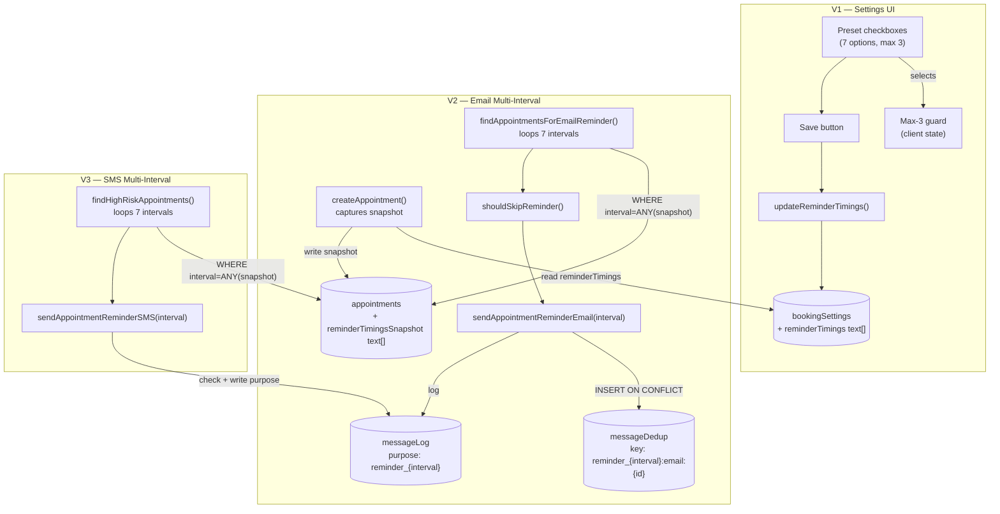

# Customizable Reminder Timing — Slices

**Shape:** A (In-Place Extension)
**Source:** `customizable-reminder-timing-shaping.md`

---

## Slice Definitions

| Slice | Name | Demo-able outcome |
|-------|------|-------------------|
| V1 | Settings UI | Shop owner configures intervals, saves, reloads — persists |
| V2 | Email multi-interval sending | Configured intervals trigger email reminders; dedup prevents double-send |
| V3 | SMS multi-interval sending | High-risk customers receive SMS at all configured intervals |

Each slice builds directly on the previous. V1 is the only slice with a purely visible UI demo. V2 and V3 demo through observable sending behaviour (emails/SMS arrive; repeating the cron produces no duplicates).

---

## V1 — Settings UI

### What ships

Shop owners visit `/settings/reminders`, see their current configuration (defaulting to `['24h']`), select up to 3 intervals from 7 presets, and save. The max-3 guard disables the 4th checkbox client-side; the schema constraint enforces it server-side. Changes persist across reloads.

This slice also includes the `bookingSettings.reminderTimings` migration and backfill — existing shops get `['24h']` so no shop is left with a NULL column before V2 lands.

### Demo

1. Visit `/app/settings/reminders` → 7 presets shown, `24h` pre-selected
2. Select `10m` and `2h` → slot dots show `3/3`, remaining presets dim
3. Click Save → "Saved" confirmation
4. Reload → `['10m', '2h', '24h']` still selected

### UI Affordances

| Affordance | Place | Wires Out |
|------------|-------|-----------|
| Preset checkboxes (7 options) | `/settings/reminders` | → `updateReminderTimings()` on save |
| Max-3 guard | `/settings/reminders` | Client state only — disables 4th when 3 selected |
| "Max 3 reached" banner | `/settings/reminders` | Display only |
| Save button | `/settings/reminders` | → `updateReminderTimings()` |

### Non-UI Affordances

| Affordance | Type | Detail |
|------------|------|--------|
| `bookingSettings.reminderTimings` | NEW column | `text[]`, default `['24h']`, max-3 + valid-values check constraint |
| `NNNN_reminder_timings_settings.sql` | Migration | Adds column; `UPDATE booking_settings SET reminder_timings = ARRAY['24h'] WHERE reminder_timings IS NULL` |
| `updateReminderTimings()` | NEW server action | Zod-validates (min 1, max 3, valid values); writes `bookingSettings.reminderTimings` |
| `ensureBookingSettings()` | UNCHANGED | Returns `reminderTimings` transparently via new column |

### Not in this slice

- Appointment snapshot capture
- Any changes to cron jobs or message-sending functions

---

## V2 — Email Multi-Interval Sending

### What ships

The email cron now loops over all 7 possible intervals. For each interval it queries appointments whose `reminderTimingsSnapshot` includes that interval and whose `startsAt` falls in the matching window. Appointments booked too recently for a window are skipped (`shouldSkipReminder`). Each `(appointment, interval)` pair sends at most once via the interval-aware dedup key.

The `createAppointment()` snapshot capture and the `appointments.reminderTimingsSnapshot` migration also land here — both are prerequisites for the cron query.

### Demo

1. Configure `['10m', '24h']` in settings (V1 required)
2. Book an appointment 25 hours from now
3. Trigger email cron → 24h reminder email arrives
4. Trigger cron again → no duplicate (dedup key blocks it)
5. When appointment is 10 minutes away, trigger cron → 10m reminder email arrives
6. Change settings to `['1w']`; book a second appointment → second appointment snapshot is `['1w']`; first appointment snapshot remains `['10m', '24h']`

### Non-UI Affordances

| Affordance | Type | Detail |
|------------|------|--------|
| `appointments.reminderTimingsSnapshot` | NEW column | `text[]`, default `['24h']`; written at booking, immutable after |
| `NNNN_reminder_timings_snapshot.sql` | Migration | Adds column; `UPDATE appointments SET reminder_timings_snapshot = ARRAY['24h'] WHERE reminder_timings_snapshot IS NULL AND status = 'booked'` |
| `createAppointment()` | EXTEND | Reads `reminderTimings` from `ensureBookingSettings()`; writes `reminderTimingsSnapshot` on appointment row |
| `shouldSkipReminder(startsAt, createdAt, interval)` | NEW pure helper | Returns `true` if `(startsAt - createdAt) < intervalMinutes`; no DB access |
| `findAppointmentsForEmailReminder()` | EXTEND | Loops 7 intervals; per iteration: queries `WHERE startsAt IN window AND interval = ANY(reminderTimingsSnapshot)`; calls `shouldSkipReminder()`; returns `{...candidate, reminderInterval}` |
| `sendAppointmentReminderEmail(interval)` | EXTEND | Accepts `reminderInterval`; dedup key: `appointment_reminder_{interval}:email:{id}` (24h key format unchanged — backward compatible) |

### Not in this slice

- SMS sending

---

## V3 — SMS Multi-Interval Sending

### What ships

The SMS cron applies the same multi-interval loop to high-risk customers. `findHighRiskAppointments()` iterates 7 intervals with the same `WHERE interval = ANY(snapshot)` filter. `sendAppointmentReminderSMS()` records the interval in `messageLog.purpose` for idempotency.

### Demo

1. Ensure a high-risk customer has `smsOptIn: true`
2. Configure `['2h', '24h']` in settings; book an appointment for that customer
3. Trigger SMS cron 24h before → SMS arrives
4. Trigger SMS cron 2h before → second SMS arrives
5. Trigger cron again at either window → no duplicate

### Non-UI Affordances

| Affordance | Type | Detail |
|------------|------|--------|
| `findHighRiskAppointments()` | EXTEND | Same 7-interval loop as email; filters `noShowRisk = 'high'` and `smsOptIn = true`; returns `reminderInterval` per row |
| `sendAppointmentReminderSMS(interval)` | EXTEND | Accepts `reminderInterval`; checks `messageLog` for existing `(appointmentId, purpose = appointment_reminder_{interval})`; writes `messageLog` on send |

---

## Sliced Breadboard

