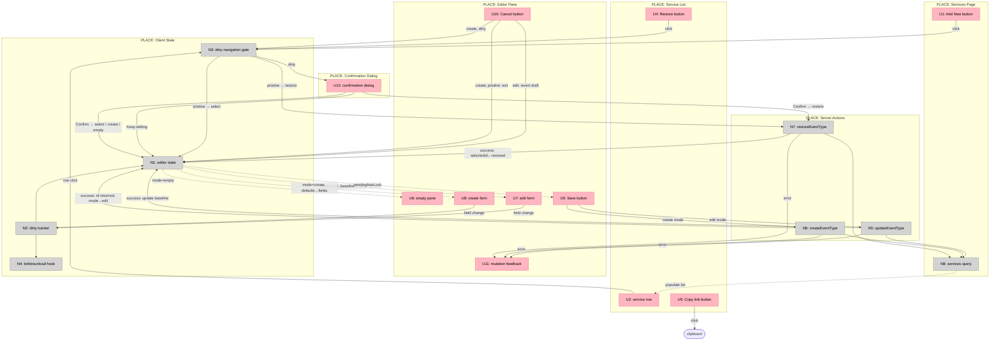

# Services Page: Split-Pane Service Management

**Selected shape:** A (Client editor shell with single active draft)

---

## Frame

### Problem

- The current services settings flow uses separate patterns for creating and editing services, creating an inconsistent experience.
- `Add New` has no defined interaction inside a split-pane layout.
- Unsaved changes behavior is undefined when switching rows, clicking Add New, or triggering Restore.
- `Restore` is ambiguous — services can be hidden, inactive, or both, and the prior design didn't specify which flags to reverse.
- The service list does not clearly represent all current state combinations (hidden-only, inactive-only, hidden-and-inactive).

### Outcome

- A shop owner can browse, create, edit, and restore services from a single unified split-pane page.
- Dirty edits are never lost silently — all navigation away from an unsaved form is gated behind explicit confirmation.
- Restore has one unambiguous meaning: return the service to the standard public/bookable state.
- The service list clearly represents every service state combination so the owner always knows what each row's state means.

---

## Requirements (R)

| ID | Requirement | Status |
|----|-------------|--------|
| **R0** | A shop owner can browse, create, edit, and restore services from a single split-pane page without silent data loss | Core goal |
| **R1** | Page uses a split-pane layout: left service list, right editor with 3 pane modes (empty / edit / create); mobile may stack with identical draft semantics | Must-have |
| R1.1 | Left pane: compact service list | Must-have |
| R1.2 | Right pane supports 3 modes: empty, edit, create | Must-have |
| R1.3 | No temporary list row during create mode | Must-have |
| R1.4 | Mobile stacked layout uses the same draft and confirmation behavior; the Back action (returning from editor pane to list pane) is gated by the dirty-navigation gate — dirty Back must trigger discard confirmation before returning to the list | Must-have |
| **R2** | Service list is scannable and represents all state combinations clearly; Copy link accessible for active services without a dirty-state gate | Must-have |
| R2.1 | Each row shows name, duration, deposit (override or inherited default), default badge | Must-have |
| R2.2 | State badges: hidden-only → Hidden; inactive-only → Inactive; hidden+inactive → both | Must-have |
| R2.3 | Copy link shown only for `isActive=true` services; not blocked by dirty confirmation; hidden for inactive services because `/book/[slug]?service=` returns 404 when `!isActive` (`src/app/book/[slug]/page.tsx:40`) | Must-have |
| R2.4 | Currently selected row visually distinct | Must-have |
| **R3** | Edit flow supports all editable fields with explicit state semantics and Save/Cancel with feedback | Must-have |
| R3.1 | All 7 fields editable: name, description, durationMinutes, bufferMinutes, depositAmountCents, isHidden, isActive | Must-have |
| R3.2 | UI makes state meaning explicit: hidden+active = publicly hidden but link-bookable; inactive = unbookable | Must-have |
| R3.3 | Save persists and refreshes baseline; shows pending / success / error | Must-have |
| R3.4 | Cancel in edit mode reverts draft to last committed values; stays on same service | Must-have |
| **R4** | Create flow opens in right pane with defined defaults; no temp list row; cancel and post-save semantics defined | Must-have |
| R4.1 | Defaults: name/description empty, first valid duration, Shop Default buffer, blank deposit, isHidden=false, isActive=true | Must-have |
| R4.2 | Cancel in create: pristine → exit immediately; dirty → confirm first | Must-have |
| R4.3 | On success: new service persisted, id returned, new row selected, pane stays in edit mode | Must-have |
| **R5** | Unsaved changes are never silently discarded — one active draft, dirty navigation gates, beforeunload warning, save-pending nav lock | Must-have |
| R5.1 | One draft at a time; no per-row draft preservation | Must-have |
| R5.2 | Dirty = any editable field differs from committed baseline | Must-have |
| R5.3 | Pristine: row switch / Add New / Restore / pane clear proceeds immediately | Must-have |
| R5.4 | Dirty: those actions blocked behind confirmation (title: "Discard unsaved changes?"; actions: "Keep editing" / "Discard changes") | Must-have |
| R5.5 | Restore on the currently open dirty row uses restore-specific confirmation copy | Must-have |
| R5.6 | Native beforeunload warning when editor is dirty | Must-have |
| R5.7 | Save-pending state disables navigation controls to prevent races | Must-have |
| R5.8 | External data refresh must not overwrite a dirty draft in the pane | Must-have |
| **R6** | Restore is a dedicated action that always returns a non-normal service to standard public/bookable state | Must-have |
| R6.1 | Restore available when isHidden=true OR isActive=false | Must-have |
| R6.2 | Restore always sets isHidden=false AND isActive=true; no dependency on state history | Must-have |
| R6.3 | After restore: restored row selected, pane shows fresh committed values | Must-have |
| R6.4 | Restore shows pending / success / error states | Must-have |
| **R7** | Validation is inline and non-destructive; matches current backend rules | Must-have |
| R7.1 | name required; durationMinutes multiple of slot size and ≤ max; depositAmountCents blank or positive; default service deactivation handled with error | Must-have |
| R7.2 | Errors render inline in the pane; pane stays open; draft preserved | Must-have |
| **R8** | Technical approach: server-rendered initial load, Server Actions for mutations, no client-fetch layer, no schema changes | Must-have |
| R8.1 | Route server-renders initial services data | Must-have |
| R8.2 | Client editor shell owns: selectedId, mode, baseline, draft, dirty, pendingTarget, confirmState | Must-have |
| R8.3 | Mutations via Server Actions; createEventType returns new service id | Must-have |
| R8.4 | No new client-side data-fetching layer or optimistic cache | Must-have |
| R8.5 | No schema changes required | Must-have |

---

## CURRENT: Inline-per-row services settings

| Part | Mechanism |
|------|-----------|
| **CUR1** | Services settings page at `/app/settings/services` — server-renders list; create form rendered below the list as a standalone section |
| **CUR2** | `event-type-list.tsx` — expands one row at a time; renders an inline `EventTypeForm` for that row |
| **CUR3** | `event-type-form.tsx` — owns local field state only for the currently rendered form; no Cancel, no dirty tracking, no cross-row state |
| **CUR4** | `actions.ts` — `createEventType` returns void; `updateEventType`, `deleteEventType` exist; restore not yet defined as a dedicated action |

**Gaps in CURRENT** (resolved by spikes):
- No split-pane selected-row model
- No create mode inside a detail pane
- No dirty tracking or discard confirmation
- No Restore action (only manual field edits)
- No state badge representation for Hidden/Inactive combinations

---

## Shape A: Client editor shell with single active draft

| Part | Mechanism | Flag |
|------|-----------|:----:|
| **A1** | **Split-pane shell** — route server-renders initial services list; shell component renders left list + right pane; owns pane mode state (`empty \| edit \| create`) | |
| **A2** | **Service list row** — name, duration, deposit (override or "Policy default"), Default badge; Hidden / Inactive state badges per R2.2; Restore action when `isHidden \|\| !isActive`; Copy link when `isActive === true` only (hidden otherwise — inactive links 404); selected-row highlight | |
| **A3** | **Client editor state** — owns `selectedId`, `mode`, `baseline` (last committed values), `draft` (local values), `dirty` flag, `pendingTarget`, `confirmState` | |
| **A4** | **Single draft model** — dirty = field-level comparison of all 7 editable values against baseline; no cached draft keyed by row id | |
| **A5** | **Dirty-navigation gate** — intercepts row switch / Add New / Restore / pane clear / mobile Back; if dirty → block + store pendingTarget + open confirm; if pristine → proceed; mobile Back resolves as `pendingTarget: { kind: "empty" }` | |
| **A6** | **Discard confirmation dialog** — generic variant ("Discard unsaved changes?" / "Keep editing" / "Discard changes") and restore-current variant ("Restore service and discard edits?" / "Keep editing" / "Restore service"); on confirm → apply pendingTarget | |
| **A7** | **beforeunload hook** — attaches native browser prompt when `dirty=true`; removes when `dirty=false` | |
| **A8** | **Edit flow** — form bound to all 7 fields; Save calls `updateEventType(id, values: ServiceEditorValues)` → A13; on `fieldErrors`: render per-field inline messages, keep pane open; on `error`: render form-level banner; on success: update baseline, dirty=false | |
| **A9** | **Create flow** — blank form initialised with defaults (R4.1); Save calls `createEventType(values: ServiceEditorValues)` → A13; on success: `result.data.id` → `selectedId`, mode → `edit`; on `fieldErrors` / `error`: same as A8 | |
| **A10** | **Restore action** — calls `restoreEventType(id)` → A13; on success: select restored row, pane shows fresh committed values; on `error`: inline error; pending / success / error UI | |
| **A11** | **Inline validation** — client pre-validates against mirrored rules before calling action; action `fieldErrors` from A13 drive per-field inline messages; action `error` drives top-of-form banner; pane stays open; draft preserved in both cases | |
| **A12** | **Save-pending nav lock** — disables row switching and navigation controls while any mutation is in-flight | |
| **A13** | **Mutation result envelope** — all three Server Actions return a typed `ActionResult`; field errors keyed to `ServiceField`; `createEventType` returns `{ id: string }` in `data` on success; see contract below | |

### Server payload contract (N8)

#### What the route must load

The split-pane shell needs three data sources. The current `page.tsx` only partially provides them:

| Source | Current `page.tsx` | Required |
|--------|-------------------|---------|
| Event types | ✅ `getEventTypesForShop(shopId)` | No change |
| `slotMinutes` | ✅ from `getBookingSettingsForShop` | No change |
| `defaultBufferMinutes` | ⚠️ returned by `getBookingSettingsForShop` but never passed to the shell | Must be passed — needed to label "Shop Default (Xm)" in buffer picker and create defaults |
| `shopPolicies.depositAmountCents` | ❌ not loaded | Must be added — needed to label "Policy default" on rows where service deposit is null |

#### Types

```ts
type ServicesPagePayload = {
  services: ServiceRow[];
  shopContext: ShopContext;
};

type ServiceRow = {
  id: string;
  name: string;
  description: string | null;
  durationMinutes: number;
  bufferMinutes: 0 | 5 | 10 | null;   // null = Shop Default
  depositAmountCents: number | null;   // null = uses policy default
  isHidden: boolean;
  isActive: boolean;
  isDefault: boolean;
};

type ShopContext = {
  slotMinutes: number;                  // drives duration picker steps; A11 validation (duration % slotMinutes === 0)
  defaultBufferMinutes: 0 | 5 | 10;    // labels "Shop Default (Xm)" in buffer picker; create-mode default description
  defaultDepositCents: number | null;  // labels "Policy default" on rows when service depositAmountCents is null
  bookingBaseUrl: string;              // base URL for U5 Copy link construction
};
```

#### What each `ShopContext` field unlocks

| Field | Unlocks |
|-------|---------|
| `slotMinutes` | Duration picker step size; A11 client-side slot-multiple validation |
| `defaultBufferMinutes` | Buffer picker label "Shop Default (10m)"; create defaults description |
| `defaultDepositCents` | U2 row deposit column: null service deposit → display formatted policy default or "None" |
| `bookingBaseUrl` | U5 Copy link: `${bookingBaseUrl}?service=${row.id}` |

#### Required change in `page.tsx`

Add `shopPolicies` to the existing `Promise.all`. No new query file; no schema changes.

```ts
const [eventTypeRows, settings, policy] = await Promise.all([
  getEventTypesForShop(shop.id),
  getBookingSettingsForShop(shop.id),
  db.query.shopPolicies.findFirst({
    where: (t, { eq }) => eq(t.shopId, shop.id),
    columns: { depositAmountCents: true },
  }),
]);

const shopContext: ShopContext = {
  slotMinutes:          settings?.slotMinutes ?? 60,
  defaultBufferMinutes: (settings?.defaultBufferMinutes ?? 0) as 0 | 5 | 10,
  defaultDepositCents:  policy?.depositAmountCents ?? null,
  bookingBaseUrl:       `${process.env.NEXT_PUBLIC_APP_URL ?? ""}/book/${shop.slug}`,
};
```

---

### Mutation result contract (A13)

#### Value type and field keys

```ts
type ServiceEditorValues = {
  name: string;
  description: string;
  durationMinutes: number;
  bufferMinutes: number | null;  // null = Shop Default
  depositAmountCents: number | null;  // null = same as policy
  isHidden: boolean;
  isActive: boolean;
};

type ServiceField = keyof ServiceEditorValues;
```

#### Result envelope

```ts
type ActionOk<T = void>  = { ok: true;  data: T };
type ActionFieldError    = { ok: false; fieldErrors: Partial<Record<ServiceField, string>> };
type ActionError         = { ok: false; error: string };
type ActionResult<T = void> = ActionOk<T> | ActionFieldError | ActionError;
```

- **`fieldErrors`** — one or more field keys map to a human-readable message; the form renders each message inline below the offending field; pane stays open; draft preserved.
- **`error`** — form-level problem (auth, not-found, unexpected); rendered as a banner at the top of the form.
- **`ok: true`** — mutation succeeded; `data` carries the id only for `createEventType`.

#### Action signatures (target state)

```ts
// src/app/app/settings/services/actions.ts

createEventType(values: ServiceEditorValues): Promise<ActionResult<{ id: string }>>
updateEventType(id: string, values: ServiceEditorValues): Promise<ActionResult>
restoreEventType(id: string): Promise<ActionResult>
```

#### Zod → `fieldErrors` mapping

Zod's `safeParse` failure gives `error.issues: ZodIssue[]`. Each issue has a `path: (string | number)[]` where `path[0]` is the top-level field name for field-level errors, and `path` is empty (`[]`) for form-level errors (cross-field refinements, etc.).

```ts
const VALID_SERVICE_FIELDS = new Set<string>([
  "name", "description", "durationMinutes", "bufferMinutes",
  "depositAmountCents", "isHidden", "isActive",
]);

function mapZodErrors(
  issues: z.ZodIssue[],
): Partial<Record<ServiceField, string>> {
  const fieldErrors: Partial<Record<ServiceField, string>> = {};
  for (const issue of issues) {
    const key = issue.path[0];
    if (
      typeof key === "string" &&       // skip empty-path (form-level) issues
      VALID_SERVICE_FIELDS.has(key) && // guard against non-UI schema internals
      !(key in fieldErrors)            // first error per field wins
    ) {
      fieldErrors[key as ServiceField] = issue.message;
    }
  }
  return fieldErrors;
}

function validateValues(values: ServiceEditorValues): ActionFieldError | null {
  const result = serviceEditorSchema.safeParse(values);
  if (!result.success) {
    return { ok: false, fieldErrors: mapZodErrors(result.error.issues) };
  }
  return null;
}
```

**Rules encoded in the mapping:**

| Rule | Why |
|------|-----|
| Take `path[0]`, not the full path | All `ServiceEditorValues` fields are top-level; nested paths don't apply here |
| Guard `VALID_SERVICE_FIELDS.has(key)` | Prevents leaking any Zod union-discriminator or internal schema keys that don't correspond to a UI field |
| Skip issues where `path` is empty | Empty path = form-level Zod error (cross-field refinement); those become `ActionError { error: string }` instead |
| First error per field wins | The UI renders one message per field; multiple issues for the same key are redundant |

**`validateDuration` returns the same shape directly** — no Zod involved, construct `fieldErrors` manually:

```ts
async function validateDuration(
  shopId: string,
  durationMinutes: number,
): Promise<ActionFieldError | null> {
  const settings = await getBookingSettingsForShop(shopId);
  const slotMinutes = settings?.slotMinutes ?? 60;
  if (durationMinutes % slotMinutes !== 0) {
    return {
      ok: false,
      fieldErrors: { durationMinutes: `Duration must be a multiple of ${slotMinutes} minutes` },
    };
  }
  return null;
}
```

#### What changes in `actions.ts`

Current `actions.ts` throws untyped string errors and `createEventType` returns `void`. The following changes are required before the client shell can implement A8–A11:

| Current | Required |
|---------|----------|
| `throw new Error(parsed.error.issues[0]?.message)` in `parseEventTypeForm` | Return `{ ok: false, fieldErrors: { [field]: message } }` — map each Zod issue to its path key |
| `throw new Error("Duration must be a multiple of …")` in `validateDuration` | Return `{ ok: false, fieldErrors: { durationMinutes: message } }` |
| `throw new Error("Cannot deactivate the default service")` in `updateEventType` | Return `{ ok: false, fieldErrors: { isActive: "Cannot deactivate the default service" } }` |
| `createEventType` returns `void` | Return `{ ok: true, data: { id } }` — insert must use `.returning({ id: eventTypes.id })` |
| `updateEventType` returns `void` | Return `{ ok: true, data: undefined }` |
| `throw new Error("Unauthorized")` / `"Event type not found"` | Return `{ ok: false, error: message }` |
| `restoreEventType` does not exist | Add: load row, set `isHidden=false` + `isActive=true`, return `{ ok: true, data: undefined }` |
| Actions accept `FormData` | Change to accept `ServiceEditorValues` directly — client shell passes typed draft, not serialized form |

---

### State model (from spikes)

```ts
type EditorState =
  | { mode: "empty" }
  | { mode: "edit";   selectedId: string; baseline: ServiceEditorValues; draft: ServiceEditorValues; dirty: boolean }
  | { mode: "create"; previousSelectedId: string | null; baseline: ServiceEditorValues; draft: ServiceEditorValues; dirty: boolean };

type PendingTarget =
  | { kind: "select";  id: string }
  | { kind: "create" }
  | { kind: "restore"; id: string }
  | { kind: "empty" }
  | null;

type ConfirmState = {
  open: boolean;
  pendingTarget: PendingTarget;
  variant: "discard" | "restore-current";
};
```

### Initial state

**Decision: `mode: "empty"` on first load — no row is pre-selected.**

| Condition | `mode` | U6 pane content |
|-----------|--------|----------------|
| Services exist, none selected | `"empty"` | "Select a service to edit, or click Add New" |
| No services yet | `"empty"` | "You don't have any services yet. Click Add New to create your first" |

Both conditions produce `mode: "empty"`. The shell derives which copy to show from `services.length === 0`; no new mode variant is needed.

**Why not auto-select the first row:**
- Mobile stacked layout enters at the list view. Auto-select would bypass the list and open the editor immediately, forcing a back-navigation to reach other services.
- Auto-select requires a tie-break rule (first by `sortOrder`? by `createdAt`? by name?). Empty pane requires none.

**Why not restore last selection:**
- Requires `localStorage` or a URL query param. Both are ruled out by R8.4 (no client-side data layer) for this slice.
- A `?serviceId=` URL param for deep-linking is a valid future addition but is out of scope here.

**Mobile implication:** The stacked layout renders the list pane first. The editor pane is hidden until the user taps a row or taps Add New. `mode: "empty"` is the correct initial state for both desktop and mobile — no platform-specific initialization logic needed.

**Mobile Back action:** Returning from the editor pane to the list pane (via a Back button or equivalent gesture) is treated as `pendingTarget: { kind: "empty" }` and routed through N3. Pristine → return to list immediately. Dirty → discard confirmation before returning. This is the same gate used for all other navigation; no special mobile-only path is needed.

---

### Event matrix (from spikes)

| Current state | User action | Result |
|---|---|---|
| pristine edit | click another row | switch rows immediately |
| dirty edit | click another row | confirm discard, then switch if confirmed |
| pristine edit | click Add New | switch to create mode |
| dirty edit | click Add New | confirm discard, then switch to create if confirmed |
| pristine edit | click Cancel | revert draft to baseline, stay on row |
| dirty edit | click Cancel | revert draft to baseline, stay on row |
| pristine create | click Cancel | exit create mode |
| dirty create | click Cancel | confirm discard, then exit create if confirmed |
| pristine any | click Restore on another row | restore immediately, select restored row |
| dirty any | click Restore on another row | confirm discard, then restore/select if confirmed |
| dirty open row | click Restore on current row | restore-specific confirmation |
| dirty any | browser reload/close | native beforeunload prompt |
| pristine edit | tap Back (mobile) | return to list immediately — `mode → empty` |
| dirty edit | tap Back (mobile) | confirm discard (generic variant), then `mode → empty` if confirmed |
| pristine create | tap Back (mobile) | exit create mode — `mode → empty` |
| dirty create | tap Back (mobile) | confirm discard (generic variant), then `mode → empty` if confirmed |

### Revalidation strategy

All three Server Actions call `revalidatePath("/app/settings/services")` on success.

**How it interacts with the split-pane:**

Next.js re-renders the route's Server Components and pushes a fresh RSC payload. The client editor shell is a Client Component — its state (`draft`, `dirty`, `confirmState`, `pendingTarget`) is unaffected by the re-render. Only server-rendered data (the service list) refreshes.

| Concern | How it is handled |
|---------|------------------|
| List pane updates after save/restore | `revalidatePath` re-renders the Server Component list — the left pane reflects the change without a manual client fetch |
| Editor baseline updates after save | Updated explicitly by the client when the action returns `{ ok: true }` (`baseline ← draft`, `dirty = false`) — not sourced from revalidation |
| Dirty draft guard (R5.8) | Client Component state survives RSC revalidation — a dirty `draft` is never overwritten by a revalidation event |
| Desktop simultaneity | Both panes are visible at once; list and editor update in the same round-trip — list via revalidation, editor baseline via the action result |

No additional client-side fetch, polling, or optimistic cache is needed (consistent with R8.4).

---

## Fit Check (R × A)

| Req | Requirement | Status | A |
|-----|-------------|--------|---|
| R0 | A shop owner can browse, create, edit, and restore services from a single split-pane page without silent data loss | Core goal | ✅ |
| R1 | Split-pane layout with 3 pane modes; mobile may stack with identical draft semantics | Must-have | ✅ |
| R2 | Service list scannable; all state combinations labeled; Copy link accessible for active services without dirty gate | Must-have | ✅ |
| R3 | Edit flow with all editable fields, explicit state semantics, Save/Cancel, feedback states | Must-have | ✅ |
| R4 | Create flow in right pane with defined defaults, no temp list row, defined cancel and post-save | Must-have | ✅ |
| R5 | One active draft, dirty navigation gates, discard confirmation, beforeunload, save-pending lock, no draft overwrite | Must-have | ✅ |
| R6 | Restore: dedicated action, available when non-normal, always full restore, feedback states | Must-have | ✅ |
| R7 | Inline validation matching backend rules; non-destructive | Must-have | ✅ |
| R8 | Server-rendered, Server Actions (create returns id), no client-fetch layer, no schema changes | Must-have | ✅ |

---

## Design

### Artifacts

| Artifact | Path |
|----------|------|
| Page mockup (Stitch) | [`stitch_reminder_system_prd (10)/screen.png`](./stitch_reminder_system_prd%20(10)/screen.png) |
| Page code (Stitch) | [`stitch_reminder_system_prd (10)/code.html`](./stitch_reminder_system_prd%20(10)/code.html) |
| Design principles | [`docs/design-system/DESIGN.md`](../../design-system/DESIGN.md) |
| Design tokens (CSS + Tailwind v4) | [`docs/design-system/design-system.md`](../../design-system/design-system.md) |

### System: Atelier Light — core rules

The page must follow the **Modern Atelier** design system. Critical constraints that override default SaaS patterns:

| Rule | What to do | What not to do |
|------|-----------|----------------|
| **No dividers** | Separate rows and sections with spacing (`gap-8` / `gap-10`) and background shifts | Never use 1px solid borders for layout or list separation |
| **Ghost border only** | If a border is required for accessibility, use `--al-ghost-border` (`outline-variant` @ 20% opacity) | Never full-opacity borders |
| **Typography** | Manrope throughout; titles `--al-primary` (#001e40); body `--al-on-surface` (#1a1c1b); labels `--al-on-surface-variant` (#43474f) | Never pure #000000 for text |
| **Shadows** | Floating elements only: `--al-shadow-float` (`0px 20px 40px rgba(26,28,27,0.06)`) | Never high-contrast drop shadows |
| **Glassmorphism** | Modals/overlays: semi-transparent `--al-surface` + `backdrop-blur: 20px` | Never solid white modals |

### Surface mapping for this page

The split-pane creates a natural two-tier surface. Depth is expressed through background shifts, not elevation shadows.

| Area | Token | Hex | Notes |
|------|-------|-----|-------|
| Page canvas | `--al-surface` / `--al-background` | `#f9f9f7` | Outermost shell |
| Left pane (list area) | `--al-surface-container-low` | `#f4f4f2` | Slightly elevated from canvas |
| Right pane (editor area) | `--al-surface-container-lowest` | `#ffffff` | White card lift — most elevated |
| Service row (default) | inherits left pane | `#f4f4f2` | No own background |
| Service row (hover) | `--al-surface-container` | `#eeeeec` | Subtle shift on hover |
| Service row (selected) | `--al-surface-container-high` | `#e8e8e6` | Selected state, no border |
| Input (default) | `--al-surface-container-low` | `#f4f4f2` | Forgo four-sided box |
| Input (focus) | `--al-surface-container-high` | `#e8e8e6` | Shift + ghost border of primary @ 20% |

### Per-affordance design notes

**U2: Service row**
- Row separation: spacing only (`gap-8` or `gap-10`), never a divider line
- Service name: `--al-primary` weight; duration / deposit: `--al-on-surface-variant`
- Selected state: `--al-surface-container-high` background; no border ring

**U3: State badges (Hidden / Inactive)**
- Use Curator Chip style: `--al-secondary-fixed` (`#ffdbcf`) background, `--al-on-secondary-fixed` (`#2a170f`) text, `border-radius: full` (pill)
- If both badges appear on one row, stack them inline with consistent gap

**U4: Restore button**
- Tertiary button style: no background, `--al-on-surface` text, underline on hover
- Should feel lightweight next to the badge; not a primary CTA

**U7 / U8: Edit and Create forms**
- Input fields: `--al-surface-container-low` background, `--al-radius-md` (6px) corners, no box border
- Focus: background shifts to `--al-surface-container-high` + `--al-ghost-border` of `--al-primary` at 20%
- Field labels: `--al-on-surface-variant`
- Validation error text: `--al-error` (`#ba1a1a`); error field background: `--al-error-container` (`#ffdad6`)
- State semantics hint (hidden + active meaning): small label in `--al-on-surface-variant`, no border box

**U9: Save button**
- Primary style: `--al-primary` (`#001e40`) background, `--al-on-primary` (`#ffffff`) text, `--al-radius-xl` (12px) roundedness
- Optionally use CTA gradient: `--al-gradient-primary` (`135deg, #001e40 → #003366`)
- Pending state: reduced opacity, spinner inline

**U10: Cancel button**
- Tertiary style: no background, `--al-on-surface` text, underline appears on hover
- Lower visual weight than Save — the hierarchy must read "Save is the action"

**U11: Mutation feedback**
- Error: inline below the triggering action, `--al-error` text on `--al-error-container` background
- Success: brief inline indicator; do not use a heavy toast that obscures the pane
- Pending: spinner inline with disabled Save button

**U12: Confirmation dialog**
- Glassmorphism: semi-transparent `--al-surface` background with `backdrop-blur: 20px`
- Shadow: `--al-shadow-float` only; never high-contrast
- Confirm ("Discard changes" / "Restore service"): primary button style
- Dismiss ("Keep editing"): secondary style — `--al-secondary-container` (`#fdd8cb`) background, `--al-on-secondary-container` text

---

## Resolved spikes

| Spike | File | Status |
|-------|------|--------|
| Add New flow | `spike-add-new-flow.md` | Resolved — create mode in right pane; createEventType returns id; no temp list row |
| Split-pane unsaved changes behavior | `spike-split-pane-unsaved-changes.md` | Resolved — single draft, discard-confirmation gate, full event matrix defined |
| Restore semantics | `spike-restore-semantics.md` | Resolved — Restore always sets isHidden=false + isActive=true; no history dependency |

---

## Breadboard

### UI Affordances

| ID | Name | Place | Description | Wires Out |
|----|------|-------|-------------|-----------|
| U1 | Add New button | Services Page | Top-level CTA to enter create mode | → N3 |
| U2 | Service row | Service List | Name, duration, deposit, state badges (Hidden / Inactive / Default); clickable to select | → N3 |
| U4 | Restore button | Service List | Per-row action; visible when `isHidden=true` OR `isActive=false` | → N3 |
| U5 | Copy link button | Service List | Copies direct-booking URL to clipboard; rendered only when `isActive=true`; not gated by dirty state | → clipboard (bypasses N3) |
| U6 | Empty pane | Editor Pane | Rendered when `mode=empty`; no service selected | |
| U7 | Edit form | Editor Pane | 7 editable fields + state semantics hint; rendered when `mode=edit` | → N2 (field change) |
| U8 | Create form | Editor Pane | Blank form pre-filled with defaults; rendered when `mode=create` | → N2 (field change) |
| U9 | Save button | Editor Pane | Submits mutation; disabled during pendingNavLock | → N5 (edit mode) / N6 (create mode) |
| U10 | Cancel button | Editor Pane | Edit: reverts draft to baseline. Create: exits (pristine) or gates (dirty) | → N1 (edit) / N3 (create+dirty) |
| U11 | Mutation feedback | Editor Pane | Pending spinner, inline success, inline error | |
| U12 | Confirmation dialog | Overlay | Generic ("Discard unsaved changes?") or restore-current variant; Keep editing + confirm button | → N1 / N7 |

### Non-UI Affordances

| ID | Name | Place | Description | Wires Out |
|----|------|-------|-------------|-----------|
| N1 | Editor state | Client State | Owns `selectedId`, `mode`, `baseline`, `draft`, `dirty`, `pendingTarget`, `confirmState` | → U6 / U7 / U8 (mode drives pane render); → U9 (pendingNavLock disables) |
| N2 | Dirty tracker | Client State | Compares all 7 draft fields against baseline; updates `dirty` flag | → N1 (update draft + dirty); → N4 (sync beforeunload) |
| N3 | Dirty-navigation gate | Client State | Intercepts row click / Add New / Restore / Cancel-create; if pristine → proceed; if dirty → open confirmation and store `pendingTarget` | → U12 (dirty) / N1 (pristine select) / N7 (pristine restore) |
| N4 | beforeunload hook | Client State | Attaches native browser prompt when `dirty=true`; detaches when `dirty=false` | → browser |
| N5 | updateEventType | Server Actions | Server Action: persists edits; revalidates path | → N1 (success: update baseline, dirty=false) / U11 (error) / N8 |
| N6 | createEventType | Server Actions | Server Action: creates service; returns new id; revalidates path | → N1 (success: `selectedId←id`, `mode=edit`, dirty=false) / U11 (error) / N8 |
| N7 | restoreEventType | Server Actions | Server Action: sets `isHidden=false` + `isActive=true`; revalidates path | → N1 (success: `selectedId←id`, `mode=edit`, dirty=false) / U11 (error) / N8 |
| N8 | Services query | Server | Loads `ServicesPagePayload` (see contract below); revalidated after mutations; dirty guard prevents overwriting active draft | → U2 (populate list); → shell (`shopContext` props) |

### Wiring Diagram



**Legend:**
- **Pink nodes (U)** = UI affordances (things users see/interact with)
- **Grey nodes (N)** = Code affordances (data stores, handlers, services)
- **Solid lines** = Wires Out (calls, triggers, mutations)
- **Dashed lines** = Returns To (data flowing back to UI)
