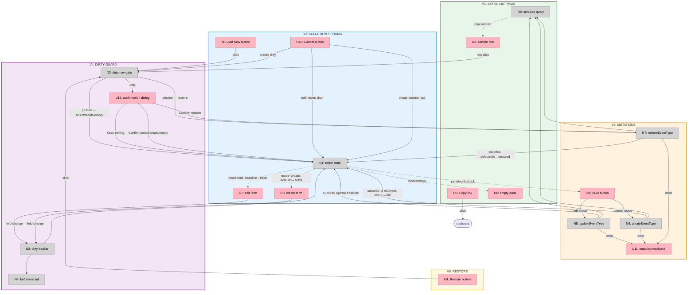

# Services Page: Slices

**Feature:** [Services Page: Split-Pane Service Management](./shaping.md)
**Selected shape:** A (Client editor shell with single active draft)
**Slices:** 5

---

## Sliced Breadboard

**Legend:**
- **Pink nodes (U)** = UI affordances
- **Grey nodes (N)** = Code affordances
- **Solid lines** = Wires Out (calls, triggers)
- **Dashed lines** = Returns To (data flowing back to UI)

---

## Slices Grid

|  |  |  |
|:--|:--|:--|
| **[V1: STATIC LIST PAGE](./v1-plan.md)** ⏳ PENDING  • Update page.tsx payload • Split-pane layout scaffold • Service rows with all badges • Copy link functional  *Demo: Browse services; correct badges/labels; Copy link copies URL* | **[V2: SELECTION + FORMS](./v2-plan.md)** ⏳ PENDING  • Editor state (selectedId, mode, baseline, draft) • Row click → edit form • Add New → create form with defaults • Cancel (edit revert / create exit)  *Demo: Click row → form populates; Add New → blank form; Cancel works* | **[V3: MUTATIONS](./v3-plan.md)** ⏳ PENDING  • Refactor actions.ts to ActionResult • Save in edit mode (updateEventType) • Save in create mode (createEventType → id) • Mutation feedback (pending/success/error/fieldErrors)  *Demo: Edit + Save → list updates; Create → new service in list* |
| **[V4: DIRTY GUARD](./v4-plan.md)** ⏳ PENDING  • Dirty tracker (draft vs baseline) • Dirty-navigation gate (all intents) • Discard confirmation dialog • beforeunload hook + nav lock  *Demo: Edit field, switch rows → dialog; browser close → native prompt* | **[V5: RESTORE](./v5-plan.md)** ⏳ PENDING  • Restore button wired (U4 → N3 → N7) • Restore-current dialog variant • Post-restore: row selected, edit mode • • &nbsp;  *Demo: Restore hidden/inactive service → becomes public, editor shows fresh values* | |

---

## V1: Static list page

### UI Affordances

| ID | Name | Place | Description | Wires Out |
|----|------|-------|-------------|-----------|
| U2 | Service row | Service List | Name, duration, deposit (override or "Policy default"), Default badge, Hidden/Inactive state badges; selected-row highlight; Add New and Restore buttons render but are not yet functional | → N3 (wired in V2/V5) |
| U5 | Copy link button | Service List | Visible only when `isActive=true`; copies `${bookingBaseUrl}?service=${id}` to clipboard | → clipboard (bypasses gate) |
| U6 | Empty pane | Editor Pane | Static text: "Select a service to edit, or click Add New" (or no-services variant) | — |

### Non-UI Affordances

| ID | Name | Place | Description | Wires Out |
|----|------|-------|-------------|-----------|
| N8 | Services query | Server | `page.tsx` updated: adds `shopPolicies` to `Promise.all`; builds `ShopContext` (`slotMinutes`, `defaultBufferMinutes`, `defaultDepositCents`, `bookingBaseUrl`); passes `ServicesPagePayload` to shell | → U2 (populate list) |

**Scope note:** Split-pane shell layout is scaffolded as a client component. U1 (Add New) and U4 (Restore) render visually but trigger no action. Editor pane always shows U6.

---

## V2: Selection + editor forms

### UI Affordances

| ID | Name | Place | Description | Wires Out |
|----|------|-------|-------------|-----------|
| U1 | Add New button | Services Page | Click enters create mode | → N3 (wired in V4; direct to N1 for now) |
| U7 | Edit form | Editor Pane | 7 editable fields pre-filled from baseline on row selection | → N2 (field change; wired in V4) |
| U8 | Create form | Editor Pane | Blank form initialised with R4.1 defaults | → N2 (field change; wired in V4) |
| U10 | Cancel button | Editor Pane | Edit: revert draft to baseline, stay on row. Create (pristine): exit to empty pane. Create (dirty): gated in V4 | → N1 |

### Non-UI Affordances

| ID | Name | Place | Description | Wires Out |
|----|------|-------|-------------|-----------|
| N1 | Editor state | Client State | `selectedId`, `mode` (`empty\|edit\|create`), `baseline`, `draft` — drives pane render; `dirty` / `pendingTarget` / `confirmState` added in V4 | → U6 / U7 / U8 (mode drives pane render) |

**Scope note:** No dirty tracking yet. Cancel in create mode always exits immediately in this slice (dirty path wired in V4). No Save wired.

---

## V3: Mutations

### UI Affordances

| ID | Name | Place | Description | Wires Out |
|----|------|-------|-------------|-----------|
| U9 | Save button | Editor Pane | Submits mutation; shows pending spinner; disabled during save | → N5 (edit mode) / N6 (create mode) |
| U11 | Mutation feedback | Editor Pane | Pending spinner inline with Save; per-field error messages; form-level error banner; brief success indicator | — |

### Non-UI Affordances

| ID | Name | Place | Description | Wires Out |
|----|------|-------|-------------|-----------|
| N5 | updateEventType | Server Actions | Refactored: typed `ServiceEditorValues` param; returns `ActionResult`; on success: `revalidatePath`, baseline updated | → N1 (success) / U11 (error) / N8 (revalidate) |
| N6 | createEventType | Server Actions | Refactored: returns `ActionResult<{ id: string }>`; on success: `revalidatePath`, `selectedId←id`, `mode=edit` | → N1 (success) / U11 (error) / N8 (revalidate) |
| N7 | restoreEventType | Server Actions | New action: `isHidden=false` + `isActive=true`; returns `ActionResult`; `revalidatePath` — client-wired in V5 | → N8 (revalidate) |

**Scope note:** `actions.ts` fully refactored to `ActionResult` envelope. Inline validation (fieldErrors) wired to form fields. N7 exists but has no client trigger until V5.

---

## V4: Dirty guard + confirmation

### UI Affordances

| ID | Name | Place | Description | Wires Out |
|----|------|-------|-------------|-----------|
| U12 | Confirmation dialog | Overlay | Generic variant: "Discard unsaved changes?" / "Keep editing" / "Discard changes". Restore-current variant added in V5 | → N1 (Keep editing or Confirm) / N7 (Confirm restore, V5) |

### Non-UI Affordances

| ID | Name | Place | Description | Wires Out |
|----|------|-------|-------------|-----------|
| N2 | Dirty tracker | Client State | Compares all 7 draft fields against baseline; sets `dirty` flag after every field change | → N1 (update dirty) / N4 (sync beforeunload) |
| N3 | Dirty-navigation gate | Client State | Intercepts row click / Add New / Cancel-create / mobile Back; if pristine → proceed; if dirty → store `pendingTarget`, open U12 | → U12 (dirty) / N1 (pristine) |
| N4 | beforeunload hook | Client State | Attaches native `beforeunload` listener when `dirty=true`; detaches when `dirty=false` | → browser |

**Scope note:** `pendingTarget` and `confirmState` added to N1 state. Save-pending nav lock (A12) disables all navigation during mutations. U10 create+dirty path now routes through N3. Mobile Back treated as `{ kind: "empty" }` target.

---

## V5: Restore action

### UI Affordances

| ID | Name | Place | Description | Wires Out |
|----|------|-------|-------------|-----------|
| U4 | Restore button | Service List | Now wired; visible when `isHidden=true` OR `isActive=false`; routes through N3; shows pending state | → N3 |
| U12 | Confirmation dialog (restore-current variant) | Overlay | "Restore service and discard edits?" / "Keep editing" / "Restore service" — used when dirty and restoring the currently open row | → N7 (Confirm) / N1 (Keep editing) |

### Non-UI Affordances

| ID | Name | Place | Description | Wires Out |
|----|------|-------|-------------|-----------|
| N7 | restoreEventType | Server Actions | Now client-wired; on success: `selectedId←id`, `mode=edit`, baseline = restored service values from refreshed list | → N1 (success) / U11 (error) / N8 (revalidate) |

**Scope note:** After restore, the list revalidates via `revalidatePath`. The client finds the restored service in the refreshed list and sets it as the new baseline.
