# Slice 5: Cancellation + Refund Window — Shaping Doc

**Status:** Shaping in progress
**Appetite:** 3 days
**Entry point:** Starting from Solution A (described in pitch)

---

## Frame

### Problem

- Disputes will spike without a clean cancellation path for customers
- Customers entitled to refunds need a deterministic, automated way to receive them
- Manual refund handling creates support burden and policy credibility issues
- Without cancellation prevention, post-appointment resolution (Slice 4) isn't sufficient

### Outcome

- Customers can cancel bookings via a secure link
- Refunds are automatically issued when cancellations occur before the policy cutoff
- Refunds are automatically denied when cancellations occur after the cutoff
- All state transitions (appointment, payment, outcome) remain consistent under retries
- Business has auditable record of cancellation decisions

---

## Requirements (R)

| ID | Requirement | Status |
|----|-------------|--------|
| **R0** | Customer can cancel a paid booking via a link (no account required) | Core goal |
| **R1** | Cancellation link must be secure (tokenized, non-guessable, single-purpose) | Must-have |
| **R2** | Policy cutoff is deterministic: evaluated using shop timezone and immutable policy snapshot | Must-have |
| **R3** | If cancelled before cutoff and payment succeeded: automatic full refund via Stripe | Must-have |
| **R4** | If cancelled after cutoff and payment captured: no refund, deposit retained | Must-have |
| **R5** | Cancellation endpoint is idempotent: retries do not cause double refunds or state corruption | Must-have |
| **R6** | Appointment, payment, and financial outcome states transition atomically and consistently | Must-have |
| **R7** | All cancellation actions are auditable (who, when, what decision, why) | Must-have |
| **R8** | Customer immediately sees cancellation outcome (refunded or not refunded) | Must-have |
| **R9** | Business dashboard shows cancelled appointments with financial outcome and reason | Must-have |
| **R10** | Slice 4 resolver must not overwrite cancellation outcomes when appointments end | Must-have |
| **R11** | Policy snapshot includes cancel_cutoff_minutes and refund_before_cutoff flag | Must-have |
| **R12** | Manage link provides read-only appointment summary and cancellation option | Nice-to-have |
| **R13** | Manage link shows policy cutoff and current refund eligibility status | Nice-to-have |

### Out of Scope (Explicit)

These are explicitly excluded from Slice 5:

- Rescheduling appointments
- Partial refunds (only full refund or no refund)
- "Reason for cancellation" taxonomy or free-text collection
- Disputes/chargebacks workflow
- Admin manual overrides or refund exceptions
- SMS/email notification of cancellation (can come later)

---

## Shape A: Customer Cancellation with Policy-Driven Refunds

| Part | Mechanism | Flag |
|------|-----------|:----:|
| **A1** | **Token-based manage link** | |
| A1.1 | `booking_manage_tokens` table (id, appointment_id FK unique, token_hash text unique, expires_at, created_at) | |
| A1.2 | Generate 32+ byte random token on booking confirmation, store hash only (bcrypt/sha256) | |
| A1.3 | Token shown on confirmation page as `/manage/{rawToken}` URL | |
| **A2** | **Manage page UI** | |
| A2.1 | `GET /manage/[token]` route validates token → loads appointment + shop + policy | |
| A2.2 | Display: appointment time (shop timezone), shop name, service, status | |
| A2.3 | Display: policy cutoff time, current refund eligibility indicator | |
| A2.4 | Cancel button (enabled if status=booked, disabled if already cancelled) | |
| A2.5 | Post-cancel view: status + refund outcome message | |
| **A3** | **Policy snapshot extensions** | |
| A3.1 | Add `cancel_cutoff_minutes` int not null default 1440 to policy_versions | |
| A3.2 | Add `refund_before_cutoff` boolean not null default true to policy_versions | |
| **A4** | **Appointments schema changes** | |
| A4.1 | Extend `status` enum: `booked | cancelled | ended` | |
| A4.2 | Add `cancelled_at` timestamptz null | |
| A4.3 | Add `cancellation_source` enum: `customer | system | admin` (use customer only in slice 5) | |
| A4.4 | Extend `resolution_reason` enum: add `cancelled_refunded_before_cutoff`, `cancelled_no_refund_after_cutoff` | |
| **A5** | **Payments schema changes** | |
| A5.1 | Add `refunded_amount_cents` int not null default 0 | |
| A5.2 | Add `stripe_refund_id` text null | |
| A5.3 | Add `refunded_at` timestamptz null | |
| **A6** | **Cancellation endpoint with refund logic** | |
| A6.1 | `POST /api/manage/[token]/cancel` validates token → loads appointment + policy + payment | |
| A6.2 | Validation: status must be `booked`, reject if already cancelled or ended | |
| A6.3 | Compute cutoff: `cutoffTime = starts_at - cancel_cutoff_minutes` (all in UTC) | |
| A6.4 | Evaluate eligibility: `isRefundable = now <= cutoffTime && payment.status === 'succeeded'` | |
| A6.5 | **If refundable:** Call `stripe.refunds.create()` with idempotency key `refund-${appointmentId}`, then update DB | |
| A6.6 | **If not refundable:** Update DB to cancelled + settled (deposit retained) | |
| A6.7 | DB update includes: appointments.status=cancelled, cancelled_at=now, financial_outcome, resolved_at, resolution_reason, payments.refunded_amount_cents, payments.stripe_refund_id, payments.refunded_at | |
| A6.8 | Write `appointment_events` audit entry: event=cancelled, source=customer, refund decision, timestamp | |
| **A7** | **Refund idempotency** | |
| A7.1 | Before issuing Stripe refund, check if `payments.stripe_refund_id` already exists | |
| A7.2 | If refund already exists, skip Stripe call, return success (idempotent) | |
| A7.3 | Use Stripe idempotency key (`refund-${appointmentId}`) to prevent duplicate API calls on retry | |
| **A8** | **Resolver integration (Slice 4 compatibility)** | |
| A8.1 | Modify resolver to skip appointments where `status=cancelled` (already resolved via cancellation) | |
| A8.2 | If somehow `status=cancelled` but `financial_outcome` null: backfill logic (refunded if refunded_amount > 0, else settled if payment captured, else voided) | |
| **A9** | **Business dashboard updates** | |
| A9.1 | `/app/appointments` shows `status` column (booked/cancelled/ended) | |
| A9.2 | Show `financial_outcome` column (settled/refunded/voided) | |
| A9.3 | Show `resolution_reason` as badge/tooltip | |

---

## Detail A: Breadboard

### UI Affordances

| ID | Place | Affordance | Wires Out |
|----|-------|------------|-----------|
| **U1** | Booking Confirmation Page | Manage link display (`/manage/{token}` URL) | — |
| **U2** | Manage Page | Appointment details (time, shop, service, status) | — |
| **U3** | Manage Page | Policy cutoff time display | — |
| **U4** | Manage Page | Refund eligibility indicator (eligible/not eligible) | — |
| **U5** | Manage Page | Cancel button (enabled if status=booked) | → N16 (POST cancel) |
| **U6** | Manage Page | Cancellation outcome message (refunded/no refund) | — |
| **U7** | Business Dashboard | Status column (booked/cancelled/ended) | — |
| **U8** | Business Dashboard | Financial outcome column (settled/refunded/voided) | — |
| **U9** | Business Dashboard | Resolution reason badge/tooltip | — |

### Non-UI Affordances

| ID | Place | Affordance | Wires Out | Returns To |
|----|-------|------------|-----------|------------|
| **N1** | Database | `booking_manage_tokens` table (id, appointment_id FK unique, token_hash, expires_at, created_at) | — | ← N2, N14 |
| **N2** | Booking Flow | Generate token handler (32+ byte random, store hash only) | → N1 (write) | — |
| **N3** | Database | `policy_versions.cancel_cutoff_minutes` int not null default 1440 | — | ← N18 |
| **N4** | Database | `policy_versions.refund_before_cutoff` boolean not null default true | — | ← N15 |
| **N5** | Database | `appointments.status` enum (booked/cancelled/ended) | — | ← N17, N22, N23, N26 |
| **N6** | Database | `appointments.cancelled_at` timestamptz null | — | ← N22, N23 |
| **N7** | Database | `appointments.cancellation_source` enum (customer/system/admin) | — | ← N22, N23 |
| **N8** | Database | `appointments.resolution_reason` enum (includes cancellation reasons) | — | ← N22, N23 |
| **N9** | Database | `payments.refunded_amount_cents` int not null default 0 | — | ← N22, N27 |
| **N10** | Database | `payments.stripe_refund_id` text null | — | ← N20, N22, N27 |
| **N11** | Database | `payments.refunded_at` timestamptz null | — | ← N22 |
| **N12** | Database | `appointment_events` table (audit log) | — | ← N24 |
| **N13** | Manage Page | `GET /manage/[token]` route handler | → N14, N15 | ← N1, N5, N3, N4 |
| **N14** | Manage Page | Validate token (hash lookup, check expiry) | — | → N1 (read) |
| **N15** | Manage Page | Load appointment + shop + policy data | — | → N5, N3, N4 (read) |
| **N16** | Cancellation API | `POST /api/manage/[token]/cancel` handler | → N17, N18, N19, N20 | — |
| **N17** | Cancellation API | Validate status = booked (reject if cancelled/ended) | — | → N5 (read) |
| **N18** | Cancellation API | Compute cutoff time (starts_at - cancel_cutoff_minutes in UTC) | — | → N3 (read) |
| **N19** | Cancellation API | Evaluate eligibility (now <= cutoff && payment.status === 'succeeded') | → N20 | — |
| **N20** | Cancellation API | Check existing refund (idempotency: skip if stripe_refund_id exists) | → N21 or N23 | → N10 (read) |
| **N21** | Cancellation API | Call `stripe.refunds.create()` with idempotency key `refund-${appointmentId}` | → Stripe API, → N22 | — |
| **N22** | Cancellation API | Update DB (refunded path: status=cancelled, refund fields, financial_outcome, resolution_reason) | → N5, N6, N7, N8, N9, N10, N11 (write) | — |
| **N23** | Cancellation API | Update DB (no refund path: status=cancelled, financial_outcome=settled, resolution_reason) | → N5, N6, N7, N8 (write) | — |
| **N24** | Cancellation API | Write audit event (event=cancelled, source=customer, refund decision, timestamp) | → N12 (write) | — |
| **N25** | Slice 4 Resolver | Resolver job (runs on appointment end time) | → N26 | — |
| **N26** | Slice 4 Resolver | Skip cancelled appointments check (if status=cancelled, skip processing) | — | → N5 (read) |
| **N27** | Slice 4 Resolver | Backfill logic (if status=cancelled but financial_outcome null, backfill based on refund fields) | — | → N9, N10 (read) |

### Breadboard Diagram

```mermaid
flowchart TB
    subgraph bookingConfirmation["PLACE: Booking Confirmation Page"]
        U1["U1: Manage link display"]
        N2["N2: Generate token handler"]
    end

    subgraph managePage["PLACE: Manage Page (/manage/[token])"]
        U2["U2: Appointment details"]
        U3["U3: Policy cutoff display"]
        U4["U4: Refund eligibility indicator"]
        U5["U5: Cancel button"]
        U6["U6: Outcome message"]
        N13["N13: GET handler"]
        N14["N14: Validate token"]
        N15["N15: Load appointment + policy"]
    end

    subgraph cancelAPI["PLACE: Cancellation API (/api/manage/[token]/cancel)"]
        N16["N16: POST cancel handler"]
        N17["N17: Validate status=booked"]
        N18["N18: Compute cutoff time"]
        N19["N19: Evaluate eligibility"]
        N20["N20: Check existing refund"]
        N21["N21: stripe.refunds.create()"]
        N22["N22: Update DB (refunded)"]
        N23["N23: Update DB (no refund)"]
        N24["N24: Write audit event"]
    end

    subgraph dashboard["PLACE: Business Dashboard"]
        U7["U7: Status column"]
        U8["U8: Financial outcome column"]
        U9["U9: Resolution reason badge"]
    end

    subgraph resolver["PLACE: Slice 4 Resolver"]
        N25["N25: Resolver job"]
        N26["N26: Skip cancelled check"]
        N27["N27: Backfill logic"]
    end

    subgraph database["PLACE: Database"]
        N1["N1: booking_manage_tokens"]
        N3["N3: policy_versions.cancel_cutoff_minutes"]
        N4["N4: policy_versions.refund_before_cutoff"]
        N5["N5: appointments.status"]
        N6["N6: appointments.cancelled_at"]
        N7["N7: appointments.cancellation_source"]
        N8["N8: appointments.resolution_reason"]
        N9["N9: payments.refunded_amount_cents"]
        N10["N10: payments.stripe_refund_id"]
        N11["N11: payments.refunded_at"]
        N12["N12: appointment_events"]
    end

    subgraph stripe["PLACE: Stripe API"]
        STRIPE["Stripe Refunds API"]
    end

    %% Booking flow
    N2 -->|write| N1

    %% Manage page flow
    U5 -->|click| N16
    N13 -->|validate| N14
    N13 -->|load data| N15
    N14 -.->|read hash| N1
    N15 -.->|read| N5
    N15 -.->|read| N3
    N15 -.->|read| N4

    %% Cancellation flow
    N16 -->|validate| N17
    N16 -->|compute| N18
    N16 -->|evaluate| N19
    N17 -.->|read| N5
    N18 -.->|read| N3
    N19 -->|if eligible| N20
    N19 -->|if not eligible| N23
    N20 -.->|check| N10
    N20 -->|if no existing refund| N21
    N20 -->|if refund exists| N22
    N21 -->|call with idempotency key| STRIPE
    N21 -->|on success| N22
    N22 -->|write| N5
    N22 -->|write| N6
    N22 -->|write| N7
    N22 -->|write| N8
    N22 -->|write| N9
    N22 -->|write| N10
    N22 -->|write| N11
    N23 -->|write| N5
    N23 -->|write| N6
    N23 -->|write| N7
    N23 -->|write| N8
    N16 -->|always| N24
    N24 -->|write| N12

    %% Dashboard flow
    U7 -.->|read| N5
    U8 -.->|read| N5
    U9 -.->|read| N8

    %% Resolver flow
    N25 -->|check status| N26
    N26 -.->|read| N5
    N26 -->|if status=cancelled & outcome=null| N27
    N27 -.->|read| N9
    N27 -.->|read| N10

    %% Styling
    classDef ui fill:#ffb6c1,stroke:#d87093,color:#000
    classDef nonui fill:#d3d3d3,stroke:#808080,color:#000
    classDef external fill:#fffacd,stroke:#ffd700,color:#000

    class U1,U2,U3,U4,U5,U6,U7,U8,U9 ui
    class N1,N2,N3,N4,N5,N6,N7,N8,N9,N10,N11,N12,N13,N14,N15,N16,N17,N18,N19,N20,N21,N22,N23,N24,N25,N26,N27 nonui
    class STRIPE external
```

**Legend:**
- **Pink nodes (U)** = UI affordances (things users see/interact with)
- **Grey nodes (N)** = Code affordances (data stores, handlers, services)
- **Yellow nodes** = External services (Stripe API)
- **Solid lines** = Wires Out (calls, triggers, writes)
- **Dashed lines** = Returns To (return values, data store reads)

---

## Fit Check (R × A)

| Req | Requirement | Status | A |
|-----|-------------|--------|---|
| **R0** | Customer can cancel a paid booking via a link (no account required) | Core goal | ✅ |
| **R1** | Cancellation link must be secure (tokenized, non-guessable, single-purpose) | Must-have | ✅ |
| **R2** | Policy cutoff is deterministic: evaluated using shop timezone and immutable policy snapshot | Must-have | ✅ |
| **R3** | If cancelled before cutoff and payment succeeded: automatic full refund via Stripe | Must-have | ✅ |
| **R4** | If cancelled after cutoff and payment captured: no refund, deposit retained | Must-have | ✅ |
| **R5** | Cancellation endpoint is idempotent: retries do not cause double refunds or state corruption | Must-have | ✅ |
| **R6** | Appointment, payment, and financial outcome states transition atomically and consistently | Must-have | ✅ |
| **R7** | All cancellation actions are auditable (who, when, what decision, why) | Must-have | ✅ |
| **R8** | Customer immediately sees cancellation outcome (refunded or not refunded) | Must-have | ✅ |
| **R9** | Business dashboard shows cancelled appointments with financial outcome and reason | Must-have | ✅ |
| **R10** | Slice 4 resolver must not overwrite cancellation outcomes when appointments end | Must-have | ✅ |
| **R11** | Policy snapshot includes cancel_cutoff_minutes and refund_before_cutoff flag | Must-have | ✅ |
| **R12** | Manage link provides read-only appointment summary and cancellation option | Nice-to-have | ✅ |
| **R13** | Manage link shows policy cutoff and current refund eligibility status | Nice-to-have | ✅ |

**Notes:**
- ~~**R3 fails:** A6.5 is flagged unknown (⚠️)~~ ✅ **RESOLVED via spike:** Use `stripe.refunds.create()` with idempotency key
- ~~**R5 fails:** A7 is flagged unknown (⚠️)~~ ✅ **RESOLVED via spike:** Idempotency via Stripe key + DB checks
- ~~**R6 fails:** A6 transaction boundaries unclear~~ ✅ **RESOLVED via spike:** Stripe outside transaction with idempotency safeguards

### Summary

**Shape A passes: 13/13 requirements (100%)** ✅
- ✅ Core goal satisfied (R0)
- ✅ All 11 must-haves satisfied
- ✅ All 2 nice-to-haves satisfied
- ✅ All flagged unknowns resolved via spike

**Shape A is now viable and ready for implementation.**

---

## Detailed Fit Check (R × A Parts)

This table shows which specific parts of Shape A contribute to each requirement:

| Req | Requirement | Status | A1 | A2 | A3 | A4 | A5 | A6 | A7 | A8 | A9 |
|-----|-------------|--------|:--:|:--:|:--:|:--:|:--:|:--:|:--:|:--:|:--:|
| **R0** | Customer can cancel a paid booking via a link (no account required) | Core goal | ✅ | ✅ | | | | ✅ | | | |
| **R1** | Cancellation link must be secure (tokenized, non-guessable, single-purpose) | Must-have | ✅ | ✅ | | | | | | | |
| **R2** | Policy cutoff is deterministic: evaluated using shop timezone and immutable policy snapshot | Must-have | | | ✅ | | | ✅ | | | |
| **R3** | If cancelled before cutoff and payment succeeded: automatic full refund via Stripe | Must-have | | | | | | ✅ | ✅ | | |
| **R4** | If cancelled after cutoff and payment captured: no refund, deposit retained | Must-have | | | ✅ | ✅ | ✅ | ✅ | | | |
| **R5** | Cancellation endpoint is idempotent: retries do not cause double refunds or state corruption | Must-have | | | | | | ✅ | ✅ | | |
| **R6** | Appointment, payment, and financial outcome states transition atomically and consistently | Must-have | | | | ✅ | ✅ | ✅ | | | |
| **R7** | All cancellation actions are auditable (who, when, what decision, why) | Must-have | | | | ✅ | | ✅ | | | |
| **R8** | Customer immediately sees cancellation outcome (refunded or not refunded) | Must-have | | ✅ | | | | ✅ | | | |
| **R9** | Business dashboard shows cancelled appointments with financial outcome and reason | Must-have | | | | ✅ | | | | | ✅ |
| **R10** | Slice 4 resolver must not overwrite cancellation outcomes when appointments end | Must-have | | | | ✅ | | | | ✅ | |
| **R11** | Policy snapshot includes cancel_cutoff_minutes and refund_before_cutoff flag | Must-have | | | ✅ | | | | | | |
| **R12** | Manage link provides read-only appointment summary and cancellation option | Nice-to-have | ✅ | ✅ | | | | | | | |
| **R13** | Manage link shows policy cutoff and current refund eligibility status | Nice-to-have | | ✅ | ✅ | | | ✅ | | | |

**Part Legend:**
- **A1:** Token-based manage link (tokens table, generation, hashing)
- **A2:** Manage page UI (route, display, cancel button)
- **A3:** Policy snapshot extensions (cancel_cutoff_minutes, refund_before_cutoff)
- **A4:** Appointments schema changes (status enum, cancelled_at, cancellation_source, resolution_reason)
- **A5:** Payments schema changes (refunded_amount_cents, stripe_refund_id, refunded_at)
- **A6:** Cancellation endpoint with refund logic ⚠️
- **A7:** Refund idempotency ⚠️
- **A8:** Resolver integration (skip cancelled, backfill logic)
- **A9:** Business dashboard updates (status, outcome, reason columns)

### Key Insights

**Requirements Coverage by Part:**

- **A6 (Cancellation endpoint)** carries the most weight: contributes to 7 requirements (R0, R2, R3, R4, R7, R8, R13), but fails 3 critical ones (R3, R5, R6) due to flagged unknowns
- **A4 (Appointments schema)** is foundational: supports 5 requirements (R4, R6, R7, R9, R10), enables auditability and state consistency
- **A1 + A2 (Token + UI)** handle user-facing needs: together satisfy security (R1) and customer experience (R0, R8, R12, R13)
- **A3 (Policy snapshot)** enables determinism: supports 3 requirements (R2, R4, R11, R13)

**Resolution Analysis:**

~~All failures traced to **A6 and A7**~~ ✅ **RESOLVED via spike:**
- ~~**R3 ❌:** A6 + A7 don't specify Stripe refund mechanism~~ → ✅ Use `stripe.refunds.create()` with idempotency key
- ~~**R5 ❌:** A7 doesn't detail idempotency strategy~~ → ✅ Idempotency via Stripe key + DB `stripe_refund_id` check
- ~~**R6 ❌:** A6 doesn't define transaction boundaries~~ → ✅ Stripe outside transaction with idempotency safeguards

**Result:**

Shape A now passes **13/13 requirements (100%)**. All parts are implementable with concrete mechanisms defined. See `spike-a6-stripe-refund.md` for detailed implementation strategy.

---

## Flagged Unknowns (⚠️)

### A6: Cancellation endpoint with refund logic ✅ RESOLVED

**Status:** Spike completed (see `spike-a6-stripe-refund.md`)

**Resolution:**
1. ✅ Use `stripe.refunds.create()` with `payment_intent` parameter
2. ✅ Use idempotency key: `refund-${appointmentId}`
3. ✅ Call Stripe OUTSIDE DB transaction (cannot rollback API calls)
4. ✅ Check `payments.stripe_refund_id` before calling Stripe (skip if exists)
5. ✅ Only mark DB as `refunded` AFTER Stripe confirms success
6. ✅ Handle errors: retry on network failures (idempotency ensures safety), accept `pending` status

**Implementation strategy:**
- Validate eligibility in transaction with row lock
- Call Stripe outside transaction with idempotency key
- Update DB in new transaction with double-check for race conditions
- Prevents: double refunds, inconsistent state, DB claiming refund before Stripe confirms

### A7: Refund idempotency ✅ RESOLVED

**Status:** Resolved via A6 spike

**Resolution:**
1. ✅ Stripe idempotency key (`refund-${appointmentId}`) prevents duplicate API calls
2. ✅ Check `payments.stripe_refund_id` in DB before issuing refund
3. ✅ Use row-level lock (`SELECT FOR UPDATE`) during validation to prevent concurrent processing
4. ✅ No separate dedup table needed (idempotency key + DB check sufficient)

**Race condition handling:**
- First request: locks row, validates, calls Stripe, updates DB
- Second concurrent request: blocks on row lock, sees status=cancelled, returns error or sees existing refund
- Retry after completion: sees `stripe_refund_id` exists, skips Stripe call, returns success

---

## Risks and Decisions Needing Clarification

### 1. Idempotency Strategy (HIGH RISK)

**Risk:** Double refunds, inconsistent state on retries, race conditions.

**Decision needed:**
- **Option A:** DB transaction wrapping Stripe call (Stripe inside transaction)
  - Pro: Atomic
  - Con: Long-running transaction if Stripe is slow, can't rollback Stripe API calls
- **Option B:** Stripe call first, then DB update with idempotency checks
  - Pro: Stripe refund ID guarantees idempotency, DB update can retry safely
  - Con: If DB update fails after Stripe succeeds, need reconciliation
- **Option C:** Dedup table with `INSERT ... ON CONFLICT` pattern before any work
  - Pro: Prevents duplicate processing at entry point
  - Con: Extra table, cleanup logic needed

**Recommendation:** Likely Option B (Stripe first) + Option C (dedup table) combined. Insert dedup key first, call Stripe with idempotency key, then update DB.

### 2. Timezone Cutoff Calculation (MEDIUM RISK)

**Risk:** Cutoff computed incorrectly, customers get wrong refund decision.

**Clarification needed:**
- `starts_at` is stored in UTC (confirmed in schema)
- `cancel_cutoff_minutes` is stored as integer (e.g., 1440 for 24h)
- Calculation: `cutoffTime = starts_at - (cancel_cutoff_minutes * 60 * 1000)` (all in UTC)
- Comparison: `now() <= cutoffTime` (both UTC)
- **Display in UI:** Convert `cutoffTime` to shop.timezone for customer-facing message

**Decision:** Confirm this approach is correct. No ambiguity allowed.

### 3. Semantic Ambiguity: "Cancelled but Settled" (MEDIUM RISK)

**Risk:** Business users confused by "cancelled" + "settled" combination.

**Current design:**
- Cancelled after cutoff → `status=cancelled`, `financial_outcome=settled`, `reason=cancelled_no_refund_after_cutoff`

**Clarification needed:**
- Is `settled` the right term for "deposit retained after late cancellation"?
- Alternative: Use `no_refund` or `forfeited` outcome value?
- UI copy must be very clear: "Cancelled — deposit retained (after cutoff)"

**Decision:** Confirm `settled` is acceptable or choose different term. Update UI copy accordingly.

### 4. Token Security Model (LOW-MEDIUM RISK)

**Risk:** Manage links leak access, customers access wrong bookings.

**Current design:**
- 32+ byte random token
- Store hash only (bcrypt or sha256?)
- One token per appointment (FK unique constraint)
- Optional expiry (90 days suggested)

**Clarification needed:**
- Use bcrypt (slow, expensive) or sha256 (fast, sufficient for random tokens)?
- Should token expire? If yes, what happens when expired? Show error or allow read-only access?
- Rate limiting on `/manage/[token]` endpoint?

**Decision:** Choose hashing algorithm. Decide on expiry policy (suggest 90 days for Slice 5).

### 5. Resolver Overwrite Prevention (HIGH RISK)

**Risk:** Slice 4 resolver runs after cancellation and overwrites `financial_outcome`.

**Current design (A8):**
- Resolver skips if `status=cancelled`
- Backfill logic if `status=cancelled` but `financial_outcome=null`

**Clarification needed:**
- Resolver runs on appointment end time (cron job?) — what prevents race condition if customer cancels right at end time?
- Should resolver check `resolved_at` timestamp instead of just `status`?
- What if resolver runs first, then customer cancels? Does cancellation check if already resolved?

**Decision:** Add check to cancellation endpoint: if `resolved_at` is already set, reject cancellation (too late). Or allow cancellation to overwrite resolver decision if within cutoff?

### 6. Stripe Refund API Error Handling (HIGH RISK)

**Risk:** Stripe API fails (timeout, 500, rate limit) — what does customer see? What is DB state?

**Scenarios:**
1. **Stripe returns 500:** Do we fail the cancellation request? Retry automatically? Show "try again" message?
2. **Stripe timeout:** Same as above
3. **Stripe rate limit:** Queue for retry? Fail immediately?
4. **Stripe succeeds but returns error code (e.g., insufficient funds):** How to handle?

**Decision needed:** Define error handling policy for each scenario. Suggest:
- 500/timeout: Fail request, show "try again" message, log for manual review
- Rate limit: Unlikely for refunds, but same as 500
- Insufficient funds: Should not happen for refunds, but log and alert if occurs

### 7. Schema Migration Ordering (MEDIUM RISK)

**Risk:** Migration breaks existing data or violates constraints.

**Migrations needed:**
1. Add policy_versions columns (cancel_cutoff_minutes, refund_before_cutoff)
2. Extend appointments.status enum (add `cancelled`)
3. Add appointments columns (cancelled_at, cancellation_source, extend resolution_reason enum)
4. Add payments columns (refunded_amount_cents, stripe_refund_id, refunded_at)
5. Create booking_manage_tokens table
6. Optional: Create refund_dedup table

**Clarification needed:**
- Backfill policy_versions with default values (1440 minutes, true)?
- Are there existing appointments that need status backfilled?
- Migration order to avoid constraint violations?

**Decision:** Confirm migration order and backfill strategy.

---

## Next Steps

### To proceed with Shape A:

1. **Resolve flagged unknowns (⚠️):**
   - [ ] Spike: Stripe refund API integration (A6.5)
   - [ ] Decide: Idempotency strategy (A7)

2. **Clarify critical decisions:**
   - [ ] Decision: Idempotency approach (transaction boundaries, dedup table)
   - [ ] Decision: Timezone cutoff calculation (confirm approach)
   - [ ] Decision: Semantic term for "cancelled after cutoff" (settled vs forfeited)
   - [ ] Decision: Token hashing (bcrypt vs sha256)
   - [ ] Decision: Token expiry policy (90 days? no expiry?)
   - [ ] Decision: Resolver race condition handling (resolved_at check, cancellation-after-resolution policy)
   - [ ] Decision: Stripe error handling policy (fail immediately vs retry vs queue)

3. **Validate scope:**
   - [ ] Confirm out-of-scope items are acceptable (no rescheduling, no partial refunds, no SMS notification)
   - [ ] Confirm 3-day appetite is realistic given flagged unknowns and risks

4. **Once resolved:**
   - [ ] Run fit check (R × A) to verify all requirements are satisfied
   - [ ] Breadboard Shape A into concrete affordances (use `/breadboarding` skill)
   - [ ] Slice into vertical increments

---

## Slices

### V1: SCHEMA + TOKEN SYSTEM

**Goal:** Customer sees manage link after booking

**Affordances:**

| ID | Place | Affordance |
|----|-------|------------|
| **Database Schema** |||
| N1 | Database | `booking_manage_tokens` table |
| N3 | Database | `policy_versions.cancel_cutoff_minutes` |
| N4 | Database | `policy_versions.refund_before_cutoff` |
| N5 | Database | `appointments.status` enum extension |
| N6 | Database | `appointments.cancelled_at` |
| N7 | Database | `appointments.cancellation_source` |
| N8 | Database | `appointments.resolution_reason` extension |
| N9 | Database | `payments.refunded_amount_cents` |
| N10 | Database | `payments.stripe_refund_id` |
| N11 | Database | `payments.refunded_at` |
| N12 | Database | `appointment_events` table |
| **Token Generation** |||
| N2 | Booking Flow | Generate token handler |
| U1 | Booking Confirmation | Manage link display |

**Demo:** Book appointment → confirmation page shows `/manage/{token}` link

---

### V2: MANAGE PAGE

**Goal:** Customer can view appointment details and cancellation eligibility

**Affordances:**

| ID | Place | Affordance |
|----|-------|------------|
| N13 | Manage Page | GET /manage/[token] handler |
| N14 | Manage Page | Validate token |
| N15 | Manage Page | Load appointment + shop + policy |
| U2 | Manage Page | Appointment details display |
| U3 | Manage Page | Policy cutoff time display |
| U4 | Manage Page | Refund eligibility indicator |
| U5 | Manage Page | Cancel button |

**Demo:** Click manage link → see appointment details, cutoff time, eligibility status, and cancel button

---

### V3: CANCELLATION WORKS

**Goal:** Customer can cancel and receive refund (or not) based on policy

**Affordances:**

| ID | Place | Affordance |
|----|-------|------------|
| N16 | Cancellation API | POST /api/manage/[token]/cancel handler |
| N17 | Cancellation API | Validate status=booked |
| N18 | Cancellation API | Compute cutoff time |
| N19 | Cancellation API | Evaluate eligibility |
| N20 | Cancellation API | Check existing refund (idempotency) |
| N21 | Cancellation API | Call stripe.refunds.create() |
| N22 | Cancellation API | Update DB (refunded path) |
| N23 | Cancellation API | Update DB (no refund path) |
| N24 | Cancellation API | Write audit event |
| U6 | Manage Page | Cancellation outcome message |

**Demo:**
- Cancel before cutoff → see "Refunded $X.XX to your card"
- Cancel after cutoff → see "Deposit retained per cancellation policy"

---

### V4: DASHBOARD VISIBILITY

**Goal:** Business sees cancelled appointments with financial outcomes

**Affordances:**

| ID | Place | Affordance |
|----|-------|------------|
| U7 | Business Dashboard | Status column (booked/cancelled/ended) |
| U8 | Business Dashboard | Financial outcome column (settled/refunded/voided) |
| U9 | Business Dashboard | Resolution reason badge/tooltip |

**Demo:** Admin views `/app/appointments` → sees cancelled appointments with financial outcomes and reasons

---

### V5: RESOLVER SAFETY

**Goal:** Slice 4 resolver doesn't overwrite cancellation outcomes

**Affordances:**

| ID | Place | Affordance |
|----|-------|------------|
| N25 | Slice 4 Resolver | Resolver job |
| N26 | Slice 4 Resolver | Skip cancelled appointments check |
| N27 | Slice 4 Resolver | Backfill logic (if outcome null) |

**Demo:** Cancelled appointment reaches end time → resolver skips it, doesn't change financial_outcome

---

### Sliced Breadboard

```mermaid
flowchart TB
    subgraph slice1["V1: SCHEMA + TOKEN SYSTEM"]
        subgraph database1["Database"]
            N1["N1: booking_manage_tokens"]
            N3["N3: policy.cancel_cutoff"]
            N4["N4: policy.refund_before_cutoff"]
            N5["N5: appointments.status"]
            N6["N6: appointments.cancelled_at"]
            N7["N7: appointments.cancellation_source"]
            N8["N8: appointments.resolution_reason"]
            N9["N9: payments.refunded_amount"]
            N10["N10: payments.stripe_refund_id"]
            N11["N11: payments.refunded_at"]
            N12["N12: appointment_events"]
        end
        subgraph booking1["Booking Confirmation"]
            U1["U1: Manage link display"]
            N2["N2: Generate token"]
        end
    end

    subgraph slice2["V2: MANAGE PAGE"]
        subgraph managePage2["Manage Page"]
            U2["U2: Appointment details"]
            U3["U3: Policy cutoff display"]
            U4["U4: Eligibility indicator"]
            U5["U5: Cancel button"]
            N13["N13: GET handler"]
            N14["N14: Validate token"]
            N15["N15: Load data"]
        end
    end

    subgraph slice3["V3: CANCELLATION WORKS"]
        subgraph cancelAPI3["Cancellation API"]
            N16["N16: POST handler"]
            N17["N17: Validate status"]
            N18["N18: Compute cutoff"]
            N19["N19: Evaluate eligibility"]
            N20["N20: Check existing refund"]
            N21["N21: stripe.refunds.create()"]
            N22["N22: Update DB (refunded)"]
            N23["N23: Update DB (no refund)"]
            N24["N24: Write audit"]
        end
        subgraph managePage3["Manage Page"]
            U6["U6: Outcome message"]
        end
        subgraph stripe3["Stripe API"]
            STRIPE["Stripe Refunds"]
        end
    end

    subgraph slice4["V4: DASHBOARD VISIBILITY"]
        subgraph dashboard4["Business Dashboard"]
            U7["U7: Status column"]
            U8["U8: Financial outcome column"]
            U9["U9: Resolution reason badge"]
        end
    end

    subgraph slice5["V5: RESOLVER SAFETY"]
        subgraph resolver5["Slice 4 Resolver"]
            N25["N25: Resolver job"]
            N26["N26: Skip cancelled check"]
            N27["N27: Backfill logic"]
        end
    end

    %% Force slice ordering
    slice1 ~~~ slice2
    slice2 ~~~ slice3
    slice3 ~~~ slice4
    slice4 ~~~ slice5

    %% V1 wiring
    N2 -->|write| N1

    %% V2 wiring
    U5 -->|click| N16
    N13 -->|validate| N14
    N13 -->|load| N15
    N14 -.->|read| N1
    N15 -.->|read| N5
    N15 -.->|read| N3
    N15 -.->|read| N4

    %% V3 wiring
    N16 -->|validate| N17
    N16 -->|compute| N18
    N16 -->|evaluate| N19
    N17 -.->|read| N5
    N18 -.->|read| N3
    N19 -->|if eligible| N20
    N19 -->|if not| N23
    N20 -.->|check| N10
    N20 -->|if none| N21
    N20 -->|if exists| N22
    N21 -->|call| STRIPE
    N21 -->|success| N22
    N22 -->|write| N5
    N22 -->|write| N6
    N22 -->|write| N7
    N22 -->|write| N8
    N22 -->|write| N9
    N22 -->|write| N10
    N22 -->|write| N11
    N23 -->|write| N5
    N23 -->|write| N6
    N23 -->|write| N7
    N23 -->|write| N8
    N16 -->|always| N24
    N24 -->|write| N12

    %% V4 wiring
    U7 -.->|read| N5
    U8 -.->|read| N5
    U9 -.->|read| N8

    %% V5 wiring
    N25 -->|check| N26
    N26 -.->|read| N5
    N26 -->|if null| N27
    N27 -.->|read| N9
    N27 -.->|read| N10

    %% Slice styling
    style slice1 fill:#e8f5e9,stroke:#4caf50,stroke-width:3px
    style slice2 fill:#e3f2fd,stroke:#2196f3,stroke-width:3px
    style slice3 fill:#fff3e0,stroke:#ff9800,stroke-width:3px
    style slice4 fill:#f3e5f5,stroke:#9c27b0,stroke-width:3px
    style slice5 fill:#fff8e1,stroke:#ffc107,stroke-width:3px

    %% Nested subgraphs transparent
    style database1 fill:transparent,stroke:#888,stroke-width:1px
    style booking1 fill:transparent,stroke:#888,stroke-width:1px
    style managePage2 fill:transparent,stroke:#888,stroke-width:1px
    style cancelAPI3 fill:transparent,stroke:#888,stroke-width:1px
    style managePage3 fill:transparent,stroke:#888,stroke-width:1px
    style stripe3 fill:transparent,stroke:#888,stroke-width:1px
    style dashboard4 fill:transparent,stroke:#888,stroke-width:1px
    style resolver5 fill:transparent,stroke:#888,stroke-width:1px

    %% Node styling
    classDef ui fill:#ffb6c1,stroke:#d87093,color:#000
    classDef nonui fill:#d3d3d3,stroke:#808080,color:#000
    classDef external fill:#fffacd,stroke:#ffd700,color:#000

    class U1,U2,U3,U4,U5,U6,U7,U8,U9 ui
    class N1,N2,N3,N4,N5,N6,N7,N8,N9,N10,N11,N12,N13,N14,N15,N16,N17,N18,N19,N20,N21,N22,N23,N24,N25,N26,N27 nonui
    class STRIPE external
```

---

### Slices Grid

|  |  |  |
|:--|:--|:--|
| **[V1: SCHEMA + TOKEN SYSTEM](./slice-5-v1-plan.md)** ⏳ PENDING  • All database migrations • Token generation on booking • Display manage link • Policy cutoff fields  *Demo: Book → see manage link* | **[V2: MANAGE PAGE](./slice-5-v2-plan.md)** ⏳ PENDING  • GET /manage/[token] route • Token validation • Show appointment details • Show cutoff & eligibility  *Demo: Visit link → see details* | **[V3: CANCELLATION WORKS](./slice-5-v3-plan.md)** ⏳ PENDING  • POST /cancel endpoint • Cutoff evaluation logic • Stripe refund integration • Idempotency safeguards  *Demo: Cancel → see outcome* |
| **V4: DASHBOARD VISIBILITY** ⏳ PENDING  • Status column • Financial outcome column • Resolution reason badge • &nbsp;  *Demo: View cancelled in dashboard* | **V5: RESOLVER SAFETY** ⏳ PENDING  • Skip cancelled appointments • Backfill logic for edge cases • Integration with Slice 4 resolver • &nbsp;  *Demo: Resolver respects cancellations* | |

---

## Questions for You

1. **Idempotency:** How do you want to handle the Stripe API + DB update transaction? Inside DB transaction, or Stripe first then DB with idempotency checks?

2. **Resolver race condition:** Should cancellation be blocked if `resolved_at` is already set? Or should cancellation always win if within cutoff window?

3. **Token security:** Bcrypt or SHA256 for token hashing? Should tokens expire after 90 days?

4. **Stripe errors:** What should customer see if Stripe API returns 500 or times out? "Please try again" message?

5. **"Settled" semantics:** Is `financial_outcome=settled` acceptable for "cancelled after cutoff, deposit retained"? Or prefer different term?

6. **Missing requirements:** Are there any requirements I missed from the pitch document that should be added to R?
