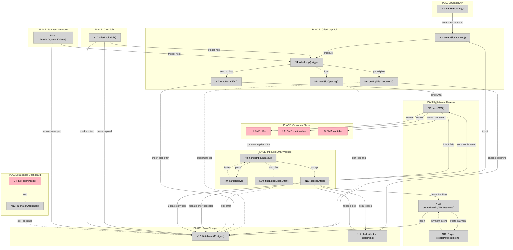

# Slice 6: Slot Recovery (Autopilot) — Shaping

**Source pitch:** `docs/requirements/Vertical Slice 6 Slot opening + offer loop (MVP autopilot).md`

**Appetite:** 3 days hard stop

**Problem:** Cancellations create wasted capacity. Manual recovery is slow or non-existent. We have all the pieces (booking, payment, SMS, policy) but no closed loop to turn cancellation → recovered booking automatically.

**Outcome:** First YES wins the slot and creates a paid booking. No staff involvement. No double booking under concurrent replies.

---

## Requirements (R)

| ID | Requirement | Status |
|----|-------------|--------|
| **R0** | Cancellation triggers automatic slot recovery with no staff action required | Core goal |
| **R1** | Offers are sent sequentially (one customer at a time), not broadcast | Must-have |
| **R2** | First affirmative reply wins the slot and creates a paid booking | Core goal |
| **R3** | No double booking under concurrent replies (race condition safety) | Must-have |
| **R4** | Payment required per shop policy (no free bookings) | Must-have |
| **R5** | Eligibility filtering is deterministic and simple (no AI/ranking) | Must-have |
| **R6** | Offers expire and system advances to next customer automatically | Must-have |
| **R7** | Payment failure after YES does not poison the slot (returns to open) | Must-have |
| **R8** | Recovery respects existing payment policies (deposit/prepay) | Must-have |
| **R9** | Only cancelled bookings that were paid create slot openings | Must-have |

### Out of Scope (Explicit)

- AI ranking / optimization of customer selection
- Broadcast offers (all customers notified simultaneously)
- Waitlists / customer preference UI
- Partial fills / overbooking strategies
- Multiple simultaneous slot openings
- Push notifications or email channels (SMS only)

---

## A: Sequential SMS Offers with Redis Locking

The solution proposed in the pitch.

| Part | Mechanism |
|------|-----------|
| **A1** | **Slot opening creation on cancellation** |
| A1.1 | `createSlotOpeningFromCancellation()` helper in `src/lib/slot-recovery.ts` called after refund path (route.ts:93) and no-refund path (route.ts:143) |
| A1.2 | Guards: payment succeeded + appointment time in future; insert slot_opening with status='open' |
| A1.3 | `POST /api/jobs/offer-loop` with `{slotOpeningId}` body, authenticated via `x-internal-secret` header |
| **A2** | **Eligibility filtering** |
| A2.1 | Query customers: `sms_opt_in=true`, valid phone, not already booked for overlapping time |
| A2.2 | `isInCooldown(customerId)` checks Redis key `offer_cooldown:{customerId}` existence (50ms per check) |
| A2.3 | Optional: filter to customers with at least one prior `financialOutcome='settled'` booking |
| A2.4 | Order by most recent settled booking DESC (deterministic, no AI/ranking) |
| **A3** | **Sequential offer loop** |
| A3.1 | `/api/jobs/offer-loop` endpoint loads slot_opening, skips if status != 'open' (idempotent) |
| A3.2 | For first eligible customer: send SMS via Twilio, insert `slot_offer(status='sent', expires_at=now+15min)` |
| A3.3 | Passive wait: no blocking/polling; state advances via inbound SMS webhook OR expiry cron (every 5 min) |
| A3.4 | Stop when: offer accepted (slot='filled') OR no eligible customers remain (slot='expired') |
| **A4** | **Inbound SMS handler for YES** |
| A4.1 | Parse `Body` field, query latest `slot_offer` WHERE customer phone matches AND status='sent' |
| A4.2 | `acquireLock(key, 30)` using SET NX EX; returns unique lockId; ~100ms; fails if key exists (concurrent YES) |
| A4.3 | Re-check slot_opening status='open' (might have changed); update offer status='accepted' in transaction |
| A4.4 | `createBookingWithPayment()` reuses Slice 2 logic; creates appointment + Stripe payment intent |
| A4.5 | Update slot_opening status='filled'; `releaseLock(key, lockId)` using Lua script (atomic check-and-delete); ~100ms |
| A4.6 | `sendSMS(phone, confirmationMessage)` with payment link; `setCooldown(customerId, 86400)` sets 24h TTL key |
| **A5** | **Expiry handling** |
| A5.1 | `/api/jobs/expire-offers` cron (vercel.json) runs every 5 min; PostgreSQL advisory lock prevents overlapping runs |
| A5.2 | Query offers WHERE status='sent' AND expires_at <= now, LIMIT 25; update to status='expired' (idempotent WHERE) |
| A5.3 | For each expired offer's slot_opening (if still open): `POST /api/jobs/offer-loop` to trigger next customer |
| **A6** | **Payment failure recovery** |
| A6.1 | Stripe webhook `/api/stripe/webhook` handles `payment_intent.payment_failed` event |
| A6.2 | Query slot_opening by appointment.sourceSlotOpeningId; update status='open' (reopen for next offer) |
| A6.3 | `POST /api/jobs/offer-loop` with slotOpeningId to trigger next eligible customer |
| **A7** | **Data model** |
| A7.1 | `slot_openings`: id uuid, shop_id uuid fk, starts_at timestamptz, ends_at timestamptz, source_appointment_id uuid fk, status enum(open/filled/expired), created_at timestamptz |
| A7.2 | `slot_offers`: id uuid, slot_opening_id uuid fk, customer_id uuid fk, channel enum(sms), status enum(sent/accepted/expired/declined), sent_at timestamptz, expires_at timestamptz, accepted_at timestamptz null |
| A7.3 | Unique constraints: `(shop_id, starts_at)` on slot_openings (prevents duplicate openings); `(slot_opening_id, customer_id)` on slot_offers (one offer per customer per slot) |
| A7.4 | Redis: `@upstash/redis` package; client singleton in `src/lib/redis.ts`; env: `UPSTASH_REDIS_REST_URL`, `UPSTASH_REDIS_REST_TOKEN` |
| **A8** | **Business dashboard (minimal UI)** |
| A8.1 | `/app/appointments` page: add slot openings section; query slot_openings by shopId; display time, status, link to recovered booking (if filled) |

### Flagged Unknowns (⚠️)

We've identified **9 flagged unknowns** where we know WHAT we want but not yet HOW to build it:

| Part | Unknown | Status |
|------|---------|--------|
| **A1.1** | Hook into cancellation flow | ✅ **RESOLVED** - See `spike-a1-cancellation-hook.md` |
| **A1.3** | Enqueue offer loop job | ✅ **RESOLVED** - See `spike-a2-background-jobs.md` |
| **A2.2** | Redis cooldown check | ✅ **RESOLVED** - See `spike-a3-redis-locks.md` |
| **A3.3** | Passive wait mechanism | ✅ **RESOLVED** - See `spike-a2-background-jobs.md` |
| **A4.2** | Acquire Redis lock | ✅ **RESOLVED** - See `spike-a3-redis-locks.md` |
| **A4.5** | Release Redis lock | ✅ **RESOLVED** - See `spike-a3-redis-locks.md` |
| **A5.1** | Cron job setup | ✅ **RESOLVED** - See `spike-a2-background-jobs.md` |
| **A5.3** | Trigger next offer | ✅ **RESOLVED** - See `spike-a2-background-jobs.md` |
| **A6.1** | Detect payment failure | ✅ **RESOLVED** - See `spike-a2-background-jobs.md` |
| **A6.3** | Move to next customer | ✅ **RESOLVED** - See `spike-a2-background-jobs.md` |
| **A7.4** | Redis setup | ✅ **RESOLVED** - See `spike-a3-redis-locks.md` |

**All flagged unknowns resolved: 11/11** ✅

### Required Spikes

To resolve these unknowns, we need **3 spikes**:

1. ✅ **Spike: Cancellation Hook Point** — COMPLETE
   - **See:** `spike-a1-cancellation-hook.md`
   - **Result:** Shared helper function called after both refund and no-refund paths
   - **Hook points:** Line 93 (refund path) and line 143 (no-refund path)
   - **Conditions:** Payment succeeded + appointment time in future

2. ✅ **Spike: Background Job Pattern on Vercel** — COMPLETE
   - **See:** `spike-a2-background-jobs.md`
   - **Pattern:** Vercel Cron + API Routes (matches existing resolve-outcomes pattern)
   - **Offer loop:** POST /api/jobs/offer-loop (from cancellation, expiry, payment failure)
   - **Expiry cron:** Every 5 minutes via vercel.json
   - **Env vars:** `APP_URL`, `INTERNAL_SECRET`

3. ✅ **Spike: Redis Lock Pattern with Upstash** — COMPLETE
   - **See:** `spike-a3-redis-locks.md`
   - **Client:** `@upstash/redis` package, REST-based, serverless-friendly
   - **Lock pattern:** acquireLock() using SET NX EX with unique lockId (~100ms)
   - **Release pattern:** releaseLock() using Lua script for atomic check-and-delete (~100ms)
   - **Cooldown pattern:** isInCooldown() checks TTL key existence (~50ms)
   - **Safety:** Lua script prevents releasing wrong lock, TTL prevents lock poisoning

**All spikes complete: 3/3** ✅

---

## B: Broadcast Offers (First Response Wins)

Notify all eligible customers simultaneously, first affirmative reply wins.

| Part | Mechanism |
|------|-----------|
| **B1** | **Slot opening creation** (same as A1) |
| B1.1 | Hook into cancellation, create slot_opening, enqueue broadcast job |
| **B2** | **Eligibility filtering** (same as A2) |
| B2.1 | Query all eligible customers at once |
| B2.2 | Apply cooldown and overlap checks |
| **B3** | **Broadcast SMS** |
| B3.1 | Send SMS to ALL eligible customers simultaneously |
| B3.2 | Create `slot_offer(status=sent)` for each customer |
| B3.3 | No expiry per customer - slot itself has expiry window |
| **B4** | **Inbound SMS handler (race to win)** |
| B4.1 | Parse YES, acquire Redis lock `slot_lock:{shopId}:{startsAt}` |
| B4.2 | Check slot_opening still `open`, mark winner's offer `accepted` |
| B4.3 | Create booking + payment for winner |
| B4.4 | Mark slot_opening `filled`, release lock |
| B4.5 | Reply confirmation to winner |
| **B5** | **Loser notification** |
| B5.1 | For all other customers who replied YES after slot filled: send "Sorry, slot taken" SMS |
| **B6** | **Payment failure recovery** (same as A6) |
| B6.1 | If winner's payment fails: reopen slot, re-broadcast to remaining eligible customers |
| **B7** | **Data model** (same as A7) |
| **B8** | **Business dashboard** (same as A8) |

---

## C: Waitlist-Based Recovery

Customers pre-register interest in openings, offers go to waitlist members in order.

| Part | Mechanism |
|------|-----------|
| **C1** | **Waitlist registration UI** |
| C1.1 | Customer-facing form: select service, time preferences, SMS consent |
| C1.2 | `waitlist_entries` table: customer_id, shop_id, service_type, preferred_times, created_at |
| **C2** | **Slot opening creation** (same as A1) |
| **C3** | **Waitlist matching** |
| C3.1 | On slot opening: query waitlist for matching service/time preferences |
| C3.2 | Order by waitlist registration time (first-in-first-out) |
| **C4** | **Sequential offers to waitlist** (same as A3) |
| C4.1 | Send SMS to first waitlist member, wait for reply or expiry |
| C4.2 | Advance to next waitlist member if declined/expired |
| **C5** | **Inbound SMS handler** (same as A4) |
| **C6** | **Payment failure recovery** (same as A6) |
| **C7** | **Data model** |
| C7.1 | Add `waitlist_entries` table (in addition to slot_openings/slot_offers) |
| **C8** | **Business dashboard** |
| C8.1 | View waitlist entries per service |
| C8.2 | View slot openings and recovery status |

---

## D: Time-Slotted Sequential Offers

Give each customer a fixed time window to respond before moving to next.

| Part | Mechanism |
|------|-----------|
| **D1** | **Slot opening creation** (same as A1) |
| **D2** | **Eligibility filtering** (same as A2) |
| **D3** | **Time-slotted offer loop** |
| D3.1 | Send SMS to first customer with explicit deadline: "Reply YES by 2:15pm to book" |
| D3.2 | Create `slot_offer(status=sent, expires_at=now+5min)` |
| D3.3 | **Active wait**: scheduled job at expires_at marks offer expired and triggers next customer |
| D3.4 | Each customer gets exactly 5 minutes (configurable per shop policy) |
| **D4** | **Inbound SMS handler** (same as A4) |
| D4.1 | Accept YES if within window, reject if expired |
| **D5** | **Expiry job** |
| D5.1 | Scheduled job per offer: at expires_at, mark expired and send to next customer |
| D5.2 | Send "Offer expired" SMS to customer who didn't respond |
| **D6** | **Payment failure recovery** (same as A6) |
| **D7** | **Data model** (same as A7) |
| **D8** | **Business dashboard** (same as A8) |

---

---

## Fit Check (Shapes Comparison)

| Req | Requirement | Status | A | B | C | D |
|-----|-------------|--------|---|---|---|---|
| R0 | Cancellation triggers automatic slot recovery with no staff action required | Core goal | ✅ | ✅ | ✅ | ✅ |
| R1 | Offers are sent sequentially (one customer at a time), not broadcast | Must-have | ✅ | ❌ | ✅ | ✅ |
| R2 | First affirmative reply wins the slot and creates a paid booking | Core goal | ✅ | ✅ | ✅ | ✅ |
| R3 | No double booking under concurrent replies (race condition safety) | Must-have | ✅ | ✅ | ✅ | ✅ |
| R4 | Payment required per shop policy (no free bookings) | Must-have | ✅ | ✅ | ✅ | ✅ |
| R5 | Eligibility filtering is deterministic and simple (no AI/ranking) | Must-have | ✅ | ✅ | ✅ | ✅ |
| R6 | Offers expire and system advances to next customer automatically | Must-have | ✅ | ✅ | ✅ | ✅ |
| R7 | Payment failure after YES does not poison the slot (returns to open) | Must-have | ✅ | ✅ | ✅ | ✅ |
| R8 | Recovery respects existing payment policies (deposit/prepay) | Must-have | ✅ | ✅ | ✅ | ✅ |
| R9 | Only cancelled bookings that were paid create slot openings | Must-have | ✅ | ✅ | ✅ | ✅ |

**Notes:**
- **B fails R1:** Broadcasts to all customers simultaneously, violating the sequential principle
- **C scope concern:** Adds waitlist UI (out of scope per pitch), increases implementation complexity beyond 3-day appetite

---

## Fit Check (R × A): How Shape A Satisfies Requirements

| Part | R0 Auto recovery | R1 Sequential not broadcast | R2 First YES wins | R3 No double booking | R4 Payment required | R5 Simple eligibility | R6 Auto expiry | R7 Payment failure recovery | R8 Respects policies | R9 Only paid cancels |
|------|:--:|:--:|:--:|:--:|:--:|:--:|:--:|:--:|:--:|:--:|
| **A1: Slot opening creation** | ✅ | | | | | | | | | ✅ |
| **A2: Eligibility filtering** | ✅ | | | | | ✅ | | | | |
| **A3: Sequential offer loop** | ✅ | ✅ | | | | | | | | |
| **A4: Inbound SMS handler** | ✅ | | ✅ | ✅ | ✅ | | | | ✅ | |
| **A5: Expiry handling** | ✅ | | | | | | ✅ | | | |
| **A6: Payment failure recovery** | ✅ | | | | | | | ✅ | | |
| **A7: Data model** | | | | ✅ | | | | | | |
| **A8: Business dashboard** | | | | | | | | | | |

**Key insights:**
- **A1 + A3** work together to satisfy R0 (automatic recovery) and R9 (only paid cancellations trigger)
- **A3** is critical for R1 (sequential, not broadcast)
- **A4** is the workhorse - satisfies R2, R3, R4, R8 through Redis locking + payment integration
- **A5** closes the loop for R6 (automatic expiry and advancement)
- **A6** handles edge case for R7 (payment failure doesn't poison slot)
- **A7** provides concurrency safety (R3) via unique constraints and Redis locks

---

## Analysis

### Shape A: Sequential SMS Offers with Redis Locking
**Passes all requirements.** This is the approach from the pitch.

**Strengths:**
- Clean sequential flow (satisfies R1)
- Passive wait model (no complex scheduling)
- Minimal scope (fits 3-day appetite)

**Weaknesses:**
- Slower to fill (waits for each expiry before next offer)
- No explicit customer expectations (customer doesn't know they're in a queue)

### Shape B: Broadcast Offers
**Fails R1** (sequential requirement). Explicitly ruled out in "Out of Scope" section of pitch.

**Why it fails:** Broadcasts create urgency/pressure ("race to click YES first") which conflicts with the principle of sequential, polite offers. Also leads to disappointed customers who reply YES but lose.

### Shape C: Waitlist-Based Recovery
**Passes all requirements** but adds significant scope (waitlist UI, customer preference matching).

**Scope concern:** Violates 3-day appetite. Requires:
- Customer-facing waitlist registration UI
- Preference matching logic
- Waitlist management dashboard
- All the recovery logic from Shape A

This is more like a 5-7 day feature.

### Shape D: Time-Slotted Sequential Offers
**Passes all requirements.** Similar to A but with explicit time windows.

**Strengths:**
- Clear customer expectations (sees deadline in SMS)
- Predictable timing (each customer gets exactly X minutes)
- More transparent than A

**Weaknesses:**
- Active scheduling (cron job per offer, more complex)
- Potentially slower (customer might use full window)
- Adds "Offer expired" messaging complexity

---

## Decision

**Shape A** is the clear winner:
- Passes all requirements ✅
- Fits 3-day appetite ✅
- Simplest implementation (passive wait model)
- Matches the pitch approach

Shape D is a close second, but adds complexity (active scheduling per offer) without clear benefit for MVP. We can evolve A → D later if we need predictable timing.

Shape B fails a must-have requirement (R1).
Shape C exceeds appetite significantly.

**Selected shape: A**

---

## Detail A: Breadboard

Breaking Shape A into concrete affordances and wiring.

### UI Affordances

| ID | Affordance | Place | Wires Out | Returns To |
|----|------------|-------|-----------|------------|
| **U1** | SMS: "Slot opened [time]. Reply YES to book. £X deposit." | Customer phone | → N2 (Twilio send) | |
| **U2** | SMS: "Booking confirmed! Pay here: [link]" | Customer phone | | ← N7 (after booking created) |
| **U3** | SMS: "Sorry, slot taken" | Customer phone | → N2 (Twilio send) | |
| **U4** | Slot openings list (time, status, recovered booking) | Business dashboard | → N12 (query slot_openings) | ← N12 |

### Non-UI Affordances

| ID | Affordance | Place | Wires Out | Returns To |
|----|------------|-------|-----------|------------|
| **N1** | cancelBooking() handler | Cancel API route | → N3 (create slot_opening) | |
| **N2** | sendSMS(phone, body) | Twilio service | | |
| **N3** | createSlotOpening(appointment) | Offer loop job | → N13 (insert slot_opening) → N4 (enqueue offer loop) | ← N13 (slot_opening id) |
| **N4** | offerLoop() job trigger | Background job | → N5 (load slot_opening) → N6 (get eligible customers) | |
| **N5** | loadSlotOpening(id) | Database query | | ← N13 (slot_opening record) |
| **N6** | getEligibleCustomers(slot) | Database query | → N14 (check Redis cooldowns) | ← N13 (customers list) |
| **N7** | sendNextOffer(slotId, customerId) | Offer loop logic | → N2 (send SMS U1) → N13 (insert slot_offer) | |
| **N8** | handleInboundSMS(from, body) | Inbound SMS webhook | → N9 (parse YES) → N10 (find open offer) | |
| **N9** | parseReply(body) | SMS parser | | ← N8 (isYes boolean) |
| **N10** | findLatestOpenOffer(phone) | Database query | | ← N13 (slot_offer + slot_opening) |
| **N11** | acceptOffer(offerId) | Offer acceptance handler | → N14 (acquire Redis lock) →N13 (update offer=accepted) →N15 (create booking + payment) →N13 (update slot_opening=filled) →N14 (release lock) →N2 (send SMS U2) | |
| **N12** | querySlotOpenings(shopId) | Database query | | ← N13 (slot_openings list) |
| **N13** | Database (slot_openings, slot_offers, appointments, payments) | Postgres | | |
| **N14** | Redis (slot_lock:{key}, offer_cooldown:{key}) | Upstash Redis | | |
| **N15** | createBookingWithPayment(slot, customer) | Booking service (Slice 2) | → N16 (create Stripe payment intent) →N13 (insert appointment + payment) | ← N16 (payment intent) |
| **N16** | createPaymentIntent() | Stripe API | | |
| **N17** | offerExpiryJob() | Cron job | → N13 (query expired offers) →N13 (mark expired) →N4 (trigger next offer) | |
| **N18** | handlePaymentFailure(bookingId) | Payment webhook | → N13 (update slot_opening=open) →N4 (trigger next offer) | |

### Wiring Diagram

**Legend:**
- **Pink nodes (U)** = UI affordances (things users see/interact with)
- **Grey nodes (N)** = Code affordances (data stores, handlers, services)
- **Solid lines** = Wires Out (calls, triggers, writes)
- **Dashed lines** = Returns To (return values, data store reads)

### Key Flows

1. **Cancellation → Slot Opening** (N1 → N3 → N4)
2. **Offer Loop** (N4 → N5, N6, N7 → U1)
3. **Inbound YES** (U1 → N8 → N11 → N15 → U2)
4. **Expiry Advancement** (N17 → N4)
5. **Payment Failure Recovery** (N18 → N4)
6. **Concurrency Safety** (N11 ↔ N14 Redis lock)

### Critical Paths

- **N11 (acceptOffer)** is the most complex: handles locking, booking creation, payment, and multiple DB updates
- **N14 (Redis)** prevents race conditions when multiple customers reply YES simultaneously
- **N4 (offerLoop trigger)** is the central orchestrator - triggered by cancellation, expiry, and payment failure

---

## Vertical Slices

Breaking the breadboard into demo-able increments, ordered by priority based on the pitch's cut list.

### V1: Slot Opening Creation

**Goal:** Cancellation creates slot opening automatically

**Affordances:**
- N1: cancelBooking() handler
- N3: createSlotOpening()
- N13: Database (slot_openings, slot_offers tables)
- A7.1, A7.2, A7.3: Schema + migrations

**What to build:**
- Migration: Create `slot_openings` table
- Migration: Create `slot_offers` table
- File: `src/lib/slot-recovery.ts` with `createSlotOpeningFromCancellation()`
- Hook into `/api/manage/[token]/cancel/route.ts` (lines 93, 143)

**Demo:**
- Cancel a paid booking (before or after cutoff)
- Query DB: `SELECT * FROM slot_openings WHERE source_appointment_id = ?`
- Assert: slot_opening exists with status='open'

**Acceptance:**
- ✅ Cancellation hook fires
- ✅ Slot opening created only for paid bookings
- ✅ Slot opening created only for future times
- ✅ Unique constraint prevents duplicate slots

---

### V2: Manual Offer (Single Customer)

**Goal:** Manually trigger offer to first eligible customer

**Affordances:**
- N4: offerLoop() trigger
- N5: loadSlotOpening()
- N6: getEligibleCustomers() (basic version)
- N7: sendNextOffer()
- N2: sendSMS()

**What to build:**
- File: `/api/jobs/offer-loop/route.ts` (POST endpoint)
- Env: `INTERNAL_SECRET`, `APP_URL`
- Function: `getEligibleCustomers()` - basic filter (sms_opt_in=true, valid phone)
- Function: `sendOffer()` - create slot_offer + send SMS
- Skip: Redis cooldowns (cut if needed)
- Skip: Automatic trigger from cancellation (manual only)

**Demo:**
- Create slot_opening manually in DB
- Seed 2 customers with sms_opt_in=true
- POST to `/api/jobs/offer-loop` with `{slotOpeningId}`
- Assert: First customer receives SMS
- Assert: slot_offer created with status='sent', expires_at set

**Acceptance:**
- ✅ Endpoint authenticates with INTERNAL_SECRET
- ✅ Loads slot_opening, skips if not open
- ✅ Queries eligible customers (basic filters)
- ✅ Sends SMS to first customer
- ✅ Creates slot_offer record

---

### V3: Accept Offer (Without Locks)

**Goal:** Customer replies YES → creates booking

**Affordances:**
- U1: SMS offer (customer receives)
- N8: handleInboundSMS()
- N9: parseReply()
- N10: findLatestOpenOffer()
- N11: acceptOffer() (simplified, no Redis yet)
- N15: createBookingWithPayment()
- N16: Stripe createPaymentIntent()
- U2: SMS confirmation

**What to build:**
- Update `/api/twilio/inbound/route.ts` to handle YES replies
- Function: `findLatestOpenOffer(phone)`
- Function: `acceptOffer(offerId)` - WITHOUT Redis lock (will add in V4)
- Update slot_opening status='filled'
- Update slot_offer status='accepted'
- Send confirmation SMS with payment link

**Demo:**
- Send offer (V2)
- Customer replies "YES" via Twilio test
- Assert: Appointment created
- Assert: Payment intent created
- Assert: slot_opening status='filled'
- Assert: slot_offer status='accepted'
- Assert: Confirmation SMS sent

**Acceptance:**
- ✅ Parses "YES" (case insensitive)
- ✅ Finds latest open offer for phone
- ✅ Creates booking + payment (reuses Slice 2)
- ✅ Updates slot and offer status
- ✅ Sends confirmation SMS

**Risk:** No concurrency safety yet (two YES replies could double book). Acceptable for V3 - V4 will fix.

---

### V4: Redis Locks (Concurrency Safety)

**Goal:** Prevent double booking under concurrent replies

**Affordances:**
- N14: Redis (locks + cooldowns)
- Updated N11: acceptOffer() with lock acquisition/release

**What to build:**
- Package: `pnpm add @upstash/redis`
- File: `src/lib/redis.ts` with `acquireLock()`, `releaseLock()`, `setCooldown()`, `isInCooldown()`
- Update `acceptOffer()` to acquire lock before booking
- Add try/finally to ensure lock release
- Handle lock failure → send "slot taken" SMS
- Add cooldowns to eligibility filter (A2.2)
- U3: SMS "slot taken" message

**Demo:**
- Send offer to 2 customers
- Both reply "YES" simultaneously (use script to fire concurrent requests)
- Assert: Exactly one booking created
- Assert: One customer gets confirmation, one gets "slot taken"
- Assert: Cooldown set for winner (24 hours)

**Acceptance:**
- ✅ Lock acquired before booking creation
- ✅ Lock released after completion (even on error)
- ✅ Concurrent YES → one succeeds, others fail gracefully
- ✅ Cooldown prevents repeat offers to same customer

---

### V5: Expiry Cron + Sequential Loop

**Goal:** Offer expires → automatically advance to next customer

**Affordances:**
- N17: offerExpiryJob()
- N4: offerLoop() trigger (from expiry)

**What to build:**
- File: `/api/jobs/expire-offers/route.ts` (POST endpoint, cron-authenticated)
- Update `vercel.json` to add cron: `*/5 * * * *` (every 5 minutes)
- Query expired offers (status='sent', expires_at <= now, LIMIT 25)
- Mark expired, trigger next offer
- PostgreSQL advisory lock (prevent concurrent cron runs)
- Connect V1 → V2: Auto-trigger offer loop from cancellation (A1.3)

**Demo:**
- Send offer to customer A (V2)
- Set expires_at = now + 2 minutes
- Wait 3 minutes
- Manually trigger expiry cron OR wait for scheduled run
- Assert: Customer A's offer marked 'expired'
- Assert: Customer B receives SMS (next in line)

**Acceptance:**
- ✅ Cron runs every 5 minutes
- ✅ Finds and marks expired offers
- ✅ Triggers offer loop for next customer
- ✅ Advisory lock prevents overlap
- ✅ Cancellation auto-triggers offer loop (end-to-end)

---

### V6: Full Automation (Payment Failure + Dashboard)

**Goal:** Complete hands-off slot recovery with observability

**Affordances:**
- N18: handlePaymentFailure()
- U4: Slot openings list
- N12: querySlotOpenings()

**What to build:**
- Update `/api/stripe/webhook/route.ts` to handle `payment_intent.payment_failed`
- Reopen slot_opening (status='open')
- Trigger offer loop for next customer (A6.3)
- Add slot openings section to `/app/appointments/page.tsx`
- Display: time, status, recovered booking link (if filled)

**Demo:**
- Send offer → customer accepts → payment fails
- Assert: Slot reopened (status='open')
- Assert: Next customer receives offer
- Business dashboard shows slot openings list
- Click "filled" slot → navigates to recovered booking

**Acceptance:**
- ✅ Payment failure detected and handled
- ✅ Slot reopened for next customer
- ✅ Dashboard displays slot openings
- ✅ End-to-end recovery works without staff action

---

## Slices Summary

| Slice | Focus | Demo | Can Cut? |
|-------|-------|------|----------|
| **V1** | Data model + cancellation hook | Cancel → slot_opening in DB | ❌ Core |
| **V2** | Manual offer trigger | Manually send SMS to customer | ❌ Core |
| **V3** | Accept YES (no locks) | Customer replies YES → booking | ❌ Core |
| **V4** | Redis locks + concurrency | Two YES → one wins | ❌ Core (R3) |
| **V5** | Expiry + sequential loop | First ignores → second gets offer | ⚠️ If time short, single offer only |
| **V6** | Payment failure + dashboard | Full automation + observability | ✅ Backend works without UI |

**Minimum viable (3 days):** V1-V4 = Core recovery loop with safety
**Stretch goals:** V5-V6 = Expiry advancement + dashboard

**Cut list alignment:**
- Cooldowns: In V4, can simplify to just locks if needed
- Dashboard UI: In V6, can skip (backend works)
- Expiry job: In V5, can reduce to single offer (no advancement)

---

## Implementation Order

1. V1 (Day 1 morning): Data model + cancellation hook
2. V2 (Day 1 afternoon): Manual offer trigger
3. V3 (Day 1 evening): Accept YES without locks
4. V4 (Day 2 morning): Add Redis locks + test concurrency
5. V5 (Day 2 afternoon-evening): Expiry cron + sequential loop
6. V6 (Day 3): Payment failure + dashboard polish

**Hard stop at Day 3.** Ship whatever is complete.
