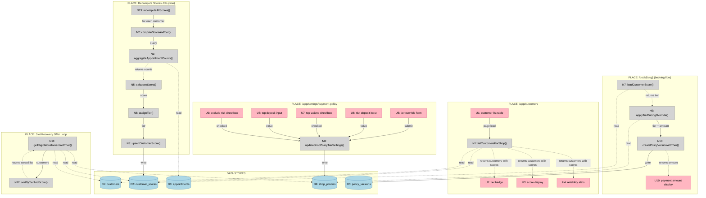

# Slice 7: Tiering + Scoring — Shaping Doc

## Requirements (R)

| ID | Requirement | Status |
|----|-------------|--------|
| **R0** | **Enable tier-based risk management through deposit adjustments** | Core goal |
| **R1** | **Scoring computation** | Must-have |
| R1.1 | Score is deterministic (0-100) based on policy outcomes over rolling window | Must-have |
| R1.2 | Score calculation is explainable (no black box, concrete formula) | Must-have |
| R1.3 | Same data recomputes to same score (reproducible/idempotent) | Must-have |
| **R2** | **Tier assignment** | Must-have |
| R2.1 | Three tiers: top (reliable), neutral (default), risk (problematic) | Must-have |
| R2.2 | Tier derived from score + constraints (e.g., top = score ≥80 AND voided==0) | Must-have |
| R2.3 | New customers without history default to neutral tier | Must-have |
| **R3** | **Dashboard visibility** | Must-have |
| R3.1 | Customer list page shows tier badge, score, and explanation for each customer | Must-have |
| R3.2 | Explanation uses concrete stats (e.g., "Settled: 6, Voided: 0, Late cancels: 1") | Must-have |
| R3.3 | No vague language or "AI decided" messaging (transparency) | Must-have |
| **R4** | **Tier-based deposit adjustments** | Must-have |
| R4.1 | Risk tier requires higher deposit amount (configurable by shop) | Must-have |
| R4.2 | Top tier deposit can be waived or reduced (configurable by shop) | Must-have |
| R4.3 | Neutral tier uses base policy deposit (no override) | Must-have |
| **R5** | **Booking pricing integration** | Must-have |
| R5.1 | Tier affects deposit amount during booking payment intent creation | Must-have |
| R5.2 | Applied tier-derived amount is snapshot in policy_version at booking time | Must-have |
| R5.3 | Tier changes after booking do not affect existing bookings (no retroactive changes) | Must-have |
| **R6** | **Offer loop prioritization** | Must-have |
| R6.1 | Eligible customers sorted by tier priority: top > neutral > risk | Must-have |
| R6.2 | Within same tier, sorted by score descending | Must-have |
| R6.3 | Ordering is deterministic (no randomness) | Must-have |
| **R7** | **Data integrity** | Must-have |
| R7.1 | Scoring uses only policy outcomes (settled, voided, refunded, late cancels) | Must-have |
| R7.2 | Scoring based on outcomes + timestamps, not current policy (policy-independent) | Must-have |
| R7.3 | Scores recomputed nightly via scheduled job | Must-have |

---

## Shape A: Deterministic scoring with tier-based deposit adjustments

| Part | Mechanism | Flag |
|------|-----------|:----:|
| **A1** | **Scoring & Tier Computation** | |
| A1.1 | Aggregate counts per customer per shop over 180-day rolling window: Query `appointments` table grouped by `(customerId, shopId)` filtering `createdAt >= NOW() - 180 days`. Count using `resolutionReason` field: settled (where `status='booked'` AND `financialOutcome='settled'`), voided (`financialOutcome='voided'`), refunded (`resolutionReason='cancelled_refunded_before_cutoff'`), late cancels (`resolutionReason='cancelled_no_refund_after_cutoff'`). No join to policyVersions needed—resolution reasons are ground truth. | |
| A1.2 | Score calculation: Start at 50. Add +10 per settled (capped at total +50). Subtract -20 per voided. Subtract -5 per refundable cancel. Subtract -10 per late cancel. Apply recency multiplier: events in last 30d count 2×, 31-90d count 1×, >90d count 0.5×. Clamp final score to 0-100 range. Store formula constants in code for easy adjustment. | |
| A1.3 | Tier mapping: `top` = score ≥80 AND voided_count==0 in last 90 days; `risk` = score <40 OR voided_count ≥2 in last 90 days; else `neutral`. Per-shop scoped (customer may have different tiers at different shops). | |
| **A2** | **Data Model** | |
| A2.1 | `customer_scores` table: `customer_id` uuid (fk → customers.id), `shop_id` uuid, `score` int NOT NULL, `tier` enum(top\|neutral\|risk) NOT NULL, `window_days` int DEFAULT 180, `stats` jsonb NOT NULL (stores {settled, voided, refunded, lateCancels, lastActivityAt}), `computed_at` timestamptz NOT NULL. Unique index on `(customer_id, shop_id)`. | |
| A2.2 | Extend `shop_policies` table: Add `risk_payment_mode` enum(deposit\|full_prepay) NULL, `risk_deposit_amount_cents` int NULL, `top_deposit_waived` boolean DEFAULT false, `top_deposit_amount_cents` int NULL, `exclude_risk_from_offers` boolean DEFAULT false. NULL values mean fallback to base policy. When `exclude_risk_from_offers=false` (default), risk tier is deprioritized; when true, risk tier is excluded entirely. | |
| **A3** | **Recompute Job** | |
| A3.1 | `POST /api/jobs/recompute-scores`: Follows cron job pattern (spike A3). Authentication via `x-cron-secret` header. PostgreSQL advisory lock 482175 prevents concurrent execution. For each shop, aggregate appointment counts (A1.1 query), compute score (A1.2), assign tier (A1.3), upsert into `customer_scores` with `ON CONFLICT (customer_id, shop_id) DO UPDATE`. Process in batches, collect errors, return `{processed, errors}`. Scheduled nightly at 2 AM UTC in `vercel.json`. | |
| A3.2 | On-event recompute (optional, cut if time-constrained): Trigger recompute for specific customer when appointment created/cancelled, payment status changes, or outcome resolved. Enqueue job or call directly. If too expensive, skip and rely on nightly batch. | |
| **A4** | **Booking Pricing Integration** | |
| A4.1 | During payment intent creation in `createAppointment()` (queries/appointments.ts:311): After `upsertCustomer()` returns customer record, load `customer_scores` via `SELECT * FROM customer_scores WHERE customer_id=? AND shop_id=? LIMIT 1`. If no score exists, treat as neutral tier. | |
| A4.2 | Apply tier overrides to determine payment amount: Load base policy from `shop_policies`. If tier==`risk` and `risk_deposit_amount_cents` is not null, use risk amount; else if tier==`top` and `top_deposit_waived==true`, set amount=0; else if tier==`top` and `top_deposit_amount_cents` is not null, use top amount; else use base `depositAmountCents`. Store final mode + amount. | |
| A4.3 | Create policy version snapshot including tier-derived amount: Insert into `policy_versions` with actual amount that will be charged (after tier override applied). This ensures policy snapshot reflects what customer actually paid, preventing disputes. | |
| **A5** | **Offer Loop Integration** | |
| A5.1 | Modify `getEligibleCustomers()` in slot-recovery.ts:114-165: Load shop policy to check `exclude_risk_from_offers` setting. Add `.leftJoin(customerScores, eq(customerScores.customerId, customers.id))` and `.leftJoin(shopPolicies, eq(shopPolicies.shopId, slotOpening.shopId))` before WHERE clause. If `exclude_risk_from_offers=true`, add WHERE condition `ne(customerScores.tier, 'risk')` OR `isNull(customerScores.tier)`. Replace `.orderBy(sql\`random()\`)` at line 137 with tier-based sort: (1) tier priority via `CASE WHEN tier='top' THEN 1 WHEN tier='neutral' OR tier IS NULL THEN 2 WHEN tier='risk' THEN 3 END`, (2) score descending with `COALESCE(score, 50) DESC`, (3) recency with `computed_at DESC NULLS LAST`. NULL tier/score treated as neutral tier with score 50. Default behavior (exclude=false) deprioritizes risk tier; when enabled, excludes them entirely. | |
| **A6** | **Dashboard UI** | |
| A6.1 | Create `/app/app/customers/page.tsx` (spike A6): Follow dashboard pattern: `requireAuth()` → `getShopByOwnerId()` → render. Create `listCustomersForShop(shopId)` query in new `/lib/queries/customers.ts` file: SELECT from customers LEFT JOIN customer_scores, order by score presence then score desc. Table columns: Customer name/email, Tier badge (TierBadge component with color: top=green, neutral=grey, risk=red), Score (show "—" if null), Reliability explanation (`stats.settled, stats.voided, stats.lateCancels` or "Insufficient history"), View link to `/app/customers/[id]`. Use existing table UI pattern from appointments page. | |
| A6.2 | Extend `/app/app/settings/payment-policy/page.tsx` (spike A6, option 1): Add "Tier-based overrides" section below base policy. Fields: Risk tier deposit amount (number input, nullable), Top tier deposit waived (checkbox), Top tier reduced deposit (number input, nullable, disabled if waived), Exclude risk tier from slot recovery offers (checkbox, default unchecked). Server action updates `shop_policies` tier columns. Show help text: "Risk tier applies to customers with low payment reliability" / "Top tier applies to highly reliable customers" / "When excluded, risk tier customers won't receive slot recovery SMS offers (they can still book directly)". | |
| **A7** | **Booking UI** | |
| A7.1 | No changes to booking form UI. Deposit amount already shown as "Deposit £X" in payment intent. Tier logic is invisible to customer—just sees the amount. Avoid "punishment copy" like "because you're risk tier". Keep messaging neutral and policy-focused. | |

---

## Fit Check (R × A)

| Req | Requirement | Status | A |
|-----|-------------|--------|---|
| **R0** | Enable tier-based risk management through deposit adjustments | Core goal | ✅ |
| **R1** | Scoring computation | Must-have | ✅ |
| R1.1 | Score is deterministic (0-100) based on policy outcomes over rolling window | Must-have | ✅ |
| R1.2 | Score calculation is explainable (no black box, concrete formula) | Must-have | ✅ |
| R1.3 | Same data recomputes to same score (reproducible/idempotent) | Must-have | ✅ |
| **R2** | Tier assignment | Must-have | ✅ |
| R2.1 | Three tiers: top (reliable), neutral (default), risk (problematic) | Must-have | ✅ |
| R2.2 | Tier derived from score + constraints (e.g., top = score ≥80 AND voided==0) | Must-have | ✅ |
| R2.3 | New customers without history default to neutral tier | Must-have | ✅ |
| **R3** | Dashboard visibility | Must-have | ✅ |
| R3.1 | Customer list page shows tier badge, score, and explanation for each customer | Must-have | ✅ |
| R3.2 | Explanation uses concrete stats (e.g., "Settled: 6, Voided: 0, Late cancels: 1") | Must-have | ✅ |
| R3.3 | No vague language or "AI decided" messaging (transparency) | Must-have | ✅ |
| **R4** | Tier-based deposit adjustments | Must-have | ✅ |
| R4.1 | Risk tier requires higher deposit amount (configurable by shop) | Must-have | ✅ |
| R4.2 | Top tier deposit can be waived or reduced (configurable by shop) | Must-have | ✅ |
| R4.3 | Neutral tier uses base policy deposit (no override) | Must-have | ✅ |
| **R5** | Booking pricing integration | Must-have | ✅ |
| R5.1 | Tier affects deposit amount during booking payment intent creation | Must-have | ✅ |
| R5.2 | Applied tier-derived amount is snapshot in policy_version at booking time | Must-have | ✅ |
| R5.3 | Tier changes after booking do not affect existing bookings (no retroactive changes) | Must-have | ✅ |
| **R6** | Offer loop prioritization | Must-have | ✅ |
| R6.1 | Eligible customers sorted by tier priority: top > neutral > risk | Must-have | ✅ |
| R6.2 | Within same tier, sorted by score descending | Must-have | ✅ |
| R6.3 | Ordering is deterministic (no randomness) | Must-have | ✅ |
| **R7** | Data integrity | Must-have | ✅ |
| R7.1 | Scoring uses only policy outcomes (settled, voided, refunded, late cancels) | Must-have | ✅ |
| R7.2 | Scoring based on outcomes + timestamps, not current policy (policy-independent) | Must-have | ✅ |
| R7.3 | Scores recomputed nightly via scheduled job | Must-have | ✅ |

**Notes:**
- Shape A satisfies all requirements
- All flagged unknowns resolved via spikes (A1, A3, A5, A6, A7)
- Design decision resolved: Risk tier handling is configurable via `exclude_risk_from_offers` (default: deprioritize)

---

## Supporting Spikes

- **Spike A7:** Customer Identification (`spike-a7-customer-identification.md`)
  - Finding: Customers identified by (shopId, phone) or (shopId, email)
  - No schema changes needed

- **Spike A5:** Offer Loop Mechanism (`spike-a5-offer-loop-mechanism.md`)
  - Finding: Random sort at slot-recovery.ts:137
  - Injection point: Replace `.orderBy(sql`random()`)` with tier/score/recency sort

- **Spike A1:** Late Cancellation Detection (`spike-a1-late-cancellation-detection.md`)
  - Finding: Use `resolutionReason` field directly, no join needed
  - Ground truth stored: `cancelled_no_refund_after_cutoff` vs `cancelled_refunded_before_cutoff`

- **Spike A3:** Existing Cron Job Pattern (`spike-a3-cron-job-pattern.md`)
  - Finding: Auth via x-cron-secret, lock ID 482175, error collection pattern
  - Template provided for recompute-scores job

- **Spike A6:** Dashboard Structure (`spike-a6-dashboard-structure.md`)
  - Finding: No customer list page exists, must create from scratch
  - UI patterns documented: tables, badges, headers, server actions

---

## Design Decisions

### 1. Risk Tier in Offer Loop (A5.1) — ✅ RESOLVED

**Decision:** Make it configurable via shop policy setting (`exclude_risk_from_offers` boolean), default to deprioritize.

**Rationale:**
- Flexibility: Shops can choose based on their customer base and SMS budget
- Default (deprioritize): Everyone gets a chance, risk customers just go last
- Optional (exclude): Reduces SMS waste when risk tier has proven unreliable
- Transparent: Clear setting with help text explains the trade-off

**Implementation:**
- New field: `shop_policies.exclude_risk_from_offers` (boolean DEFAULT false)
- When false: Risk tier sorted last (tier priority: top=1, neutral=2, risk=3)
- When true: Risk tier filtered out via WHERE clause
- UI: Checkbox in settings with explanation: "When excluded, risk tier customers won't receive slot recovery SMS offers (they can still book directly)"

---

## Breadboard

### UI Affordances

| ID | Affordance | Place | Wires Out |
|----|------------|-------|-----------|
| **U1** | Customer list table | /app/customers | → N1 (on page load) |
| **U2** | Tier badge (top/neutral/risk) | /app/customers | (display only) |
| **U3** | Score display (0-100 or "—") | /app/customers | (display only) |
| **U4** | Reliability stats text | /app/customers | (display only) |
| **U5** | Tier override form section | /app/settings/payment-policy | → N8 (on submit) |
| **U6** | Risk deposit amount input | /app/settings/payment-policy | → N8 |
| **U7** | Top deposit waived checkbox | /app/settings/payment-policy | → N8 |
| **U8** | Top deposit amount input | /app/settings/payment-policy | → N8 |
| **U9** | Exclude risk from offers checkbox | /app/settings/payment-policy | → N8 |
| **U10** | Booking payment amount display | /book/[slug] | (display only) |

### Non-UI Affordances

| ID | Affordance | Type | Wires Out |
|----|------------|------|-----------|
| **N1** | listCustomersForShop(shopId) | Query | -.-> D1, D2 |
| **N2** | computeScoreAndTier(customerId, shopId) | Handler | -.-> D3, → N3 |
| **N3** | upsertCustomerScore(data) | Command | → D2 |
| **N4** | aggregateAppointmentCounts(customerId, shopId, windowDays) | Query | -.-> D3 |
| **N5** | calculateScore(counts, recencyData) | Pure function | (returns score) |
| **N6** | assignTier(score, voidedCount) | Pure function | (returns tier) |
| **N7** | loadCustomerScore(customerId, shopId) | Query | -.-> D2 |
| **N8** | updateShopPolicyTierSettings(shopId, data) | Command | → D4 |
| **N9** | applyTierPricingOverride(tier, basePolicy) | Handler | -.-> D4, → N10 |
| **N10** | createPolicyVersionWithTier(shopId, tier, amount) | Command | → D5 |
| **N11** | getEligibleCustomersWithTier(slotOpeningId) | Query | -.-> D1, D2, D4 |
| **N12** | sortByTierAndScore(customers, excludeRisk) | Pure function | (returns sorted list) |
| **N13** | recomputeAllScores(shopId) | Cron handler | → N2 (for each customer) |

### Data Stores

| ID | Store | Schema |
|----|-------|--------|
| **D1** | customers | id, shopId, fullName, email, phone, createdAt |
| **D2** | customer_scores | customerId, shopId, score, tier, stats, windowDays, computedAt |
| **D3** | appointments | id, customerId, shopId, status, financialOutcome, resolutionReason, startsAt, createdAt |
| **D4** | shop_policies | shopId, currency, paymentMode, depositAmountCents, riskDepositAmountCents, topDepositWaived, topDepositAmountCents, excludeRiskFromOffers |
| **D5** | policy_versions | id, shopId, currency, paymentMode, depositAmountCents, cancelCutoffMinutes, refundBeforeCutoff, createdAt |

### Wiring Diagram



**Legend:**
- **Pink nodes (U)** = UI affordances (things users see/interact with)
- **Grey nodes (N)** = Code affordances (queries, handlers, pure functions)
- **Blue nodes (D)** = Data stores (database tables)
- **Solid lines** = Wires Out (calls, triggers, writes)
- **Dashed lines** = Returns To (return values, data store reads)

### Key Flows

**Flow 1: Nightly Score Recomputation**
```
Cron trigger (2 AM UTC)
  ↓
N13: recomputeAllScores(shopId)
  ↓ (for each customer)
N2: computeScoreAndTier(customerId, shopId)
  ↓
N4: aggregateAppointmentCounts() -.-> D3
  ↓ (returns counts)
N5: calculateScore(counts) → score
  ↓
N6: assignTier(score, voidedCount) → tier
  ↓
N3: upsertCustomerScore() → D2
```

**Flow 2: View Customer List**
```
User navigates to /app/customers
  ↓
U1: customer list table → N1: listCustomersForShop()
  ↓
N1 reads D1 (customers) + D2 (customer_scores)
  ↓
U2 displays tier badge
U3 displays score
U4 displays reliability stats
```

**Flow 3: Configure Tier Settings**
```
User edits tier overrides in payment policy settings
  ↓
U5-U9: form inputs → N8: updateShopPolicyTierSettings()
  ↓
N8 writes D4 (shop_policies)
  ↓
Settings saved, revalidate page
```

**Flow 4: Booking with Tier Pricing**
```
Customer books appointment
  ↓
createAppointment() → upsertCustomer() returns customerId
  ↓
N7: loadCustomerScore(customerId, shopId) -.-> D2
  ↓ (returns tier or null)
N9: applyTierPricingOverride(tier, basePolicy) -.-> D4
  ↓ (calculates final amount)
N10: createPolicyVersionWithTier() → D5
  ↓
U10 displays final deposit amount
```

**Flow 5: Offer Loop with Tier Sorting**
```
Slot opening created (cancellation)
  ↓
N11: getEligibleCustomersWithTier(slotOpeningId)
  ↓
N11 reads D1 (customers) + D2 (scores) + D4 (exclude setting)
  ↓
N12: sortByTierAndScore(customers, excludeRisk)
  ↓
Returns prioritized list → send offer to first customer
```

### Orthogonal Concerns

These parts are **independent** and can be built in any order:

1. **Score Computation (A1, A2.1, A3)** — Standalone scoring logic + cron job
2. **Dashboard UI (A6.1)** — Customer list page (depends on D2 existing)
3. **Policy Settings (A2.2, A6.2)** — Tier override form (extends existing page)
4. **Booking Integration (A4)** — Pricing logic (depends on D2, D4 existing)
5. **Offer Loop (A5)** — Sorting logic (depends on D2, D4 existing)

**Recommended build order:**
1. Score Computation (creates the data)
2. Dashboard UI (makes scores visible)
3. Policy Settings (enables configuration)
4. Booking Integration (applies tier pricing)
5. Offer Loop (uses tier for prioritization)

---

## Vertical Slices

### V1: Scoring Engine + Database

**What's built:**
- Database schema: `customer_scores` table (D2)
- Extend `shop_policies` with tier columns (D4)
- Scoring functions: N5 (calculateScore), N6 (assignTier)
- Aggregation: N4 (aggregateAppointmentCounts)
- Persistence: N3 (upsertCustomerScore)
- Recompute job: N13 (recomputeAllScores), N2 (computeScoreAndTier)
- Cron configuration in vercel.json

**Demo:**
- Run `pnpm db:generate && pnpm db:migrate` to create schema
- Manually trigger recompute job: `curl -X POST http://localhost:3000/api/jobs/recompute-scores -H "x-cron-secret: $CRON_SECRET"`
- Open Drizzle Studio (`pnpm db:studio`), see `customer_scores` table populated with scores, tiers, and stats
- Verify scoring logic by checking specific customers' data

**Acceptance:**
- ✅ customer_scores table exists with computed data
- ✅ Scoring formula produces expected results (unit tests pass)
- ✅ Cron job runs successfully and populates scores
- ✅ Idempotency: re-running produces same results

---

### V2: Customer List Dashboard

**What's built:**
- Query: N1 (listCustomersForShop)
- New file: `/src/lib/queries/customers.ts`
- Page: `/src/app/app/customers/page.tsx`
- Components: U1 (customer table), U2 (TierBadge), U3 (score display), U4 (stats text)

**Demo:**
- Navigate to `/app/customers`
- See table of all customers with:
  - Name and email/phone
  - Tier badge (green=top, grey=neutral, red=risk)
  - Score (0-100 or "—" for no history)
  - Reliability text: "Settled: 6, Voided: 0, Late cancels: 1" or "Insufficient history"
- Click customer name → navigates to existing customer detail page

**Acceptance:**
- ✅ Customer list page renders with all customers
- ✅ Tier badges display correct colors
- ✅ Scores display correctly (including "—" for null)
- ✅ Stats show human-readable counts
- ✅ Customers without scores show "Insufficient history"

---

### V3: Tier Policy Settings

**What's built:**
- Extend `shop_policies` schema migration (if not in V1)
- Handler: N8 (updateShopPolicyTierSettings)
- UI: Extend `/src/app/app/settings/payment-policy/page.tsx`
- Form inputs: U5-U9 (risk deposit, top waived, top deposit, exclude risk)

**Demo:**
- Navigate to `/app/settings/payment-policy`
- Scroll to "Tier-based overrides" section
- Set risk deposit to $50 (vs base $20)
- Check "Waive deposit for top tier"
- Check "Exclude risk tier from offers"
- Submit form
- Refresh page → settings persist
- Check DB: `shop_policies` row shows new values

**Acceptance:**
- ✅ Tier override fields render in settings form
- ✅ Current values pre-populate correctly
- ✅ Saving updates database
- ✅ Validation prevents invalid amounts
- ✅ Help text explains each setting

---

### V4: Booking Tier Pricing

**What's built:**
- Query: N7 (loadCustomerScore)
- Handler: N9 (applyTierPricingOverride)
- Command: N10 (extend createPolicyVersion to include tier-derived amount)
- Modify: `createAppointment()` in `/src/lib/queries/appointments.ts`

**Demo:**
- Create 3 test customers with different tiers (via Drizzle Studio or script):
  - Customer A: top tier (score 85)
  - Customer B: neutral tier (score 55)
  - Customer C: risk tier (score 30)
- Configure policy: base=$20, risk=$50, top=waived
- Book appointment as Customer A → see "No deposit required" (top tier)
- Book appointment as Customer B → see "Deposit $20" (neutral, base policy)
- Book appointment as Customer C → see "Deposit $50" (risk tier)
- Verify policy_versions snapshots store the tier-derived amounts

**Acceptance:**
- ✅ Top tier customers see waived/reduced deposit
- ✅ Neutral tier customers see base policy deposit
- ✅ Risk tier customers see higher deposit
- ✅ Policy version snapshot includes tier-derived amount
- ✅ Customers without scores default to neutral tier pricing

---

### V5: Offer Loop Tier Prioritization

**What's built:**
- Modify: `getEligibleCustomers()` in `/src/lib/slot-recovery.ts`
- Add join to `customer_scores` and `shop_policies`
- Implement: N12 (sortByTierAndScore logic in ORDER BY)
- Handle `exclude_risk_from_offers` setting

**Demo:**
- Create slot opening by cancelling a booked appointment
- Check SMS logs or slot_offers table
- Verify offer sent to highest-tier customer first
- Scenario 1 (exclude=false, default): Top customer gets first offer, neutral second, risk third
- Scenario 2 (exclude=true): Top customer gets first offer, risk customers excluded from list
- Let first offer expire → verify next customer in tier order gets offer

**Acceptance:**
- ✅ Top tier customers receive offers first
- ✅ Within same tier, higher score customers prioritized
- ✅ Customers without scores treated as neutral tier
- ✅ When exclude_risk_from_offers=true, risk tier filtered out
- ✅ When exclude_risk_from_offers=false, risk tier goes last

---

### V6: Polish & Testing

**What's built:**
- E2E tests (Playwright): Full scoring + pricing flow
- Unit tests: Scoring functions, tier assignment, edge cases
- Error handling refinement across all components
- Documentation updates

**Demo:**
- Run `pnpm test` → all unit tests pass
- Run `pnpm test:e2e` → E2E tests pass
- Full flow: Recompute scores → view customers → configure tiers → book with tier pricing → slot recovery prioritization
- All edge cases handled gracefully (no scores, null tiers, missing policies)

**Acceptance:**
- ✅ Unit test coverage ≥80% for scoring logic
- ✅ E2E test covers full tier-based booking flow
- ✅ Error messages are user-friendly
- ✅ Documentation reflects all tier features

---

## Slice Grid

|  |  |  |
|:--|:--|:--|
| **V1: SCORING ENGINE + DATABASE**<br>⏳ PENDING<br><br>• customer_scores table schema<br>• Scoring functions (calculate, assign)<br>• Aggregation query<br>• Recompute job + cron<br><br>*Demo: Run job, view scores in Drizzle Studio* | **V2: CUSTOMER LIST DASHBOARD**<br>⏳ PENDING<br><br>• /app/customers page<br>• listCustomersForShop query<br>• Tier badge component<br>• Score + stats display<br><br>*Demo: View all customers with tiers and scores* | **V3: TIER POLICY SETTINGS**<br>⏳ PENDING<br><br>• Extend payment policy page<br>• Tier override form fields<br>• updateShopPolicyTierSettings<br>• Validation + persistence<br><br>*Demo: Configure tier deposits, save settings* |
| **V4: BOOKING TIER PRICING**<br>⏳ PENDING<br><br>• loadCustomerScore query<br>• applyTierPricingOverride logic<br>• Extend createPolicyVersion<br>• Modify createAppointment<br><br>*Demo: Book as different tiers, see deposit change* | **V5: OFFER LOOP PRIORITIZATION**<br>⏳ PENDING<br><br>• Modify getEligibleCustomers<br>• Add tier sorting logic<br>• Handle exclude_risk setting<br>• Test offer sequence<br><br>*Demo: Create slot, verify tier priority in offers* | **V6: POLISH & TESTING**<br>⏳ PENDING<br><br>• E2E tests (Playwright)<br>• Unit tests coverage<br>• Error handling refinement<br>• Documentation<br><br>*Demo: Full flow works end-to-end* |

---

## Slice Dependencies

```
V1 (Scoring Engine)
  ↓
V2 (Customer List) ← reads D2
  ↓
V3 (Policy Settings) ← writes D4
  ↓
V4 (Booking Pricing) ← reads D2, D4
  ↓
V5 (Offer Loop) ← reads D2, D4
  ↓
V6 (Polish)
```

**Linear dependency:** Each slice builds on the previous. V1 must ship first (creates the data), then V2-V5 can follow in order.

**Optional parallelization:** After V1, V2 and V3 could be built in parallel (they don't depend on each other), then V4 and V5 require both V2 and V3 complete.

---

## Cut Strategy

If time runs out, ship in priority order:

**Must-ship (MVP):**
- ✅ V1: Scoring Engine (creates foundation)
- ✅ V4: Booking Tier Pricing (delivers core value: deposit adjustments)

**Nice-to-have:**
- V2: Customer List Dashboard (visibility)
- V3: Tier Policy Settings (configuration)
- V5: Offer Loop Prioritization (optimization)
- V6: Polish & Testing (quality)

**Minimum viable:** V1 + V4 = Customers are scored, tier affects deposit amounts (even without dashboard visibility or offer loop integration).

---

## Cut List (if time runs out)

In priority order:

1. **A3.2:** On-event recompute → Nightly batch only
2. **A6.2:** Tier override UI → Seed DB settings, read-only display
3. **A6.1:** Customer list UI → Show tier on appointment rows only
4. **A5.1:** Offer loop prioritization → Ship scoring without offer loop integration

**Core must-ship:**
- A1: Score computation logic
- A2: Database schema
- A3.1: Nightly recompute job
- A4: Booking pricing integration (deposit adjustments)

---

## Summary

### Shaping Complete ✅

**Requirements (R):**
- 7 top-level requirements with sub-requirements (R0-R7)
- All must-have, focused on deterministic scoring, tier assignment, dashboard visibility, deposit adjustments, booking integration, offer prioritization, and data integrity

**Shape A: Deterministic scoring with tier-based deposit adjustments**
- 7 major parts (A1-A7) fully detailed with concrete mechanisms
- All flagged unknowns resolved via 5 spikes
- Fit check: All requirements satisfied (100% ✅)
- Design decision: Risk tier handling configurable via `exclude_risk_from_offers` (default: deprioritize)

**Breadboard:**
- 10 UI affordances across 3 places
- 13 non-UI affordances (queries, handlers, commands, pure functions)
- 5 data stores
- Complete wiring diagram with 5 key flows
- Orthogonal concerns identified for flexible build order

**Vertical Slices:**
- 6 slices, each ending in demo-able UI
- V1: Scoring Engine + Database (foundation)
- V2: Customer List Dashboard (visibility)
- V3: Tier Policy Settings (configuration)
- V4: Booking Tier Pricing (core value)
- V5: Offer Loop Prioritization (optimization)
- V6: Polish & Testing (quality)
- Linear dependencies: V1 → V2 → V3 → V4 → V5 → V6
- MVP: V1 + V4 (minimum viable functionality)

**Supporting Documentation:**
- 5 spike documents with detailed findings
- Complete shaping document with requirements, shape, breadboard, and slices
- Ready for implementation

---

## Next Steps

1. ✅ **Requirements extracted** — 7 top-level requirements with sub-requirements
2. ✅ **Shape A refined** — All spike findings incorporated, all flags removed
3. ✅ **Fit check complete** — Shape A satisfies all requirements
4. ✅ **Design decision resolved** — Risk tier handling is configurable (default: deprioritize)
5. ✅ **Breadboard complete** — 10 UI affordances, 13 non-UI affordances, 5 data stores
6. ✅ **Slicing complete** — 6 vertical slices with demo criteria and dependencies
7. **Create implementation plans** — Write V1-plan.md through V6-plan.md for development
