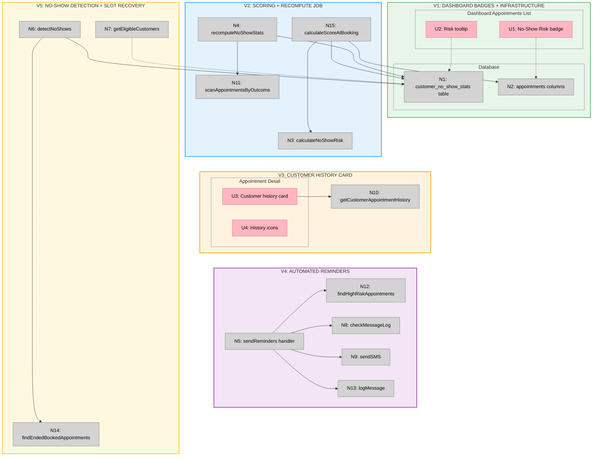

# Slice 8: No-show Prediction — Big Picture

**Selected shape:** A (Deterministic Scoring with Automated Reminders)

---

## Frame

### Problem

- Payment reliability (Slice 7) doesn't equal attendance reliability
- Customer can be "top tier" financially but frequently no-show 30% of the time
- No-show rates reach 40-60% in appointment-based businesses
- Businesses can't send targeted reminders to high-risk customers
- Slot recovery offers go to customers likely to no-show again, wasting capacity
- Dashboard provides no signal for proactive intervention on attendance

### Outcome

- Each appointment has a no-show risk score and tier at booking time
- Business dashboard shows risk badges and customer attendance history
- High-risk customers receive automatic reminder SMS 24h before appointment
- Slot recovery offer loop can filter and prioritize by no-show risk
- Predictions are explainable with visible stats (not black-box)
- System automatically detects no-shows and updates customer stats

---

## Shape

### Fit Check (R × A)

| Req | Requirement | Status | A |
|-----|-------------|--------|---|
| **R0** | Predict no-show risk for appointments to enable proactive intervention | Core goal | ✅ |
| **R1** | Dashboard shows attendance reliability signals for each appointment | Must-have | ✅ |
| **R2** | High-risk appointments trigger automated reminders before appointment time | Must-have | ✅ |
| **R3** | Slot recovery can prioritize customers by attendance reliability | Must-have | ✅ |
| **R4** | Predictions are explainable with visible stats (not black-box) | Must-have | ✅ |
| **R5** | New customers with no history are not penalized | Must-have | ✅ |
| **R6** | Customer-facing messaging is never punitive or judgmental | Must-have | ✅ |
| **R7** | Scoring is deterministic (same inputs → same output) and reproducible | Must-have | ✅ |
| **R8** | System automatically detects no-shows after appointments end | Must-have | ✅ |
| **R9** | Integrates with Slice 7 financial tiering for holistic customer view | Must-have | ✅ |
| **R10** | Reminders respect SMS opt-in preferences and prevent duplicates | Must-have | ✅ |

### Parts

| Part | Mechanism | Flag |
|------|-----------|:----:|
| **A1** | Customer no-show stats tracking (table per customer per shop) | |
| **A2** | Nightly recompute job (scan last 180 days, upsert stats) | |
| **A3** | Deterministic scoring algorithm (base 75 + adjustments + recency) | |
| **A4** | Risk tier rules (low/medium/high thresholds) | |
| **A5** | Booking-time score calculation (calculate on create) | |
| **A6** | No-show detection in resolver (extend existing job) | |
| **A7** | Dashboard integration (badges, tooltips, history card) | |
| **A8** | Automated reminder SMS (hourly cron, 24h before high-risk) | |
| **A9** | Slot recovery integration (optional filter/prioritize params) | |
| **A10** | Database schema changes (appointment columns + enum) | |

### Breadboard

```mermaid
flowchart TB
    subgraph dashboardList["PLACE: Dashboard Appointments List"]
        U1["U1: No-Show Risk badge"]
        U2["U2: Risk tooltip"]
    end

    subgraph dashboardDetail["PLACE: Dashboard Appointment Detail"]
        U3["U3: Customer history card"]
        U4["U4: History icons"]
    end

    subgraph bookingCreate["PLACE: POST /api/bookings/create"]
        N15["N15: calculateScoreAtBooking"]
    end

    subgraph recomputeJob["PLACE: POST /api/jobs/recompute-no-show-stats"]
        N4["N4: recomputeNoShowStats handler"]
    end

    subgraph reminderJob["PLACE: POST /api/jobs/send-reminders"]
        N5["N5: sendReminders handler"]
    end

    subgraph resolverJob["PLACE: POST /api/jobs/resolve-outcomes"]
        N6["N6: detectNoShows"]
    end

    subgraph slotRecovery["PLACE: src/lib/slot-recovery.ts"]
        N7["N7: getEligibleCustomers"]
    end

    subgraph database["PLACE: Database"]
        N1["N1: customer_no_show_stats table"]
        N2["N2: appointments columns"]
    end

    subgraph queries["PLACE: Query Functions"]
        N10["N10: getCustomerAppointmentHistory"]
        N11["N11: scanAppointmentsByOutcome"]
        N12["N12: findHighRiskAppointments"]
        N14["N14: findEndedBookedAppointments"]
    end

    subgraph services["PLACE: Service Functions"]
        N3["N3: calculateNoShowRisk"]
        N8["N8: checkMessageLog"]
        N9["N9: sendSMS"]
        N13["N13: logMessage"]
    end

    %% Dashboard List wiring
    U1 -.-> N2
    U2 -.-> N1

    %% Dashboard Detail wiring
    U3 --> N10
    N10 -.-> U3

    %% Booking Create wiring
    N15 --> N1
    N15 --> N3
    N15 --> N2

    %% Recompute Job wiring
    N4 --> N11
    N4 --> N1

    %% Reminder Job wiring
    N5 --> N12
    N5 --> N8
    N5 --> N9
    N5 --> N13

    %% Resolver wiring
    N6 --> N14
    N6 --> N1

    %% Slot Recovery wiring
    N7 -.-> N1

    %% Style
    classDef ui fill:#ffb6c1,stroke:#d87093,color:#000
    classDef nonui fill:#d3d3d3,stroke:#808080,color:#000

    class U1,U2,U3,U4 ui
    class N1,N2,N3,N4,N5,N6,N7,N8,N9,N10,N11,N12,N13,N14,N15 nonui
```

**Legend:**
- **Pink nodes (U)** = UI affordances (things users see/interact with)
- **Grey nodes (N)** = Code affordances (data stores, handlers, services)
- **Solid lines** = Wires Out (calls, triggers, writes)
- **Dashed lines** = Returns To (return values, data store reads)

---

## Slices

### Sliced Breadboard

### Slices Grid

|  |  |  |
|:--|:--|:--|
| **V1: DASHBOARD BADGES + INFRASTRUCTURE** ⏳ PENDING  • Create customer_no_show_stats table • Add appointment columns (migration) • Show risk badges on dashboard • Add tooltip with score/explanation  *Demo: Dashboard shows risk badges (all "medium" by default)* | **V2: SCORING + RECOMPUTE JOB** ⏳ PENDING  • Implement calculateNoShowRisk() • Implement recompute job handler • Extend booking create with scoring • scanAppointmentsByOutcome query  *Demo: New booking shows real risk, recompute updates existing* | **V3: CUSTOMER HISTORY CARD** ⏳ PENDING  • getCustomerAppointmentHistory query • Add history card to detail page • Display history icons (✅/🚫/❌) • Show attendance pattern  *Demo: Click appointment, see last 5 with pattern* |
| **V4: AUTOMATED REMINDERS** ⏳ PENDING  • findHighRiskAppointments query • checkMessageLog dedup • sendReminders job handler • logMessage to messageLog  *Demo: High-risk appointment tomorrow → reminder SMS sent* | **V5: NO-SHOW DETECTION + SLOT RECOVERY** ⏳ PENDING  • Extend resolver with detectNoShows • findEndedBookedAppointments query • Extend getEligibleCustomers filters • Increment no_show_count stats  *Demo: Resolver detects no-shows, slot recovery filters them* | • &nbsp; • &nbsp; • &nbsp; • &nbsp;  *&nbsp;* |

---

## Implementation Notes

### Appetite: 2 Days (Hard Stop)

**Must-haves:**
- V1-V2 (scoring works, dashboard shows badges)
- V3 (history visible for explainability)

**Nice-to-haves (can defer):**
- V4 (automated reminders — can add manual "Send Reminder" button instead)
- V5 (slot recovery integration — can prioritize in next iteration)

### Critical Constraints

1. **Resolver safety:** detectNoShows() MUST filter by `status='booked'` (never overwrite cancellations)
2. **Scoring determinism:** Same inputs always produce same score (no randomness, no ML)
3. **New customer fairness:** Default to medium (score=50), don't penalize lack of history
4. **Customer messaging:** SMS uses neutral "Reminder" language, never shows "high-risk" label
5. **Idempotency:** Recompute job can be run multiple times safely (upsert, not insert)
6. **SMS dedup:** Check messageLog before sending to prevent duplicate reminders

### Integration with Slice 7

Dashboard can show both signals side-by-side:
- `[💰 top] [🟢 low]` = Best customer (reliable payment + attendance)
- `[💰 top] [🔴 high]` = Pays well but often no-shows
- `[💰 risk] [🟢 low]` = Payment issues but reliable attendance
- `[💰 risk] [🔴 high]` = Risky across the board

Slot recovery combines both: prioritize top-tier + low-risk, filter out risk-tier + high-risk.
