# Slice 8: No-show Prediction Shaping

**Status:** Extracting requirements and proposed shape
**Appetite:** 2 days (hard stop)

---

## Requirements (R)

| ID | Requirement | Status |
|----|-------------|--------|
| **R0** | Predict no-show risk for appointments to enable proactive intervention | Core goal |
| **R1** | Dashboard shows attendance reliability signals for each appointment | Must-have |
| **R2** | High-risk appointments trigger automated reminders before appointment time | Must-have |
| **R3** | Slot recovery can prioritize customers by attendance reliability | Must-have |
| **R4** | Predictions are explainable with visible stats (not black-box) | Must-have |
| **R5** | New customers with no history are not penalized | Must-have |
| **R6** | Customer-facing messaging is never punitive or judgmental | Must-have |
| **R7** | Scoring is deterministic (same inputs → same output) and reproducible | Must-have |
| **R8** | System automatically detects no-shows after appointments end | Must-have |
| **R9** | Integrates with Slice 7 financial tiering for holistic customer view | Must-have |
| **R10** | Reminders respect SMS opt-in preferences and prevent duplicates | Must-have |

---

## CURRENT: No Attendance Tracking

Currently, the system has no attendance prediction or tracking:

| Part | State |
|------|-------|
| **CURRENT-1** | No customer attendance history tracked |
| **CURRENT-2** | No no-show risk scoring or prediction |
| **CURRENT-3** | No automated reminders based on risk |
| **CURRENT-4** | Slot recovery uses only financial tier (Slice 7), not attendance reliability |
| **CURRENT-5** | Dashboard shows only financial outcomes, not attendance patterns |

**Gap:** Payment reliability (Slice 7) ≠ attendance reliability. A customer can be "top tier" financially but frequently no-show.

---

## A: Deterministic Scoring with Automated Reminders

**Approach:** Rule-based scoring system using historical appointment outcomes, with nightly recomputation and automated SMS reminders for high-risk bookings.

| Part | Mechanism | Flag |
|------|-----------|:----:|
| **A1** | **Customer no-show stats tracking** | |
| A1.1 | New table: `customer_no_show_stats` (per customer per shop) | |
| A1.2 | Columns: total_appointments, no_show_count, late_cancel_count, on_time_cancel_count, completed_count, last_no_show_at, computed_at | |
| A1.3 | Unique constraint on (customer_id, shop_id) | |
| **A2** | **Nightly recompute job** | |
| A2.1 | Route: `POST /api/jobs/recompute-no-show-stats` (cron: daily 2 AM UTC) | |
| A2.2 | For each shop, scan appointments in last 180 days by outcome | |
| A2.3 | Upsert into customer_no_show_stats (Drizzle `.onConflictDoUpdate()`) | |
| A2.4 | Auth: `x-cron-secret` header (same pattern as resolve-outcomes) | |
| **A3** | **Deterministic scoring algorithm** | |
| A3.1 | Base score: 75 | |
| A3.2 | Adjustments: +5 per completed (cap +25), -15 per no-show, -5 per late cancel, -2 per on-time cancel | |
| A3.3 | Recency multiplier: 1.5x (last 30d), 1.0x (31-90d), 0.5x (91-180d) | |
| A3.4 | Current appointment adjustments: -10 lead time <24h, -5 time 6-9 AM, -5 no payment required | |
| A3.5 | Score range: clamp(0, 100) | |
| **A4** | **Risk tier rules** | |
| A4.1 | Low: score ≥70 AND no_show_count=0 in last 90 days | |
| A4.2 | High: score <40 OR no_show_count ≥2 in last 90 days | |
| A4.3 | Medium: everything else | |
| A4.4 | New customers (no stats): default score=50, risk=medium | |
| **A5** | **Booking-time score calculation** | |
| A5.1 | In `POST /api/bookings/create`, after appointment created | |
| A5.2 | Load customer_no_show_stats (if exists) | |
| A5.3 | Calculate score + risk using A3/A4 | |
| A5.4 | Update appointment: noShowScore, noShowRisk, noShowComputedAt | |
| **A6** | **No-show detection in resolver** | |
| A6.1 | In `POST /api/jobs/resolve-outcomes` (existing route) | |
| A6.2 | Find appointments: status='booked' AND endsAt<now-30min AND cancelledAt IS NULL | |
| A6.3 | For each: increment customer_no_show_stats.noShowCount, set lastNoShowAt | |
| A6.4 | Mark appointment status='ended' | |
| **A7** | **Dashboard integration** | |
| A7.1 | Appointments list: add "No-Show Risk" column with badge (🟢/🟡/🔴) + score | |
| A7.2 | Tooltip on hover: "Score: 65/100 — 3 completed, 1 no-show in last 180 days" | |
| A7.3 | Appointment detail page: customer history card (last 5 appointments with ✅/🚫/❌ icons) | |
| **A8** | **Automated reminder SMS** | |
| A8.1 | Route: `POST /api/jobs/send-reminders` (cron: hourly) | |
| A8.2 | Find appointments: startsAt between now+23h and now+25h, status='booked', noShowRisk='high', customer.smsOptIn=true | |
| A8.3 | Check messageLog: skip if reminder already sent (dedup) | |
| A8.4 | Send SMS: "Reminder: Your appointment tomorrow at [time] at [shop]. Manage booking: [link]" | |
| A8.5 | Log in messageLog with purpose='appointment_reminder_24h' | |
| **A9** | **Slot recovery integration** | |
| A9.1 | In `getEligibleCustomers()`, add optional params: excludeHighNoShowRisk, prioritizeByNoShowScore | |
| A9.2 | Filter: exclude customers with no_show_count ≥2 if excludeHighNoShowRisk=true | |
| A9.3 | Sort: prioritize by completed_count (proxy for low risk) if prioritizeByNoShowScore=true | |
| **A10** | **Database schema changes** | |
| A10.1 | Extend appointments: ADD COLUMN noShowScore INT, noShowRisk TEXT, noShowComputedAt TIMESTAMPTZ | |
| A10.2 | Extend message_purpose enum: ADD VALUE 'appointment_reminder_24h' | |

---

## Fit Check (R × A)

| Req | Requirement | Status | A |
|-----|-------------|--------|---|
| **R0** | Predict no-show risk for appointments to enable proactive intervention | Core goal | ✅ |
| **R1** | Dashboard shows attendance reliability signals for each appointment | Must-have | ✅ |
| **R2** | High-risk appointments trigger automated reminders before appointment time | Must-have | ✅ |
| **R3** | Slot recovery can prioritize customers by attendance reliability | Must-have | ✅ |
| **R4** | Predictions are explainable with visible stats (not black-box) | Must-have | ✅ |
| **R5** | New customers with no history are not penalized | Must-have | ✅ |
| **R6** | Customer-facing messaging is never punitive or judgmental | Must-have | ✅ |
| **R7** | Scoring is deterministic (same inputs → same output) and reproducible | Must-have | ✅ |
| **R8** | System automatically detects no-shows after appointments end | Must-have | ✅ |
| **R9** | Integrates with Slice 7 financial tiering for holistic customer view | Must-have | ✅ |
| **R10** | Reminders respect SMS opt-in preferences and prevent duplicates | Must-have | ✅ |

**Notes:**
- All requirements satisfied by Shape A
- R0: A3/A4/A5 provide scoring + tiers at booking time
- R1: A7 adds dashboard columns and tooltips
- R2: A8 sends automated reminders for high-risk appointments
- R3: A9 adds slot recovery filtering and prioritization
- R4: A3 uses transparent formula, A7.2 shows explanation in tooltip
- R5: A4.4 defaults new customers to medium (score=50)
- R6: A8.4 uses neutral "Reminder" language, no "high-risk" shown to customer
- R7: A3 formula is deterministic (no randomness, no ML)
- R8: A6 extends resolver to detect no-shows
- R9: Dashboard can show both financial tier (Slice 7) and no-show risk (Slice 8)
- R10: A8.2 filters by smsOptIn=true, A8.3 checks messageLog for dedup

**Decision:** Shape A passes fit check. Proceeding to detail.

---

## Detail A: Concrete Affordances

### UI Affordances

| ID | Affordance | Place | Wires Out | Returns To |
|----|------------|-------|-----------|------------|
| **U1** | No-Show Risk badge | Appointments list page | - | N2 (read noShowRisk, noShowScore) |
| **U2** | Risk tooltip | Appointments list page | - | N3 (read stats explanation) |
| **U3** | Customer history card | Appointment detail page | N10 (query last 5 appointments) | N10 (appointment list) |
| **U4** | History icons (✅/🚫/❌) | Appointment detail page | - | - |

### Non-UI Affordances

| ID | Affordance | Place | Wires Out | Returns To |
|----|------------|-------|-----------|------------|
| **N1** | customer_no_show_stats table | Database | - | - |
| **N2** | appointments columns (noShowScore, noShowRisk, noShowComputedAt) | Database | - | - |
| **N3** | calculateNoShowRisk(stats, leadTime, timeOfDay, paymentRequired) | src/lib/no-show-scoring.ts | - | { score, risk, explanation } |
| **N4** | recomputeNoShowStats() handler | POST /api/jobs/recompute-no-show-stats | N11 (scan appointments), N1 (upsert stats) | { shopsProcessed, customersUpdated } |
| **N5** | sendReminders() handler | POST /api/jobs/send-reminders | N12 (find high-risk appointments), N8 (check dedup), N9 (send SMS), N13 (log message) | { remindersSent, skipped } |
| **N6** | detectNoShows() | src/app/api/jobs/resolve-outcomes (extend existing) | N14 (find ended appointments), N1 (increment no_show_count) | { noShowsDetected } |
| **N7** | getEligibleCustomers(excludeHighNoShowRisk, prioritizeByNoShowScore) | src/lib/slot-recovery.ts (extend) | N1 (filter by no_show_count), N1 (sort by completed_count) | Customer[] |
| **N8** | checkMessageLog(appointmentId, purpose) | src/lib/queries/messages.ts | messageLog table | boolean (already sent) |
| **N9** | sendSMS(to, body) | src/lib/twilio.ts (existing) | Twilio API | { messageSid } |
| **N10** | getCustomerAppointmentHistory(customerId, limit) | src/lib/queries/appointments.ts | appointments table | Appointment[] |
| **N11** | scanAppointmentsByOutcome(shopId, windowDays) | src/lib/queries/appointments.ts | appointments table | { completed, noShows, lateCancels, onTimeCancels } |
| **N12** | findHighRiskAppointments(timeWindow) | src/lib/queries/appointments.ts | appointments table (noShowRisk='high') | Appointment[] |
| **N13** | logMessage(appointmentId, purpose, status, phone) | messageLog table | - | - |
| **N14** | findEndedBookedAppointments(graceMinutes) | src/app/api/jobs/resolve-outcomes (existing query, extend) | appointments table | Appointment[] |
| **N15** | calculateScoreAtBooking(customerId, shopId, appointment) | POST /api/bookings/create (extend) | N1 (load stats), N3 (calculate), N2 (update appointment) | void |

### Wiring Diagram

```mermaid
flowchart TB
    subgraph dashboardList["PLACE: Dashboard Appointments List"]
        U1["U1: No-Show Risk badge"]
        U2["U2: Risk tooltip"]
    end

    subgraph dashboardDetail["PLACE: Dashboard Appointment Detail"]
        U3["U3: Customer history card"]
        U4["U4: History icons"]
    end

    subgraph bookingCreate["PLACE: POST /api/bookings/create"]
        N15["N15: calculateScoreAtBooking"]
    end

    subgraph recomputeJob["PLACE: POST /api/jobs/recompute-no-show-stats"]
        N4["N4: recomputeNoShowStats handler"]
    end

    subgraph reminderJob["PLACE: POST /api/jobs/send-reminders"]
        N5["N5: sendReminders handler"]
    end

    subgraph resolverJob["PLACE: POST /api/jobs/resolve-outcomes"]
        N6["N6: detectNoShows"]
    end

    subgraph slotRecovery["PLACE: src/lib/slot-recovery.ts"]
        N7["N7: getEligibleCustomers"]
    end

    subgraph database["PLACE: Database"]
        N1["N1: customer_no_show_stats table"]
        N2["N2: appointments columns"]
    end

    subgraph queries["PLACE: Query Functions"]
        N10["N10: getCustomerAppointmentHistory"]
        N11["N11: scanAppointmentsByOutcome"]
        N12["N12: findHighRiskAppointments"]
        N14["N14: findEndedBookedAppointments"]
    end

    subgraph services["PLACE: Service Functions"]
        N3["N3: calculateNoShowRisk"]
        N8["N8: checkMessageLog"]
        N9["N9: sendSMS"]
        N13["N13: logMessage"]
    end

    %% Dashboard List wiring
    U1 -.-> N2
    U2 -.-> N1

    %% Dashboard Detail wiring
    U3 --> N10
    N10 -.-> U3

    %% Booking Create wiring
    N15 --> N1
    N15 --> N3
    N15 --> N2

    %% Recompute Job wiring
    N4 --> N11
    N4 --> N1

    %% Reminder Job wiring
    N5 --> N12
    N5 --> N8
    N5 --> N9
    N5 --> N13

    %% Resolver wiring
    N6 --> N14
    N6 --> N1

    %% Slot Recovery wiring
    N7 -.-> N1

    %% Style
    classDef ui fill:#ffb6c1,stroke:#d87093,color:#000
    classDef nonui fill:#d3d3d3,stroke:#808080,color:#000

    class U1,U2,U3,U4 ui
    class N1,N2,N3,N4,N5,N6,N7,N8,N9,N10,N11,N12,N13,N14,N15 nonui
```



**Legend:**
- **Pink nodes (U)** = UI affordances (things users see/interact with)
- **Grey nodes (N)** = Code affordances (data stores, handlers, services)
- **Solid lines** = Wires Out (calls, triggers, writes)
- **Dashed lines** = Returns To (return values, data store reads)

---

## Vertical Slices

Breaking Shape A into demo-able increments:

### V1: Dashboard Badges + Infrastructure

**Demo:** Dashboard shows no-show risk badges (all appointments default to "medium" until scoring is active)

| Affordance | Description |
|------------|-------------|
| N1 | Create `customer_no_show_stats` table (migration) |
| N2 | Add columns to appointments: noShowScore, noShowRisk, noShowComputedAt (migration) |
| U1 | Add "No-Show Risk" column to appointments list with badge (🟢/🟡/🔴) |
| U2 | Add tooltip showing score + explanation on hover |

**Why this first:** Gets UI in place so we can see progress. Existing appointments show "medium" by default (no score yet).

---

### V2: Scoring + Recompute Job

**Demo:** Create new booking → see real no-show risk. Run recompute job → existing customers get accurate scores.

| Affordance | Description |
|------------|-------------|
| N3 | Implement `calculateNoShowRisk()` function with scoring formula |
| N11 | Implement `scanAppointmentsByOutcome()` query |
| N4 | Implement `POST /api/jobs/recompute-no-show-stats` handler |
| N15 | Extend `POST /api/bookings/create` to calculate score at booking time |

**Why this second:** Makes scoring work. New bookings get real risk scores. Running recompute populates stats for existing customers.

---

### V3: Customer History Card

**Demo:** Click appointment detail → see customer's last 5 appointments with attendance pattern.

| Affordance | Description |
|------------|-------------|
| N10 | Implement `getCustomerAppointmentHistory()` query |
| U3 | Add customer history card to appointment detail page |
| U4 | Display history icons (✅ completed / 🚫 cancelled / ❌ no-show) |

**Why this third:** Adds explainability. Businesses can see WHY a customer has a certain risk score.

---

### V4: Automated Reminders

**Demo:** Create high-risk appointment for tomorrow → run reminder job → see SMS sent (check messageLog).

| Affordance | Description |
|------------|-------------|
| N12 | Implement `findHighRiskAppointments()` query (24h window) |
| N8 | Implement `checkMessageLog()` dedup check |
| N13 | Implement `logMessage()` to messageLog |
| N5 | Implement `POST /api/jobs/send-reminders` handler |

**Why this fourth:** Adds automated intervention. High-risk customers get reminders 24h before appointments.

---

### V5: No-Show Detection + Slot Recovery

**Demo:** Run resolver on past appointment that wasn't cancelled → see no-show detected and stats updated. Use slot recovery with `excludeHighNoShowRisk=true` → see high-risk customers filtered out.

| Affordance | Description |
|------------|-------------|
| N14 | Extend resolver query to find ended booked appointments |
| N6 | Implement `detectNoShows()` in resolver (increment no_show_count) |
| N7 | Extend `getEligibleCustomers()` with excludeHighNoShowRisk and prioritizeByNoShowScore params |

**Why this fifth:** Completes the loop. System automatically detects no-shows and can deprioritize them in slot recovery.

---

## Slice Dependency Graph

```
V1 (Dashboard UI)
  ↓
V2 (Scoring works)
  ↓
V3 (History visible)
  ↓
V4 (Reminders sent)
  ↓
V5 (Detection + filtering)
```

**Total:** 5 vertical slices, each with demo-able UI or observable behavior.

---

## Next Steps

1. ✅ **Fit Check** — Shape A satisfies all requirements
2. ✅ **Detail A** — Breadboarded into concrete affordances
3. ✅ **Slice A** — Broken into 5 vertical slices
4. **Create V1 Plan** — Detailed implementation plan for first slice
